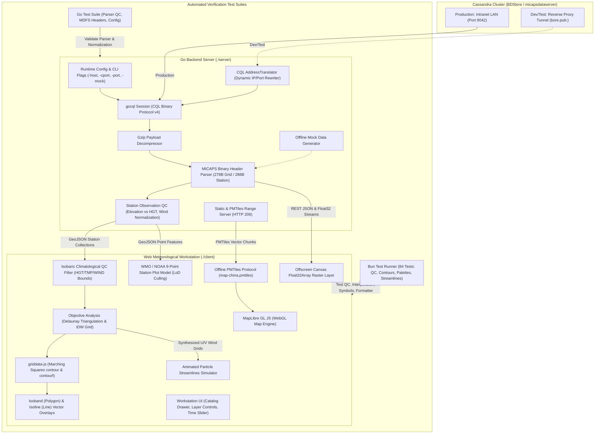
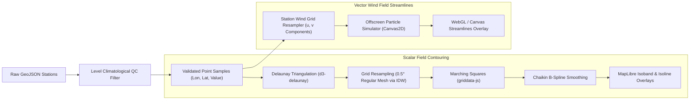

# MICAPS-Web Architecture & Technical Reference

This document provides in-depth technical documentation for the architecture, data pipeline, API specifications, build workflows, and directory structure of **MICAPS-Web**.

---

## 1. Architecture Overview



---

## 2. Directory Structure

```text
micaps-web/
├── Architecture.md                   # In-depth architectural & technical specification
├── README.md                         # Project overview and quick start guide
├── server/                           # Go HTTP server & Cassandra data engine
│   ├── cmd/
│   │   └── main.go                   # CLI entrypoint, flag parsing, route bootstrap
│   ├── config/
│   │   ├── config.go                 # Configuration, MICAPS.exe.config discovery, CLI flags
│   │   └── config_test.go            # Unit tests for XML parsing and random IP selection
│   ├── db/
│   │   ├── cql_client.go             # Cassandra CQL session & TunnelTranslator
│   │   ├── catalog_queries.go        # Catalog, treeview, level & latest time queries
│   │   └── data_queries.go           # Raw blob query executor
│   ├── handler/
│   │   ├── catalog_handler.go        # REST catalog endpoints
│   │   ├── grid_handler.go           # NWP JSON and binary Float32 streaming handlers
│   │   ├── station_handler.go        # GeoJSON station observation handler
│   │   └── static_handler.go         # SPA fallback & HTTP 206 PMTiles range server
│   ├── mock/
│   │   └── mock_generator.go         # Synthetic NWP grid & station observation generator
│   ├── model/
│   │   └── types.go                  # Data structures and GeoJSON models
│   ├── parser/
│       ├── decompress.go             # Gzip blob decompressor
│       ├── grid_header.go            # 278-byte MICAPS Type 4/11 header parser
│       ├── grid_data.go              # Grid Float32 payload decoding
│       ├── station_parser.go         # 288-byte station header & observation decoder (QC & elevation/height)
│       └── station_parser_test.go    # Go unit tests for station QC, rain, elevation vs height, & calm winds
├── client/                           # Frontend Meteorological Workstation
│   ├── index.html                    # Workstation HTML shell
│   ├── package.json                  # Dependencies, build scripts & test runner
│   ├── config.json                   # Runtime-editable meteorological configuration (presets, colormaps & derived layers)
│   ├── map/
│   │   └── map-china.pmtiles         # Offline China vector tiles (borders & provinces)
│   ├── palettes/                     # CMA standard colormaps & color tables (served directly, not bundled)
│   ├── dist/                         # Compiled bundle (strictly assets/ and index.html; no config, palettes, or map)
│   │   ├── assets/
│   │   └── index.html
│   ├── src/
│   │   ├── main.js                   # Application bootstrap & lifecycle orchestrator
│   │   ├── style.css                 # Dark meteorological theme stylesheet
│   │   ├── api/                      # REST & binary stream fetchers
│   │   ├── layers/                   # MapLibre, Deck.gl, Canvas, Sounding & Surface analysis layers
│   │   ├── map/                      # MapLibre GL setup, PMTiles protocol, graticule lines
│   │   ├── store/                    # Reactive workstation state manager
│   │   ├── ui/                       # Navbar, catalog drawer, layer control, time slider, tooltip
│   │   └── utils/                    # CMA palettes, weather symbols, griddata-js adapter
│   └── test/                         # Meteorological Unit Test Suite (117 bun tests across 14 files)
│       ├── colormaps.test.js         # Dynamic colormaps & level scaling tests
│       ├── weather_symbols.test.js   # WMO symbols & 110° wind barbs tests
│       ├── contour_logic.test.js     # Characteristic bold contour tests
│       ├── config.test.js            # config.json validation & compact formatting tests
│       ├── timeslider.test.js        # Timeline stepper, init-time, & sounding filter tests
│       ├── formatters.test.js        # Meteorological unit and date formatting tests
│       ├── derived_layers.test.js    # Sounding Height/Temp/Wind QC, layer auto-save & streamlines tests
│       ├── station_contour_analysis.test.js # Delaunay triangulation & IDW objective analysis tests
│       ├── smooth_contour.test.js    # Chaikin B-spline contour line smoothing tests
│       ├── raster_layer.test.js      # Float32 offscreen canvas raster layer tests
│       ├── ui_review2_fixes.test.js  # UI layer controls & window manager synchronization tests
│       ├── ui_review3_fixes.test.js  # UI Review 3 CSS/layout, a11y, multi-window & analysis consistency tests
│       ├── dtd_analysis.test.js      # Dew-point depression (DTD = T - Td) QC, contours, plots & collision tests
│       └── window_title.test.js      # Multi-window viewport title generation tests
```

---

## 3. Development & Build Workflows

The application uses a unified Go server architecture. A separate frontend development server (such as Vite dev server) is not required because the Go backend (`micaps-server`) directly serves both the API routes and all frontend resources:
- **Compiled Web Application**: Served from `client/dist/` with single-page application (SPA) fallback to `index.html`.
- **Runtime Configuration**: Served and persisted directly to `client/config.json` via `/api/config` and `/config.json`.
- **Offline Vector Basemap**: Served directly from `client/map/map-china.pmtiles` with HTTP 206 partial content range requests via `/map-china.pmtiles`.
- **Color Palettes**: Served dynamically from `client/palettes/` via `/palettes/*`.

### Frontend Build (Client)

The frontend JavaScript and CSS modules are compiled using Vite into `client/dist`.

> [!IMPORTANT]
> Non-bundled assets remain strictly outside `client/dist`:
> - **`client/config.json`**: Only exists at `client/config.json`. It is never copied into or bundled with `client/dist/`, ensuring live configuration edits take effect without requiring frontend rebuilds.
> - **`client/palettes/`** and **`client/map/`**: Color tables and PMTiles vector tiles are served directly from their respective source folders by the Go server.
> 
> Consequently, `client/dist/` contains solely `index.html` and the hashed JavaScript/CSS assets in `assets/`.

```bash
cd client

# Install dependencies (requires Bun 1.4 or Node)
bun install

# Build production bundle into client/dist
bun run build
```

### Backend Build & Execution (Server)

```bash
cd server

# Run Go package unit tests
go test ./...

# Build Linux binary
go build -o micaps-server cmd/main.go

# Cross-compile Windows 10/11 x86-64 binary
GOOS=windows GOARCH=amd64 go build -o micaps-server.exe cmd/main.go

# Run server (automatically serves client/dist, client/config.json, client/palettes, and client/map)
./micaps-server -mock
```

---

## 4. Runtime Configuration Schema (config.json)

Composite presets and named colormaps are loaded from `client/config.json` at startup rather than bundled into the JavaScript. The file structure is:

```json
{
  "colormaps": {
    "my-temperature": [
      { "val": -20, "color": [0, 80, 255, 255] },
      { "val": 20, "color": [255, 80, 0, 255] }
    ]
  },
  "presets": [
    {
      "id": "my-group",
      "name": "My Group",
      "hasLevel": true,
      "defaultLevel": 500,
      "colormap": "my-temperature",
      "colormapByLevel": { "850": "my-temperature" },
      "layers": [
        {
          "model": "ECMWF_HR",
          "element": "TMP",
          "type": "contour",
          "render": {
            "colormap": "my-temperature",
            "colormapByLevel": { "500": "my-temperature" }
          }
        }
      ]
    }
  ]
}
```

- `render.colormap` overrides the group setting, and `colormapByLevel` provides a level-specific override.
- Colormaps use sorted numeric `val` stops and RGB/RGBA channel arrays from 0–255.

---

## 5. Meteorological Unit Testing (Bun Test & Go Test)

Comprehensive automated testing is maintained across both frontend meteorological algorithms and backend binary parsers.

### 5.1. Client Meteorological Test Suite (Bun Test)

Run all 117 client-side unit tests across 14 test suites covering meteorological objective analysis, contouring, symbology, and quality control:

```bash
cd client
bun test
```

Individual test suites:
- **`derived_layers.test.js`**: Sounding Height, Temperature, and Wind QC bounds filtering, ground elevation rejection, calm wind vector handling, streamline vector grid generation, and preset layer persistence.
- **`station_contour_analysis.test.js`**: Delaunay triangulation, natural neighbor / IDW objective analysis interpolation, surface sea-level pressure (SLP) contouring, and multi-element extractor verification.
- **`smooth_contour.test.js`**: Chaikin B-spline corner smoothing and Douglas-Peucker simplification for smooth meteorological isolines.
- **`colormaps.test.js`**: Dynamic colormap interpolation, discrete/continuous stops, and pressure level scaling.
- **`weather_symbols.test.js`**: WMO standard present weather symbols and 110-degree wind barbs.
- **`contour_logic.test.js`**: Characteristic bold contour line matching (e.g. 588 dam subtropical high, 0°C isotherm).
- **`config.test.js`**: `config.json` schema validation, preset loading, and compact JSON serialization.
- **`timeslider.test.js`**: Timeline stepper intervals, upper-air synoptic sounding 08:00 / 20:00 UTC+8 filtering, and NWP forecast init-cycles.
- **`formatters.test.js`**: Meteorological unit formatting, coordinate rounding, and date/time conversions.
- **`raster_layer.test.js`**: Offscreen canvas Float32Array raster rendering, range clamping, and opacity blending.
- **`ui_review2_fixes.test.js`**: UI layer control state synchronization and multi-window manager callbacks.
- **`ui_review3_fixes.test.js`**: UI layout contracts, CSS ellipsis, panel a11y, multi-window config recovery, step-length fallback, and layer label sizing.
- **`dtd_analysis.test.js`**: Dew-point depression ($DTD = T - T_d$) multi-element extraction, physical supersaturation clamping & QC rejection, isobaric envelope validation, Delaunay triangulation & filled isoband contours, level-step layer renaming, station filter thresholding, station weather plot middle-left integer rendering with slot collision displacement/drop, and custom inverted moisture colormaps.
- **`window_title.test.js`**: Dynamic multi-window viewport title generation from active layer metadata.

### 5.2. Server Binary Parser Test Suite (Go Test)

Run backend binary parser tests covering MDFS Diamond 1/2 station observation decoding, precipitation parsing, elevation/height separation, and upper-air wind quality control:

```bash
cd server
go test -v ./...
```

Key Go test coverage:
- **`parser/station_parser_test.go`**:
  - `TestStationParserPrecipitation`: Multi-element surface station decoding (SLP, 3h pressure tendency, 6h cumulative rain).
  - `TestStationParserHeightAndElevation`: Strict decoupling of station ground elevation (element 3, meters) from isobaric geopotential height (element 421/419, dam to gpm) to prevent PILOT station elevations from corrupting upper-air height fields.
  - `TestStationParserWindQC`: Normalization of missing flags (`9999`, negative values), calm wind direction consistency ($ws=0 \implies wd=0$), gross speed outlier rejection ($>150\text{ m/s} \to -9999$), and tenths-of-a-meter scaling.
- **`config/config_test.go`**: Verification of `MICAPS.exe.config` XML discovery, IP fallback lists, and CLI runtime argument overrides.

---

## 6. API Reference Summary

| Endpoint | Method | Description |
| :--- | :--- | :--- |
| `/api/status` | `GET` | Health check, uptime, and database connection status. |
| `/api/config` | `GET`, `POST` | Read or save runtime `client/config.json` preset configurations. |
| `/config.json` | `GET` | SPA handler direct route serving runtime `client/config.json`. |
| `/palettes/*` | `GET` | Dynamic static file route serving CMA color palettes directly from `client/palettes/`. |
| `/map-china.pmtiles` | `GET` | HTTP 206 range-request endpoint serving offline China vector basemap tiles from `client/map/map-china.pmtiles`. |
| `/api/catalog/models` | `GET` | Returns 4-tier model hierarchy (Global NWP, Regional, Guidance, Observations). |
| `/api/catalog/tree` | `GET` | Returns directory file tree for a given data path. |
| `/api/catalog/levels` | `GET` | Returns isobaric pressure levels (`1000`, `850`, `500`, `200` hPa). |
| `/api/catalog/latest` | `GET` | Returns the latest available forecast cycle for a path. |
| `/api/data/grid` | `GET` | Returns decoded NWP grid GeoJSON with 2D scalar/vector arrays. |
| `/api/data/grid/binary` | `GET` | Streams raw Little-Endian `Float32Array` bytes for zero-copy Canvas/WebGL raster rendering. |
| `/api/data/station` | `GET` | Returns WMO/CMA synoptic station observations as GeoJSON Point `FeatureCollection`. |

---

## 7. Standards & References

- **CMA MICAPS 4 Cassandra Architecture**: `../help/micaps4-cassandra.md`
- **MICAPS 4 File Format**: [nmcdev/nmc_met_io](https://github.com/nmcdev/nmc_met_io/blob/master/nmc_met_io/retrieve_cassandraDB.py)
- **High-Performance Local Web Maps**: [likev/local-map](https://github.com/likev/local-map)
- **In-Browser Contouring**: [likev/griddata-js](https://github.com/likev/griddata-js)
- **WMO / NOAA Station Weather Plot Layout**:
  - [CIMSS Satellite Meteorology Module 7](https://cimss.ssec.wisc.edu/satmet/modules/7_weather_forecast/wf-5.html)
  - [NOAA Weather Prediction Center (WPC) Station Plot](https://www.wpc.ncep.noaa.gov/html/stationplot.shtml)

---

## 8. MICAPS Data Format Specifications & Cassandra Ingestion Conventions

### 8.1. MICAPS Diamond File Types

The China Meteorological Administration (CMA) MDFS / MICAPS 4 data store organizes gridded model outputs and meteorological observations into standard **Diamond Types** designated by the `DataType` field in the 278-byte binary header:

| Diamond Type | `DataType` | Structure | Content & Usage |
| :--- | :--- | :--- | :--- |
| **Diamond 1** | `1` | Discrete station records | Surface synoptic weather station observations |
| **Diamond 2** | `2` | Discrete station records | Upper-air sounding observations (Height, Temp, Dewpoint depression, Wind) |
| **Diamond 3** | `3` | Discrete station records | High-density automatic weather stations (AWS) with 3h pressure tendency |
| **Diamond 4** | `4` | 2D Scalar Grid ($N_{\text{lat}} \times N_{\text{lon}}$) | Scalar NWP fields: Temperature ($TT$), Geopotential Height ($H$), Relative Humidity ($RH$), Precipitation |
| **Diamond 11** | `11` | 2D Vector Grid ($2 \times N_{\text{lat}} \times N_{\text{lon}}$) | Vector wind fields: $U/V$ physical velocities or Speed / Direction angle grids |
| **Diamond 13** | `13` | 2D Scalar Grid | Weather radar composite reflectivity mosaics (dBZ) |
| **Diamond 14** | `14` | 2D Scalar Grid | Meteorological satellite infrared / visible cloud imagery |

---

### 8.2. Diamond 11 Vector Wind Ingestion Conventions (Polar vs. Cartesian)

In the CMA MDFS Cassandra storage architecture, different upstream NWP decoders ingest gridded wind products under `DataType == 11` using one of two internal representations without a separate sub-type discriminator in the header:

1. **Polar Coordinate Representation (`ECMWF_HR/WIND`, `ECMWF/WIND`, `GFS/WIND`)**:
   - **Block 1** (`payload[0 : totalPoints*4]`): Wind Speed magnitude ($ff \ge 0\text{ m/s}$).
   - **Block 2** (`payload[totalPoints*4 : totalPoints*8]`): Mathematical Polar Angle $\theta$ in degrees ($[0^\circ, 360^\circ]$, where $0^\circ = \text{East / +X}$, $90^\circ = \text{North / +Y}$, $180^\circ = \text{West / -X}$, $270^\circ = \text{South / -Y}$).
   - **Conversion to Physical Velocities**:
     $$U = \text{speed} \cdot \cos\left(\frac{\theta\pi}{180}\right),\quad V = \text{speed} \cdot \sin\left(\frac{\theta\pi}{180}\right),\quad \text{Magnitude} = \text{speed}$$

2. **Cartesian Coordinate Representation (`CMA-GFS / GRAPES / UV` or synthetic grids)**:
   - **Block 1**: Physical Eastward Velocity $U$ ($\text{m/s}$, signed).
   - **Block 2**: Physical Northward Velocity $V$ ($\text{m/s}$, signed).
   - **Magnitude Calculation**:
     $$\text{Magnitude} = \sqrt{U^2 + V^2}$$

#### Decoder Differentiation Logic
The server parser ([`server/parser/grid_data.go`](file:///root/downloads/micaps-web/server/parser/grid_data.go)) inspects the blocks:
- If Block 2 values span $[0, 360]$ with typical meteorological angles ($> 60^\circ$) and Block 1 is strictly non-negative ($\ge 0$), it decodes the grid as **Polar Speed/Direction**.
- If negative velocity components are present or values represent raw $U/V$ velocity bounds ($[-60, 60]\text{ m/s}$), it consumes them directly as **Cartesian $U$ and $V$**.

---

### 8.3. Unsigned Latitude Grid Step ($\Delta\text{lat}$) Convention

In MICAPS 278-byte binary grid headers:
- `StartLatitude` (offset 150) defines the first row coordinate (typically North, e.g. $60.0^\circ\text{N}$).
- `EndLatitude` (offset 154) defines the last row coordinate (typically South, e.g. $0.0^\circ\text{N}$ or $-10.0^\circ\text{S}$).
- `LatitudeGridSpace` (offset 158) is written as an **unsigned magnitude** ($+0.25^\circ$), regardless of whether the grid traverses North-to-South or South-to-North.

To prevent coordinate calculations from incrementing upwards into the Arctic ($60^\circ \to 120^\circ$), the coordinate array generator dynamically computes the true signed step:

$$\Delta\text{lat} = \frac{\text{EndLatitude} - \text{StartLatitude}}{N_{\text{lat}} - 1}$$

- For North-to-South grids ($60^\circ \to 0^\circ$, $N_{\text{lat}} = 241$), $\Delta\text{lat} = -0.25^\circ$.
- For South-to-North grids ($15^\circ \to 55^\circ$, $N_{\text{lat}} = 161$), $\Delta\text{lat} = +0.25^\circ$.

Both JSON coordinate vectors (`resp.X`, `resp.Y`) and binary stream headers (`EncodeBinaryStream`) synchronize their bounding endpoints to this calculated grid extent.

---

### 8.4. Per-Layer Raster Source & State Isolation

To avoid race conditions and stale state in multi-field composite views (e.g. concurrent loads of $RH$, $HGT$, and $WIND$ via `Promise.allSettled()`):
- **Per-Layer DOM IDs**: Every weather layer generates isolated MapLibre sources and layers:
  - Source: `${layerId}-raster-source`
  - Layer: `${layerId}-raster-layer`
- **Captured Layer Context**: Layer records in `windowLayersMap` retain their own `{ path, file, gridData, colormap, element, level, model }`.
- **Wind Raster Consistency**: Wind magnitude raster overlays compute from the captured $U/V$ components directly or the decoded speed matrix, ensuring 100% geometric and scalar alignment with animated streamlines and wind barbs.

---

### 8.5. Meteorological Observation Quality Control (QC) & Objective Analysis Pipeline

Raw meteorological observation streams transmitted via MDFS / Cassandra (Diamond 1 surface and Diamond 2 upper-air soundings) often contain telecommunication corruptions, PILOT balloon omissions, element mixups, and flag values that must be sanitized before presentation or spatial interpolation. MICAPS-Web implements a dual-stage quality control architecture spanning the Go backend decoder and the frontend client analysis engine.

#### 8.5.1. Separation of Station Surface Elevation vs. Isobaric Geopotential Height

In WMO and CMA synoptic reporting standards:
- **Station Surface Elevation (`props["elevation"]`)**: Decoded from element descriptor `3` (`测站高度`). Represents the geometric height of the station barometer or ground surface above mean sea level in meters ($m$).
- **Isobaric Geopotential Height (`props["height"]`)**: Decoded from element descriptors `421` or `419` (`等压面位势高度`). Represents the work done against gravity to reach that pressure surface, reported in geopotential decameters ($dam$) or meters ($gpm$).

**The PILOT Station Trap**:
Upper-air directories (`UPPER_AIR/PLOT/<level>`) aggregate both full radiosonde balloon soundings (TEMP messages measuring $P, T, T_d, U, V$) and pilot balloon optical/radar tracking stations (PILOT messages measuring only upper-air wind vectors $U, V$). PILOT stations report station surface elevation in element 3, but do **not** measure isobaric geopotential height (element 421 is absent).

If a parser treats element 3 as a fallback for missing element 421:
- A mountain PILOT station at Grand Junction ($1473\text{ m}$) would report a 500 hPa height of $1473\text{ gpm}$ instead of the expected $\sim 5840\text{ gpm}$!
- Lowland coastal PILOT stations (e.g. Kota Bharu at $5\text{ m}$, Kuching at $27\text{ m}$) would report heights near zero.

**Architecture Fix ([`server/parser/station_parser.go`](file:///root/downloads/micaps-web/server/parser/station_parser.go))**:
1. Element 3 is decoded strictly into `props["elevation"]`.
2. Elements 421 and 419 are decoded strictly into `props["height"]` (converted $dam \to gpm$ via $\times 10$ if values are in decameter range $[20, 4500]$).
3. If element 421/419 is absent, `props["height"]` defaults to `-9999` (missing). No fallback to element 3 is permitted.
4. Longitude (element 1) is completely excluded from height property decoding.

#### 8.5.2. Upper-Air Wind Quality Control & Calm Consistency

Upper-air wind observations are subject to multi-stage QC in both backend parsing and client-side processing:

1. **Flag Normalization**:
   - Sentinels (`9999`, `999`, `999.9`, negative values, or encoded codes $\ge 9000$) are normalized to `-9999` (null).
2. **Tenths-of-a-Meter Scaling**:
   - Upstream MDFS decoders occasionally transmit raw wind speed in units of $0.1\text{ m/s}$ (e.g., $185\text{ m/s}$ encoded as integer $1850$). Speeds in the range $(100, 1500]$ are divided by $10.0$.
   - Speeds exceeding $150\text{ m/s}$ are rejected as physical impossibilities (set to `-9999`).
3. **Calm Wind Consistency**:
   - When wind speed is calm ($ws = 0\text{ m/s}$ or $ws < 0.5\text{ m/s}$), the wind direction is normalized to $0^\circ$, and Cartesian components are set to $u = 0, v = 0$.
   - A non-calm wind observation requires a valid direction $wd \in [0, 360]$. Missing directions are **never** defaulted to $0^\circ$ (which represents true North), preventing artificial northerly wind vectors from contaminating spatial vector fields.
4. **Synoptic Station Plotting Symbology ([`client/src/layers/stationLayer.js`](file:///root/downloads/micaps-web/client/src/layers/stationLayer.js))**:
   - Missing wind ($ws = \text{null}$ or $-9999$): No wind barb or calm circle is rendered.
   - Calm wind ($ws < 1.5\text{ m/s}$): A calm wind circle ($\odot$) is rendered centered on the station coordinates; barb shafts and feathers are omitted.
   - Active wind ($ws \ge 1.5\text{ m/s}$ and $wd \in [0, 360]$): A directional WMO standard wind barb with 110-degree flags is rendered, oriented along the incoming wind azimuth.

#### 8.5.3. Isobaric Level-Specific Climatological QC Bounds Table

To eliminate gross errors (e.g. data transmission bitflips, misplaced pressure level records, or residual surface values) before Delaunay triangulation and objective contouring, the client analysis engine ([`client/src/layers/soundingAnalysis.js`](file:///root/downloads/micaps-web/client/src/layers/soundingAnalysis.js)) verifies observations against physical climatological bounds tailored to each standard pressure level:

| Pressure Level ($hPa$) | Geopotential Height ($gpm$) | Temperature ($^\circ C$) | Dewpoint ($^\circ C$) | Max Wind Speed ($m/s$) |
| :---: | :---: | :---: | :---: | :---: |
| **1000** | $[-400, 800]$ | $[-60, 55]$ | $[-70, 40]$ | $50$ |
| **925** | $[200, 1400]$ | $[-55, 50]$ | $[-70, 35]$ | $60$ |
| **850** | $[800, 2200]$ | $[-50, 45]$ | $[-70, 30]$ | $70$ |
| **700** | $[2200, 3800]$ | $[-50, 30]$ | $[-75, 25]$ | $80$ |
| **500** | $[4400, 6400]$ | $[-60, 10]$ | $[-80, 5]$ | $95$ |
| **400** | $[6000, 8200]$ | $[-70, 0]$ | $[-85, 0]$ | $110$ |
| **300** | $[7500, 11000]$ | $[-80, 0]$ | $[-90, -5]$ | $140$ |
| **250** | $[8500, 12200]$ | $[-85, -10]$ | $[-95, -10]$ | $140$ |
| **200** | $[9800, 13800]$ | $[-85, -15]$ | $[-95, -15]$ | $140$ |
| **150** | $[11500, 15800]$ | $[-90, -20]$ | $[-100, -20]$ | $120$ |
| **100** | $[14000, 18500]$ | $[-90, -25]$ | $[-100, -25]$ | $85$ |
| **70** | $[16000, 20500]$ | $[-90, -30]$ | $[-100, -30]$ | $80$ |
| **50** | $[18000, 23000]$ | $[-90, -30]$ | $[-100, -30]$ | $75$ |
| **30** | $[21000, 26500]$ | $[-90, -30]$ | $[-100, -30]$ | $70$ |
| **20** | $[23500, 29500]$ | $[-90, -30]$ | $[-100, -30]$ | $65$ |
| **10** | $[28000, 35000]$ | $[-90, -30]$ | $[-100, -30]$ | $60$ |

Observations falling outside these envelopes are cleanly filtered out prior to triangulation, preventing isolated outliers from producing artificial circular contour bulls-eyes or distortion in the interpolated field.

##### Derived Dew-Point Depression ($DTD = T - T_d$) Analysis & Quality Control

Dew-point depression ($DTD = T - T_d$) is computed as a first-class derived scalar field across surface observations and upper-air soundings ([`client/src/layers/surfaceAnalysis.js`](file:///root/downloads/micaps-web/client/src/layers/surfaceAnalysis.js), [`client/src/layers/soundingAnalysis.js`](file:///root/downloads/micaps-web/client/src/layers/soundingAnalysis.js), [`client/src/layers/stationLayer.js`](file:///root/downloads/micaps-web/client/src/layers/stationLayer.js)):

1. **Operand Validation (Q1)**:
   - **Surface**: $T \in [-90, 65]^\circ\text{C}$ and $T_d \in [-90, 50]^\circ\text{C}$.
   - **Upper-Air Soundings**: $T$ and $T_d$ must strictly pass the level-specific isobaric climatological envelopes defined above.
2. **Supersaturation & Instrument Tolerance (Q2)**:
   - Physical definition dictates $T_d \le T$. Due to sensor calibration tolerances and rounding in radiosondes and automatic weather stations, reported dewpoints slightly exceeding air temperature ($T_d > T$) are clamped to saturation:
     $$\text{If } -0.5^\circ\text{C} \le T - T_d < 0^\circ\text{C} \implies DTD = 0.0^\circ\text{C}$$
   - Unphysical observations where $T_d > T + 0.5^\circ\text{C}$ (i.e., $T - T_d < -0.5^\circ\text{C}$) represent severe gross instrument or decoding error and are rejected as null.
3. **Meteorological Range Limits (Q3)**:
   - Plausible tropospheric depression values are bounded by $0 \le DTD \le 45^\circ\text{C}$. Values exceeding $45^\circ\text{C}$ are discarded as invalid outliers.
4. **Synoptic Contours & Isoline Rendering**:
   - **Standard Operational Levels**: $[1, 2, 3, 4, 5, 6, 8, 10, 12, 15, 20, 25, 30]^\circ\text{C}$. If dynamic station range has $\max(DTD) < 5^\circ\text{C}$, automatic fallback intervals are generated via `griddata.autoLevels(minV, maxV, 8)`.
   - **Characteristic Bold Isolines**: Highlighted at $2^\circ\text{C}$ (saturation / cloud ceiling boundary) and $10^\circ\text{C}$ (dry air boundary).
   - **Fills & Colormap**: Renders filled isobands using an inverted moisture ramp (saturated $0^\circ\text{C}$ deep blue `#2c7bb6` $\to$ arid $30^\circ\text{C}$ dark crimson `#7f0000`) mapped to palette category `TMP`.
5. **Station Weather Plotting & Collision Rules**:
   - Opt-in plotting (`showDTD: false` default) displays an orange (`#f0883e`) 12px bold integer at middle-left (`left: 0`, `top: 20px`).
   - Priority rule `DTD > ww`: When `showDTD` is active, present weather ($ww$) shifts to the far-left slot (`left: -26px`) only if visibility ($VIS$) is disabled; if $VIS$ is active, $ww$ is dropped (`VIS > ww`), preserving existing layout invariants without overlap.

#### 8.5.4. Objective Analysis, Delaunay Triangulation & Vector Grid Synthesis

The client-side objective analysis pipeline converts sparse, irregular station soundings into continuous vector and scalar fields in real time:



1. **Delaunay Triangulation & Adaptive IDW**:
   - Validated station points form a planar Delaunay mesh.
   - An adaptive regular grid ($0.5^\circ \times 0.5^\circ$ spacing) is interpolated using Inverse Distance Weighting (IDW) bounded by local Delaunay neighbor search to preserve sharp baroclinic fronts while suppressing edge extrapolation artifacts.
2. **Marching Squares & B-Spline Smoothing**:
   - `griddata-js` extracts isobands (filled polygons) and isolines (contour paths).
   - Isolines undergo Chaikin algorithm corner cuts followed by Douglas-Peucker simplification, producing professional, cartographic-grade meteorological isolines.
   - Characteristic synoptic isolines (such as the 588 dam subtropical ridge line or the 0°C freezing isotherm) are identified and highlighted with custom stroke weights and colors.
3. **Station Wind Grid Synthesis**:
   - Upper-air vector winds $(u, v)$ from soundings are gridded into a regular 2D vector field via [`generateStationWindGrid`](file:///root/downloads/micaps-web/client/src/layers/windLayer.js).
   - This grid drives the client-side particle engine to render real-time animated streamlines directly from sparse station soundings without requiring gridded NWP model files.

