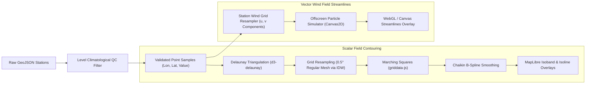
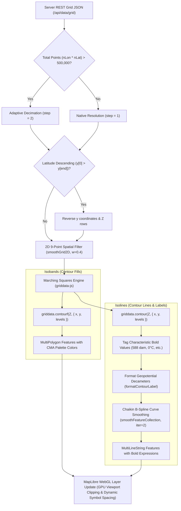

# MICAPS-Web Architecture & Technical Reference

This document provides in-depth technical documentation for the architecture, data pipeline, API specifications, build workflows, and directory structure of **MICAPS-Web**.

---

## 1. Architecture Overview

```mermaid
graph TD
    subgraph Storage ["Cassandra Cluster (BDStore / micapsdataserver)"]
        DirectLAN["Production: Intranet LAN (Port 9042)"]
        Tunnel["Dev/Test: Reverse Proxy Tunnel (bore.pub:<dynamic-port>)"]
    end

    subgraph Backend ["Go Backend Server (./server)"]
        Config["Runtime Config & CLI Flags (-host, -cport, -port, -mock)"]
        Translator["CQL AddressTranslator (Dynamic IP/Port Rewriter)"]
        Gocql["gocql Session (CQL Binary Protocol v4)"]
        Decompress["Gzip Payload Decompressor"]
        Parser["MICAPS Binary Header Parser (278B Grid / 288B Station)"]
        StationQC["Station Observation QC (Elevation vs HGT, Wind Normalization)"]
        RangeServer["Static & PMTiles Range Server (HTTP 206)"]
        MockEngine["Offline Mock Data Generator"]

        Config --> Gocql
        Tunnel -.->|Dev/Test| Translator --> Gocql
        DirectLAN -->|Production| Gocql
        Gocql --> Decompress --> Parser --> StationQC
        MockEngine -.-> Parser
    end

    subgraph Frontend ["Web Meteorological Workstation (./client)"]
        MapLibre["MapLibre GL JS (WebGL Map Engine)"]
        PMTilesProto["Offline PMTiles Protocol (map-china.pmtiles)"]
        QCFilter["Isobaric Climatological QC Filter (HGT/TMP/WIND Bounds)"]
        ObjAnalysis["Objective Analysis (Delaunay Triangulation & IDW Grid)"]
        GridData["griddata-js (Marching Squares contour & contourf)"]
        
        RasterL["Offscreen Canvas Float32Array Raster Layer"]
        ContourL["Isoband (Polygon) & Isoline (Line) Vector Overlays"]
        WindL["Animated Particle Streamlines Simulator"]
        StationL["WMO / NOAA 9-Point Station Plot Model (LoD Culling)"]
        UI["Workstation UI (Catalog Drawer, Layer Controls, Time Slider)"]

        KeyboardNav["Keyboard Shortcuts Engine (Arrow Keys: Time & Level)"]
        PrefetchEngine["Intelligent Prefetch Engine (Left/Right/Up/Down Preload)"]
        DataCache["apiClient 3-Minute TTL Cache & In-Flight Deduplicator"]
        
        KeyboardNav -->|Instant 0ms Step| DataCache
        UI -->|Schedule Debounced (150ms)| PrefetchEngine
        PrefetchEngine -->|Preload Orthogonal Neighbors| DataCache
        DataCache -->|Cache Hits| ContourL
        DataCache -->|Cache Hits| RasterL
        DataCache -->|Cache Hits| StationL
    end

    subgraph Testing ["Automated Verification Test Suites"]
        GoTest["Go Test Suite (Parser QC, MDFS Headers, Config)"]
        BunTest["Bun Test Runner (174 Tests: QC, Contours, Palettes, Prefetch, Shortcuts)"]
        GoTest -->|Validate Parser & Normalization| Backend
        BunTest -->|Test QC, Interpolation, Contours, Prefetch, Shortcuts| Frontend
    end

    StationQC -->|GeoJSON Station Collections| DataCache
    Parser -->|REST JSON & Float32 Streams| DataCache
    DataCache --> QCFilter --> ObjAnalysis --> GridData --> ContourL
    DataCache --> StationL
    ObjAnalysis -->|Synthesized U/V Wind Grids| WindL
    RangeServer -->|PMTiles Vector Chunks| PMTilesProto --> MapLibre
```

---

## 2. Directory Structure

```text
micaps-web/
├── Architecture.md                   # In-depth architectural & technical specification
├── README.md                         # Project overview and quick start guide
├── server/                           # Go HTTP server & Cassandra data engine
│   ├── cmd/
│   │   └── main.go                   # CLI entrypoint, flag parsing, route bootstrap
│   ├── config/
│   │   ├── config.go                 # Configuration, MICAPS.exe.config discovery, CLI flags
│   │   └── config_test.go            # Unit tests for XML parsing and random IP selection
│   ├── db/
│   │   ├── cql_client.go             # Cassandra CQL session & TunnelTranslator
│   │   ├── catalog_queries.go        # Catalog, treeview, level & latest time queries
│   │   └── data_queries.go           # Raw blob query executor
│   ├── handler/
│   │   ├── catalog_handler.go        # REST catalog endpoints
│   │   ├── grid_handler.go           # NWP JSON and binary Float32 streaming handlers
│   │   ├── station_handler.go        # GeoJSON station observation handler
│   │   └── static_handler.go         # SPA fallback & HTTP 206 PMTiles range server
│   ├── mock/
│   │   └── mock_generator.go         # Synthetic NWP grid & station observation generator
│   ├── model/
│   │   └── types.go                  # Data structures and GeoJSON models
│   ├── parser/
│       ├── decompress.go             # Gzip blob decompressor
│       ├── grid_header.go            # 278-byte MICAPS Type 4/11 header parser
│       ├── grid_data.go              # Grid Float32 payload decoding
│       ├── station_parser.go         # 288-byte station header & observation decoder (QC & elevation/height)
│       └── station_parser_test.go    # Go unit tests for station QC, rain, elevation vs height, & calm winds
├── client/                           # Frontend Meteorological Workstation
│   ├── index.html                    # Workstation HTML shell
│   ├── package.json                  # Dependencies, build scripts & test runner
│   ├── config.json                   # Runtime-editable meteorological configuration (presets, colormaps & derived layers)
│   ├── map/
│   │   └── map-china.pmtiles         # Offline China vector tiles (borders & provinces)
│   ├── palettes/                     # CMA standard colormaps & color tables (served directly, not bundled)
│   ├── dist/                         # Compiled bundle (strictly assets/ and index.html; no config, palettes, or map)
│   │   ├── assets/
│   │   └── index.html
│   ├── src/
│   │   ├── main.js                   # Application bootstrap & lifecycle orchestrator
│   │   ├── style.css                 # Dark meteorological theme stylesheet
│   │   ├── tabs.css                  # Multi-window tabs & layout styling
│   │   ├── api/                      # REST & binary stream fetchers (3-minute TTL cache & inflight deduplication)
│   │   ├── layers/                   # MapLibre, Deck.gl, Canvas, Sounding & Surface analysis layers
│   │   ├── map/                      # MapLibre GL setup, PMTiles protocol, graticule lines
│   │   ├── services/                 # Intelligent background data prefetch engine (Left/Right/Up/Down)
│   │   ├── store/                    # Reactive workstation state manager
│   │   ├── ui/                       # Navbar, catalog drawer, layer control, time slider, tooltip
│   │   └── utils/                    # CMA palettes, weather symbols, griddata-js adapter
│   └── test/                         # Meteorological Unit Test Suite (174 bun tests across 18 files)
│       ├── colormaps.test.js         # Dynamic colormaps & level scaling tests
│       ├── weather_symbols.test.js   # WMO symbols & 110° wind barbs tests
│       ├── contour_logic.test.js     # Characteristic bold contour tests
│       ├── contour_raster_exclusivity_legend.test.js # Colormap exclusivity & dynamic legend switching tests
│       ├── config.test.js            # config.json validation & compact formatting tests
│       ├── timeslider.test.js        # Timeline stepper, init-time, & sounding filter tests
│       ├── formatters.test.js        # Meteorological unit and date formatting tests
│       ├── derived_layers.test.js    # Sounding Height/Temp/Wind QC, layer auto-save & streamlines tests
│       ├── station_contour_analysis.test.js # Delaunay triangulation & IDW objective analysis tests
│       ├── smooth_contour.test.js    # Chaikin B-spline contour line smoothing tests
│       ├── raster_layer.test.js      # Float32 offscreen canvas raster layer tests
│       ├── ui_review2_fixes.test.js  # UI layer controls & window manager synchronization tests
│       ├── ui_review3_fixes.test.js  # UI Review 3 CSS/layout, a11y, multi-window & analysis consistency tests
│       ├── dtd_analysis.test.js      # Dew-point depression (DTD = T - Td) QC, contours, plots & collision tests
│       ├── window_title.test.js      # Multi-window viewport title generation tests
│       ├── palette_persistence.test.js # Custom palettePath & colormap preservation across re-registration tests
│       ├── keyboard_shortcuts.test.js # ArrowLeft/Right time stepping & ArrowUp/Down isobaric level shortcuts tests
│       └── prefetch.test.js          # 3-min TTL cache, adjacent step resolution, prefetch targets & debouncing tests
```

---

## 3. Development & Build Workflows

The application uses a unified Go server architecture. A separate frontend development server (such as Vite dev server) is not required because the Go backend (`micaps-server`) directly serves both the API routes and all frontend resources:
- **Compiled Web Application**: Served from `client/dist/` with single-page application (SPA) fallback to `index.html`.
- **Runtime Configuration**: Served and persisted directly to `client/config.json` via `/api/config` and `/config.json`.
- **Offline Vector Basemap**: Served directly from `client/map/map-china.pmtiles` with HTTP 206 partial content range requests via `/map-china.pmtiles`.
- **Color Palettes**: Served dynamically from `client/palettes/` via `/palettes/*`.

### Frontend Build (Client)

The frontend JavaScript and CSS modules are compiled using Vite into `client/dist`.

> [!IMPORTANT]
> Non-bundled assets remain strictly outside `client/dist`:
> - **`client/config.json`**: Only exists at `client/config.json`. It is never copied into or bundled with `client/dist/`, ensuring live configuration edits take effect without requiring frontend rebuilds.
> - **`client/palettes/`** and **`client/map/`**: Color tables and PMTiles vector tiles are served directly from their respective source folders by the Go server.
> 
> Consequently, `client/dist/` contains solely `index.html` and the hashed JavaScript/CSS assets in `assets/`.

```bash
cd client

# Install dependencies (requires Bun 1.4 or Node)
bun install

# Build production bundle into client/dist
bun run build
```

### Backend Build & Execution (Server)

```bash
cd server

# Run Go package unit tests
go test ./...

# Build Linux binary
go build -o micaps-server cmd/main.go

# Cross-compile Windows 10/11 x86-64 binary
GOOS=windows GOARCH=amd64 go build -o micaps-server.exe cmd/main.go

# Run server (automatically serves client/dist, client/config.json, client/palettes, and client/map)
./micaps-server -mock
```

---

## 4. Runtime Configuration Schema (config.json)

Composite presets and named colormaps are loaded from `client/config.json` at startup rather than bundled into the JavaScript. The file structure is:

```json
{
  "colormaps": {
    "my-temperature": [
      { "val": -20, "color": [0, 80, 255, 255] },
      { "val": 20, "color": [255, 80, 0, 255] }
    ]
  },
  "presets": [
    {
      "id": "my-group",
      "name": "My Group",
      "hasLevel": true,
      "defaultLevel": 500,
      "colormap": "my-temperature",
      "colormapByLevel": { "850": "my-temperature" },
      "layers": [
        {
          "model": "ECMWF_HR",
          "element": "TMP",
          "type": "contour",
          "render": {
            "colormap": "my-temperature",
            "colormapByLevel": { "500": "my-temperature" }
          }
        }
      ]
    }
  ]
}
```

- `render.colormap` overrides the group setting, and `colormapByLevel` provides a level-specific override.
- Colormaps use sorted numeric `val` stops and RGB/RGBA channel arrays from 0–255.

---

## 5. Meteorological Unit Testing (Bun Test & Go Test)

Comprehensive automated testing is maintained across both frontend meteorological algorithms and backend binary parsers.

### 5.1. Client Meteorological Test Suite (Bun Test)

Run all 174 client-side unit tests across 18 test suites covering meteorological objective analysis, contouring, symbology, quality control, data prefetching, and keyboard shortcuts:

```bash
cd client
bun test
```

Individual test suites:
- **`derived_layers.test.js`**: Sounding Height, Temperature, and Wind QC bounds filtering, ground elevation rejection, calm wind vector handling, streamline vector grid generation, and preset layer persistence.
- **`station_contour_analysis.test.js`**: Delaunay triangulation, natural neighbor / IDW objective analysis interpolation, surface sea-level pressure (SLP) contouring, and multi-element extractor verification.
- **`smooth_contour.test.js`**: Chaikin B-spline corner smoothing and Douglas-Peucker simplification for smooth meteorological isolines.
- **`colormaps.test.js`**: Dynamic colormap interpolation, discrete/continuous stops, and pressure level scaling.
- **`weather_symbols.test.js`**: WMO standard present weather symbols and 110-degree wind barbs.
- **`contour_logic.test.js`**: Characteristic bold contour line matching (e.g. 588 dam subtropical high, 0°C isotherm).
- **`contour_raster_exclusivity_legend.test.js`**: Colormap exclusivity, dual rendering states, dynamic legend switching between contour and raster palettes, and visibility coordination.
- **`config.test.js`**: `config.json` schema validation, preset loading, and compact JSON serialization.
- **`timeslider.test.js`**: Timeline stepper intervals, upper-air synoptic sounding 08:00 / 20:00 UTC+8 filtering, and NWP forecast init-cycles.
- **`formatters.test.js`**: Meteorological unit formatting, coordinate rounding, and date/time conversions.
- **`raster_layer.test.js`**: Offscreen canvas Float32Array raster rendering, range clamping, and opacity blending.
- **`ui_review2_fixes.test.js`**: UI layer control state synchronization and multi-window manager callbacks.
- **`ui_review3_fixes.test.js`**: UI layout contracts, CSS ellipsis, panel a11y, multi-window config recovery, step-length fallback, and layer label sizing.
- **`dtd_analysis.test.js`**: Dew-point depression ($DTD = T - T_d$) multi-element extraction, physical supersaturation clamping & QC rejection, isobaric envelope validation, Delaunay triangulation & filled isoband contours, level-step layer renaming, station filter thresholding, station weather plot middle-left integer rendering with slot collision displacement/drop, and custom inverted moisture colormaps.
- **`window_title.test.js`**: Dynamic multi-window viewport title generation from active layer metadata.
- **`palette_persistence.test.js`**: Custom raster palette path and colormap preservation across layer re-registration, wind layer updates, preset config auto-save, and collapsible panel state persistence.
- **`keyboard_shortcuts.test.js`**: Keyboard arrow key handling for operational forecasting, active window targeting, ArrowLeft / ArrowRight timeline stepping across NWP forecast lead hours and observation timestamps, and ArrowUp / ArrowDown isobaric level transitions.
- **`prefetch.test.js`**: 3-minute TTL in-memory data cache, network in-flight request deduplication, JSON deep clone isolation, clock-skew prevention, tab visibility GC pause/resume, adjacent time step resolution (NWP periods & observation timestamps), 4-directional target calculation (Left/Right/Up/Down), surface vs upper-air level suppression, directional stepper prefetching (`btn-prev` only prev, `btn-next` and `btn-play` only next), and non-blocking debounced multi-window background prefetching.

### 5.2. Server Binary Parser Test Suite (Go Test)

Run backend binary parser tests covering MDFS Diamond 1/2 station observation decoding, precipitation parsing, elevation/height separation, and upper-air wind quality control:

```bash
cd server
go test -v ./...
```

Key Go test coverage:
- **`parser/station_parser_test.go`**:
  - `TestStationParserPrecipitation`: Multi-element surface station decoding (SLP, 3h pressure tendency, 6h cumulative rain).
  - `TestStationParserHeightAndElevation`: Strict decoupling of station ground elevation (element 3, meters) from isobaric geopotential height (element 421/419, dam to gpm) to prevent PILOT station elevations from corrupting upper-air height fields.
  - `TestStationParserWindQC`: Normalization of missing flags (`9999`, negative values), calm wind direction consistency ($ws=0 \implies wd=0$), gross speed outlier rejection ($>150\text{ m/s} \to -9999$), and tenths-of-a-meter scaling.
- **`config/config_test.go`**: Verification of `MICAPS.exe.config` XML discovery, IP fallback lists, and CLI runtime argument overrides.

---

## 6. API Reference Summary

| Endpoint | Method | Description |
| :--- | :--- | :--- |
| `/api/status` | `GET` | Health check, uptime, and database connection status. |
| `/api/config` | `GET`, `POST` | Read or save runtime `client/config.json` preset configurations. |
| `/config.json` | `GET` | SPA handler direct route serving runtime `client/config.json`. |
| `/palettes/*` | `GET` | Dynamic static file route serving CMA color palettes directly from `client/palettes/`. |
| `/map-china.pmtiles` | `GET` | HTTP 206 range-request endpoint serving offline China vector basemap tiles from `client/map/map-china.pmtiles`. |
| `/api/catalog/models` | `GET` | Returns 4-tier model hierarchy (Global NWP, Regional, Guidance, Observations). |
| `/api/catalog/tree` | `GET` | Returns directory file tree for a given data path. |
| `/api/catalog/levels` | `GET` | Returns isobaric pressure levels (`1000`, `850`, `500`, `200` hPa). |
| `/api/catalog/latest` | `GET` | Returns the latest available forecast cycle for a path. |
| `/api/data/grid` | `GET` | Returns decoded NWP grid GeoJSON with 2D scalar/vector arrays. |
| `/api/data/grid/binary` | `GET` | Streams raw Little-Endian `Float32Array` bytes for zero-copy Canvas/WebGL raster rendering. |
| `/api/data/station` | `GET` | Returns WMO/CMA synoptic station observations as GeoJSON Point `FeatureCollection`. |

---

## 7. Standards & References

- **CMA MICAPS 4 Cassandra Architecture**: `../help/micaps4-cassandra.md`
- **MICAPS 4 File Format**: [nmcdev/nmc_met_io](https://github.com/nmcdev/nmc_met_io/blob/master/nmc_met_io/retrieve_cassandraDB.py)
- **High-Performance Local Web Maps**: [likev/local-map](https://github.com/likev/local-map)
- **In-Browser Contouring**: [likev/griddata-js](https://github.com/likev/griddata-js)
- **WMO / NOAA Station Weather Plot Layout**:
  - [CIMSS Satellite Meteorology Module 7](https://cimss.ssec.wisc.edu/satmet/modules/7_weather_forecast/wf-5.html)
  - [NOAA Weather Prediction Center (WPC) Station Plot](https://www.wpc.ncep.noaa.gov/html/stationplot.shtml)

---

## 8. MICAPS Data Format Specifications & Cassandra Ingestion Conventions

### 8.1. MICAPS Diamond File Types

The China Meteorological Administration (CMA) MDFS / MICAPS 4 data store organizes gridded model outputs and meteorological observations into standard **Diamond Types** designated by the `DataType` field in the 278-byte binary header:

| Diamond Type | `DataType` | Structure | Content & Usage |
| :--- | :--- | :--- | :--- |
| **Diamond 1** | `1` | Discrete station records | Surface synoptic weather station observations |
| **Diamond 2** | `2` | Discrete station records | Upper-air sounding observations (Height, Temp, Dewpoint depression, Wind) |
| **Diamond 3** | `3` | Discrete station records | High-density automatic weather stations (AWS) with 3h pressure tendency |
| **Diamond 4** | `4` | 2D Scalar Grid ($N_{\text{lat}} \times N_{\text{lon}}$) | Scalar NWP fields: Temperature ($TT$), Geopotential Height ($H$), Relative Humidity ($RH$), Precipitation |
| **Diamond 11** | `11` | 2D Vector Grid ($2 \times N_{\text{lat}} \times N_{\text{lon}}$) | Vector wind fields: $U/V$ physical velocities or Speed / Direction angle grids |
| **Diamond 13** | `13` | 2D Scalar Grid | Weather radar composite reflectivity mosaics (dBZ) |
| **Diamond 14** | `14` | 2D Scalar Grid | Meteorological satellite infrared / visible cloud imagery |

---

### 8.2. Diamond 11 Vector Wind Ingestion Conventions (Polar vs. Cartesian)

In the CMA MDFS Cassandra storage architecture, different upstream NWP decoders ingest gridded wind products under `DataType == 11` using one of two internal representations without a separate sub-type discriminator in the header:

1. **Polar Coordinate Representation (`ECMWF_HR/WIND`, `ECMWF/WIND`, `GFS/WIND`)**:
   - **Block 1** (`payload[0 : totalPoints*4]`): Wind Speed magnitude ($ff \ge 0\text{ m/s}$).
   - **Block 2** (`payload[totalPoints*4 : totalPoints*8]`): Mathematical Polar Angle $\theta$ in degrees ($[0^\circ, 360^\circ]$, where $0^\circ = \text{East / +X}$, $90^\circ = \text{North / +Y}$, $180^\circ = \text{West / -X}$, $270^\circ = \text{South / -Y}$).
   - **Conversion to Physical Velocities**:
     $$U = \text{speed} \cdot \cos\left(\frac{\theta\pi}{180}\right),\quad V = \text{speed} \cdot \sin\left(\frac{\theta\pi}{180}\right),\quad \text{Magnitude} = \text{speed}$$

2. **Cartesian Coordinate Representation (`CMA-GFS / GRAPES / UV` or synthetic grids)**:
   - **Block 1**: Physical Eastward Velocity $U$ ($\text{m/s}$, signed).
   - **Block 2**: Physical Northward Velocity $V$ ($\text{m/s}$, signed).
   - **Magnitude Calculation**:
     $$\text{Magnitude} = \sqrt{U^2 + V^2}$$

#### Decoder Differentiation Logic
The server parser ([`server/parser/grid_data.go`](file:///root/downloads/micaps-web/server/parser/grid_data.go)) inspects the blocks:
- If Block 2 values span $[0, 360]$ with typical meteorological angles ($> 60^\circ$) and Block 1 is strictly non-negative ($\ge 0$), it decodes the grid as **Polar Speed/Direction**.
- If negative velocity components are present or values represent raw $U/V$ velocity bounds ($[-60, 60]\text{ m/s}$), it consumes them directly as **Cartesian $U$ and $V$**.

---

### 8.3. Unsigned Latitude Grid Step ($\Delta\text{lat}$) Convention

In MICAPS 278-byte binary grid headers:
- `StartLatitude` (offset 150) defines the first row coordinate (typically North, e.g. $60.0^\circ\text{N}$).
- `EndLatitude` (offset 154) defines the last row coordinate (typically South, e.g. $0.0^\circ\text{N}$ or $-10.0^\circ\text{S}$).
- `LatitudeGridSpace` (offset 158) is written as an **unsigned magnitude** ($+0.25^\circ$), regardless of whether the grid traverses North-to-South or South-to-North.

To prevent coordinate calculations from incrementing upwards into the Arctic ($60^\circ \to 120^\circ$), the coordinate array generator dynamically computes the true signed step:

$$\Delta\text{lat} = \frac{\text{EndLatitude} - \text{StartLatitude}}{N_{\text{lat}} - 1}$$

- For North-to-South grids ($60^\circ \to 0^\circ$, $N_{\text{lat}} = 241$), $\Delta\text{lat} = -0.25^\circ$.
- For South-to-North grids ($15^\circ \to 55^\circ$, $N_{\text{lat}} = 161$), $\Delta\text{lat} = +0.25^\circ$.

Both JSON coordinate vectors (`resp.X`, `resp.Y`) and binary stream headers (`EncodeBinaryStream`) synchronize their bounding endpoints to this calculated grid extent.

---

### 8.4. Per-Layer Raster Source & State Isolation

To avoid race conditions and stale state in multi-field composite views (e.g. concurrent loads of $RH$, $HGT$, and $WIND$ via `Promise.allSettled()`):
- **Per-Layer DOM IDs**: Every weather layer generates isolated MapLibre sources and layers:
  - Source: `${layerId}-raster-source`
  - Layer: `${layerId}-raster-layer`
- **Captured Layer Context**: Layer records in `windowLayersMap` retain their own `{ path, file, gridData, colormap, element, level, model }`.
- **Wind Raster Consistency**: Wind magnitude raster overlays compute from the captured $U/V$ components directly or the decoded speed matrix, ensuring 100% geometric and scalar alignment with animated streamlines and wind barbs.

---

### 8.5. Meteorological Observation Quality Control (QC) & Objective Analysis Pipeline

Raw meteorological observation streams transmitted via MDFS / Cassandra (Diamond 1 surface and Diamond 2 upper-air soundings) often contain telecommunication corruptions, PILOT balloon omissions, element mixups, and flag values that must be sanitized before presentation or spatial interpolation. MICAPS-Web implements a dual-stage quality control architecture spanning the Go backend decoder and the frontend client analysis engine.

#### 8.5.1. Separation of Station Surface Elevation vs. Isobaric Geopotential Height

In WMO and CMA synoptic reporting standards:
- **Station Surface Elevation (`props["elevation"]`)**: Decoded from element descriptor `3` (`测站高度`). Represents the geometric height of the station barometer or ground surface above mean sea level in meters ($m$).
- **Isobaric Geopotential Height (`props["height"]`)**: Decoded from element descriptors `421` or `419` (`等压面位势高度`). Represents the work done against gravity to reach that pressure surface, reported in geopotential decameters ($dam$) or meters ($gpm$).

**The PILOT Station Trap**:
Upper-air directories (`UPPER_AIR/PLOT/<level>`) aggregate both full radiosonde balloon soundings (TEMP messages measuring $P, T, T_d, U, V$) and pilot balloon optical/radar tracking stations (PILOT messages measuring only upper-air wind vectors $U, V$). PILOT stations report station surface elevation in element 3, but do **not** measure isobaric geopotential height (element 421 is absent).

If a parser treats element 3 as a fallback for missing element 421:
- A mountain PILOT station at Grand Junction ($1473\text{ m}$) would report a 500 hPa height of $1473\text{ gpm}$ instead of the expected $\sim 5840\text{ gpm}$!
- Lowland coastal PILOT stations (e.g. Kota Bharu at $5\text{ m}$, Kuching at $27\text{ m}$) would report heights near zero.

**Architecture Fix ([`server/parser/station_parser.go`](file:///root/downloads/micaps-web/server/parser/station_parser.go))**:
1. Element 3 is decoded strictly into `props["elevation"]`.
2. Elements 421 and 419 are decoded strictly into `props["height"]` (converted $dam \to gpm$ via $\times 10$ if values are in decameter range $[20, 4500]$).
3. If element 421/419 is absent, `props["height"]` defaults to `-9999` (missing). No fallback to element 3 is permitted.
4. Longitude (element 1) is completely excluded from height property decoding.

#### 8.5.2. Upper-Air Wind Quality Control & Calm Consistency

Upper-air wind observations are subject to multi-stage QC in both backend parsing and client-side processing:

1. **Flag Normalization**:
   - Sentinels (`9999`, `999`, `999.9`, negative values, or encoded codes $\ge 9000$) are normalized to `-9999` (null).
2. **Tenths-of-a-Meter Scaling**:
   - Upstream MDFS decoders occasionally transmit raw wind speed in units of $0.1\text{ m/s}$ (e.g., $185\text{ m/s}$ encoded as integer $1850$). Speeds in the range $(100, 1500]$ are divided by $10.0$.
   - Speeds exceeding $150\text{ m/s}$ are rejected as physical impossibilities (set to `-9999`).
3. **Calm Wind Consistency**:
   - When wind speed is calm ($ws = 0\text{ m/s}$ or $ws < 0.5\text{ m/s}$), the wind direction is normalized to $0^\circ$, and Cartesian components are set to $u = 0, v = 0$.
   - A non-calm wind observation requires a valid direction $wd \in [0, 360]$. Missing directions are **never** defaulted to $0^\circ$ (which represents true North), preventing artificial northerly wind vectors from contaminating spatial vector fields.
4. **Synoptic Station Plotting Symbology ([`client/src/layers/stationLayer.js`](file:///root/downloads/micaps-web/client/src/layers/stationLayer.js))**:
   - Missing wind ($ws = \text{null}$ or $-9999$): No wind barb or calm circle is rendered.
   - Calm wind ($ws < 1.5\text{ m/s}$): A calm wind circle ($\odot$) is rendered centered on the station coordinates; barb shafts and feathers are omitted.
   - Active wind ($ws \ge 1.5\text{ m/s}$ and $wd \in [0, 360]$): A directional WMO standard wind barb with 110-degree flags is rendered, oriented along the incoming wind azimuth.

#### 8.5.3. Isobaric Level-Specific Climatological QC Bounds Table

To eliminate gross errors (e.g. data transmission bitflips, misplaced pressure level records, or residual surface values) before Delaunay triangulation and objective contouring, the client analysis engine ([`client/src/layers/soundingAnalysis.js`](file:///root/downloads/micaps-web/client/src/layers/soundingAnalysis.js)) verifies observations against physical climatological bounds tailored to each standard pressure level:

| Pressure Level ($hPa$) | Geopotential Height ($gpm$) | Temperature ($^\circ C$) | Dewpoint ($^\circ C$) | Max Wind Speed ($m/s$) |
| :---: | :---: | :---: | :---: | :---: |
| **1000** | $[-400, 800]$ | $[-60, 55]$ | $[-70, 40]$ | $50$ |
| **925** | $[200, 1400]$ | $[-55, 50]$ | $[-70, 35]$ | $60$ |
| **850** | $[800, 2200]$ | $[-50, 45]$ | $[-70, 30]$ | $70$ |
| **700** | $[2200, 3800]$ | $[-50, 30]$ | $[-75, 25]$ | $80$ |
| **500** | $[4400, 6400]$ | $[-60, 10]$ | $[-80, 5]$ | $95$ |
| **400** | $[6000, 8200]$ | $[-70, 0]$ | $[-85, 0]$ | $110$ |
| **300** | $[7500, 11000]$ | $[-80, 0]$ | $[-90, -5]$ | $140$ |
| **250** | $[8500, 12200]$ | $[-85, -10]$ | $[-95, -10]$ | $140$ |
| **200** | $[9800, 13800]$ | $[-85, -15]$ | $[-95, -15]$ | $140$ |
| **150** | $[11500, 15800]$ | $[-90, -20]$ | $[-100, -20]$ | $120$ |
| **100** | $[14000, 18500]$ | $[-90, -25]$ | $[-100, -25]$ | $85$ |
| **70** | $[16000, 20500]$ | $[-90, -30]$ | $[-100, -30]$ | $80$ |
| **50** | $[18000, 23000]$ | $[-90, -30]$ | $[-100, -30]$ | $75$ |
| **30** | $[21000, 26500]$ | $[-90, -30]$ | $[-100, -30]$ | $70$ |
| **20** | $[23500, 29500]$ | $[-90, -30]$ | $[-100, -30]$ | $65$ |
| **10** | $[28000, 35000]$ | $[-90, -30]$ | $[-100, -30]$ | $60$ |

Observations falling outside these envelopes are cleanly filtered out prior to triangulation, preventing isolated outliers from producing artificial circular contour bulls-eyes or distortion in the interpolated field.

##### Derived Dew-Point Depression ($DTD = T - T_d$) Analysis & Quality Control

Dew-point depression ($DTD = T - T_d$) is computed as a first-class derived scalar field across surface observations and upper-air soundings ([`client/src/layers/surfaceAnalysis.js`](file:///root/downloads/micaps-web/client/src/layers/surfaceAnalysis.js), [`client/src/layers/soundingAnalysis.js`](file:///root/downloads/micaps-web/client/src/layers/soundingAnalysis.js), [`client/src/layers/stationLayer.js`](file:///root/downloads/micaps-web/client/src/layers/stationLayer.js)):

1. **Operand Validation (Q1)**:
   - **Surface**: $T \in [-90, 65]^\circ\text{C}$ and $T_d \in [-90, 50]^\circ\text{C}$.
   - **Upper-Air Soundings**: $T$ and $T_d$ must strictly pass the level-specific isobaric climatological envelopes defined above.
2. **Supersaturation & Instrument Tolerance (Q2)**:
   - Physical definition dictates $T_d \le T$. Due to sensor calibration tolerances and rounding in radiosondes and automatic weather stations, reported dewpoints slightly exceeding air temperature ($T_d > T$) are clamped to saturation:
     $$\text{If } -0.5^\circ\text{C} \le T - T_d < 0^\circ\text{C} \implies DTD = 0.0^\circ\text{C}$$
   - Unphysical observations where $T_d > T + 0.5^\circ\text{C}$ (i.e., $T - T_d < -0.5^\circ\text{C}$) represent severe gross instrument or decoding error and are rejected as null.
3. **Meteorological Range Limits (Q3)**:
   - Plausible tropospheric depression values are bounded by $0 \le DTD \le 45^\circ\text{C}$. Values exceeding $45^\circ\text{C}$ are discarded as invalid outliers.
4. **Synoptic Contours & Isoline Rendering**:
   - **Standard Operational Levels**: $[1, 2, 3, 4, 5, 6, 8, 10, 12, 15, 20, 25, 30]^\circ\text{C}$. If dynamic station range has $\max(DTD) < 5^\circ\text{C}$, automatic fallback intervals are generated via `griddata.autoLevels(minV, maxV, 8)`.
   - **Characteristic Bold Isolines**: Highlighted at $2^\circ\text{C}$ (saturation / cloud ceiling boundary) and $10^\circ\text{C}$ (dry air boundary).
   - **Fills & Colormap**: Renders filled isobands using an inverted moisture ramp (saturated $0^\circ\text{C}$ deep blue `#2c7bb6` $\to$ arid $30^\circ\text{C}$ dark crimson `#7f0000`) mapped to palette category `TMP`.
5. **Station Weather Plotting & Collision Rules**:
   - Opt-in plotting (`showDTD: false` default) displays an orange (`#f0883e`) 12px bold integer at middle-left (`left: 0`, `top: 20px`).
   - Priority rule `DTD > ww`: When `showDTD` is active, present weather ($ww$) shifts to the far-left slot (`left: -26px`) only if visibility ($VIS$) is disabled; if $VIS$ is active, $ww$ is dropped (`VIS > ww`), preserving existing layout invariants without overlap.

#### 8.5.4. Objective Analysis, Delaunay Triangulation & Vector Grid Synthesis

The client-side objective analysis pipeline converts sparse, irregular station soundings into continuous vector and scalar fields in real time:



1. **Delaunay Triangulation & Adaptive IDW**:
   - Validated station points form a planar Delaunay mesh.
   - An adaptive regular grid ($0.5^\circ \times 0.5^\circ$ spacing) is interpolated using Inverse Distance Weighting (IDW) bounded by local Delaunay neighbor search to preserve sharp baroclinic fronts while suppressing edge extrapolation artifacts.
2. **Marching Squares & B-Spline Smoothing**:
   - `griddata-js` extracts isobands (filled polygons) and isolines (contour paths).
   - Isolines undergo Chaikin algorithm corner cuts followed by Douglas-Peucker simplification, producing professional, cartographic-grade meteorological isolines.
   - Characteristic synoptic isolines (such as the 588 dam subtropical ridge line or the 0°C freezing isotherm) are identified and highlighted with custom stroke weights and colors.
3. **Station Wind Grid Synthesis**:
   - Upper-air vector winds $(u, v)$ from soundings are gridded into a regular 2D vector field via [`generateStationWindGrid`](file:///root/downloads/micaps-web/client/src/layers/windLayer.js).
   - This grid drives the client-side particle engine to render real-time animated streamlines directly from sparse station soundings without requiring gridded NWP model files.

---

### 8.6. NWP Gridded Contouring & Isoband Pipeline (ECMWF_HR & Global Models)

Unlike sparse, irregularly distributed station observations (which require Delaunay Triangulation and IDW interpolation to synthesize a continuous field), Numerical Weather Prediction (NWP) model outputs from systems such as **ECMWF_HR**, **GFS**, and **CMA-GFS** are ingested directly from Cassandra MDFS tables as structured rectangular latitude-longitude meshes (MICAPS Diamond 4 scalar or Diamond 11 vector fields).

The client contour engine ([`client/src/layers/contourLayer.js`](file:///root/downloads/micaps-web/client/src/layers/contourLayer.js)) executes a high-performance, in-browser Marching Squares pipeline that converts raw scalar grids into smooth, publication-grade vector isobands (filled polygons) and isolines (contour paths).



#### 8.6.1. Domain Scope & Viewport Independence

1. **Full Domain Computation**:
   - The contouring engine computes geometry across the **entire bounding domain** returned by `/api/data/grid` (e.g. standard regional domain $70^\circ\text{E} \to 140^\circ\text{E}, 15^\circ\text{N} \to 55^\circ\text{N}$, or global $0^\circ \to 360^\circ, -90^\circ \to +90^\circ$).
   - Calculations are **strictly viewport-independent**. The client does not clip, cull, or re-run Marching Squares when the user pans or zooms the map.
2. **GPU Frustum Clipping**:
   - Once computed, the full-domain GeoJSON `FeatureCollection` is uploaded to MapLibre GL's WebGL tile buffer (`map.getSource(srcId).setData(geojson)`).
   - Viewport clipping, line tessellation, and polygon rasterization are handled natively on the GPU at 60 FPS, eliminating CPU overhead during viewport transformations.

#### 8.6.2. Native Grid Resolution & Adaptive Decimation

1. **Native Spacing ($d\text{lon} \times d\text{lat}$)**:
   - For ECMWF_HR and regional models, the pipeline operates directly on the native grid spacing (typically $0.125^\circ \times 0.125^\circ$ or $0.25^\circ \times 0.25^\circ$).
2. **Adaptive Decimation Guard (`step`)**:
   - To preserve sub-second response times across divergent model domains, an adaptive step factor evaluates total mesh vertices:
     $$\text{step} = \begin{cases} 2, & \text{if } N_{\text{lon}} \times N_{\text{lat}} > 500,000 \\ 1, & \text{otherwise} \end{cases}$$
   - Regional domains (e.g., China $281 \times 161 = 45,241$ points) and standard global $0.5^\circ$ grids ($720 \times 361 = 259,920$ points) are evaluated at **100% full native resolution** (`step = 1`).
   - Massive high-resolution global grids ($> 500,000$ points, such as $0.1^\circ$ global meshes with $3600 \times 1801 \approx 6.48 \times 10^6$ points) are dynamically downsampled by a factor of 2 (`step = 2`), preventing browser JavaScript thread locking while preserving smooth macro-scale fronts.
3. **Coordinate Ascending Normalization**:
   - In MICAPS format conventions, latitude grids frequently store northernmost latitudes first (e.g. $60.0^\circ\text{N} \to 0.0^\circ\text{N}$).
   - Because `griddata-js` Marching Squares algorithms require monotonic ascending coordinates ($y_0 < y_1 < \dots < y_{N-1}$), the pipeline inspects $y$:
     $$\text{If } y[0] > y[N_{\text{lat}}-1] \implies y \leftarrow \text{reverse}(y), \quad Z \leftarrow \text{reverseRows}(Z)$$
   - This ensures correct topological winding and prevents upside-down or inverted contour orientation.

#### 8.6.3. Pre-Contour 2D Spatial Filtering

Raw NWP grids often contain high-frequency numerical discretization noise or Gibbs oscillations originating from spectral-to-grid transforms. Before vector extraction, scalar matrix $Z$ is filtered via a 2D 9-point smoothing stencil ([`client/src/utils/smoothContour.js`](file:///root/downloads/micaps-web/client/utils/smoothContour.js)):

$$Z_{\text{smoothed}} = \text{smoothGrid2D}(Z, \text{iterations} = 1, \text{weight} = 0.4)$$

- **Stencil Kernel ($3 \times 3$)**:
  $$\mathbf{K} = \begin{bmatrix} \frac{w}{8} & \frac{w}{4} & \frac{w}{8} \\ \frac{w}{4} & 1 - w & \frac{w}{4} \\ \frac{w}{8} & \frac{w}{4} & \frac{w}{8} \end{bmatrix}, \quad \text{where } w = 0.4$$
- **Boundary Handling**: Neumann zero-gradient reflective padding prevents boundary damping.
- **Physical Conservation**: Spatial smoothing eliminates single-cell mathematical spikes without degrading synoptic ridge axes or trough depths.

#### 8.6.4. Marching Squares & Isoband / Isoline Generation

1. **Isobands (`griddata.contourf`)**:
   - Decomposes the 2D scalar field into discrete polygonal bins defined by meteorological level intervals $[L_k, L_{k+1}]$.
   - Emits a GeoJSON `FeatureCollection` of `MultiPolygon` geometries.
   - Polygon features receive dynamic fill colors evaluated at the interval midpoint:
     $$\text{fillColor} = \text{getHexColor}\left(\frac{L_k + L_{k+1}}{2}, \text{element}, \text{colormap}\right)$$

   > [!NOTE]
   > For detailed memory footprint comparisons and optimization strategies between vector isobands (`contourf`) and WebGL raster textures (`rasterLayer.js`), see [Section 8.8: Memory Optimization & Spatial Data Structures](#88-memory-optimization--spatial-data-structures-geojson-vs-direct-webgl--canvas).

2. **Isolines (`griddata.contour`)**:
   - Extracts continuous planar isolines at exact contour thresholds $L_k$.
   - Emits a GeoJSON `FeatureCollection` of `MultiLineString` geometries.

#### 8.6.5. Post-Contour Chaikin Vector Curve Smoothing

Marching squares output inherently consists of piecewise linear segments along grid cell edges. To achieve curved, cartographic-grade meteorological isolines, isoline paths undergo 2 iterations of **Chaikin's corner-cutting subdivision algorithm** ([`client/src/utils/smoothContour.js`](file:///root/downloads/micaps-web/client/src/utils/smoothContour.js)):

$$\begin{aligned}
Q_i &= \frac{3}{4} P_i + \frac{1}{4} P_{i+1} \\
R_i &= \frac{1}{4} P_i + \frac{3}{4} P_{i+1}
\end{aligned}$$

- Replaces sharp grid vertex corners with quadratic B-spline curves.
- Closed contours remain topologically closed; open boundary contours preserve their exact boundary entry and exit intercepts.

#### 8.6.6. Characteristic Bold Isolines & Synoptic Formatting

Operational meteorological standards dictate prominent emphasis of critical synoptic boundaries:

| Element | Characteristic Values | Meteorological Significance | Default Presentation |
| :---: | :---: | :---: | :---: |
| **HGT** | $5880\text{ gpm}$ ($588\text{ dam}$), $5840\text{ gpm}$ | Western Pacific Subtropical High ridge boundary | Line width $4.0\text{px}$ (vs $2.0\text{px}$ standard) |
| **TMP** | $0^\circ\text{C}$, $-20^\circ\text{C}$ | Freezing level isotherm / icing & snow boundary | Line width $4.0\text{px}$, highlighted stroke |
| **SLP** | $1000\text{ hPa}$, $1010\text{ hPa}$, $1020\text{ hPa}$ | Synoptic surface high / low center benchmarks | Line width $4.0\text{px}$ |

1. **Tagging Engine (`isFeatureBold`)**:
   - Isolines are matched against configured bold values, handling decameter-to-meter scaling ($588 \leftrightarrow 5880$) and integer tolerances.
   - Tagged features receive `properties.isBold = true`.
2. **Decameter Label Formatting (`formatContourLabel`)**:
   - For geopotential height (`element === "HGT"`), values $\ge 1000\text{ gpm}$ are converted to geopotential decameters ($dam$):
     $$5880\text{ gpm} \longrightarrow \text{"588"}$$
   - Matches standard WMO and CMA weather office synoptic charting conventions.
3. **MapLibre Label Engine**:
   - Isoline labels are rendered as MapLibre `symbol` layers along vector lines:
     - `symbol-placement: "line"`: Aligns text along the curve tangent.
     - `symbol-spacing: 160`: Maintains consistent physical spacing along the line regardless of zoom.
     - `text-halo-color: "rgba(10, 15, 25, 0.95)"`, `text-halo-width: 2.0`: Dark halo prevents text illegibility when overlaying bright isoband fills or satellite imagery.
     - `symbol-sort-key: ["case", ["get", "isBold"], 0, 10]`: Prioritizes characteristic bold contour labels over standard labels in MapLibre collision avoidance.

#### 8.6.7. Zoom Independence & Lifecycle Contract

- **One-Shot Execution**: Contours are generated **once** when the NWP data arrives (or when forecast lead time or level changes).
- **Zero Zoom Re-Computation**: Panning and zooming do **not** re-invoke `renderContourLayers()`. MapLibre GL scales the vector tiles on the GPU without CPU recalculation.
- **Comparison: NWP Gridded Contours vs. Station Sounding Objective Analysis**:

| Feature | NWP Gridded Pipeline (§8.6) | Station Objective Analysis (§8.5.4) |
| :--- | :--- | :--- |
| **Input Data** | Structured regular 2D grid ($N_{\text{lat}} \times N_{\text{lon}}$) | Discrete, irregular station point observations |
| **Interpolation** | None (direct grid traversal) | Delaunay Triangulation + IDW Mesh Resampling ($0.5^\circ$) |
| **Domain Scope** | Full model grid (e.g. $70^\circ\text{E} \to 140^\circ\text{E}$) | Convex hull of filtered synoptic station points |
| **Filtering** | 2D 9-point Laplacian spatial filter ($w=0.4$) | Isobaric climatological envelope QC rejection |
| **Decimation** | Adaptive step ($step = 2$ if points $> 500,000$) | Fixed $0.5^\circ$ interpolation resolution |
| **Smoothing** | Chaikin B-spline subdivision (2 iterations) | Chaikin B-spline + Douglas-Peucker simplification |
| **Rendering** | MapLibre GeoJSON Line & Fill vector layers | MapLibre GeoJSON Line & Fill vector layers |

---

### 8.7. Keyboard Navigation & Intelligent Data Prefetch Architecture

Meteorological forecasting requires rapid multi-dimensional data interrogation. Forecasters continuously cycle along two primary orthogonal axes:
1. **Time Axis (Horizontal $\leftarrow$ / $\rightarrow$)**: Advancing or rewinding forecast lead times (e.g. $024\text{h} \leftrightarrow 027\text{h} \leftrightarrow 030\text{h}$) or surface/upper-air observation cycles.
2. **Vertical Axis (Vertical $\uparrow$ / $\downarrow$)**: Ascending or descending standard isobaric pressure levels ($1000\text{ hPa} \leftrightarrow 850\text{ hPa} \leftrightarrow 700\text{ hPa} \leftrightarrow 500\text{ hPa} \leftrightarrow 200\text{ hPa}$).

To eliminate network round-trip delays ($100\text{--}400\text{ ms}$) during keyboard navigation, MICAPS-Web integrates an **Intelligent Background Data Prefetch Engine** coupled with a **3-Minute TTL In-Memory Cache**.

```mermaid
flowchart TD
    subgraph Triggers ["Navigation Triggers & Directional Constraints"]
        BtnPrev["btn-prev (◀) / ArrowLeft"] -->|directions: ['prev']| Debounce["Per-Window Debounce / Immediate Start"]
        BtnNextPlay["btn-next (▶) / btn-play (❚❚) / ArrowRight"] -->|directions: ['next']| Debounce
        GeneralNav["Timeline Chip / Level Switch / Preset Load"] -->|directions: all 4 (unconstrained)| Debounce
    end

    Debounce --> TargetCalc["Prefetch Target Resolver (getPrefetchTargets)"]
    
    subgraph TargetResolution ["Directional Filtering & Target Resolution"]
        TargetCalc --> DirCheck{"directions Filter Active?"}
        DirCheck -->|prev only| DirLeft["Left Axis Only: Prior Forecast Step / Obs File"]
        DirCheck -->|next only| DirRight["Right Axis Only: Next Forecast Step / Obs File"]
        DirCheck -->|unconstrained| DirAll["All 4 Directions: Left/Right (Time) + Up/Down (Isobaric Levels)"]
    end
    
    DirLeft --> TargetFilter["Collect Target Items (NWP Grids, Binary Streams, Station Obs)"]
    DirRight --> TargetFilter
    DirAll --> TargetFilter
    
    TargetFilter --> CacheCheck{"Is URL in 3-Min TTL Cache?"}
    CacheCheck -->|Yes (Hit)| SkipItem["Skip Item (No Network Call)"]
    CacheCheck -->|No (Miss)| InflightCheck{"Is Request In-Flight?"}
    
    InflightCheck -->|Yes| AttachPromise["Attach to Existing Pending Promise"]
    InflightCheck -->|No| ExecFetch["Background Fetch (Promise.allSettled)"]
    
    ExecFetch --> StoreCache["Store in In-Memory Cache (expiresAt = now + 180s)"]
    AttachPromise --> StoreCache
    
    subgraph InstantNavigation ["Meteorological Navigation"]
        UserNav["User Steps (◀ / ▶) or Auto Playback Tick"] --> RequestData["apiClient.fetchJson / fetchBinary"]
        RequestData --> CacheLookup{"Cache Lookup"}
        CacheLookup -->|Hit| InstantRender["0ms Synchronous Return & Instant Layer Update"]
        CacheLookup -->|Miss| FallbackFetch["Normal Network Fetch"]
    end
    
    StoreCache -.->|Provides 0ms Data| CacheLookup
```

#### 8.7.1. 3-Minute TTL In-Memory Cache & Network Deduplication ([`apiClient.js`](file:///root/downloads/micaps-web/client/src/api/apiClient.js))

The frontend network client implements an in-memory caching tier optimized for rapid switching and zero memory leakage:

1. **3-Minute Time-To-Live (`DEFAULT_CACHE_TTL_MS = 180000`)**:
   - Data fetched via prefetch or direct user interaction remains valid in memory for 180 seconds ($3\text{ minutes}$).
   - If an entry exceeds its expiration timestamp (`Date.now() > entry.expiresAt`), it is discarded on access.
2. **Deterministic Canonical URL Keying (`buildUrl`)**:
   - Query parameter keys are sorted alphabetically before stringifying:
     ```javascript
     const sortedKeys = Array.from(new Set(query.keys())).sort();
     ```
   - Guarantees that requests with identical parameters in different orders generate the identical cache key (e.g., `/api/data/grid?file=...&path=...` matches `/api/data/grid?path=...&file=...`).
3. **In-Flight Request Deduplication (`inflightRequests`)**:
   - Tracks currently executing network promises in a map keyed by canonical URL.
   - If a prefetch call requests data that is currently in-flight (or if the user presses a key while prefetch is in transit), the second caller attaches to the existing promise rather than initiating a duplicate HTTP connection.
4. **Data Isolation via Deep Cloning (`cloneJson`)**:
   - To prevent meteorological rendering layers from mutating cached master objects (e.g. attaching temporary GeoJSON properties or modifying stats), `fetchJson` clones data using `structuredClone` (with `JSON.parse(JSON.stringify)` fallback):
     ```javascript
     return cloneJson(cached.data);
     ```
   - Binary raster streams (`fetchBinary`) clone underlying buffers via `buf.slice(0)`.
5. **Single-Timestamp Skew Protection**:
   - Cache storage captures `const now = Date.now()` once and records both `cachedAt: now` and `expiresAt: now + ttl`, preventing clock drift between allocation steps.
6. **Visibility-Aware Garbage Collection**:
   - A background interval executes every 60 seconds to prune expired entries.
   - When the user switches tabs (`document.hidden === true`), background pruning pauses to prevent unnecessary battery and CPU consumption. Upon tab reactivation (`visibilitychange`), pruning resumes immediately.

#### 8.7.2. Orthogonal Target Resolution ([`prefetchService.js`](file:///root/downloads/micaps-web/client/src/services/prefetchService.js))

The prefetch service determines exact data requirements along all 4 compass directions based on the active window state:

1. **Left ($\leftarrow$) & Right ($\rightarrow$) Resolution**:
   - **NWP Forecast Mode**: Resolves previous and next forecast periods from timeline discrete steps (e.g., current $24\text{h} \implies \text{Left: } 21\text{h}, \text{Right: } 27\text{h}$).
   - **Observation Mode**: Resolves previous and next file timestamps from `obsFiles` sequence (e.g., current `...080000.000` $\implies \text{Left: } `...020000.000`, \text{Right: } `...140000.000`).
2. **Up ($\uparrow$) & Down ($\downarrow$) Resolution**:
   - Standard isobaric levels: `VERTICAL_LEVELS = [1000, 925, 850, 700, 500, 400, 300, 200, 100]` (sorted from surface to upper atmosphere).
   - **Up ($\uparrow$)**: Steps toward lower pressure / higher altitude (e.g., $500\text{ hPa} \to 400\text{ hPa}$).
   - **Down ($\downarrow$)**: Steps toward higher pressure / lower altitude (e.g., $500\text{ hPa} \to 700\text{ hPa}$).
   - **Boundary Clamping**: The top level ($100\text{ hPa}$) has no Up target; the surface level ($1000\text{ hPa}$) has no Down target.
   - **Surface Level Suppression**: Surface products (`model === "SURFACE"`, `level === 0`, or preset group `hasLevel === false`) strictly suppress Up/Down prefetching to eliminate wasteful 404 queries.
3. **Composite Layer & Binary Stream Prefetch**:
   - For multi-layer presets (e.g., 500 hPa Subtropical High consisting of $HGT$ contour and $TMP$ raster), prefetch resolves all constituent scalar layers.
   - If `showRaster: true` or active raster overlays are detected on a layer, prefetch fetches both the scalar grid JSON (`/api/data/grid`) and the raw Float32 binary stream (`/api/data/grid/binary`).
   - Derived layers (`derivedFrom: "station"`) are skipped since they compute locally without backend queries.
4. **Directional Stepper Navigation Optimization (`btn-prev`, `btn-next`, `btn-play`)**:
   - **`btn-prev` (Previous Step ◀)**: When moving backward in time, prefetch is strictly constrained to `directions: ["prev"]` (Left timeline axis). Next time steps and vertical isobaric levels (Up/Down) are skipped to eliminate redundant network fetches.
   - **`btn-next` (Next Step ▶)**: When moving forward in time, prefetch is strictly constrained to `directions: ["next"]` (Right timeline axis), skipping previous time steps and vertical levels.
   - **`btn-play` (Animation Playback)**: Upon playback start, an immediate prefetch for `directions: ["next"]` caches the upcoming frame before the first interval tick. Each subsequent tick continues to prefetch strictly `next`. This reduces network queries during animated playback from 4–8 down to exactly 1 query per frame, eliminating dropped frames.
   - **General Navigation vs. Stepper Actions**: Unconstrained operations (such as clicking a timeline chip directly, switching presets in the catalog, or changing isobaric levels) continue to prefetch along all 4 orthogonal directions (`left`, `right`, `up`, `down`).

#### 8.7.3. Non-Blocking Execution & Multi-Window Scheduling

1. **Per-Window Debouncing (`prefetchTimers`)**:
   - Prefetch triggers are scheduled with a 150 ms debounce delay (`schedulePrefetch(win, 150)`).
   - In multi-window grid workspaces, timers are tracked in a `Map<string, Timer>` keyed by window ID (`win.id` or `w-${winIdx}`). Navigating Window 1 does not clear or postpone the prefetch timer of Window 2.
2. **Zero Render / WebGL Contention**:
   - Background prefetch operates strictly at the network fetching and caching layer.
   - It performs **zero DOM manipulation**, **zero WebGL draw calls**, and **zero Marching Squares calculations**.
   - Thread execution returns immediately upon queueing background promises, ensuring the UI thread maintains a locked 60 FPS during map interactions.
3. **Best-Effort Silent Fault Tolerance**:
   - All network requests execute inside `Promise.allSettled()` with silent exception suppression.
   - Prefetch failures (e.g. missing forecast lead times at boundary ends or network dropouts) will never throw unhandled rejections, display notification toasts, or interfere with user operations.
4. **Instantaneous 0ms Navigation**:
   - When the forecaster presses `ArrowLeft`, `ArrowRight`, `ArrowUp`, or `ArrowDown`, the layer loading logic queries `apiClient.fetchJson` / `fetchBinary`.
   - Because the target data was prefetched, the call hits the in-memory cache synchronously (0 ms network latency), delivering immediate chart transitions without loading spinners.

---

### 8.8. Memory Optimization & Spatial Data Structures (GeoJSON vs. Direct WebGL / Canvas)

High-resolution NWP models (such as ECMWF_HR $0.1^\circ$ global or regional meshes) represent millions of data points per cycle. Rendering and navigating these multi-dimensional datasets in the browser without browser tab crashes or garbage collection (GC) freezes requires precise spatial data structure selection and memory life-cycle management.

```mermaid
flowchart TD
    subgraph DataArrival ["Raw Meteorological Data"]
        RawGrid["Scalar Grid Float32Array (1-3 MB)"]
        RawWind["Wind Vector [u, v] Float32Array (2-4 MB)"]
    end

    subgraph MemoryPathways ["Client Spatial Representation Pathways"]
        RawGrid -->|Color Shading| RasterPath["WebGL Float32 Texture (rasterLayer.js)"]
        RawGrid -->|Vector Lines| IsolinePath["Marching Squares Isolines (contourLayer.js)"]
        RawGrid -->|Vector Fills (Heavy)| IsobandPath["Marching Squares Isobands (contourf)"]
        RawWind -->|Dynamic Simulation| CanvasWind["HTML5 Canvas 2D Overlay (windLayer.js)"]
    end

    subgraph MemoryFootprint ["Client Memory Impact"]
        RasterPath -->|GPU VRAM: ~3 MB| LowMem["Zero GeoJSON Overhead (Ultra-Light)"]
        IsolinePath -->|JS Heap: 2-5 MB| MedMem["LineString GeoJSON (Manageable)"]
        IsobandPath -->|JS Heap: 60-90 MB| HighMem["MultiPolygons + Earcut Mesh (Extremely Heavy)"]
        CanvasWind -->|Canvas Buffer: ~8 MB| LowMemWind["Zero GeoJSON Overhead (Locked 60 FPS)"]
    end
```

#### 8.8.1. GeoJSON Heap Explosion & Topology Overhead (Isolines vs. Isobands)

Although meteorological intuition suggests that an isoband is simply the bounded region between two contour lines, **isobands (`contourf`) consume $10\times\text{ to }25\times$ more memory than isolines (`contour`)**. This discrepancy stems from fundamental differences in geometry topology, GeoJSON specification constraints, and GPU rendering pipelines:

1. **Topology Complexity (1D Open Lines vs. 2D Closed Polygons with Holes)**:
   - **Isolines (`LineString`)**: Represent 1D scalar contours $z(x,y) = L$. When a contour reaches the boundary of the grid domain, it terminates cleanly. Vertices exist only along the physical contour path.
   - **Isobands (`MultiPolygon`)**: Represent 2D regions where $L_0 \le z(x,y) < L_1$. A polygon must form a strictly closed ring. When an isoband touches the border of the data grid (which occurs in virtually all meteorological fields), it must trace the entire rectangular perimeter of the grid domain (North, East, South, West) to close the polygon ring.
   - **Interior Holes**: Isolated thermal centers, cold pools, high-pressure centers, or eye walls inside an isoband create topological "holes" (interior rings winding clockwise). A single weather band becomes a fragmented `MultiPolygon` with dozens of disconnected islands and nested hole rings.
2. **Double Vertex Duplication (No Shared Edge Referencing)**:
   - The GeoJSON specification mandates self-contained coordinate arrays; features cannot reference shared boundaries.
   - In isoline representation, the $588\text{ dam}$ line is generated once.
   - In isoband representation, that exact same $588\text{ dam}$ line is stored as the upper boundary of Band $[584, 588]$ **and duplicated a second time** as the lower boundary of Band $[588, 592]$.
   - Consequently, nearly $100\%$ of all interior contour vertices are duplicated twice across adjacent bands, in addition to repeated start/end points for closed rings.
3. **V8 Engine JavaScript Heap Overhead (Array Nesting)**:
   - Every coordinate array `[lon, lat]` incurs an object header and GC tracking overhead in the V8 heap ($\sim 32\text{--}48\text{ bytes}$ per point).
   - Isolines require only 1 level of array nesting: `[ [lon, lat], [lon, lat], ... ]`.
   - Isobands require 3 levels of array nesting: `[ [ [ [lon, lat], ... ] ] ]` (`MultiPolygon` $\to$ `Polygon` $\to$ `LinearRing` $\to$ `Point`).
   - For 16–20 meteorological bands, this generates hundreds of thousands of distinct JavaScript array allocations, placing massive pressure on the V8 young/old generation garbage collectors.
4. **GPU Triangulation & Vector Tile Slicing (MapLibre Earcut)**:
   - GPUs cannot directly rasterize concave polygons or polygons with interior holes; they exclusively rasterize triangles.
   - When `map.getSource().setData(isobandFC)` is called, MapLibre's Web Worker runs the **Earcut triangulation algorithm** on every single polygon and hole ring, generating hundreds of thousands of triangle vertex indices.
   - Slicing complex polygons across vector tile boundaries (`geojson-vt`) further multiplies the geometry stored in worker memory and GPU vertex buffers.

##### Memory Footprint Comparison (Typical 500 hPa Geopotential Height Field, 16 Levels):

| Metric | Contour Lines (`griddata.contour`) | Contour Fills (`griddata.contourf`) | WebGL Float32 Raster (`rasterLayer.js`) |
| :--- | :--- | :--- | :--- |
| **Geometry Representation** | GeoJSON `LineString` | GeoJSON `MultiPolygon` with Holes | Raw 2D Texture Array (GPU VRAM) |
| **Coordinate Points** | $\approx 22,000$ points | $\approx 65,000$ points (duplicated + borders) | $0$ GeoJSON points ($1000 \times 800$ floats) |
| **JavaScript Heap Memory** | $\approx 2\text{--}4\text{ MB}$ | $\approx 25\text{--}45\text{ MB}$ | $\approx 3.2\text{ MB}$ flat typed array |
| **GPU Buffer / Triangulation** | Minimal (line extrusion quads) | $80,000\text{--}150,000$ WebGL triangles | $1$ quad (2 triangles) + texture sampler |
| **Total Memory Footprint** | **$\approx 6\text{ MB}$** | **$\approx 60\text{--}90\text{ MB}$** ($10\times\text{--}15\times$) | **$\approx 3.2\text{ MB}$** ($95\%$ reduction) |

#### 8.8.2. Zero-GeoJSON Direct Canvas Architecture for Vector Wind (`windLayer.js`)

Dynamic vector wind representations (animated streamlines and dense wind barbs) present severe challenges for standard GIS engines:

- **The Pitfall of GeoJSON Wind**:
  - Simulating $1,200$ moving particles across $60\text{ FPS}$ would require regenerating GeoJSON `LineString` features sixty times per second.
  - Slicing and uploading $60$ GeoJSON datasets per second would saturate MapLibre's Web Worker pipeline and cause immediate out-of-memory browser tab termination.
- **MICAPS-Web Direct Canvas Implementation**:
  - Both animated streamlines ([`renderWindStreamlines`](file:///root/downloads/micaps-web/client/src/layers/windLayer.js#L4)) and grid wind barbs ([`renderGridWindBarbs`](file:///root/downloads/micaps-web/client/src/layers/windLayer.js#L224)) bypass GeoJSON completely.
  - They render into full-screen HTML5 `<canvas>` overlays (`.streamline-canvas` at `zIndex: 400` and `.wind-barb-canvas` at `zIndex: 405`) inserted directly into the MapLibre map container.
  - **Data Efficiency**: The renderer reads directly from the raw 1D typed arrays (`gridData.u` and `gridData.v`).
  - **Particle Advection**: Streamlines sample velocity via bilinear interpolation (`sampleWind(lng, lat)`), compute screen projections on the fly, and draw fading particle trails.
  - **Screen-Space Barb Culling**: Grid wind barbs evaluate screen coordinates at regular $48\text{-pixel}$ intervals (`step = 48`), rendering only visible barbs on map pan/zoom.
  - **Total GeoJSON Memory**: **$0\text{ bytes}$**.

#### 8.8.3. WebGL Float32 Raster Overlay Strategy (`rasterLayer.js`)

To eliminate the $60\text{--}90\text{ MB}$ memory footprint of vector isobands (`contourf`), MICAPS-Web integrates a dedicated WebGL Float32 raster pipeline:

1. **Binary Stream Ingestion (`/api/data/grid/binary`)**:
   - Downloads the uncompressed Float32 scalar grid directly into an `ArrayBuffer`.
2. **Direct GPU Texture Binding**:
   - Uploads the grid to an `OES_texture_float` or `R32F` WebGL texture.
3. **Fragment Shader Color Mapping**:
   - The GPU fragment shader samples the scalar value and evaluates colormap stops in a single clock cycle, blending opacity seamlessly.
4. **Mutual Exclusivity Enforcement**:
   - As established in Section 8.5.4, contour fills (`showFill`) and binary raster overlays (`showRaster`) are mutually exclusive. Selecting raster shading disables `contourf` calculation entirely, dropping client memory load by up to $95\%$.

#### 8.8.4. Viewport Bounding Box Spatial Culling & Cell-Count-Driven LOD

When handling massive ultra-high-resolution global grids (such as ECMWF_HR $0.1^\circ$ with $3600 \times 1801 \approx 6.48 \times 10^6$ cells), calculating isolines across the entire planet produces hundreds of thousands of lines that are never displayed on screen. Rather than coupling decimation to arbitrary map zoom levels, the pipeline strictly evaluates the **active cell count ($N_{\text{cells}}$)** against a calibrated computational budget of **$50,000\text{ cells}$**:

```mermaid
flowchart TD
    GridIn["NWP Grid Ingestion: N_cells = N_lon * N_lat"] --> CellCheck{"Is N_cells < 50,000?"}
    
    CellCheck -->|Yes: Small/Regional Mesh (e.g. China 45k)| FullDomain["Bypass BBox Crop & Decimation: step = 1\n(Full Domain Once, Zero Re-computation on Pan/Zoom)"]
    
    CellCheck -->|No: Large/Global Mesh (>= 50,000 pts)| BBoxCheck{"Is Domain Larger than Viewport?"}
    
    BBoxCheck -->|No (Fully Contained)| ActiveCalcFull["N_active = N_cells"]
    BBoxCheck -->|Yes (Exceeds Viewport)| CropGrid["BBox Crop Sub-Grid:\n[West-buf, South-buf, East+buf, North+buf]"]
    CropGrid --> ActiveCalcCrop["N_active = N_crop = N_lon_crop * N_lat_crop"]
    
    ActiveCalcFull --> StepCalc{"Evaluate step based on N_active"}
    ActiveCalcCrop --> StepCalc
    
    StepCalc -->|N_active < 50k| Step1["step = 1 (100% Full Native Resolution)"]
    StepCalc -->|50k <= N_active < 200k| Step2["step = 2 (4x Cell Reduction -> <= 50k effective)"]
    StepCalc -->|200k <= N_active < 450k| Step3["step = 3 (9x Cell Reduction -> <= 50k effective)"]
    StepCalc -->|N_active >= 450k| StepN["step = ceil(sqrt(N_active / 50,000))"]
    
    FullDomain --> MarchingSquares["Marching Squares & Isoline Generation"]
    Step1 --> MarchingSquares
    Step2 --> MarchingSquares
    Step3 --> MarchingSquares
    StepN --> MarchingSquares
```

1. **The $50,000$ Cell Guard Limit (`$N_{\text{cells}} < 50,000$`)**:
   - **Contract**: When total mesh cells $N_{\text{cells}} = N_{\text{lon}} \times N_{\text{lat}} < 50,000$, both **Bounding Box Cropping and decimation are strictly bypassed**.
   - Standard regional operational products (such as China synoptic mesh $281 \times 161 = 45,241$ cells) fit comfortably within browser heap budgets ($\approx 2\text{--}4\text{ MB}$ GeoJSON).
   - By calculating the entire domain once at native resolution (`step = 1`), forecasters can freely pan and zoom across the continent at a locked 60 FPS without triggering CPU Marching Squares re-calculations.

2. **Deciding `step` by Cell Count (Decoupled from Zoom Level)**:
   - **Why Zoom-Based Decimation Fails**: A coarse regional grid (e.g. $60 \times 40 = 2,400$ cells) viewed at a low zoom level would be ruined if decimated by a zoom-based rule (`step = 4` $\implies 15 \times 10$ points). Conversely, an ultra-fine global grid viewed at mid zoom could still contain millions of cells, causing tab crashes if judged solely by zoom.
   - **Budget-Balancing Decimation Formula**:
     To guarantee that the input matrix to Marching Squares never exceeds the safe computational ceiling of $50,000$ effective cells, the decimation step factor is derived directly from the active cell count:
     $$\text{step} = \max\left(1, \left\lceil \sqrt{\frac{N_{\text{active}}}{50,000}} \right\rceil\right)$$
   - **Operational Decimation Brackets**:
     - **$N_{\text{active}} < 50,000$ cells**: $\text{step} = 1$ ($100\%$ full native resolution, zero loss of mesoscale fidelity).
     - **$50,000 \le N_{\text{active}} < 200,000$ cells**: $\text{step} = 2$ ($4\times$ decimation $\implies 12,500\text{--}50,000$ effective cells).
     - **$200,000 \le N_{\text{active}} < 450,000$ cells**: $\text{step} = 3$ ($9\times$ decimation $\implies 22,200\text{--}50,000$ effective cells).
     - **$450,000 \le N_{\text{active}} < 800,000$ cells**: $\text{step} = 4$ ($16\times$ decimation $\implies 28,100\text{--}50,000$ effective cells).
     - **$N_{\text{active}} \ge 800,000$ cells**: BBox Cropping extracts the visible sub-grid. If the cropped sub-grid contains $< 50,000$ cells, it immediately renders at full native resolution (`step = 1`).

3. **Bounding Box Spatial Culling (BBox Crop)**:
   - **Activation Condition**: Only invoked when $N_{\text{cells}} \ge 50,000$ AND the model domain substantially exceeds the current viewport.
   - **Index Clamping Formulation**:
     Given visible geographic bounds $[W, S, E, N] = \text{map.getBounds()}$ and buffer margin $\delta = 1.5^\circ\text{--}2.0^\circ$:
     $$\begin{aligned}
     i_{\min} &= \max\left(0, \left\lfloor \frac{W - \delta - \text{startLon}}{d\text{lon}} \right\rfloor\right), \quad &i_{\max} &= \min\left(N_{\text{lon}}-1, \left\lceil \frac{E + \delta - \text{startLon}}{d\text{lon}} \right\rceil\right) \\
     j_{\min} &= \max\left(0, \left\lfloor \frac{S - \delta - \text{startLat}}{d\text{lat}} \right\rfloor\right), \quad &j_{\max} &= \min\left(N_{\text{lat}}-1, \left\lceil \frac{N + \delta - \text{startLat}}{d\text{lat}} \right\rceil\right)
     \end{aligned}$$
   - **Memory Impact**:
     Cropping a $3600 \times 1801$ global grid to a synoptic view ($30^\circ \times 20^\circ$) reduces active cells from $6.48 \times 10^6$ down to $300 \times 200 = 60,000$ cells. Applying the decimation formula ($\text{step} = 2$) results in only $15,000$ points fed into Marching Squares—a **$99.7\%$ reduction** in vertex generation and heap allocation.

#### 8.8.5. Lifecycle Memory Management & Cache Flushing

1. **Chaikin Smoothing Vertex Control**:
   - Because each iteration of Chaikin smoothing doubles polyline vertices ($2^N$ growth), smoothing is capped at $2$ iterations (`smoothIterations = 2`).
   - For large grids, running a preliminary Douglas-Peucker simplification pass eliminates nearly-collinear points along straight isobar ridges before corner cutting, pruning up to $60\%$ of redundant vertices.
2. **Main-Thread FeatureCollection Dereferencing**:
   - Once MapLibre has ingested the GeoJSON via `map.getSource(srcId).setData(isolineFC)`, the main-thread reference is dereferenced (`isolineFC = null`), allowing the V8 garbage collector to reclaim young-generation heap objects immediately.
3. **Timeline Stepper Tile Flushing**:
   - When advancing along the timeline (`btn-next`, `btn-prev`, or `btn-play`), inactive layer sources are updated with an empty FeatureCollection (`{ type: "FeatureCollection", features: [] }`) before disposal, forcing MapLibre's Web Worker to clear tile pyramid caches.


