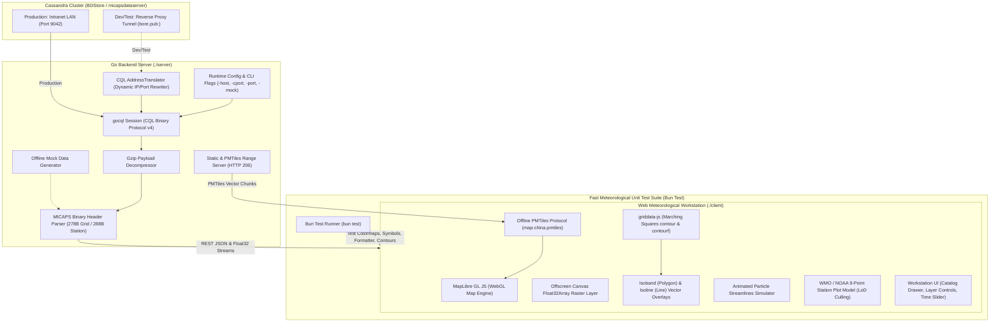

# MICAPS-Web Architecture & Technical Reference

This document provides in-depth technical documentation for the architecture, data pipeline, API specifications, build workflows, and directory structure of **MICAPS-Web**.

---

## 1. Architecture Overview



---

## 2. Directory Structure

```text
micaps-web/
├── Architecture.md                   # In-depth architectural & technical specification
├── README.md                         # Project overview and quick start guide
├── server/                           # Go HTTP server & Cassandra data engine
│   ├── cmd/
│   │   └── main.go                   # CLI entrypoint, flag parsing, route bootstrap
│   ├── config/
│   │   ├── config.go                 # Configuration, MICAPS.exe.config discovery, CLI flags
│   │   └── config_test.go            # Unit tests for XML parsing and random IP selection
│   ├── db/
│   │   ├── cql_client.go             # Cassandra CQL session & TunnelTranslator
│   │   ├── catalog_queries.go        # Catalog, treeview, level & latest time queries
│   │   └── data_queries.go           # Raw blob query executor
│   ├── handler/
│   │   ├── catalog_handler.go        # REST catalog endpoints
│   │   ├── grid_handler.go           # NWP JSON and binary Float32 streaming handlers
│   │   ├── station_handler.go        # GeoJSON station observation handler
│   │   └── static_handler.go         # SPA fallback & HTTP 206 PMTiles range server
│   ├── mock/
│   │   └── mock_generator.go         # Synthetic NWP grid & station observation generator
│   ├── model/
│   │   └── types.go                  # Data structures and GeoJSON models
│   ├── parser/
│       ├── decompress.go             # Gzip blob decompressor
│       ├── grid_header.go            # 278-byte MICAPS Type 4/11 header parser
│       ├── grid_data.go              # Grid Float32 payload decoding
│       └── station_parser.go         # 288-byte station header & observation decoder
├── client/                           # Frontend Meteorological Workstation
│   ├── index.html                    # Workstation HTML shell
│   ├── package.json                  # Dependencies, build scripts & test runner
│   ├── config.json                   # Runtime-editable meteorological configuration (presets, colormaps & derived layers)
│   ├── map/
│   │   └── map-china.pmtiles         # Offline China vector tiles (borders & provinces)
│   ├── palettes/                     # CMA standard colormaps & color tables (served directly, not bundled)
│   ├── dist/                         # Compiled bundle (strictly assets/ and index.html; no config, palettes, or map)
│   │   ├── assets/
│   │   └── index.html
│   ├── src/
│   │   ├── main.js                   # Application bootstrap & lifecycle orchestrator
│   │   ├── style.css                 # Dark meteorological theme stylesheet
│   │   ├── api/                      # REST & binary stream fetchers
│   │   ├── layers/                   # MapLibre, Deck.gl, Canvas & SVG layer renderers
│   │   ├── map/                      # MapLibre GL setup, PMTiles protocol, graticule lines
│   │   ├── store/                    # Reactive workstation state manager
│   │   ├── ui/                       # Navbar, catalog drawer, layer control, time slider, tooltip
│   │   └── utils/                    # CMA palettes, weather symbols, griddata-js adapter
│   └── test/                         # Meteorological Unit Test Suite
│       ├── colormaps.test.js         # Dynamic colormaps & level scaling tests
│       ├── weather_symbols.test.js   # WMO symbols & 110° wind barbs tests
│       ├── contour_logic.test.js     # Characteristic bold contour tests
│       ├── config.test.js            # config.json validation & compact formatting tests
│       ├── timeslider.test.js        # Timeline stepper, init-time, & sounding filter tests
│       └── formatters.test.js        # Meteorological unit and date formatting tests
```

---

## 3. Development & Build Workflows

The application uses a unified Go server architecture. A separate frontend development server (such as Vite dev server) is not required because the Go backend (`micaps-server`) directly serves both the API routes and all frontend resources:
- **Compiled Web Application**: Served from `client/dist/` with single-page application (SPA) fallback to `index.html`.
- **Runtime Configuration**: Served and persisted directly to `client/config.json` via `/api/config` and `/config.json`.
- **Offline Vector Basemap**: Served directly from `client/map/map-china.pmtiles` with HTTP 206 partial content range requests via `/map-china.pmtiles`.
- **Color Palettes**: Served dynamically from `client/palettes/` via `/palettes/*`.

### Frontend Build (Client)

The frontend JavaScript and CSS modules are compiled using Vite into `client/dist`.

> [!IMPORTANT]
> Non-bundled assets remain strictly outside `client/dist`:
> - **`client/config.json`**: Only exists at `client/config.json`. It is never copied into or bundled with `client/dist/`, ensuring live configuration edits take effect without requiring frontend rebuilds.
> - **`client/palettes/`** and **`client/map/`**: Color tables and PMTiles vector tiles are served directly from their respective source folders by the Go server.
> 
> Consequently, `client/dist/` contains solely `index.html` and the hashed JavaScript/CSS assets in `assets/`.

```bash
cd client

# Install dependencies (requires Bun 1.4 or Node)
bun install

# Build production bundle into client/dist
bun run build
```

### Backend Build & Execution (Server)

```bash
cd server

# Run Go package unit tests
go test ./...

# Build Linux binary
go build -o micaps-server cmd/main.go

# Cross-compile Windows 10/11 x86-64 binary
GOOS=windows GOARCH=amd64 go build -o micaps-server.exe cmd/main.go

# Run server (automatically serves client/dist, client/config.json, client/palettes, and client/map)
./micaps-server -mock
```

---

## 4. Runtime Configuration Schema (config.json)

Composite presets and named colormaps are loaded from `client/config.json` at startup rather than bundled into the JavaScript. The file structure is:

```json
{
  "colormaps": {
    "my-temperature": [
      { "val": -20, "color": [0, 80, 255, 255] },
      { "val": 20, "color": [255, 80, 0, 255] }
    ]
  },
  "presets": [
    {
      "id": "my-group",
      "name": "My Group",
      "hasLevel": true,
      "defaultLevel": 500,
      "colormap": "my-temperature",
      "colormapByLevel": { "850": "my-temperature" },
      "layers": [
        {
          "model": "ECMWF_HR",
          "element": "TMP",
          "type": "contour",
          "render": {
            "colormap": "my-temperature",
            "colormapByLevel": { "500": "my-temperature" }
          }
        }
      ]
    }
  ]
}
```

- `render.colormap` overrides the group setting, and `colormapByLevel` provides a level-specific override.
- Colormaps use sorted numeric `val` stops and RGB/RGBA channel arrays from 0–255.

---

## 5. Meteorological Unit Testing (Bun Test)

Run the entire suite of meteorological algorithms, colormap calculations, WMO symbol rendering, and configuration formatting tests:

```bash
cd client
bun test
```

Individual test suites:
- **`colormaps.test.js`**: Verify meteorological colormaps and dynamic level scaling.
- **`weather_symbols.test.js`**: Verify WMO standard symbols and 110-degree wind barbs.
- **`contour_logic.test.js`**: Verify characteristic bold contour line matching logic.
- **`config.test.js`**: Verify configuration format and preset schema.
- **`timeslider.test.js`**: Verify timeline step-lengths, upper-air 08:00/20:00 UTC+8 filtering, and forecast init-cycles.
- **`formatters.test.js`**: Verify date/time, cycle, and coordinate formatting.

---

## 6. API Reference Summary

| Endpoint | Method | Description |
| :--- | :--- | :--- |
| `/api/status` | `GET` | Health check, uptime, and database connection status. |
| `/api/config` | `GET`, `POST` | Read or save runtime `client/config.json` preset configurations. |
| `/config.json` | `GET` | SPA handler direct route serving runtime `client/config.json`. |
| `/palettes/*` | `GET` | Dynamic static file route serving CMA color palettes directly from `client/palettes/`. |
| `/map-china.pmtiles` | `GET` | HTTP 206 range-request endpoint serving offline China vector basemap tiles from `client/map/map-china.pmtiles`. |
| `/api/catalog/models` | `GET` | Returns 4-tier model hierarchy (Global NWP, Regional, Guidance, Observations). |
| `/api/catalog/tree` | `GET` | Returns directory file tree for a given data path. |
| `/api/catalog/levels` | `GET` | Returns isobaric pressure levels (`1000`, `850`, `500`, `200` hPa). |
| `/api/catalog/latest` | `GET` | Returns the latest available forecast cycle for a path. |
| `/api/data/grid` | `GET` | Returns decoded NWP grid GeoJSON with 2D scalar/vector arrays. |
| `/api/data/grid/binary` | `GET` | Streams raw Little-Endian `Float32Array` bytes for zero-copy Canvas/WebGL raster rendering. |
| `/api/data/station` | `GET` | Returns WMO/CMA synoptic station observations as GeoJSON Point `FeatureCollection`. |

---

## 7. Standards & References

- **CMA MICAPS 4 Cassandra Architecture**: `../help/micaps4-cassandra.md`
- **MICAPS 4 File Format**: [nmcdev/nmc_met_io](https://github.com/nmcdev/nmc_met_io/blob/master/nmc_met_io/retrieve_cassandraDB.py)
- **High-Performance Local Web Maps**: [likev/local-map](https://github.com/likev/local-map)
- **In-Browser Contouring**: [likev/griddata-js](https://github.com/likev/griddata-js)
- **WMO / NOAA Station Weather Plot Layout**:
  - [CIMSS Satellite Meteorology Module 7](https://cimss.ssec.wisc.edu/satmet/modules/7_weather_forecast/wf-5.html)
  - [NOAA Weather Prediction Center (WPC) Station Plot](https://www.wpc.ncep.noaa.gov/html/stationplot.shtml)

---

## 8. MICAPS Data Format Specifications & Cassandra Ingestion Conventions

### 8.1. MICAPS Diamond File Types

The China Meteorological Administration (CMA) MDFS / MICAPS 4 data store organizes gridded model outputs and meteorological observations into standard **Diamond Types** designated by the `DataType` field in the 278-byte binary header:

| Diamond Type | `DataType` | Structure | Content & Usage |
| :--- | :--- | :--- | :--- |
| **Diamond 1** | `1` | Discrete station records | Surface synoptic weather station observations |
| **Diamond 2** | `2` | Discrete station records | Upper-air sounding observations (Height, Temp, Dewpoint depression, Wind) |
| **Diamond 3** | `3` | Discrete station records | High-density automatic weather stations (AWS) with 3h pressure tendency |
| **Diamond 4** | `4` | 2D Scalar Grid ($N_{\text{lat}} \times N_{\text{lon}}$) | Scalar NWP fields: Temperature ($TT$), Geopotential Height ($H$), Relative Humidity ($RH$), Precipitation |
| **Diamond 11** | `11` | 2D Vector Grid ($2 \times N_{\text{lat}} \times N_{\text{lon}}$) | Vector wind fields: $U/V$ physical velocities or Speed / Direction angle grids |
| **Diamond 13** | `13` | 2D Scalar Grid | Weather radar composite reflectivity mosaics (dBZ) |
| **Diamond 14** | `14` | 2D Scalar Grid | Meteorological satellite infrared / visible cloud imagery |

---

### 8.2. Diamond 11 Vector Wind Ingestion Conventions (Polar vs. Cartesian)

In the CMA MDFS Cassandra storage architecture, different upstream NWP decoders ingest gridded wind products under `DataType == 11` using one of two internal representations without a separate sub-type discriminator in the header:

1. **Polar Coordinate Representation (`ECMWF_HR/WIND`, `ECMWF/WIND`, `GFS/WIND`)**:
   - **Block 1** (`payload[0 : totalPoints*4]`): Wind Speed magnitude ($ff \ge 0\text{ m/s}$).
   - **Block 2** (`payload[totalPoints*4 : totalPoints*8]`): Mathematical Polar Angle $\theta$ in degrees ($[0^\circ, 360^\circ]$, where $0^\circ = \text{East / +X}$, $90^\circ = \text{North / +Y}$, $180^\circ = \text{West / -X}$, $270^\circ = \text{South / -Y}$).
   - **Conversion to Physical Velocities**:
     $$U = \text{speed} \cdot \cos\left(\frac{\theta\pi}{180}\right),\quad V = \text{speed} \cdot \sin\left(\frac{\theta\pi}{180}\right),\quad \text{Magnitude} = \text{speed}$$

2. **Cartesian Coordinate Representation (`CMA-GFS / GRAPES / UV` or synthetic grids)**:
   - **Block 1**: Physical Eastward Velocity $U$ ($\text{m/s}$, signed).
   - **Block 2**: Physical Northward Velocity $V$ ($\text{m/s}$, signed).
   - **Magnitude Calculation**:
     $$\text{Magnitude} = \sqrt{U^2 + V^2}$$

#### Decoder Differentiation Logic
The server parser ([`server/parser/grid_data.go`](file:///root/downloads/micaps-web/server/parser/grid_data.go)) inspects the blocks:
- If Block 2 values span $[0, 360]$ with typical meteorological angles ($> 60^\circ$) and Block 1 is strictly non-negative ($\ge 0$), it decodes the grid as **Polar Speed/Direction**.
- If negative velocity components are present or values represent raw $U/V$ velocity bounds ($[-60, 60]\text{ m/s}$), it consumes them directly as **Cartesian $U$ and $V$**.

---

### 8.3. Unsigned Latitude Grid Step ($\Delta\text{lat}$) Convention

In MICAPS 278-byte binary grid headers:
- `StartLatitude` (offset 150) defines the first row coordinate (typically North, e.g. $60.0^\circ\text{N}$).
- `EndLatitude` (offset 154) defines the last row coordinate (typically South, e.g. $0.0^\circ\text{N}$ or $-10.0^\circ\text{S}$).
- `LatitudeGridSpace` (offset 158) is written as an **unsigned magnitude** ($+0.25^\circ$), regardless of whether the grid traverses North-to-South or South-to-North.

To prevent coordinate calculations from incrementing upwards into the Arctic ($60^\circ \to 120^\circ$), the coordinate array generator dynamically computes the true signed step:

$$\Delta\text{lat} = \frac{\text{EndLatitude} - \text{StartLatitude}}{N_{\text{lat}} - 1}$$

- For North-to-South grids ($60^\circ \to 0^\circ$, $N_{\text{lat}} = 241$), $\Delta\text{lat} = -0.25^\circ$.
- For South-to-North grids ($15^\circ \to 55^\circ$, $N_{\text{lat}} = 161$), $\Delta\text{lat} = +0.25^\circ$.

Both JSON coordinate vectors (`resp.X`, `resp.Y`) and binary stream headers (`EncodeBinaryStream`) synchronize their bounding endpoints to this calculated grid extent.

---

### 8.4. Per-Layer Raster Source & State Isolation

To avoid race conditions and stale state in multi-field composite views (e.g. concurrent loads of $RH$, $HGT$, and $WIND$ via `Promise.allSettled()`):
- **Per-Layer DOM IDs**: Every weather layer generates isolated MapLibre sources and layers:
  - Source: `${layerId}-raster-source`
  - Layer: `${layerId}-raster-layer`
- **Captured Layer Context**: Layer records in `windowLayersMap` retain their own `{ path, file, gridData, colormap, element, level, model }`.
- **Wind Raster Consistency**: Wind magnitude raster overlays compute from the captured $U/V$ components directly or the decoded speed matrix, ensuring 100% geometric and scalar alignment with animated streamlines and wind barbs.
