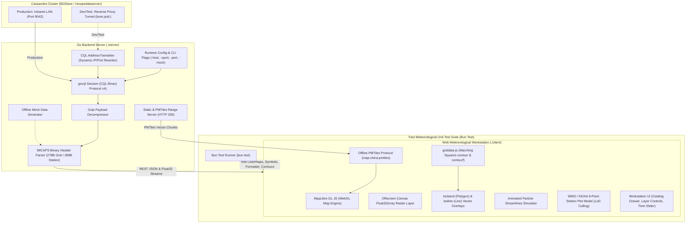

# MICAPS-Web Architecture & Technical Reference

This document provides in-depth technical documentation for the architecture, data pipeline, API specifications, build workflows, and directory structure of **MICAPS-Web**.

---

## 1. Architecture Overview



---

## 2. Directory Structure

```text
micaps-web/
├── Architecture.md                   # In-depth architectural & technical specification
├── README.md                         # Project overview and quick start guide
├── server/                           # Go HTTP server & Cassandra data engine
│   ├── cmd/
│   │   └── main.go                   # CLI entrypoint, flag parsing, route bootstrap
│   ├── config/
│   │   ├── config.go                 # Configuration, MICAPS.exe.config discovery, CLI flags
│   │   └── config_test.go            # Unit tests for XML parsing and random IP selection
│   ├── db/
│   │   ├── cql_client.go             # Cassandra CQL session & TunnelTranslator
│   │   ├── catalog_queries.go        # Catalog, treeview, level & latest time queries
│   │   └── data_queries.go           # Raw blob query executor
│   ├── handler/
│   │   ├── catalog_handler.go        # REST catalog endpoints
│   │   ├── grid_handler.go           # NWP JSON and binary Float32 streaming handlers
│   │   ├── station_handler.go        # GeoJSON station observation handler
│   │   └── static_handler.go         # SPA fallback & HTTP 206 PMTiles range server
│   ├── mock/
│   │   └── mock_generator.go         # Synthetic NWP grid & station observation generator
│   ├── model/
│   │   └── types.go                  # Data structures and GeoJSON models
│   ├── parser/
│   │   ├── decompress.go             # Gzip blob decompressor
│   │   ├── grid_header.go            # 278-byte MICAPS Type 4/11 header parser
│   │   ├── grid_data.go              # Grid Float32 payload decoding
│   │   └── station_parser.go         # 288-byte station header & observation decoder
│   └── static/
│       └── map-china.pmtiles         # Offline China vector tiles (borders & provinces)
├── client/                           # Frontend Meteorological Workstation
│   ├── index.html                    # Workstation HTML shell
│   ├── package.json                  # Dependencies, build scripts & test runner
│   ├── vite.config.js                # Vite build configuration
│   ├── public/
│   │   └── config.json               # Runtime-editable meteorological configuration (presets & colormaps)
│   ├── src/
│   │   ├── main.js                   # Application bootstrap & lifecycle orchestrator
│   │   ├── style.css                 # Dark meteorological theme stylesheet
│   │   ├── api/                      # REST & binary stream fetchers
│   │   ├── layers/                   # MapLibre, Deck.gl, Canvas & SVG layer renderers
│   │   ├── map/                      # MapLibre GL setup, PMTiles protocol, graticule lines
│   │   ├── store/                    # Reactive workstation state manager
│   │   ├── ui/                       # Navbar, catalog drawer, layer control, time slider, tooltip
│   │   └── utils/                    # CMA palettes, weather symbols, griddata-js adapter
│   └── test/                         # Meteorological Unit Test Suite
│       ├── colormaps.test.js         # Dynamic colormaps & level scaling tests
│       ├── weather_symbols.test.js   # WMO symbols & 110° wind barbs tests
│       ├── contour_logic.test.js     # Characteristic bold contour tests
│       ├── config.test.js            # config.json validation & compact formatting tests
│       ├── timeslider.test.js        # Timeline stepper, init-time, & sounding filter tests
│       └── formatters.test.js        # Meteorological unit and date formatting tests
```

---

## 3. Development & Build Workflows

### Frontend Development & Build (Client)

The frontend is built using Vite and bundled into `client/dist`. The Go backend serves these compiled static assets directly from filesystem or embedded distribution.

```bash
cd client

# Install dependencies (requires Bun 1.4)
bun install

# Launch local Vite dev server with hot reload
bun run dev

# Build production distribution and client.zip package
bun run build:all
```

### Backend Build (Server)

```bash
cd server

# Run Go package unit tests
go test ./...

# Build Linux binary
go build -o micaps-server cmd/main.go

# Cross-compile Windows 10/11 x86-64 binary
GOOS=windows GOARCH=amd64 go build -o micaps-server.exe cmd/main.go
```

---

## 4. Runtime Configuration Schema (config.json)

Composite presets and named colormaps are loaded from `client/public/config.json` at startup rather than bundled into the JavaScript. The file structure is:

```json
{
  "colormaps": {
    "my-temperature": [
      { "val": -20, "color": [0, 80, 255, 255] },
      { "val": 20, "color": [255, 80, 0, 255] }
    ]
  },
  "presets": [
    {
      "id": "my-group",
      "name": "My Group",
      "hasLevel": true,
      "defaultLevel": 500,
      "colormap": "my-temperature",
      "colormapByLevel": { "850": "my-temperature" },
      "layers": [
        {
          "model": "ECMWF_HR",
          "element": "TMP",
          "type": "contour",
          "render": {
            "colormap": "my-temperature",
            "colormapByLevel": { "500": "my-temperature" }
          }
        }
      ]
    }
  ]
}
```

- `render.colormap` overrides the group setting, and `colormapByLevel` provides a level-specific override.
- Colormaps use sorted numeric `val` stops and RGB/RGBA channel arrays from 0–255.

---

## 5. Meteorological Unit Testing (Bun Test)

Run the entire suite of meteorological algorithms, colormap calculations, WMO symbol rendering, and configuration formatting tests:

```bash
cd client
bun test
```

Individual test suites:
- **`colormaps.test.js`**: Verify meteorological colormaps and dynamic level scaling.
- **`weather_symbols.test.js`**: Verify WMO standard symbols and 110-degree wind barbs.
- **`contour_logic.test.js`**: Verify characteristic bold contour line matching logic.
- **`config.test.js`**: Verify configuration format and preset schema.
- **`timeslider.test.js`**: Verify timeline step-lengths, upper-air 08:00/20:00 UTC+8 filtering, and forecast init-cycles.
- **`formatters.test.js`**: Verify date/time, cycle, and coordinate formatting.

---

## 6. API Reference Summary

| Endpoint | Method | Description |
| :--- | :--- | :--- |
| `/api/status` | `GET` | Health check, uptime, and database connection status. |
| `/api/config` | `GET`, `POST` | Read or save runtime `config.json` preset configurations. |
| `/api/catalog/models` | `GET` | Returns 4-tier model hierarchy (Global NWP, Regional, Guidance, Observations). |
| `/api/catalog/tree` | `GET` | Returns directory file tree for a given data path. |
| `/api/catalog/levels` | `GET` | Returns isobaric pressure levels (`1000`, `850`, `500`, `200` hPa). |
| `/api/catalog/latest` | `GET` | Returns the latest available forecast cycle for a path. |
| `/api/data/grid` | `GET` | Returns decoded NWP grid GeoJSON with 2D scalar/vector arrays. |
| `/api/data/grid/binary` | `GET` | Streams raw Little-Endian `Float32Array` bytes for zero-copy Canvas/WebGL raster rendering. |
| `/api/data/station` | `GET` | Returns WMO/CMA synoptic station observations as GeoJSON Point `FeatureCollection`. |
| `/map-china.pmtiles` | `GET` | HTTP 206 range-request endpoint serving offline China vector basemap tiles. |

---

## 7. Standards & References

- **CMA MICAPS 4 Cassandra Architecture**: `../help/micaps4-cassandra.md`
- **MICAPS 4 File Format**: [nmcdev/nmc_met_io](https://github.com/nmcdev/nmc_met_io/blob/master/nmc_met_io/retrieve_cassandraDB.py)
- **High-Performance Local Web Maps**: [likev/local-map](https://github.com/likev/local-map)
- **In-Browser Contouring**: [likev/griddata-js](https://github.com/likev/griddata-js)
- **WMO / NOAA Station Weather Plot Layout**:
  - [CIMSS Satellite Meteorology Module 7](https://cimss.ssec.wisc.edu/satmet/modules/7_weather_forecast/wf-5.html)
  - [NOAA Weather Prediction Center (WPC) Station Plot](https://www.wpc.ncep.noaa.gov/html/stationplot.shtml)
