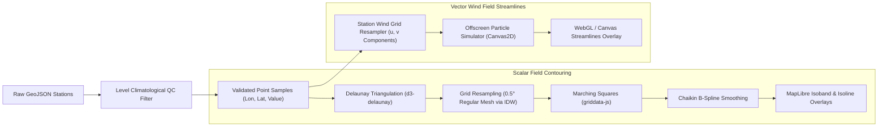
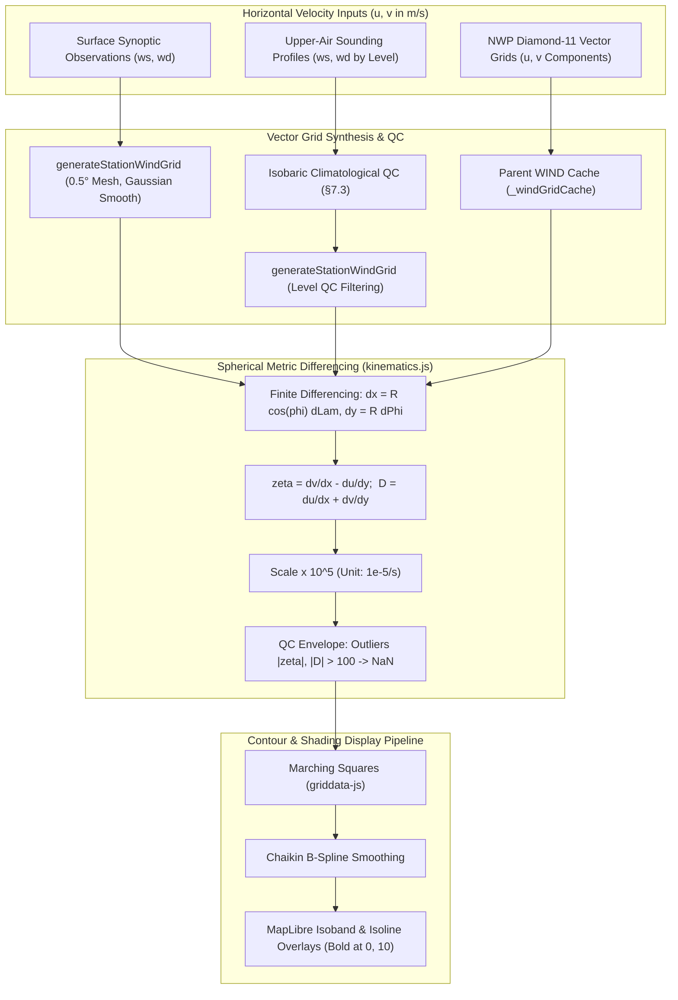
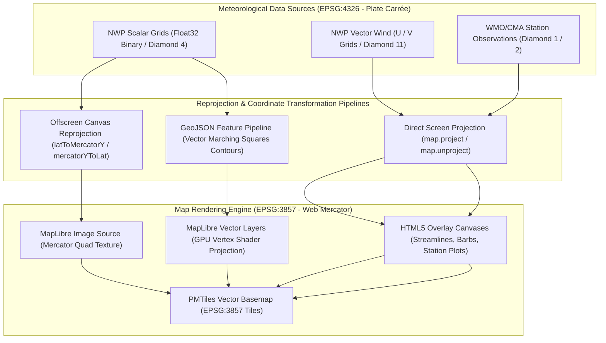
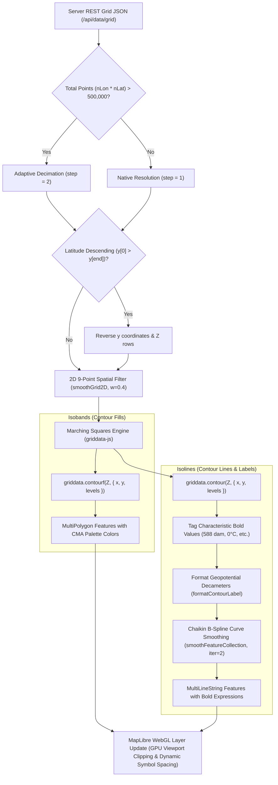
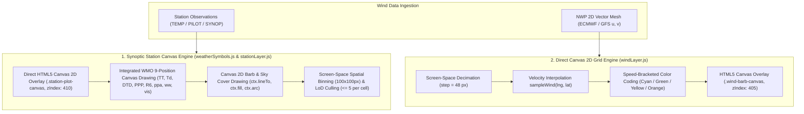
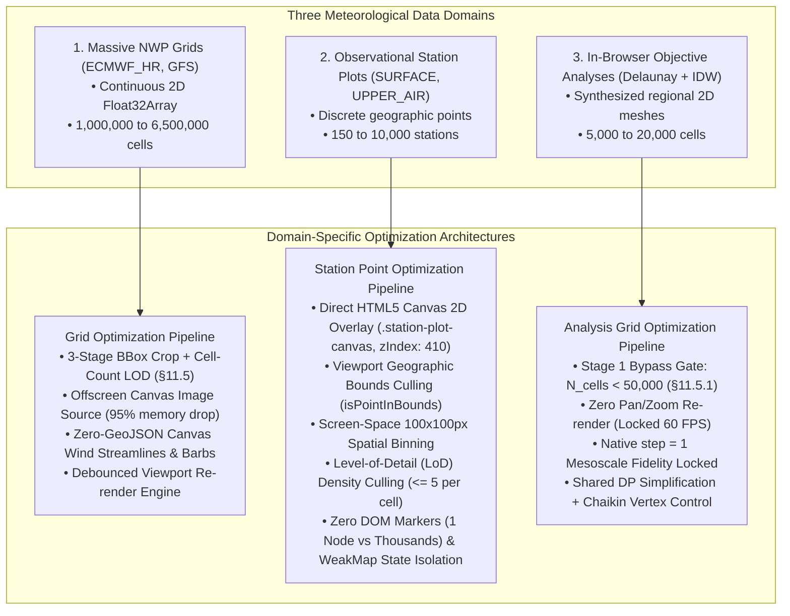
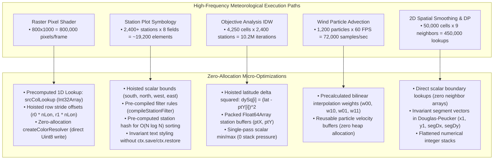

# MICAPS-Web Architecture & Technical Reference

This document provides in-depth technical documentation for the architecture, data pipeline, API specifications, build workflows, and directory structure of **MICAPS-Web**.

---

## Table of Contents

- [1. Architecture Overview](#1-architecture-overview)
- [2. Directory Structure](#2-directory-structure)
- [3. Development & Build Workflows](#3-development--build-workflows)
  - [3.1. Frontend Build (Client)](#31-frontend-build-client)
  - [3.2. Backend Build & Execution (Server)](#32-backend-build--execution-server)
- [4. Runtime Configuration Schema (`config.json`)](#4-runtime-configuration-schema-configjson)
- [5. API Reference Summary](#5-api-reference-summary)
- [6. MICAPS Data Format Specifications & Cassandra Ingestion Conventions](#6-micaps-data-format-specifications--cassandra-ingestion-conventions)
  - [6.1. MICAPS Diamond File Types](#61-micaps-diamond-file-types)
  - [6.2. Diamond 11 Vector Wind Ingestion Conventions (Polar vs. Cartesian)](#62-diamond-11-vector-wind-ingestion-conventions-polar-vs-cartesian)
  - [6.3. Unsigned Latitude Grid Step ($\Delta\text{lat}$) Convention](#63-unsigned-latitude-grid-step-deltatextlat-convention)
- [7. Meteorological Observation Quality Control (QC) & Objective Analysis Pipeline](#7-meteorological-observation-quality-control-qc--objective-analysis-pipeline)
  - [7.1. Separation of Station Surface Elevation vs. Isobaric Geopotential Height](#71-separation-of-station-surface-elevation-vs-isobaric-geopotential-height)
  - [7.2. Upper-Air Wind Quality Control & Calm Consistency](#72-upper-air-wind-quality-control--calm-consistency)
  - [7.3. Isobaric Level-Specific Climatological QC Bounds Table](#73-isobaric-level-specific-climatological-qc-bounds-table)
  - [7.4. Objective Analysis, Delaunay Triangulation & Vector Grid Synthesis](#74-objective-analysis-delaunay-triangulation--vector-grid-synthesis)
- [8. Map Projection & Coordinate Systems Architecture](#8-map-projection--coordinate-systems-architecture)
  - [8.1. Primary Map Engine Projection: Web Mercator (EPSG:3857)](#81-primary-map-engine-projection-web-mercator-epsg3857)
  - [8.2. Native Meteorological Space: Equirectangular (EPSG:4326)](#82-native-meteorological-space-equirectangular-epsg4326)
  - [8.3. Transformation & Reprojection Implementations](#83-transformation--reprojection-implementations)
  - [8.4. Coordinate Systems & Projection Summary](#84-coordinate-systems--projection-summary)
  - [8.5. Multi-Projection Support & Runtime Switching Architecture](#85-multi-projection-support--runtime-switching-architecture)
- [9. NWP Gridded Contouring & Isoband Pipeline (ECMWF_HR & Global Models)](#9-nwp-gridded-contouring--isoband-pipeline-ecmwf_hr--global-models)
  - [9.1. Domain Scope & Viewport Independence](#91-domain-scope--viewport-independence)
  - [9.2. Native Grid Resolution & Adaptive Decimation](#92-native-grid-resolution--adaptive-decimation)
  - [9.3. Pre-Contour 2D Spatial Filtering](#93-pre-contour-2d-spatial-filtering)
  - [9.4. Marching Squares & Isoband / Isoline Generation](#94-marching-squares--isoband--isoline-generation)
  - [9.5. Post-Contour Chaikin Vector Curve Smoothing](#95-post-contour-chaikin-vector-curve-smoothing)
  - [9.6. Characteristic Bold Isolines & Synoptic Formatting](#96-characteristic-bold-isolines--synoptic-formatting)
  - [9.7. Zoom Independence & Lifecycle Contract](#97-zoom-independence--lifecycle-contract)
- [10. Meteorological Symbology & Dual-Engine Rendering Architecture](#10-meteorological-symbology--dual-engine-rendering-architecture)
  - [10.1. CMA / MICAPS Metric Wind Barb Symbology Standards](#101-cma--micaps-metric-wind-barb-symbology-standards)
  - [10.2. Dual-Engine Rendering Implementation](#102-dual-engine-rendering-implementation)
- [11. Memory Optimization & Spatial Data Structures (GeoJSON vs. Direct WebGL / Canvas)](#11-memory-optimization--spatial-data-structures-geojson-vs-direct-webgl--canvas)
  - [11.1. GeoJSON Heap Explosion & Topology Overhead (Isolines vs. Isobands)](#111-geojson-heap-explosion--topology-overhead-isolines-vs-isobands)
  - [11.2. Zero-GeoJSON Direct Canvas Architecture for Vector Wind (`windLayer.js`)](#112-zero-geojson-direct-canvas-architecture-for-vector-wind-windlayerjs)
  - [11.3. Offscreen Canvas Image Source Pipeline (`rasterLayer.js`)](#113-offscreen-canvas-image-source-pipeline-rasterlayerjs)
  - [11.4. Per-Layer Raster Source & State Isolation](#114-per-layer-raster-source--state-isolation)
  - [11.5. Viewport Bounding Box Spatial Culling & Cell-Count-Driven LOD Pipeline](#115-viewport-bounding-box-spatial-culling--cell-count-driven-lod-pipeline)
  - [11.6. Lifecycle Memory Management & Cache Flushing](#116-lifecycle-memory-management--cache-flushing)
  - [11.7. Domain-Specific Memory Strategies: NWP Grids vs. Observational Stations vs. Derived Analyses](#117-domain-specific-memory-strategies-nwp-grids-vs-observational-stations-vs-derived-analyses)
  - [11.8. Hot-Path Loop Optimization & Zero-Allocation Micro-Architectures](#118-hot-path-loop-optimization--zero-allocation-micro-architectures)
- [12. Workstation UX & Intelligent Data Prefetch Architecture](#12-workstation-ux--intelligent-data-prefetch-architecture)
  - [12.1. 3-Minute TTL In-Memory Cache & Network Deduplication (`apiClient.js`)](#121-3-minute-ttl-in-memory-cache--network-deduplication-apiclientjs)
  - [12.2. Orthogonal Target Resolution (`prefetchService.js`)](#122-orthogonal-target-resolution-prefetchservicejs)
  - [12.3. Non-Blocking Execution & Multi-Window Scheduling](#123-non-blocking-execution--multi-window-scheduling)
- [13. Sounding & Vertical Profile Analysis Subsystems (T-lnP & EC Time-Height Profile)](#13-sounding--vertical-profile-analysis-subsystems-t-lnp--ec-time-height-profile)
  - [13.1. Upper-Air T-lnP Sounding Diagram Architecture (`tlogp`)](#131-upper-air-t-lnp-sounding-diagram-architecture-tlogp)
    - [13.1.1. Skew-T Thermodynamic Coordinates & Transformations](#1311-skew-t-thermodynamic-coordinates--transformations)
    - [13.1.2. Thermodynamic Background Curves & Runge-Kutta 4 (RK4) Parcel Ascent](#1312-thermodynamic-background-curves--runge-kutta-4-rk4-parcel-ascent)
    - [13.1.3. Convective Instability Indices Formulation](#1313-convective-instability-indices-formulation)
    - [13.1.4. MapLibre Station Integration, Sounding Extraction & Panel UI](#1314-maplibre-station-integration-sounding-extraction--panel-ui)
  - [13.2. ECMWF Time-Height Cross-Section Architecture (`ec-time-height-profile`)](#132-ecmwf-time-height-cross-section-architecture-ec-time-height-profile)
    - [13.2.1. Multi-Dimensional Grid Slicing ($t \times \ln p$) & Lower-Tropospheric Focus (1000–200 hPa)](#1321-multi-dimensional-grid-slicing-t-times-ln-p--lower-tropospheric-focus-1000200-hpa)
    - [13.2.2. Multi-Element Composite Rendering Pipeline](#1322-multi-element-composite-rendering-pipeline)
    - [13.2.3. Asynchronous Concurrency, Window-Scoped Grid Caching & Fast-Path Resampling](#1323-asynchronous-concurrency-window-scoped-grid-caching--fast-path-resampling)
    - [13.2.4. Zero-Fetch Time Direction Inversion & Canvas Buffer Clearing](#1324-zero-fetch-time-direction-inversion--canvas-buffer-clearing)
    - [13.2.5. Aspect-Ratio Locked Subwindow Resizing & Viewport Clamping](#1325-aspect-ratio-locked-subwindow-resizing--viewport-clamping)
  - [13.3. ECMWF Transect Profiles: Line–Height Section & Time–Line Hovmoller (`ec-line-profile`)](#133-ecmwf-transect-profiles-lineheight-section--timeline-hovmoller-ec-line-profile)
    - [13.3.1. Transect Endpoints](#1331-transect-endpoints)
    - [13.3.2. Matrices & Timeline Ownership](#1332-matrices--timeline-ownership)
    - [13.3.3. Response & Heap Budget](#1333-response--heap-budget)
- [14. Meteorological Unit Testing & Automated Verification (Bun Test & Go Test)](#14-meteorological-unit-testing--automated-verification-bun-test--go-test)
  - [14.1. Client Meteorological Test Suite (Bun Test)](#141-client-meteorological-test-suite-bun-test)
  - [14.2. Server Binary Parser Test Suite (Go Test)](#142-server-binary-parser-test-suite-go-test)
- [15. Standards & References](#15-standards--references)


---

## 1. Architecture Overview

```mermaid
graph TD
    subgraph Storage ["Cassandra Cluster (BDStore / micapsdataserver)"]
        DirectLAN["Production: Intranet LAN (Port 9042)"]
        Tunnel["Dev/Test: Reverse Proxy Tunnel (bore.pub:<dynamic-port>)"]
    end

    subgraph Backend ["Go Backend Server (./server)"]
        Config["Runtime Config & CLI Flags (-host, -cport, -port, -mock)"]
        Translator["CQL AddressTranslator (Dynamic IP/Port Rewriter)"]
        Gocql["gocql Session (CQL Binary Protocol v4)"]
        Decompress["Gzip Payload Decompressor"]
        Parser["MICAPS Binary Header Parser (278B Grid / 288B Station)"]
        StationQC["Station Observation QC (Elevation vs HGT, Wind Normalization)"]
        RangeServer["Static & PMTiles Range Server (HTTP 206)"]
        MockEngine["Offline Mock Data Generator"]

        Config --> Gocql
        Tunnel -.->|Dev/Test| Translator --> Gocql
        DirectLAN -->|Production| Gocql
        Gocql --> Decompress --> Parser --> StationQC
        MockEngine -.-> Parser
    end

    subgraph Frontend ["Web Meteorological Workstation (./client)"]
        MapLibre["MapLibre GL JS (WebGL Map Engine)"]
        PMTilesProto["Offline PMTiles Protocol (map-china.pmtiles)"]
        QCFilter["Isobaric Climatological QC Filter (HGT/TMP/WIND Bounds)"]
        ObjAnalysis["Objective Analysis (Delaunay Triangulation & IDW Grid)"]
        GridData["griddata-js (Marching Squares contour & contourf)"]
        
        RasterL["Offscreen Canvas Float32Array Raster Layer"]
        ContourL["Isoband (Polygon) & Isoline (Line) Vector Overlays"]
        WindL["Vector Wind & Wind Barb Engine (Canvas Streamlines & 110° Metric Barbs)"]
        StationL["WMO / NOAA 9-Point Station Plot Model (LoD Culling)"]
        TLogPL["T-lnP Sounding Diagram (RK4 Parcel Ascent, CAPE/CIN/LCL/LFC)"]
        TimeHeightL["EC Time-Height Profile (1000-200 hPa, RH/TMP/VVEL/Wind Cross-Section)"]
        UI["Workstation UI (Catalog Drawer, Layer Controls, Time Slider)"]

        KeyboardNav["Keyboard Shortcuts Engine (Arrow Keys: Time & Level)"]
        PrefetchEngine["Intelligent Prefetch Engine (Left/Right/Up/Down Preload)"]
        DataCache["apiClient 3-Minute TTL Cache & In-Flight Deduplicator"]
        
        KeyboardNav -->|Instant 0ms Step| DataCache
        UI -->|Schedule Debounced (150ms)| PrefetchEngine
        PrefetchEngine -->|Preload Orthogonal Neighbors| DataCache
        DataCache -->|Cache Hits| ContourL
        DataCache -->|Cache Hits| RasterL
        DataCache -->|Cache Hits| StationL
        DataCache -->|Sounding Obs| TLogPL
        DataCache -->|NWP Grids & Fast Resample| TimeHeightL
    end

    subgraph Testing ["Automated Verification Test Suites"]
        GoTest["Go Test Suite (Parser QC, MDFS Headers, Config)"]
        BunTest["Bun Test Runner (486 Tests: QC, Contours, Prefetch, T-lnP, Time-Height)"]
        GoTest -->|Validate Parser & Normalization| Backend
        BunTest -->|Test QC, Interpolation, Contours, Prefetch, Soundings| Frontend
    end

    StationQC -->|GeoJSON Station Collections| DataCache
    Parser -->|REST JSON & Float32 Streams| DataCache
    DataCache --> QCFilter --> ObjAnalysis --> GridData --> ContourL
    DataCache --> StationL
    ObjAnalysis -->|Synthesized U/V Wind Grids| WindL
    RangeServer -->|PMTiles Vector Chunks| PMTilesProto --> MapLibre
```

---

## 2. Directory Structure

```text
micaps-web/
├── Architecture.md                   # In-depth architectural & technical specification
├── README.md                         # Project overview and quick start guide
├── server/                           # Go HTTP server & Cassandra data engine
│   ├── cmd/
│   │   └── main.go                   # CLI entrypoint, flag parsing, route bootstrap
│   ├── config/
│   │   ├── config.go                 # Configuration, MICAPS.exe.config discovery, CLI flags
│   │   └── config_test.go            # Unit tests for XML parsing and random IP selection
│   ├── db/
│   │   ├── cql_client.go             # Cassandra CQL session & TunnelTranslator
│   │   ├── catalog_queries.go        # Catalog, treeview, level & latest time queries
│   │   └── data_queries.go           # Raw blob query executor
│   ├── handler/
│   │   ├── catalog_handler.go        # REST catalog endpoints
│   │   ├── grid_handler.go           # NWP JSON and binary Float32 streaming handlers
│   │   ├── station_handler.go        # GeoJSON station observation handler
│   │   └── static_handler.go         # SPA fallback & HTTP 206 PMTiles range server
│   ├── mock/
│   │   └── mock_generator.go         # Synthetic NWP grid & station observation generator
│   ├── model/
│   │   └── types.go                  # Data structures and GeoJSON models
│   ├── parser/
│       ├── decompress.go             # Gzip blob decompressor
│       ├── grid_header.go            # 278-byte MICAPS Type 4/11 header parser
│       ├── grid_data.go              # Grid Float32 payload decoding
│       ├── station_parser.go         # 288-byte station header & observation decoder (QC & elevation/height)
│       └── station_parser_test.go    # Go unit tests for station QC, rain, elevation vs height, & calm winds
├── client/                           # Frontend Meteorological Workstation
│   ├── index.html                    # Workstation HTML shell
│   ├── package.json                  # Dependencies, build scripts & test runner
│   ├── config.json                   # Runtime-editable meteorological configuration (presets, colormaps & derived layers)
│   ├── map/
│   │   └── map-china.pmtiles         # Offline China vector tiles (borders & provinces)
│   ├── palettes/                     # CMA standard colormaps & color tables (served directly, not bundled)
│   ├── dist/                         # Compiled bundle (strictly assets/ and index.html; no config, palettes, or map)
│   │   ├── assets/
│   │   └── index.html
│   ├── src/
│   │   ├── main.js                   # Application bootstrap & lifecycle orchestrator
│   │   ├── style.css                 # Dark meteorological theme stylesheet
│   │   ├── tabs.css                  # Multi-window tabs & layout styling
│   │   ├── api/                      # REST & binary stream fetchers (3-minute TTL cache & inflight deduplication)
│   │   ├── layers/                   # MapLibre, Deck.gl, Canvas, Kinematics, Sounding & Surface analysis layers
│   │   │   ├── tlogp/                # Upper-air T-lnP sounding diagram, RK4 parcel ascent & convective indices
│   │   │   ├── timeheight/           # ECMWF time-height cross-section (1000-200 hPa multi-element composite)
│   │   │   ├── kinematics/           # Relative vorticity, horizontal divergence & finite differencing
│   │   │   ├── station/              # Surface & upper-air station plots and WMO/CMA symbology
│   │   │   └── dtd/                  # Dew-point depression (DTD) analysis & moisture contours
│   │   ├── map/                      # MapLibre GL setup, PMTiles protocol, graticule lines
│   │   ├── services/                 # Intelligent background data prefetch engine (Left/Right/Up/Down)
│   │   ├── store/                    # Reactive workstation state manager
│   │   ├── ui/                       # Navbar, catalog drawer, layer control, time slider, tooltip
│   │   └── utils/                    # CMA palettes, weather symbols, griddata-js adapter
│   └── test/                         # Meteorological Unit Test Suite (514 bun tests across 73 files)
│       ├── tlogp/                    # T-lnP thermodynamics, parcel ascent & aspect-ratio resize tests
│       ├── timeheight/               # Time-height loading, canvas math, sampling, resize & integration tests
│       ├── colormaps.test.js         # Dynamic colormaps & level scaling tests
│       ├── weather_symbols.test.js   # WMO symbols & CMA/MICAPS 110° wind barbs tests
│       ├── contour_logic.test.js     # Characteristic bold contour tests
│       ├── contour_raster_exclusivity_legend.test.js # Colormap exclusivity & dynamic legend switching tests
│       ├── config.test.js            # config.json validation & compact formatting tests
│       ├── timeslider.test.js        # Timeline stepper, init-time, & sounding filter tests
│       ├── formatters.test.js        # Meteorological unit and date formatting tests
│       ├── derived_layers.test.js    # Sounding Height/Temp/Wind QC, layer auto-save & streamlines tests
│       ├── station_contour_analysis.test.js # Delaunay triangulation & IDW objective analysis tests
│       ├── smooth_contour.test.js    # Chaikin B-spline contour line smoothing tests
│       ├── raster_layer.test.js      # Float32 offscreen canvas raster layer tests
│       ├── ui_review2_fixes.test.js  # UI layer controls & window manager synchronization tests
│       ├── ui_review3_fixes.test.js  # UI Review 3 CSS/layout, a11y, multi-window & analysis consistency tests
│       ├── dtd_analysis.test.js      # Dew-point depression (DTD = T - Td) QC, contours, plots & collision tests
│       ├── window_title.test.js      # Multi-window viewport title generation tests
│       ├── palette_persistence.test.js # Custom palettePath & colormap preservation across re-registration tests
│       ├── keyboard_shortcuts.test.js # ArrowLeft/Right time stepping & ArrowUp/Down isobaric level shortcuts tests
│       ├── prefetch.test.js          # 3-min TTL cache, adjacent step resolution, prefetch targets & debouncing tests
│       ├── viewport_crop.test.js     # Performance maxEffectiveCells budget & cell-count LOD step decimation tests
│       ├── memory_optimization.test.js # Viewport BBox culling, zero-GeoJSON vector wind, & tile cache flush tests
│       └── vorticity_divergence.test.js # Relative vorticity & divergence kinematics, QC, adapters, caching & UI tests
```

---

## 3. Development & Build Workflows

The application uses a unified Go server architecture. A separate frontend development server (such as Vite dev server) is not required because the Go backend (`micaps-server`) directly serves both the API routes and all frontend resources:
- **Compiled Web Application**: Served from `client/dist/` with single-page application (SPA) fallback to `index.html`.
- **Runtime Configuration**: Served and persisted directly to `client/config.json` via `/api/config` and `/config.json`.
- **Offline Vector Basemap**: Served directly from `client/map/map-china.pmtiles` with HTTP 206 partial content range requests via `/map-china.pmtiles`.
- **Color Palettes**: Served dynamically from `client/palettes/` via `/palettes/*`.

### 3.1. Frontend Build (Client)

The frontend JavaScript and CSS modules are compiled using Vite into `client/dist`.

> [!IMPORTANT]
> Non-bundled assets remain strictly outside `client/dist`:
> - **`client/config.json`**: Only exists at `client/config.json`. It is never copied into or bundled with `client/dist/`, ensuring live configuration edits take effect without requiring frontend rebuilds.
> - **`client/palettes/`** and **`client/map/`**: Color tables and PMTiles vector tiles are served directly from their respective source folders by the Go server.
> 
> Consequently, `client/dist/` contains solely `index.html` and the hashed JavaScript/CSS assets in `assets/`.

```bash
cd client

# Install dependencies (requires Bun 1.4 or Node)
bun install

# Build production bundle into client/dist
bun run build
```

### 3.2. Backend Build & Execution (Server)

```bash
cd server

# Run Go package unit tests
go test ./...

# Build Linux binary
go build -o micaps-server cmd/main.go

# Cross-compile Windows 10/11 x86-64 binary
GOOS=windows GOARCH=amd64 go build -o micaps-server.exe cmd/main.go

# Run server (automatically serves client/dist, client/config.json, client/palettes, and client/map)
./micaps-server -mock
```

---

## 4. Runtime Configuration Schema (config.json)

Composite presets and named colormaps are loaded from `client/config.json` at startup rather than bundled into the JavaScript. The file structure is:

```json
{
  "colormaps": {
    "my-temperature": [
      { "val": -20, "color": [0, 80, 255, 255] },
      { "val": 20, "color": [255, 80, 0, 255] }
    ]
  },
  "presets": [
    {
      "id": "my-group",
      "name": "My Group",
      "hasLevel": true,
      "defaultLevel": 500,
      "colormap": "my-temperature",
      "colormapByLevel": { "850": "my-temperature" },
      "layers": [
        {
          "model": "ECMWF_HR",
          "element": "TMP",
          "type": "contour",
          "render": {
            "colormap": "my-temperature",
            "colormapByLevel": { "500": "my-temperature" }
          }
        }
      ]
    }
  ]
}
```

- `render.colormap` overrides the group setting, and `colormapByLevel` provides a level-specific override.
- Colormaps use sorted numeric `val` stops and RGB/RGBA channel arrays from 0–255.
- `performance.maxEffectiveCells` (default `50000`) caps the Marching Squares input budget (§11.5); never hardcoded — read via `getMaxEffectiveCells()` in `client/src/config/presets.js`.
- **Guided Configuration UI**: Workstation operators manage presets, layers, colormaps, basemap schemes, and performance budgets via a form-based UI (`client/src/ui/configEditor.js`) equipped with a 20-color meteorological swatch picker, visual colormap editor with live CSS gradient preview, layer cloning, and horizontal dividers (`{ "id": "div-obs", "divider": true, "label": "Observations" }`) rendered as unselectable separators in dropdowns and sidebars via the shared `renderPresetOptions()` helper. Standard raw JSON editing is preserved via an advanced fallback sub-tab.

---

## 5. API Reference Summary

| Endpoint | Method | Description |
| :--- | :--- | :--- |
| `/api/status` | `GET` | Health check, uptime, and database connection status. |
| `/api/config` | `GET`, `POST` | Read or save runtime `client/config.json` preset configurations. |
| `/config.json` | `GET` | SPA handler direct route serving runtime `client/config.json`. |
| `/palettes/*` | `GET` | Dynamic static file route serving CMA color palettes directly from `client/palettes/`. |
| `/map-china.pmtiles` | `GET` | HTTP 206 range-request endpoint serving offline China vector basemap tiles from `client/map/map-china.pmtiles`. |
| `/api/catalog/models` | `GET` | Returns 4-tier model hierarchy (Global NWP, Regional, Guidance, Observations). |
| `/api/catalog/tree` | `GET` | Returns directory file tree for a given data path. |
| `/api/catalog/levels` | `GET` | Returns isobaric pressure levels (`1000`, `850`, `500`, `200` hPa). |
| `/api/catalog/latest` | `GET` | Returns the latest available forecast cycle for a path. |
| `/api/data/grid` | `GET` | Returns decoded NWP grid GeoJSON with 2D scalar/vector arrays. |
| `/api/data/grid/binary` | `GET` | Streams raw Little-Endian `Float32Array` bytes for zero-copy Canvas/WebGL raster rendering. |
| `/api/data/station` | `GET` | Returns WMO/CMA synoptic station observations as GeoJSON Point `FeatureCollection`. |

---

## 6. MICAPS Data Format Specifications & Cassandra Ingestion Conventions

MICAPS-Web connects to Cassandra clusters (BDStore) and parses standard CMA binary meteorological data streams into modern web-native formats.

### 6.1. MICAPS Diamond File Types

The China Meteorological Administration (CMA) MDFS / MICAPS 4 data store organizes gridded model outputs and meteorological observations into standard **Diamond Types** designated by the `DataType` field in the 278-byte binary header:

| Diamond Type | `DataType` | Structure | Content & Usage |
| :--- | :--- | :--- | :--- |
| **Diamond 1** | `1` | Discrete station records | Surface synoptic weather station observations |
| **Diamond 2** | `2` | Discrete station records | Upper-air sounding observations (Height, Temp, Dewpoint depression, Wind) |
| **Diamond 3** | `3` | Discrete station records | High-density automatic weather stations (AWS) with 3h pressure tendency |
| **Diamond 4** | `4` | 2D Scalar Grid ($N_{\text{lat}} \times N_{\text{lon}}$) | Scalar NWP fields: Temperature ($TT$), Geopotential Height ($H$), Relative Humidity ($RH$), Precipitation |
| **Diamond 11** | `11` | 2D Vector Grid ($2 \times N_{\text{lat}} \times N_{\text{lon}}$) | Vector wind fields: $U/V$ physical velocities or Speed / Direction angle grids |
| **Diamond 13** | `13` | 2D Scalar Grid | Weather radar composite reflectivity mosaics (dBZ) |
| **Diamond 14** | `14` | 2D Scalar Grid | Meteorological satellite infrared / visible cloud imagery |

---

### 6.2. Diamond 11 Vector Wind Ingestion Conventions (Polar vs. Cartesian)

In the CMA MDFS Cassandra storage architecture, different upstream NWP decoders ingest gridded wind products under `DataType == 11` using one of two internal representations without a separate sub-type discriminator in the header:

1. **Polar Coordinate Representation (`ECMWF_HR/WIND`, `ECMWF/WIND`, `GFS/WIND`)**:
   - **Block 1** (`payload[0 : totalPoints*4]`): Wind Speed magnitude ($ff \ge 0\text{ m/s}$).
   - **Block 2** (`payload[totalPoints*4 : totalPoints*8]`): Mathematical Polar Angle $\theta$ in degrees ($[0^\circ, 360^\circ]$, where $0^\circ = \text{East / +X}$, $90^\circ = \text{North / +Y}$, $180^\circ = \text{West / -X}$, $270^\circ = \text{South / -Y}$).
   - **Conversion to Physical Velocities**:
     $$U = \text{speed} \cdot \cos\left(\frac{\theta\pi}{180}\right),\quad V = \text{speed} \cdot \sin\left(\frac{\theta\pi}{180}\right),\quad \text{Magnitude} = \text{speed}$$

2. **Cartesian Coordinate Representation (`CMA-GFS / GRAPES / UV` or synthetic grids)**:
   - **Block 1**: Physical Eastward Velocity $U$ ($\text{m/s}$, signed).
   - **Block 2**: Physical Northward Velocity $V$ ($\text{m/s}$, signed).
   - **Magnitude Calculation**:
     $$\text{Magnitude} = \sqrt{U^2 + V^2}$$

#### Decoder Differentiation Logic
The server parser ([`server/parser/grid_data.go`](file:///root/downloads/micaps-web/server/parser/grid_data.go)) inspects the blocks:
- If Block 2 values span $[0, 360]$ with typical meteorological angles ($> 60^\circ$) and Block 1 is strictly non-negative ($\ge 0$), it decodes the grid as **Polar Speed/Direction**.
- If negative velocity components are present or values represent raw $U/V$ velocity bounds ($[-60, 60]\text{ m/s}$), it consumes them directly as **Cartesian $U$ and $V$**.

---

### 6.3. Unsigned Latitude Grid Step ($\Delta\text{lat}$) Convention

In MICAPS 278-byte binary grid headers:
- `StartLatitude` (offset 150) defines the first row coordinate (typically North, e.g. $60.0^\circ\text{N}$).
- `EndLatitude` (offset 154) defines the last row coordinate (typically South, e.g. $0.0^\circ\text{N}$ or $-10.0^\circ\text{S}$).
- `LatitudeGridSpace` (offset 158) is written as an **unsigned magnitude** ($+0.25^\circ$), regardless of whether the grid traverses North-to-South or South-to-North.

To prevent coordinate calculations from incrementing upwards into the Arctic ($60^\circ \to 120^\circ$), the coordinate array generator dynamically computes the true signed step:

$$\Delta\text{lat} = \frac{\text{EndLatitude} - \text{StartLatitude}}{N_{\text{lat}} - 1}$$

- For North-to-South grids ($60^\circ \to 0^\circ$, $N_{\text{lat}} = 241$), $\Delta\text{lat} = -0.25^\circ$.
- For South-to-North grids ($15^\circ \to 55^\circ$, $N_{\text{lat}} = 161$), $\Delta\text{lat} = +0.25^\circ$.

Both JSON coordinate vectors (`resp.X`, `resp.Y`) and binary stream headers (`EncodeBinaryStream`) synchronize their bounding endpoints to this calculated grid extent.

---

## 7. Meteorological Observation Quality Control (QC) & Objective Analysis Pipeline

Raw meteorological observation streams transmitted via MDFS / Cassandra (Diamond 1 surface and Diamond 2 upper-air soundings) often contain telecommunication corruptions, PILOT balloon omissions, element mixups, and flag values that must be sanitized before presentation or spatial interpolation. MICAPS-Web implements a dual-stage quality control architecture spanning the Go backend decoder and the frontend client analysis engine.

### 7.1. Separation of Station Surface Elevation vs. Isobaric Geopotential Height

In WMO and CMA synoptic reporting standards:
- **Station Surface Elevation (`props["elevation"]`)**: Decoded from element descriptor `3` (`测站高度`). Represents the geometric height of the station barometer or ground surface above mean sea level in meters ($m$).
- **Isobaric Geopotential Height (`props["height"]`)**: Decoded from element descriptors `421` or `419` (`等压面位势高度`). Represents the work done against gravity to reach that pressure surface, reported in geopotential decameters ($dam$) or meters ($gpm$).

**The PILOT Station Trap**:
Upper-air directories (`UPPER_AIR/PLOT/<level>`) aggregate both full radiosonde balloon soundings (TEMP messages measuring $P, T, T_d, U, V$) and pilot balloon optical/radar tracking stations (PILOT messages measuring only upper-air wind vectors $U, V$). PILOT stations report station surface elevation in element 3, but do **not** measure isobaric geopotential height (element 421 is absent).

If a parser treats element 3 as a fallback for missing element 421:
- A mountain PILOT station at Grand Junction ($1473\text{ m}$) would report a 500 hPa height of $1473\text{ gpm}$ instead of the expected $\sim 5840\text{ gpm}$!
- Lowland coastal PILOT stations (e.g. Kota Bharu at $5\text{ m}$, Kuching at $27\text{ m}$) would report heights near zero.

**Architecture Fix ([`server/parser/station_parser.go`](file:///root/downloads/micaps-web/server/parser/station_parser.go))**:
1. Element 3 is decoded strictly into `props["elevation"]`.
2. Elements 421 and 419 are decoded strictly into `props["height"]` (converted $dam \to gpm$ via $\times 10$ if values are in decameter range $[20, 4500]$).
3. If element 421/419 is absent, `props["height"]` defaults to `-9999` (missing). No fallback to element 3 is permitted.
4. Longitude (element 1) is completely excluded from height property decoding.

### 7.2. Upper-Air Wind Quality Control & Calm Consistency

Upper-air wind observations are subject to multi-stage QC in both backend parsing and client-side processing:

1. **Flag Normalization**:
   - Sentinels (`9999`, `999`, `999.9`, negative values, or encoded codes $\ge 9000$) are normalized to `-9999` (null).
2. **Tenths-of-a-Meter Scaling**:
   - Upstream MDFS decoders occasionally transmit raw wind speed in units of $0.1\text{ m/s}$ (e.g., $185\text{ m/s}$ encoded as integer $1850$). Speeds in the range $(100, 1500]$ are divided by $10.0$.
   - Speeds exceeding $150\text{ m/s}$ are rejected as physical impossibilities (set to `-9999`).
3. **Calm Wind Consistency**:
   - When wind speed is calm ($ws = 0\text{ m/s}$ or $ws < 0.5\text{ m/s}$), the wind direction is normalized to $0^\circ$, and Cartesian components are set to $u = 0, v = 0$.
   - A non-calm wind observation requires a valid direction $wd \in [0, 360]$. Missing directions are **never** defaulted to $0^\circ$ (which represents true North), preventing artificial northerly wind vectors from contaminating spatial vector fields.
4. **Synoptic Station Plotting Symbology ([`client/src/layers/stationLayer.js`](file:///root/downloads/micaps-web/client/src/layers/stationLayer.js))**:
   - Missing wind ($ws = \text{null}$ or $-9999$): No wind barb or calm circle is rendered.
   - Calm wind ($ws < 1.5\text{ m/s}$): A calm wind circle ($\odot$) is rendered centered on the station coordinates; barb shafts and feathers are omitted.
   - Active wind ($ws \ge 1.5\text{ m/s}$ and $wd \in [0, 360]$): A directional WMO / CMA standard wind barb with 110-degree flags is rendered, oriented along the incoming wind azimuth using metric increments ($20\text{ m/s}$ triangle pennant flag, $4\text{ m/s}$ full barb, $2\text{ m/s}$ half barb; see [Chapter 10: Meteorological Symbology & Dual-Engine Rendering Architecture](#10-meteorological-symbology--dual-engine-rendering-architecture)).

### 7.3. Isobaric Level-Specific Climatological QC Bounds Table

To eliminate gross errors (e.g. data transmission bitflips, misplaced pressure level records, or residual surface values) before Delaunay triangulation and objective contouring, the client analysis engine ([`client/src/layers/soundingAnalysis.js`](file:///root/downloads/micaps-web/client/src/layers/soundingAnalysis.js)) verifies observations against physical climatological bounds tailored to each standard pressure level:

| Pressure Level ($hPa$) | Geopotential Height ($gpm$) | Temperature ($^\circ C$) | Dewpoint ($^\circ C$) | Max Wind Speed ($m/s$) |
| :---: | :---: | :---: | :---: | :---: |
| **1000** | $[-400, 800]$ | $[-60, 55]$ | $[-70, 40]$ | $50$ |
| **925** | $[200, 1400]$ | $[-55, 50]$ | $[-70, 35]$ | $60$ |
| **850** | $[800, 2200]$ | $[-50, 45]$ | $[-70, 30]$ | $70$ |
| **700** | $[2200, 3800]$ | $[-50, 30]$ | $[-75, 25]$ | $80$ |
| **500** | $[4400, 6400]$ | $[-60, 10]$ | $[-80, 5]$ | $95$ |
| **400** | $[6000, 8200]$ | $[-70, 0]$ | $[-85, 0]$ | $110$ |
| **300** | $[7500, 11000]$ | $[-80, 0]$ | $[-90, -5]$ | $140$ |
| **250** | $[8500, 12200]$ | $[-85, -10]$ | $[-95, -10]$ | $140$ |
| **200** | $[9800, 13800]$ | $[-85, -15]$ | $[-95, -15]$ | $140$ |
| **150** | $[11500, 15800]$ | $[-90, -20]$ | $[-100, -20]$ | $120$ |
| **100** | $[14000, 18500]$ | $[-90, -25]$ | $[-100, -25]$ | $85$ |
| **70** | $[16000, 20500]$ | $[-90, -30]$ | $[-100, -30]$ | $80$ |
| **50** | $[18000, 23000]$ | $[-90, -30]$ | $[-100, -30]$ | $75$ |
| **30** | $[21000, 26500]$ | $[-90, -30]$ | $[-100, -30]$ | $70$ |
| **20** | $[23500, 29500]$ | $[-90, -30]$ | $[-100, -30]$ | $65$ |
| **10** | $[28000, 35000]$ | $[-90, -30]$ | $[-100, -30]$ | $60$ |

Observations falling outside these envelopes are cleanly filtered out prior to triangulation, preventing isolated outliers from producing artificial circular contour bulls-eyes or distortion in the interpolated field.

#### Derived Dew-Point Depression ($DTD = T - T_d$) Analysis & Quality Control

Dew-point depression ($DTD = T - T_d$) is computed as a first-class derived scalar field across surface observations and upper-air soundings ([`client/src/layers/surfaceAnalysis.js`](file:///root/downloads/micaps-web/client/src/layers/surfaceAnalysis.js), [`client/src/layers/soundingAnalysis.js`](file:///root/downloads/micaps-web/client/src/layers/soundingAnalysis.js), [`client/src/layers/stationLayer.js`](file:///root/downloads/micaps-web/client/src/layers/stationLayer.js)):

1. **Operand Validation (Q1)**:
   - **Surface**: $T \in [-90, 65]^\circ\text{C}$ and $T_d \in [-90, 50]^\circ\text{C}$.
   - **Upper-Air Soundings**: $T$ and $T_d$ must strictly pass the level-specific isobaric climatological envelopes defined above.
2. **Supersaturation & Instrument Tolerance (Q2)**:
   - Physical definition dictates $T_d \le T$. Due to sensor calibration tolerances and rounding in radiosondes and automatic weather stations, reported dewpoints slightly exceeding air temperature ($T_d > T$) are clamped to saturation:
     $$\text{If } -0.5^\circ\text{C} \le T - T_d < 0^\circ\text{C} \implies DTD = 0.0^\circ\text{C}$$
   - Unphysical observations where $T_d > T + 0.5^\circ\text{C}$ (i.e., $T - T_d < -0.5^\circ\text{C}$) represent severe gross instrument or decoding error and are rejected as null.
3. **Meteorological Range Limits (Q3)**:
   - Plausible tropospheric depression values are bounded by $0 \le DTD \le 45^\circ\text{C}$. Values exceeding $45^\circ\text{C}$ are discarded as invalid outliers.
4. **Synoptic Contours & Isoline Rendering**:
   - **Standard Operational Levels**: $[1, 2, 3, 4, 5, 6, 8, 10, 12, 15, 20, 25, 30]^\circ\text{C}$. If dynamic station range has $\max(DTD) < 5^\circ\text{C}$, automatic fallback intervals are generated via `griddata.autoLevels(minV, maxV, 8)`.
   - **Characteristic Bold Isolines**: Highlighted at $2^\circ\text{C}$ (saturation / cloud ceiling boundary) and $10^\circ\text{C}$ (dry air boundary).
   - **Fills & Colormap**: Renders filled isobands using an inverted moisture ramp (saturated $0^\circ\text{C}$ deep blue `#2c7bb6` $\to$ arid $30^\circ\text{C}$ dark crimson `#7f0000`) mapped to palette category `TMP`.
5. **Station Weather Plotting & Collision Rules**:
   - Opt-in plotting (`showDTD: false` default) displays an orange (`#f0883e`) 12px bold integer at middle-left (`left: 0`, `top: 20px`).
   - Priority rule `DTD > ww`: When `showDTD` is active, present weather ($ww$) shifts to the far-left slot (`left: -26px`) only if visibility ($VIS$) is disabled; if $VIS$ is active, $ww$ is dropped (`VIS > ww`), preserving existing layout invariants without overlap.

### 7.4. Objective Analysis, Delaunay Triangulation & Vector Grid Synthesis

The client-side objective analysis pipeline converts sparse, irregular station soundings into continuous vector and scalar fields in real time:



1. **Delaunay Triangulation & Adaptive IDW**:
   - Validated station points form a planar Delaunay mesh.
   - An adaptive regular grid ($0.5^\circ \times 0.5^\circ$ spacing) is interpolated using Inverse Distance Weighting (IDW) bounded by local Delaunay neighbor search to preserve sharp baroclinic fronts while suppressing edge extrapolation artifacts.
2. **Marching Squares & B-Spline Smoothing**:
   - `griddata-js` extracts isobands (filled polygons) and isolines (contour paths).
   - Isolines undergo Chaikin algorithm corner cuts followed by Douglas-Peucker simplification, producing professional, cartographic-grade meteorological isolines.
   - Characteristic synoptic isolines (such as the 588 dam subtropical ridge line or the 0°C freezing isotherm) are identified and highlighted with custom stroke weights and colors.
3. **Station Wind Grid Synthesis**:
   - Upper-air vector winds $(u, v)$ from soundings are gridded into a regular 2D vector field via [`generateStationWindGrid`](file:///root/downloads/micaps-web/client/src/layers/windLayer.js).
   - This grid drives the client-side particle engine to render real-time animated streamlines directly from sparse station soundings without requiring gridded NWP model files.

### 7.5. Derived Relative Vorticity ($\zeta$) & Divergence ($D$) Kinematics & Quality Control

Horizontal kinematic derivatives—relative vertical vorticity ($\zeta = \mathbf{k} \cdot \nabla \times \mathbf{v}$) and horizontal divergence ($D = \nabla \cdot \mathbf{v}$)—are computed on the client side across Surface observations, Upper-Air soundings, and NWP vector wind grids via [`client/src/layers/kinematics.js`](file:///root/downloads/micaps-web/client/src/layers/kinematics.js):



1. **Mathematical Formulation & Spherical Metric Differencing**:
   - In spherical coordinates with mean Earth radius $R = 6,371,000\text{ m}$:
     $$\zeta = \frac{\partial v}{\partial x} - \frac{\partial u}{\partial y} = \frac{1}{R \cos\phi}\frac{\partial v}{\partial \lambda} - \frac{1}{R}\frac{\partial u}{\partial \phi}$$
     $$D = \frac{\partial u}{\partial x} + \frac{\partial v}{\partial y} = \frac{1}{R \cos\phi}\frac{\partial u}{\partial \lambda} + \frac{1}{R}\frac{\partial v}{\partial \phi}$$
   - Sign conventions: Northern Hemisphere cyclonic rotation $\zeta > 0$, anticyclonic $\zeta < 0$; horizontal divergence $D > 0$, convergence $D < 0$. Formulas preserve identical kinematic sign conventions in the Southern Hemisphere without arbitrary negation.
   - Coordinate metric scales:
     $$\Delta x_j = R \cos(\phi_j) \Delta\lambda_{\text{rad}}, \quad \Delta y = R \Delta\phi_{\text{rad}}$$
   - Grid orientation awareness: Centered finite differences for interior cells ($2\Delta x$, $2\Delta y$) and forward/backward differences along domain boundaries. Automatically detects grid row ordering: South-to-North ($\Delta\phi > 0$, standard for Delaunay station IDW grids) versus North-to-South ($\Delta\phi < 0$, standard for ECMWF/GFS NWP grids), ensuring correct meridional derivative signs.

2. **Atmospheric Units & Scaling**:
   - Typical synoptic-scale vorticity and divergence magnitudes are $\sim 10^{-5}\text{ s}^{-1}$.
   - All derivative fields are scaled by $10^5$ during computation:
     $$\zeta_{\text{scaled}} = \zeta \times 10^5, \quad D_{\text{scaled}} = D \times 10^5$$
   - Display unit is standardized across formatters, legends, and popups as $10^{-5}\text{ s}^{-1}$ (ASCII format `"1e-5/s"`). Values are formatted with one decimal place.

3. **Multi-Stage Quality Control & Outlier Clamping**:
   - **Upstream Sounding QC**: When computing upper-air kinematic fields, raw radiosonde wind observations are strictly validated against isobaric climatological envelopes (§7.3) before vector gridding.
   - **Minimum Station Density**: A minimum of $\ge 3$ stations with valid vector winds within the bounding domain is required. If fewer than 3 valid stations exist, kinematic contour generation is skipped gracefully with a user notification.
   - **Display QC Cutoff**: Finite difference singularities at high latitudes or boundary extrapolations producing unphysical magnitudes exceeding $|\zeta| > 100 \times 10^{-5}\text{ s}^{-1}$ or $|D| > 100 \times 10^{-5}\text{ s}^{-1}$ are clipped to `NaN` (masked from isoline extraction and raster fills).

4. **Standardized Cartographic Styling**:
   - **Contour Intervals**: $[-20, -15, -10, -8, -6, -4, -2, 0, 2, 4, 6, 8, 10, 15, 20] \times 10^{-5}\text{ s}^{-1}$.
   - **Characteristic Bold Isolines**: $\zeta$ highlights $0$ and $+10 \times 10^{-5}\text{ s}^{-1}$ (synoptic cyclonic shear boundary); $D$ highlights $0 \times 10^{-5}\text{ s}^{-1}$ (nondivergent level boundary).
   - **Line Stroke Colors**: Vorticity defaults to `#c678dd` (purple/magenta); Divergence defaults to `#56d4dd` (cyan/teal).
   - **Centered Diverging Colormaps**: Colormaps center zero on white/neutral, mapping negative/anticyclonic/convergent values to one pole and positive/cyclonic/divergent values to the opposite pole, assigned to diverging palette category `PRS_HGT`.

5. **Multi-Source Lifecycle & Caching Architecture**:
   - **Zero Backend Changes**: Computations run entirely client-side using existing Diamond-1/2 station observations and Diamond-11 NWP vector grids.
   - **3-Tier Parent Caching**: NWP kinematic layers dynamically locate their parent wind field via `layer.gridData` $\to$ window `_windGridCache` $\to$ `fetchGridData`, eliminating redundant network queries.
   - **Scalar Wind Speed Contour Reuse**: Scalar wind speed magnitude ($ff = \sqrt{u^2 + v^2}$) contours reuse the identical kinematic calculation and caching pipeline (`buildKinematicGridData("WIND", ...)`). In the UI, the wind layer accordion intentionally exposes `VOR` and `DIV` options to avoid redundancy with the Wind Magnitude Raster overlay, while station and programmatic workflows can generate scalar wind speed contours through this shared pathway.
   - **Lifecycle Integration**: Full support for isobaric vertical level steps (700 $\to$ 500 hPa renaming `contour-sounding-vor-700` $\to$ `contour-sounding-vor-500` with eye state preservation), prefetch service parent WIND item resolution, and preset configuration persistence.

---

## 8. Map Projection & Coordinate Systems Architecture

MICAPS-Web bridges two fundamentally different geospatial coordinate spaces:
1. **Spherical Mercator (Web Mercator / EPSG:3857)**: The display and camera projection utilized by the MapLibre GL WebGL engine and vector basemap tiling schemes.
2. **Equirectangular (Plate Carrée / EPSG:4326)**: The native coordinate system of raw atmospheric gridded fields (CMA/ECMWF/NCEP NWP models) and synoptic weather observation stations (WMO/CMA).



### 8.1. Primary Map Engine Projection: Web Mercator (EPSG:3857)

- **MapLibre GL JS Native Projection**:
  The client map container is initialized via [`createMapInstance`](file:///root/downloads/micaps-web/client/src/map/mapInstance.js#L48) using MapLibre GL JS (`maplibre-gl ^5.0.1`) without non-Mercator projection overrides, operating natively in **Web Mercator (EPSG:3857)** (conformal cylindrical projection between $\approx -85.0511^\circ$ and $+85.0511^\circ$ latitude).
- **PMTiles Vector Basemap**:
  Offline vector basemap tiles (`map-china.pmtiles`) are generated and partitioned in standard Web Mercator Slippy Map tile pyramids ($Z/X/Y$). Boundary paths (national boundaries, provincial borders, city and county boundaries) and land polygons are rendered directly by WebGL tile shaders in EPSG:3857 (see [`pmtilesLayers.js`](file:///root/downloads/micaps-web/client/src/map/pmtilesLayers.js)).
- **Graticule System**:
  Dynamic parallels and meridians generated in [`graticule.js`](file:///root/downloads/micaps-web/client/src/map/graticule.js) are fed as EPSG:4326 GeoJSON lines, allowing MapLibre's internal projection matrix to render the characteristic Mercator curvature and spacing of latitude lines.

### 8.2. Native Meteorological Space: Equirectangular (EPSG:4326)

Operational meteorological models and observation networks index spatial positions in geographic degrees:
- **Global & Regional Grids**: NWP scalar and vector grids (ECMWF_HR, GFS, CMA-GFS) are spaced evenly in spherical angular degrees:
  $$\lambda \in [\text{slon}, \text{elon}], \quad \phi \in [\text{slat}, \text{elat}]$$
  with constant angular grid increments $\Delta\text{lon}$ and $\Delta\text{lat}$.
- **Observational Networks**: Surface stations, upper-air soundings, and radar sites are cataloged by WMO/CMA station metadata with WGS 84 $(\text{lon}, \text{lat}, h)$ tuples.

### 8.3. Transformation & Reprojection Implementations

Because Web Mercator stretches vertical distance with increasing latitude by a factor of $\sec(\phi)$, raw equirectangular data cannot be placed directly onto the map without distortion. MICAPS-Web deploys three specialized reprojection pathways tailored to the rendering engine:

#### 8.3.1. Non-Linear CPU Raster Reprojection ([`rasterLayer.js`](file:///root/downloads/micaps-web/client/src/layers/rasterLayer.js))

For scalar field color shading (`showRaster`), linear quad-stretching produces intolerable positional drift at mid and high latitudes. To achieve exact cartographic alignment without GPU shader overhead, the offscreen canvas ([`renderRasterImage`](file:///root/downloads/micaps-web/client/src/layers/rasterLayer.js#L113)) resamples each output row using the spherical Mercator conformal mapping:

- **Mathematical Rationale & Physical Distortion**:
  Raw meteorological model grids (ECMWF, GFS, CMA-GFS) are indexed in regular angular increments ($\Delta\text{lat} = \text{const}$, Plate Carrée / EPSG:4326). However, Web Mercator distances expand non-linearly towards the poles by $\sec(\phi) = \frac{1}{\cos(\phi)}$:
  - At the Equator ($0^\circ$): $1^\circ$ latitude has length $L$.
  - At $60^\circ\text{N}$: $1^\circ$ latitude expands to $2 \times L$.
  - At $80^\circ\text{N}$: $1^\circ$ latitude expands to $5.8 \times L$.
  If the raw equidistant grid were painted directly into an image quad, MapLibre's linear UV texture mapping would place the $30^\circ\text{N}$ data at the visual 50% midpoint between $0^\circ$ and $60^\circ$ (which in Mercator is geographically at $\approx 35.3^\circ\text{N}$), creating tens of kilometers of latitudinal error.

- **Forward Transformation (Latitude to Mercator $Y$)**:
  $$y = \ln\left(\tan\left(\frac{\pi}{4} + \frac{\phi_{\text{rad}}}{2}\right)\right), \quad \text{where } \phi_{\text{rad}} = \phi \cdot \frac{\pi}{180}$$
  Implemented in [`latToMercatorY`](file:///root/downloads/micaps-web/client/src/layers/rasterLayer.js#L104):
  ```javascript
  function latToMercatorY(lat) {
    const rad = (Math.max(-85.05112878, Math.min(85.05112878, lat)) * Math.PI) / 180;
    return Math.log(Math.tan(Math.PI / 4 + rad / 2));
  }
  ```
- **Inverse Transformation (Mercator $Y$ to Latitude)**:
  $$\phi = \left(2\arctan(e^y) - \frac{\pi}{2}\right) \cdot \frac{180}{\pi}$$
  Implemented in [`mercatorYToLat`](file:///root/downloads/micaps-web/client/src/layers/rasterLayer.js#L109):
  ```javascript
  function mercatorYToLat(y) {
    return (2 * Math.atan(Math.exp(y)) - Math.PI / 2) * (180 / Math.PI);
  }
  ```
- **Canvas Bitmap Synthesis**:
  The offscreen canvas iterates down each Mercator raster line $j \in [0, \text{outHeight}-1]$, computes the exact geographic latitude $\phi = \text{mercatorYToLat}(y_{\text{merc}})$, and bilinearly samples the scalar values from the original EPSG:4326 grid columns. The resulting Mercator-aligned bitmap is bound as a native MapLibre Image Source (`coordinates: [[leftLon, topLat], [rightLon, topLat], [rightLon, bottomLat], [leftLon, bottomLat]]`).

- **Architectural Comparison: MapLibre GL JS vs. OpenLayers Reprojection**:
  In GIS suites like **OpenLayers**, data sources natively accept a source-level projection parameter:
  ```javascript
  // OpenLayers automates client-side raster warping via ol/reproj
  new ol.layer.Image({
    source: new ol.source.ImageStatic({
      url: '...',
      imageExtent: [slon, slat, elon, elat],
      projection: 'EPSG:4326' // OpenLayers automatically resamples to view projection
    })
  });
  ```
  MapLibre GL JS, by contrast, has **no source-level `projection` parameter** on `map.addSource()`. To maintain a lightweight footprint and locked 60 FPS GPU rendering, MapLibre strictly assumes all raster and image sources map directly into normalized Web Mercator tile space ($0 \dots 1$). It possesses no built-in `ol/reproj` triangle-warping engine. Consequently, [`latToMercatorY`](file:///root/downloads/micaps-web/client/src/layers/rasterLayer.js#L104) serves as MICAPS-Web's lightweight, zero-dependency substitute for OpenLayers' internal raster reprojection pipeline.

- **Necessity of `latToMercatorY` in 3D Globe Projection**:
  Even when the map is switched to 3D Globe (`globe` or `vertical-perspective`), this CPU resampling remains **strictly necessary**. MapLibre GL JS v5's internal `ImageSource` implementation converts corner coordinates to Mercator tile coordinates (`MercatorCoordinate.fromLngLat`). MapLibre's globe vertex shaders then map tile coordinates onto the 3D unit sphere via `mercatorCoordinatesToAngularCoordinatesRadians` $\to$ `angularCoordinatesRadiansToVector`. Because MapLibre's globe shader assumes the incoming image's UV texture space is already Mercator-distributed, feeding an un-resampled (equidistant) texture would cause double-distortion on the 3D sphere.

#### 8.3.2. GPU Vertex Shader Projection for Vector Contours ([`contourLayer.js`](file:///root/downloads/micaps-web/client/src/layers/contourLayer.js))
- Isobands (`contourf`) and isolines (`contour`) generated by [`griddata-js`](file:///root/downloads/micaps-web/client/src/layers/contourLayer.js) produce GeoJSON features with coordinates expressed in geographic longitude/latitude degrees (EPSG:4326).
- When bound to MapLibre GeoJSON sources (`map.addSource(id, { type: "geojson", data })`), MapLibre's WebGL vertex shaders reproject all polygon and line vertices to Web Mercator screen space dynamically on the GPU every frame.

#### 8.3.3. Screen-Space Projection Matrix for Canvas Overlays ([`windLayer.js`](file:///root/downloads/micaps-web/client/src/layers/windLayer.js) & [`stationLayer.js`](file:///root/downloads/micaps-web/client/src/layers/stationLayer.js))
For high-density overlays that bypass MapLibre's GeoJSON pipeline to eliminate memory overhead, projections are evaluated on the fly via MapLibre's camera matrix:
- **Station Plots ([`stationLayer.js`](file:///root/downloads/micaps-web/client/src/layers/stationLayer.js))**:
  Station geographic coordinates $(\lambda_i, \phi_i)$ are projected to viewport screen coordinates $(x_i, y_i)$ via:
  $$(x_i, y_i) = \text{map.project}([\lambda_i, \phi_i])$$
  Station symbols (WMO 9-point plots, wind feathers, sky cover octas) are drawn centered at screen pixels $(x_i, y_i)$ using HTML5 Canvas 2D.
- **Gridded Wind Barbs & Streamlines ([`windLayer.js`](file:///root/downloads/micaps-web/client/src/layers/windLayer.js))**:
  - **Screen Decimation**: To guarantee constant visual density across all zoom levels, gridded wind barbs evaluate screen pixels at uniform intervals ($\text{step} = 48\text{ px}$).
  - **Inverse Camera Unprojection**: For each screen node $(x, y)$, the map calculates the geographic coordinate:
    $$[\lambda, \phi] = \text{map.unproject}([x, y])$$
    and samples velocity vectors $(u, v)$ from the underlying EPSG:4326 Float32 array via bilinear interpolation.

### 8.4. Coordinate Systems & Projection Summary

| Subsystem / Layer | Source Data CRS | Internal Transformation | Display / Rendering Projection | Primary Implementation |
| :--- | :--- | :--- | :--- | :--- |
| **Map Engine & Camera** | N/A | Mercator tile pyramid & camera matrix | **Web Mercator (EPSG:3857)** | [`mapInstance.js`](file:///root/downloads/micaps-web/client/src/map/mapInstance.js) |
| **Basemap Layers** | Vector PMTiles | Pre-projected EPSG:3857 vector tiles | **Web Mercator (EPSG:3857)** | [`pmtilesLayers.js`](file:///root/downloads/micaps-web/client/src/map/pmtilesLayers.js) |
| **Graticule (Grid lines)** | Parametric lat/lon | MapLibre GeoJSON vertex shader | **Web Mercator (EPSG:3857)** | [`graticule.js`](file:///root/downloads/micaps-web/client/src/map/graticule.js) |
| **Raster Scalar Overlay** | EPSG:4326 Float32 Grid | Offscreen CPU resampling (`latToMercatorY`) | **Web Mercator (EPSG:3857)** (Image Source) | [`rasterLayer.js`](file:///root/downloads/micaps-web/client/src/layers/rasterLayer.js) |
| **Vector Contours (Lines/Fills)** | EPSG:4326 Float32 Grid | GPU vertex shader reprojection | **Web Mercator (EPSG:3857)** (WebGL Polygons) | [`contourLayer.js`](file:///root/downloads/micaps-web/client/src/layers/contourLayer.js) |
| **Station Plot Overlay** | EPSG:4326 Station Points | Per-frame screen projection (`map.project`) | **Screen Space (px)** on Canvas 2D | [`stationLayer.js`](file:///root/downloads/micaps-web/client/src/layers/stationLayer.js) |
| **Gridded Wind Barbs** | EPSG:4326 $U/V$ Grids | Viewport unprojection (`map.unproject`) | **Screen Space (px)** on Canvas 2D | [`windLayer.js`](file:///root/downloads/micaps-web/client/src/layers/windLayer.js) |
| **Animated Streamlines** | EPSG:4326 $U/V$ Grids | Bilinear sample + screen advection | **Screen Space (px)** on Canvas 2D | [`windLayer.js`](file:///root/downloads/micaps-web/client/src/layers/windLayer.js) |

### 8.5. Multi-Projection Support & Runtime Switching Architecture

MICAPS-Web provides an integrated projection selection architecture allowing forecasters to toggle between 2D conformal planar analysis and 3D planetary views without page reload.

#### 8.5.1. Supported Projection Types (MapLibre GL JS v5+)

| Projection ID | Name | Type | Characteristics & Synoptic Role |
| :--- | :--- | :--- | :--- |
| **`mercator`** *(default)* | 🗺️ Mercator (2D) | Conformal Cylindrical (EPSG:3857) | Standard workstation view. Zero angular distortion locally; preserves Rhumb lines and compass headings. Best for meso-scale analysis, radar, and station plots. |
| **`globe`** | 🌍 Globe (3D) | Adaptive 3D Sphere $\to$ Mercator | Renders a 3D Earth globe at synoptic scales ($z < 11$), automatically morphing via linear interpolation into flat Mercator at local scales ($z \ge 12$). Eliminates polar area distortion while retaining local zoom precision. |
| **`vertical-perspective`** | 🪐 Perspective (3D) | Fixed 3D Orthographic Globe | Continuous 3D vertical perspective looking down at the spherical Earth without transitioning into Mercator at high zoom. Ideal for global planetary circulation and satellite overviews. |

#### 8.5.2. Configuration & Runtime State Flow

- **Persistence Layer**: Declared in [`config.json`](file:///root/downloads/micaps-web/client/config.json#L2-L8) under `"basemap": { "projection": "mercator", ... }`. Persisted dynamically to `localStorage.getItem("micaps-map-projection")` and synchronized across app restarts via [`resolveInitialProjection`](file:///root/downloads/micaps-web/client/src/map/mapInstance.js#L23).
- **Interactive UI Drawer**: The China Vector Basemap drawer in [`layerControl.js`](file:///root/downloads/micaps-web/client/src/ui/layerControl.js#L865-L872) exposes a dedicated `🌐 Projection` select menu alongside the Basemap Theme selector.
- **Dynamic Dispatcher**: When toggled, [`handleLayerAction`](file:///root/downloads/micaps-web/client/src/ui/layerActions.js#L129-L133) invokes [`setMapProjection(map, newProjection)`](file:///root/downloads/micaps-web/client/src/map/mapInstance.js#L126), executing `map.setProjection({ type })`, triggering `map.triggerRepaint()`, and firing synthetic `move` events to refresh canvas overlays instantly.

#### 8.5.3. Cross-Subsystem Behavioral Compatibility on 3D Globe

| Subsystem | Compatibility on Globe | Architectural Behavior & Considerations |
| :--- | :--- | :--- |
| **PMTiles Vector Basemap** | **100% Seamless** ✅ | Handled natively by MapLibre v5 GPU tessellation. International boundaries, provincial borders, and fills curve around the 3D sphere with zero edge tearing. |
| **Marching Squares Contours** | **100% Seamless** ✅ | GeoJSON `LineString` and `MultiPolygon` vertices in EPSG:4326 are transformed into spherical coordinates in GPU vertex shaders. |
| **Canvas Image Source (`showRaster`)** | **Supported with Bounds** ⚠️ | Pins 4 corners to the globe mesh. Functions cleanly for regional domains (China/East Asia). For whole-world ($360^\circ$) grids, vector contour fills (`showFill`) are recommended over a single quad to prevent antimeridian ($\pm 180^\circ$) wrap clipping. |
| **Direct Canvas Overlays (Wind & Stations)** | **Supported with Horizon Culling** ⚠️ | Screen coordinates are computed via `map.project([lng, lat])`. On a 3D sphere, features on the occluded far-side hemisphere are clamped or clipped by MapLibre's horizon plane. Grid barb pixel unprojection (`map.unproject([x, y])`) automatically clamps points beyond the globe silhouette to the visible limb. |

---

## 9. NWP Gridded Contouring & Isoband Pipeline (ECMWF_HR & Global Models)

Unlike sparse, irregularly distributed station observations (which require Delaunay Triangulation and IDW interpolation to synthesize a continuous field), Numerical Weather Prediction (NWP) model outputs from systems such as **ECMWF_HR**, **GFS**, and **CMA-GFS** are ingested directly from Cassandra MDFS tables as structured rectangular latitude-longitude meshes (MICAPS Diamond 4 scalar or Diamond 11 vector fields).

The client contour engine ([`client/src/layers/contourLayer.js`](file:///root/downloads/micaps-web/client/src/layers/contourLayer.js)) executes a high-performance, in-browser Marching Squares pipeline that converts raw scalar grids into smooth, publication-grade vector isobands (filled polygons) and isolines (contour paths).



### 9.1. Domain Scope & Viewport Independence

1. **Full Domain Computation**:
   - The contouring engine computes geometry across the **entire bounding domain** returned by `/api/data/grid` (e.g. standard regional domain $70^\circ\text{E} \to 140^\circ\text{E}, 15^\circ\text{N} \to 55^\circ\text{N}$, or global $0^\circ \to 360^\circ, -90^\circ \to +90^\circ$).
   - Calculations are **strictly viewport-independent**. The client does not clip, cull, or re-run Marching Squares when the user pans or zooms the map.
2. **GPU Frustum Clipping**:
   - Once computed, the full-domain GeoJSON `FeatureCollection` is uploaded to MapLibre GL's WebGL tile buffer (`map.getSource(srcId).setData(geojson)`).
   - Viewport clipping, line tessellation, and polygon rasterization are handled natively on the GPU at 60 FPS, eliminating CPU overhead during viewport transformations.

### 9.2. Native Grid Resolution & Adaptive Decimation

1. **Native Spacing ($d\text{lon} \times d\text{lat}$)**:
   - For ECMWF_HR and regional models, the pipeline operates directly on the native grid spacing (typically $0.125^\circ \times 0.125^\circ$ or $0.25^\circ \times 0.25^\circ$).
2. **Adaptive Decimation Guard (`step`)**:
   - To preserve sub-second response times across divergent model domains, an adaptive step factor evaluates total mesh vertices:
     $$\text{step} = \begin{cases} 2, & \text{if } N_{\text{lon}} \times N_{\text{lat}} > 500,000 \\ 1, & \text{otherwise} \end{cases}$$
   - Regional domains (e.g., China $281 \times 161 = 45,241$ points) and standard global $0.5^\circ$ grids ($720 \times 361 = 259,920$ points) are evaluated at **100% full native resolution** (`step = 1`).
   - Massive high-resolution global grids ($> 500,000$ points, such as $0.1^\circ$ global meshes with $3600 \times 1801 \approx 6.48 \times 10^6$ points) are dynamically downsampled by a factor of 2 (`step = 2`), preventing browser JavaScript thread locking while preserving smooth macro-scale fronts.
3. **Coordinate Ascending Normalization**:
   - In MICAPS format conventions, latitude grids frequently store northernmost latitudes first (e.g. $60.0^\circ\text{N} \to 0.0^\circ\text{N}$).
   - Because `griddata-js` Marching Squares algorithms require monotonic ascending coordinates ($y_0 < y_1 < \dots < y_{N-1}$), the pipeline inspects $y$:
     $$\text{If } y[0] > y[N_{\text{lat}}-1] \implies y \leftarrow \text{reverse}(y), \quad Z \leftarrow \text{reverseRows}(Z)$$
   - This ensures correct topological winding and prevents upside-down or inverted contour orientation.

### 9.3. Pre-Contour 2D Spatial Filtering

Raw NWP grids often contain high-frequency numerical discretization noise or Gibbs oscillations originating from spectral-to-grid transforms. Before vector extraction, scalar matrix $Z$ is filtered via a 2D 9-point smoothing stencil ([`client/src/utils/smoothContour.js`](file:///root/downloads/micaps-web/client/utils/smoothContour.js)):

$$Z_{\text{smoothed}} = \text{smoothGrid2D}(Z, \text{iterations} = 1, \text{weight} = 0.4)$$

- **Stencil Kernel ($3 \times 3$)**:
  $$\mathbf{K} = \begin{bmatrix} \frac{w}{8} & \frac{w}{4} & \frac{w}{8} \\ \frac{w}{4} & 1 - w & \frac{w}{4} \\ \frac{w}{8} & \frac{w}{4} & \frac{w}{8} \end{bmatrix}, \quad \text{where } w = 0.4$$
- **Boundary Handling**: Neumann zero-gradient reflective padding prevents boundary damping.
- **Physical Conservation**: Spatial smoothing eliminates single-cell mathematical spikes without degrading synoptic ridge axes or trough depths.

### 9.4. Marching Squares & Isoband / Isoline Generation

1. **Isobands (`griddata.contourf`)**:
   - Decomposes the 2D scalar field into discrete polygonal bins defined by meteorological level intervals $[L_k, L_{k+1}]$.
   - Emits a GeoJSON `FeatureCollection` of `MultiPolygon` geometries.
   - Polygon features receive dynamic fill colors evaluated at the interval midpoint:
     $$\text{fillColor} = \text{getHexColor}\left(\frac{L_k + L_{k+1}}{2}, \text{element}, \text{colormap}\right)$$

   > [!NOTE]
   > For detailed memory footprint comparisons and optimization strategies between vector isobands (`contourf`) and WebGL raster textures (`rasterLayer.js`), see [Chapter 11: Memory Optimization & Spatial Data Structures](#11-memory-optimization--spatial-data-structures-geojson-vs-direct-webgl--canvas).

2. **Isolines (`griddata.contour`)**:
   - Extracts continuous planar isolines at exact contour thresholds $L_k$.
   - Emits a GeoJSON `FeatureCollection` of `MultiLineString` geometries.

### 9.5. Post-Contour Chaikin Vector Curve Smoothing

Marching squares output inherently consists of piecewise linear segments along grid cell edges. To achieve curved, cartographic-grade meteorological isolines, isoline paths undergo 2 iterations of **Chaikin's corner-cutting subdivision algorithm** ([`client/src/utils/smoothContour.js`](file:///root/downloads/micaps-web/client/src/utils/smoothContour.js)):

$$\begin{aligned}
Q_i &= \frac{3}{4} P_i + \frac{1}{4} P_{i+1} \\
R_i &= \frac{1}{4} P_i + \frac{3}{4} P_{i+1}
\end{aligned}$$

- Replaces sharp grid vertex corners with quadratic B-spline curves.
- Closed contours remain topologically closed; open boundary contours preserve their exact boundary entry and exit intercepts.

### 9.6. Characteristic Bold Isolines & Synoptic Formatting

Operational meteorological standards dictate prominent emphasis of critical synoptic boundaries:

| Element | Characteristic Values | Meteorological Significance | Default Presentation |
| :---: | :---: | :---: | :---: |
| **HGT** | $5880\text{ gpm}$ ($588\text{ dam}$), $5840\text{ gpm}$ | Western Pacific Subtropical High ridge boundary | Line width $4.0\text{px}$ (vs $2.0\text{px}$ standard) |
| **TMP** | $0^\circ\text{C}$, $-20^\circ\text{C}$ | Freezing level isotherm / icing & snow boundary | Line width $4.0\text{px}$, highlighted stroke |
| **SLP** | $1000\text{ hPa}$, $1010\text{ hPa}$, $1020\text{ hPa}$ | Synoptic surface high / low center benchmarks | Line width $4.0\text{px}$ |

1. **Tagging Engine (`isFeatureBold`)**:
   - Isolines are matched against configured bold values, handling decameter-to-meter scaling ($588 \leftrightarrow 5880$) and integer tolerances.
   - Tagged features receive `properties.isBold = true`.
2. **Decameter Label Formatting (`formatContourLabel`)**:
   - For geopotential height (`element === "HGT"`), values $\ge 1000\text{ gpm}$ are converted to geopotential decameters ($dam$):
     $$5880\text{ gpm} \longrightarrow \text{"588"}$$
   - Matches standard WMO and CMA weather office synoptic charting conventions.
3. **MapLibre Label Engine**:
   - Isoline labels are rendered as MapLibre `symbol` layers along vector lines:
     - `symbol-placement: "line"`: Aligns text along the curve tangent.
     - `symbol-spacing: 160`: Maintains consistent physical spacing along the line regardless of zoom.
     - `text-halo-color: "rgba(10, 15, 25, 0.95)"`, `text-halo-width: 2.0`: Dark halo prevents text illegibility when overlaying bright isoband fills or satellite imagery.
     - `symbol-sort-key: ["case", ["get", "isBold"], 0, 10]`: Prioritizes characteristic bold contour labels over standard labels in MapLibre collision avoidance.

### 9.7. Zoom Independence & Lifecycle Contract

- **One-Shot Execution**: Contours are generated **once** when the NWP data arrives (or when forecast lead time or level changes).
- **Zero Zoom Re-Computation**: Panning and zooming do **not** re-invoke `renderContourLayers()`. MapLibre GL scales the vector tiles on the GPU without CPU recalculation.
- **Comparison: NWP Gridded Contours vs. Station Sounding Objective Analysis**:

| Feature | NWP Gridded Pipeline (§9) | Station Objective Analysis (§7.4) |
| :--- | :--- | :--- |
| **Input Data** | Structured regular 2D grid ($N_{\text{lat}} \times N_{\text{lon}}$) | Discrete, irregular station point observations |
| **Interpolation** | None (direct grid traversal) | Delaunay Triangulation + IDW Mesh Resampling ($0.5^\circ$) |
| **Domain Scope** | Full model grid (e.g. $70^\circ\text{E} \to 140^\circ\text{E}$) | Convex hull of filtered synoptic station points |
| **Filtering** | 2D 9-point Laplacian spatial filter ($w=0.4$) | Isobaric climatological envelope QC rejection |
| **Decimation** | Adaptive step ($step = 2$ if points $> 500,000$) | Fixed $0.5^\circ$ interpolation resolution |
| **Smoothing** | Chaikin B-spline subdivision (2 iterations) | Chaikin B-spline + Douglas-Peucker simplification |
| **Rendering** | MapLibre GeoJSON Line & Fill vector layers | MapLibre GeoJSON Line & Fill vector layers |

---

## 10. Meteorological Symbology & Dual-Engine Rendering Architecture

Wind barbs (风向风速杆) provide simultaneous spatial representation of wind direction (azimuth $\theta \in [0^\circ, 360^\circ]$) and scalar wind speed ($ws$) for both discrete ground/radiosonde observation stations and continuous numerical weather prediction (NWP) vector meshes. MICAPS-Web implements an authoritative meteorological wind barb pipeline strictly adhering to **China Meteorological Administration (CMA / MICAPS)** operational forecasting rules and **Chinese National Standard (GB/T 35663)** weather charting conventions.



### 10.1. CMA / MICAPS Metric Wind Barb Symbology Standards

Unlike United States / NOAA conventions that reckon wind speed in knots ($1\text{ pennant} = 50\text{ kt} \approx 25.7\text{ m/s}$), operational weather analysis in China measures wind speed in **meters per second ($m/s$)**.

The speed is decomposed into a hierarchical sequence of geometric pennants (flags) and feathers:
- **三角旗 (Pennant Flag)**: **$20\text{ m/s}$** each ($\approx 72\text{ km/h}$ or $38.9\text{ kt}$). Drawn as a solid filled triangle (`<polygon>` in SVG, `ctx.fill()` in Canvas2D).
- **长划 (Full Barb / Long Feather)**: **$4\text{ m/s}$** each ($\approx 14.4\text{ km/h}$ or $7.8\text{ kt}$). Drawn as a full-length line segment ($15\text{--}17\text{ px}$).
- **短划 (Half Barb / Short Feather)**: **$2\text{ m/s}$** ($\approx 7.2\text{ km/h}$ or $3.9\text{ kt}$). Drawn at approximately half the length of a full feather ($8\text{ px}$).
- **静风 (Calm Wind, $ws < 1.5\text{ m/s}$)**: Represented as a calm wind circle ($\odot$ on station plots; omitted or culled on continuous gridded meshes). No shaft or feathers are drawn.

#### Metric Decomposition & Rounding Rules

Wind speed is rounded to the nearest $2\text{ m/s}$ increment following operational meteorological thresholds:

| Wind Speed ($m/s$) | Pennants ($20\text{ m/s}$) | Full Feathers ($4\text{ m/s}$) | Half Feathers ($2\text{ m/s}$) | Graphical Representation |
| :--- | :--- | :--- | :--- | :--- |
| **$< 1.5$** | $0$ | $0$ | $0$ | Calm circle ($\odot$, radius $4.5\text{ px}$) |
| **$[1.5, 3.5)$** | $0$ | $0$ | $1$ | 1 short feather (indented from staff tip) |
| **$[3.5, 5.5)$** | $0$ | $1$ | $0$ | 1 long feather |
| **$[5.5, 7.5)$** | $0$ | $1$ | $1$ | 1 long feather + 1 short feather |
| **$[7.5, 9.5)$** | $0$ | $2$ | $0$ | 2 long feathers |
| **$[9.5, 11.5)$** | $0$ | $2$ | $1$ | 2 long feathers + 1 short feather |
| **$[11.5, 13.5)$** | $0$ | $3$ | $0$ | 3 long feathers |
| **$[13.5, 15.5)$** | $0$ | $3$ | $1$ | 3 long feathers + 1 short feather |
| **$[15.5, 17.5)$** | $0$ | $4$ | $0$ | 4 long feathers |
| **$[18.0, 21.5)$** | **$1$** | $0$ | $0$ | **1 Pennant triangle flag** |
| **$[21.5, 23.5)$** | **$1$** | $0$ | $1$ | 1 Pennant flag + 1 short feather |
| **$[23.5, 25.5)$** | **$1$** | $1$ | $0$ | 1 Pennant flag + 1 long feather |
| **$[27.5, 29.5)$** | **$1$** | $2$ | $0$ | 1 Pennant flag + 2 long feathers |
| **$[38.0, 41.5)$** | **$2$** | $0$ | $0$ | **2 Pennant triangle flags** |
| **$[58.0, 61.5)$** | **$3$** | $0$ | $0$ | **3 Pennant triangle flags** (Typhoon / Jet core) |

#### Spatial Geometry & Orientation Convention

- **Staff Direction (Azimuth)**: The barb shaft points towards the direction from which the wind originates (upwind vector). For example, a Northerly wind ($0^\circ$) has its shaft pointing straight North; a Westerly wind ($270^\circ$) has its shaft pointing West.
- **Feather Slant Angle**: Per standard WMO / NOAA / CMA conventions, feathers and pennants are angled backward towards the tail at $110^\circ$ relative to the inward shaft vector (slanted $70^\circ$ relative to staff axis), facing cyclonically (to the left in Northern Hemisphere synoptic charts).
- **Indentation Rule**: When a wind barb contains only a single half-feather ($2\text{ m/s}$), the feather is placed indented from the end of the shaft to prevent visual confusion with a full feather positioned at the tip.

### 10.2. Dual-Engine Rendering Implementation

MICAPS-Web provides two specialized, high-performance rendering engines tailored to the differing topological requirements of discrete observational stations vs. dense gridded NWP fields:

#### 10.2.1. Synoptic Station Direct Canvas 2D Engine ([`stationLayer.js`](file:///root/downloads/micaps-web/client/src/layers/stationLayer.js) & [`weatherSymbols.js`](file:///root/downloads/micaps-web/client/src/utils/weatherSymbols.js))
- **Zero DOM Markers (Direct HTML5 Canvas 2D Overlay)**: Operates on a dedicated full-screen overlay `<canvas class="station-plot-canvas">` attached to the map container at `zIndex: 410`, replacing thousands of heavy DOM nodes with a single canvas element ($100\%$ elimination of layout thrashing and composite latency).
- **Integrated WMO 9-Position Canvas Drawing**: Renders TT (Temperature), Td (Dew Point), DTD (Dew-point Depression), PPP (Pressure/Height), R6 (6h Rain), ppa (3h Tendency), ww (Weather Code), and VV (Visibility) directly via high-contrast Canvas 2D text drawing (`ctx.strokeText` halo + `ctx.fillText`) centered at the station centroid.
- **Direct Canvas Barb & Sky Cover Symbology**: Draws the rotating staff line (`ctx.lineTo`), $20\text{ m/s}$ filled pennant polygons (`ctx.fill()`), $4\text{ m/s}$ and $2\text{ m/s}$ feathers, calm circles ($< 1.5\text{ m/s}$), and 0–8 octas sky cover pie slices / 9-okta obscured X-cross directly on Canvas 2D.
- **Locked 60 FPS Continuous Navigation**: Uses `requestAnimationFrame` scheduled on continuous map gestures (`move`, `zoom`, `resize`), eliminating the stutter and lag of legacy DOM marker repositioning.
- **Interactive Mouse Hover Inspection**: Employs $O(1)$ screen-bin spatial indexing with `requestAnimationFrame` throttling and zoom-scaled hit radius for instant hit-testing on map `mousemove`, automatically raising the hover tooltip (`__SHOW_TOOLTIP__`) and changing the cursor to pointer when hovering within station proximity.
- **Pure Canvas Architecture**: Canvas 2D path operates with zero DOM marker trees or SVG imports; headless testing is verified using mock Canvas 2D recording contexts.

#### 10.2.2. NWP Gridded Vector Canvas Engine ([`windLayer.js`](file:///root/downloads/micaps-web/client/src/layers/windLayer.js))
- **Direct Canvas 2D Pipeline**: Operates on a full-screen `<canvas class="wind-barb-canvas">` at `zIndex: 405`, completely bypassing GeoJSON allocations and worker tile serialization ($0\text{ MB}$ GeoJSON footprint).
- **Screen-Space Decimation (`step = 48 px`)**: Unlike station markers which are anchored to geographic coordinates, gridded vector wind is evaluated uniformly across viewport screen pixels. At every $48\text{-pixel}$ screen node, the map coordinate is unprojected (`map.unproject([sx, sy])`) and sampled from raw Float32 arrays (`gridData.u`, `gridData.v`) via bilinear interpolation. This prevents dense clutter at low zoom levels while maintaining uniform visual density when zooming in.
- **High-DPI Retina Support**: Automatically scales by `window.devicePixelRatio`, applying `ctx.setTransform(dpr, 0, 0, dpr, 0, 0)` so that staff lines ($1.3\text{ px}$) and pennant polygons remain razor-sharp on $4\text{K}$ and Retina displays.
- **Speed-Bracketed Dynamic Color Coding**:
  To enhance synoptic situational awareness, grid barbs are dynamically color-coded according to physical wind speed tiers:
  - **$ws > 25\text{ m/s}$**: Orange/Red (`rgba(240, 100, 30, 0.9)`) — Jet streams, severe gales, typhoon circulation.
  - **$ws > 15\text{ m/s}$**: Yellow (`rgba(230, 200, 40, 0.9)`) — Gale force, strong breeze.
  - **$ws > 8\text{ m/s}$**: Green (`rgba(80, 220, 120, 0.85)`) — Moderate breeze.
  - **$ws \le 8\text{ m/s}$**: Light Blue (`rgba(100, 190, 255, 0.8)`) — Light breeze.
- **Unified Lifecycle & Cleanup**:
  Integrated with streamline particle animations into `cleanupWindLayer(map)`, ensuring that map pan, zoom, tab switching, and layer deletion safely clear canvas buffers and cancel pending animation frames without memory leaks.

---

## 11. Memory Optimization & Spatial Data Structures (GeoJSON vs. Direct WebGL / Canvas)

High-resolution NWP models (such as ECMWF_HR $0.1^\circ$ global or regional meshes) represent millions of data points per cycle. Rendering and navigating these multi-dimensional datasets in the browser without browser tab crashes or garbage collection (GC) freezes requires precise spatial data structure selection and memory life-cycle management.

```mermaid
flowchart TD
    subgraph DataArrival ["Raw Meteorological Data"]
        RawGrid["Scalar Grid Float32Array (1-3 MB)"]
        RawWind["Wind Vector [u, v] Float32Array (2-4 MB)"]
    end

    subgraph MemoryPathways ["Client Spatial Representation Pathways"]
        RawGrid -->|Color Shading| RasterPath["Offscreen Canvas Image Source (rasterLayer.js)"]
        RawGrid -->|Vector Lines| IsolinePath["Marching Squares Isolines (contourLayer.js)"]
        RawGrid -->|Vector Fills (Heavy)| IsobandPath["Marching Squares Isobands (contourf)"]
        RawWind -->|Dynamic Simulation| CanvasWind["HTML5 Canvas 2D Overlay (windLayer.js)"]
    end

    subgraph MemoryFootprint ["Client Memory Impact"]
        RasterPath -->|Image Source Bitmap: ~2-4 MB| LowMem["Zero GeoJSON Overhead (Ultra-Light)"]
        IsolinePath -->|JS Heap: 2-5 MB| MedMem["LineString GeoJSON (Manageable)"]
        IsobandPath -->|JS Heap: 60-90 MB| HighMem["MultiPolygons + Earcut Mesh (Extremely Heavy)"]
        CanvasWind -->|Canvas Buffer: ~8 MB| LowMemWind["Zero GeoJSON Overhead (Locked 60 FPS)"]
    end
```

### 11.1. GeoJSON Heap Explosion & Topology Overhead (Isolines vs. Isobands)

Although meteorological intuition suggests that an isoband is simply the bounded region between two contour lines, **isobands (`contourf`) consume $10\times\text{ to }25\times$ more memory than isolines (`contour`)**. This discrepancy stems from fundamental differences in geometry topology, GeoJSON specification constraints, and GPU rendering pipelines:

1. **Topology Complexity (1D Open Lines vs. 2D Closed Polygons with Holes)**:
   - **Isolines (`LineString`)**: Represent 1D scalar contours $z(x,y) = L$. When a contour reaches the boundary of the grid domain, it terminates cleanly. Vertices exist only along the physical contour path.
   - **Isobands (`MultiPolygon`)**: Represent 2D regions where $L_0 \le z(x,y) < L_1$. A polygon must form a strictly closed ring. When an isoband touches the border of the data grid (which occurs in virtually all meteorological fields), it must trace the entire rectangular perimeter of the grid domain (North, East, South, West) to close the polygon ring.
   - **Interior Holes**: Isolated thermal centers, cold pools, high-pressure centers, or eye walls inside an isoband create topological "holes" (interior rings winding clockwise). A single weather band becomes a fragmented `MultiPolygon` with dozens of disconnected islands and nested hole rings.
2. **Double Vertex Duplication (No Shared Edge Referencing)**:
   - The GeoJSON specification mandates self-contained coordinate arrays; features cannot reference shared boundaries.
   - In isoline representation, the $588\text{ dam}$ line is generated once.
   - In isoband representation, that exact same $588\text{ dam}$ line is stored as the upper boundary of Band $[584, 588]$ **and duplicated a second time** as the lower boundary of Band $[588, 592]$.
   - Consequently, nearly $100\%$ of all interior contour vertices are duplicated twice across adjacent bands, in addition to repeated start/end points for closed rings.
3. **V8 Engine JavaScript Heap Overhead (Array Nesting)**:
   - Every coordinate array `[lon, lat]` incurs an object header and GC tracking overhead in the V8 heap ($\sim 32\text{--}48\text{ bytes}$ per point).
   - Isolines require only 1 level of array nesting: `[ [lon, lat], [lon, lat], ... ]`.
   - Isobands require 3 levels of array nesting: `[ [ [ [lon, lat], ... ] ] ]` (`MultiPolygon` $\to$ `Polygon` $\to$ `LinearRing` $\to$ `Point`).
   - For 16–20 meteorological bands, this generates hundreds of thousands of distinct JavaScript array allocations, placing massive pressure on the V8 young/old generation garbage collectors.
4. **GPU Triangulation & Vector Tile Slicing (MapLibre Earcut)**:
   - GPUs cannot directly rasterize concave polygons or polygons with interior holes; they exclusively rasterize triangles.
   - When `map.getSource().setData(isobandFC)` is called, MapLibre's Web Worker runs the **Earcut triangulation algorithm** on every single polygon and hole ring, generating hundreds of thousands of triangle vertex indices.
   - Slicing complex polygons across vector tile boundaries (`geojson-vt`) further multiplies the geometry stored in worker memory and GPU vertex buffers.

#### Memory Footprint Comparison (Typical 500 hPa Geopotential Height Field, 16 Levels):

| Metric | Contour Lines (`griddata.contour`) | Contour Fills (`griddata.contourf`) | Offscreen Canvas Raster (`rasterLayer.js`) |
| :--- | :--- | :--- | :--- |
| **Geometry Representation** | GeoJSON `LineString` | GeoJSON `MultiPolygon` with Holes | MapLibre Image Source (`type: "image"`) |
| **Coordinate Points** | $\approx 22,000$ points | $\approx 65,000$ points (duplicated + borders) | $0$ GeoJSON points ($4$ corner coordinates) |
| **JavaScript Heap Memory** | $\approx 2\text{--}4\text{ MB}$ | $\approx 25\text{--}45\text{ MB}$ | $\approx 2\text{--}4\text{ MB}$ ImageData buffer |
| **GPU Buffer / Triangulation** | Minimal (line extrusion quads) | $80,000\text{--}150,000$ WebGL triangles | $1$ quad (2 triangles) + raster texture |
| **Total Memory Footprint** | **$\approx 6\text{ MB}$** | **$\approx 60\text{--}90\text{ MB}$** ($10\times\text{--}15\times$) | **$\approx 3\text{--}5\text{ MB}$** ($95\%$ reduction) |

### 11.2. Zero-GeoJSON Direct Canvas Architecture for Vector Wind (`windLayer.js`)

Dynamic vector wind representations (animated streamlines and dense wind barbs) present severe challenges for standard GIS engines:

- **The Pitfall of GeoJSON Wind**:
  - Simulating $1,200$ moving particles across $60\text{ FPS}$ would require regenerating GeoJSON `LineString` features sixty times per second.
  - Slicing and uploading $60$ GeoJSON datasets per second would saturate MapLibre's Web Worker pipeline and cause immediate out-of-memory browser tab termination.
- **MICAPS-Web Direct Canvas Implementation**:
  - Both animated streamlines ([`renderWindStreamlines`](file:///root/downloads/micaps-web/client/src/layers/windLayer.js#L16)) and grid wind barbs ([`renderGridWindBarbs`](file:///root/downloads/micaps-web/client/src/layers/windLayer.js#L301)) bypass GeoJSON completely.
  - They render into full-screen HTML5 `<canvas>` overlays (`.streamline-canvas` at `zIndex: 400` and `.wind-barb-canvas` at `zIndex: 405`) inserted directly into the MapLibre map container.
  - **Data Efficiency**: The renderer reads directly from the raw 1D typed arrays (`gridData.u` and `gridData.v`).
  - **Particle Advection**: Streamlines sample velocity via bilinear interpolation (`sampleWind(lng, lat)`), compute screen projections on the fly, and draw fading particle trails.
  - **Screen-Space Barb Culling**: Grid wind barbs evaluate screen coordinates at regular $48\text{-pixel}$ intervals (`step = 48`), rendering only visible barbs on map pan/zoom.
  - **Metric Pennant Standard**: Strictly follows CMA/MICAPS metric conventions ($20\text{ m/s}$ filled triangle flag, $4\text{ m/s}$ full barb, $2\text{ m/s}$ half barb; see [Chapter 10: Meteorological Symbology & Dual-Engine Rendering Architecture](#10-meteorological-symbology--dual-engine-rendering-architecture) for full specification).
  - **Total GeoJSON Memory**: **$0\text{ bytes}$**.

### 11.3. Offscreen Canvas Image Source Pipeline (`rasterLayer.js`)

To eliminate the $60\text{--}90\text{ MB}$ memory footprint of vector isobands (`contourf`), MICAPS-Web integrates an **Offscreen Canvas Image Source pipeline** that streams directly into MapLibre's raster renderer:

1. **Binary Stream Ingestion (`/api/data/grid/binary`)**:
   - Downloads the uncompressed Float32 scalar grid directly into an `ArrayBuffer` without JSON serialization overhead.
2. **Web Mercator Reprojection (EPSG:4326 $\to$ EPSG:3857)**:
   - Atmospheric grid data is natively indexed in equirectangular coordinates (Plate Carrée, EPSG:4326), but MapLibre GL operates in Web Mercator (EPSG:3857).
   - An offscreen canvas (`rasterCanvas`) interpolates each row non-linearly using `latToMercatorY` and `mercatorYToLat`, ensuring that the resulting quad bitmap aligns with MapLibre's basemap tiles without high-latitude distortion.
3. **Colormap Evaluation & Canvas Painting**:
   - Evaluates colormap stops on CPU via `getColor(val, element, colormap, zMin, zMax)` and fills a single `ImageData` buffer (`imgData.data`), painting to canvas in a single `ctx.putImageData(imgData, 0, 0)` call.
4. **MapLibre Image Source Binding & Blob URL Lifecycle**:
   - Converts the per-render canvas into a Blob URL (`URL.createObjectURL(blob)`) and binds it as a native MapLibre Image Source (`type: "image"`), capping raster dimensions to a maximum of 2048 on the longest side to bound texture memory:
     ```javascript
     map.addSource(rasterSrcId, {
       type: "image",
       url: blobUrl,
       coordinates: [[leftLon, topLat], [rightLon, topLat], [rightLon, bottomLat], [leftLon, bottomLat]],
     });
     ```
   - Subsequent time steps and re-renders call `map.getSource(rasterSrcId).updateImage({ url: newBlobUrl, coordinates })` and revoke prior URLs via `URL.revokeObjectURL(prevUrl)`, completely preventing heap retention and base64 bloat. MapLibre uploads the bitmap to a standard GPU texture and renders it via its built-in raster shader (`raster-opacity`, `raster-fade-duration`).
5. **Architectural Comparison: Canvas Image Source vs. Direct GPU Texture Binding**:
   - **Canvas Image Source (Current Realization)**: Universal across all browsers and devices; zero custom GLSL shader maintenance; integrates seamlessly into MapLibre's layer hierarchy, layer reordering (`beforeId`), and opacity controls. Completely eliminates GeoJSON overhead ($95\%$ memory reduction, ~3–5 MB vs 60–90 MB). See [memory-optimization-plan1.md](file:///root/downloads/micaps-web/memory-optimization-plan1.md) for full implementation details.
   - **Direct GPU Texture Binding (Potential Future Optimization)**: Using MapLibre's `CustomLayerInterface` to bind raw Float32 data to an `OES_texture_float` or WebGL2 `R32F` texture would eliminate the CPU canvas loop, but requires maintaining a custom WebGL vertex/fragment shader that reprojects EPSG:4326 coordinates and samples a 1D colormap palette on the GPU.
6. **Mutual Exclusivity Enforcement**:
   - As established in [Section 7.4: Objective Analysis, Delaunay Triangulation & Vector Grid Synthesis](#74-objective-analysis-delaunay-triangulation--vector-grid-synthesis), contour fills (`showFill`) and binary raster overlays (`showRaster`) are mutually exclusive. Selecting raster shading disables `contourf` calculation entirely at the compute site.

### 11.4. Per-Layer Raster Source & State Isolation

To avoid race conditions and stale state in multi-field composite views (e.g. concurrent loads of $RH$, $HGT$, and $WIND$ via `Promise.allSettled()`):
- **Per-Layer DOM IDs**: Every weather layer generates isolated MapLibre sources and layers:
  - Source: `${layerId}-raster-source`
  - Layer: `${layerId}-raster-layer`
- **Captured Layer Context**: Layer records in `windowLayersMap` retain their own `{ path, file, gridData, colormap, element, level, model }`.
- **Wind Raster Consistency**: Wind magnitude raster overlays compute from the captured $U/V$ components directly or the decoded speed matrix, ensuring 100% geometric and scalar alignment with animated streamlines and wind barbs.

### 11.5. Viewport Bounding Box Spatial Culling & Cell-Count-Driven LOD Pipeline

When handling massive ultra-high-resolution global grids (such as ECMWF_HR $0.1^\circ$ with $3600 \times 1801 \approx 6.48 \times 10^6$ cells), calculating isolines across the entire planet produces hundreds of thousands of lines that are never displayed on screen. To maximize memory efficiency and preserve locked 60 FPS map performance, the client executes a sequential 3-stage spatial evaluation pipeline:

```mermaid
flowchart TD
    GridIn["NWP Grid Ingestion: Total N_cells = N_lon * N_lat"] --> Stage1{"1. Is Total N_cells < 50,000?"}
    
    Stage1 -->|Yes (< 50k cells)| Bypass["Stage 1: Complete BBox Crop Bypass\n• Lock step = 1 (100% Full Native Resolution)\n• Full domain computed once, locked 60 FPS on pan/zoom"]
    
    Stage1 -->|No (>= 50k cells)| Stage2["Stage 2: Execute Viewport BBox Crop\n• Crop sub-grid to viewport [W, S, E, N] + buffer delta\n• Compute cropped count: N_crop = N_lon_crop * N_lat_crop"]
    
    Stage2 --> Stage3{"3. Evaluate step by Cropped Count N_crop"}
    
    Stage3 -->|N_crop < 50,000| Step1["step = 1 (Full Native Resolution on Cropped Viewport)"]
    Stage3 -->|50,000 <= N_crop < 200,000| Step2["step = 2 (4x Cell Reduction -> <= 50k effective)"]
    Stage3 -->|200,000 <= N_crop < 450,000| Step3["step = 3 (9x Cell Reduction -> <= 50k effective)"]
    Stage3 -->|N_crop >= 450,000| StepN["step = ceil(sqrt(N_crop / 50,000))"]
    
    Bypass --> MarchingSquares["Marching Squares & Isoline Generation"]
    Step1 --> MarchingSquares
    Step2 --> MarchingSquares
    Step3 --> MarchingSquares
    StepN --> MarchingSquares
```

#### 11.5.1. Small Grid Bypass Gate (When Total Grid Cells $N_{\text{cells}} = N_{\text{lon}} \times N_{\text{lat}} < 50,000$:
- **Complete BBox Crop Bypass**: When the ingested dataset contains fewer than $50,000$ total points, Bounding Box Cropping is **strictly bypassed**.
- **Native Resolution Locked (`step = 1`)**: No downsampling is applied; the grid is evaluated at $100\%$ full native resolution.
- **Zero Re-computation on Pan / Zoom**: Standard regional operational meshes (such as the China synoptic mesh $281 \times 161 = 45,241$ cells) generate a lightweight GeoJSON footprint ($\approx 2\text{--}4\text{ MB}$). Computing the full domain once allows forecasters to freely pan, zoom, and tilt the map at a locked 60 FPS with zero CPU Marching Squares recalculations.

#### 11.5.2. Bounding Box Spatial Culling (BBox Crop when $N_{\text{cells}} \ge 50,000$):
- **Viewport Spatial Isolation**: When the total grid exceeds $50,000$ cells and extends beyond the current display, the client crops the 2D scalar matrix $Z$ to the visible map bounding box plus a safety buffer margin $\delta = 1.5^\circ\text{--}2.0^\circ$.
- **Index Clamping Formulation**:
  Given visible geographic bounds $[W, S, E, N] = \text{map.getBounds()}$:
  $$\begin{aligned}
  i_{\min} &= \max\left(0, \left\lfloor \frac{W - \delta - \text{startLon}}{d\text{lon}} \right\rfloor\right), \quad &i_{\max} &= \min\left(N_{\text{lon}}-1, \left\lceil \frac{E + \delta - \text{startLon}}{d\text{lon}} \right\rceil\right) \\
  j_{\min} &= \max\left(0, \left\lfloor \frac{S - \delta - \text{startLat}}{d\text{lat}} \right\rfloor\right), \quad &j_{\max} &= \min\left(N_{\text{lat}}-1, \left\lceil \frac{N + \delta - \text{startLat}}{d\text{lat}} \right\rceil\right)
  \end{aligned}$$
- **Cropped Dimensions & Cell Count**:
  $$\begin{aligned}
  N_{\text{lon\_crop}} &= i_{\max} - i_{\min} + 1, \quad &N_{\text{lat\_crop}} &= j_{\max} - j_{\min} + 1 \\
  N_{\text{crop}} &= N_{\text{lon\_crop}} \times N_{\text{lat\_crop}}
  \end{aligned}$$
- **Immediate Spatial Pruning**: For a $3600 \times 1801$ global grid ($6.48\text{M}$ cells), cropping to a regional synoptic view ($30^\circ \times 20^\circ$) drops the active cell count from $6,483,600$ down to $N_{\text{crop}} = 300 \times 200 = 60,000$ cells—an immediate **$99\%$ reduction** in active data points.

#### 11.5.3. Cell-Count-Driven LOD Calculation After BBox Crop:
- **Decoupled from Zoom Level**: The decimation factor `step` is **never determined by arbitrary map zoom levels**. Instead, it is evaluated strictly on the **cropped cell count ($N_{\text{crop}}$)** resulting from Stage 2.
- **Budget-Balancing Decimation Formula**:
  To guarantee that the input matrix fed into Marching Squares never exceeds the calibrated computational ceiling of $50,000$ effective cells, `step` is derived directly from $N_{\text{crop}}$:
  $$\text{step} = \max\left(1, \left\lceil \sqrt{\frac{N_{\text{crop}}}{50,000}} \right\rceil\right)$$
- **Post-Crop Decimation Brackets**:
  - **$N_{\text{crop}} < 50,000$ cells**: $\text{step} = 1$ ($100\%$ full native resolution on the cropped viewport area, zero loss of mesoscale accuracy).
  - **$50,000 \le N_{\text{crop}} < 200,000$ cells**: $\text{step} = 2$ ($4\times$ cell reduction $\implies 12,500\text{--}50,000$ effective cells).
  - **$200,000 \le N_{\text{crop}} < 450,000$ cells**: $\text{step} = 3$ ($9\times$ cell reduction $\implies 22,200\text{--}50,000$ effective cells).
  - **$450,000 \le N_{\text{crop}} < 800,000$ cells**: $\text{step} = 4$ ($16\times$ cell reduction $\implies 28,100\text{--}50,000$ effective cells).
  - **$N_{\text{crop}} \ge 800,000$ cells**: Scaled dynamically via $\lceil\sqrt{N_{\text{crop}} / 50,000}\rceil$, ensuring the active Marching Squares calculation strictly finishes in $< 30\text{ ms}$.

### 11.6. Lifecycle Memory Management & Cache Flushing

1. **Chaikin Smoothing Vertex Control**:
   - Because each iteration of Chaikin smoothing doubles polyline vertices ($2^N$ growth), smoothing is capped at $2$ iterations (`smoothIterations = 2`).
   - For large grids, running a preliminary Douglas-Peucker simplification pass eliminates nearly-collinear points along straight isobar ridges before corner cutting, pruning up to $60\%$ of redundant vertices.
2. **Main-Thread FeatureCollection Dereferencing**:
   - Once MapLibre has ingested the GeoJSON via `map.getSource(srcId).setData(isolineFC)`, the main-thread reference is dereferenced (`isolineFC = null`), allowing the V8 garbage collector to reclaim young-generation heap objects immediately.
3. **Timeline Stepper Tile Flushing**:
   - When advancing along the timeline (`btn-next`, `btn-prev`, or `btn-play`), inactive layer sources are updated with an empty FeatureCollection (`{ type: "FeatureCollection", features: [] }`) before disposal, forcing MapLibre's Web Worker to clear tile pyramid caches.

### 11.7. Domain-Specific Memory Strategies: NWP Grids vs. Observational Stations vs. Derived Analyses

Memory and performance optimization in MICAPS-Web is **not** confined to NWP grids; it spans all three meteorological data domains, applying specialized, mathematically appropriate strategies tailored to the topological nature of each data type:



#### Architectural Comparison Across All Three Domains:

| Dimension | Massive NWP Grids (ECMWF_HR, GFS) | Observational Stations (`SURFACE` & `UPPER_AIR`) | In-Browser Objective Analyses (Surface / Sounding) |
| :--- | :--- | :--- | :--- |
| **Data Nature** | Continuous uniform 2D scalar/vector matrix | Discrete, irregular geographic observation points | Synthesized continuous 2D scalar mesh (Delaunay + IDW) |
| **Data Scale ($N$)** | $1.0\text{M}\text{--}6.5\text{M}$ grid cells ($0.1^\circ\text{--}0.25^\circ$ global) | Surface: $2,000\text{--}10,000$ points; Upper-air: $120\text{--}800$ points | Regional East Asia: $171 \times 101 \approx 17,271$ cells ($0.5^\circ$ grid) |
| **Primary Memory Bottleneck** | V8 heap exhaustion from GeoJSON `MultiPolygon` isobands ($60\text{--}90\text{ MB}$) & CPU Marching Squares latency ($> 500\text{ ms}$) | Legacy DOM marker tree bloat, layout thrashing, and composite latency from thousands of DOM elements | Unnecessary CPU Marching Squares re-computations during smooth map navigation |
| **Active Spatial Optimization** | **3-Stage Pipeline (§11.5)**:<br>1. Stage 2 BBox crop to visible extent $[W, S, E, N]$<br>2. Stage 3 cell-count LOD: $\text{step} = \lceil\sqrt{N_{\text{crop}} / 50,000}\rceil$<br>3. Debounced re-render (`contourReRender.js`) | **Direct Canvas 2D Overlay Pipeline**:<br>1. Single full-screen `<canvas>` at `zIndex: 410`<br>2. Viewport coordinate culling (`isPointInBounds`)<br>3. $100\times100\text{ px}$ screen-space spatial binning<br>4. LoD density capping (max 5 stations/cell via stable hash)<br>5. Instant mouse hover inspection (`__SHOW_TOOLTIP__`) | **Stage 1 Complete Bypass Gate**:<br>1. Evaluates $N_{\text{cells}} \approx 17,271 < 50,000$<br>2. BBox crop completely bypassed (`shouldBypassCrop` = `true`)<br>3. Step locked at `step = 1` (full native mesoscale fidelity)<br>4. Viewport re-render listeners bypassed (0 ms pan overhead) |
| **Rendering Pathway** | Offscreen Canvas Image Source (`rasterLayer.js`) + LineString isolines (`contourLayer.js`) + HTML5 Canvas wind overlay (`windLayer.js`) | Direct HTML5 Canvas 2D context drawing (`ctx.fillText`, `ctx.arc`, `ctx.lineTo`) managed via per-map `WeakMap` lifecycle | Shared `contourLayer.js` LineString pipeline with Douglas-Peucker simplification + optional Canvas raster |
| **GeoJSON Heap Footprint** | $0\text{ MB}$ (Raster / Wind) or $2\text{--}4\text{ MB}$ (Cropped Isolines) | $\approx 200\text{ KB}\text{--}1.2\text{ MB}$ (raw GeoJSON in V8 heap, $0$ DOM markers) | $\approx 800\text{ KB}\text{--}1.8\text{ MB}$ (regional isoline GeoJSON) |
| **Navigation FPS** | Locked $60\text{ FPS}$ (debounced dynamic re-sampling) | Locked $60\text{ FPS}$ (zero layout thrashing, continuous canvas rendering) | Locked $60\text{ FPS}$ (computed once, zero re-computations) |

### 11.8. Hot-Path Loop Optimization & Zero-Allocation Micro-Architectures

In high-frame-rate meteorological workstation graphics, browser performance violations (such as `[Violation] 'requestAnimationFrame' handler took 65ms` or `'setTimeout' handler took 119ms`) are rarely triggered by pure floating-point arithmetic. Modern V8 JIT compilers optimize raw scalar math with near-native efficiency. Instead, frame stalls and jank are fundamentally caused by three runtime anti-patterns occurring within high-frequency loops:
1. **Micro-Allocations Triggering Synchronous GC**: Constructing short-lived objects (e.g. `[r, g, b, a]` per pixel, neighbor coordinate pairs `[[r-1, c], ...]` per grid cell) creates millions of transient heap objects within milliseconds. This saturates the V8 Young Generation (Nursery) heap, provoking stop-the-world Scavenge and Mark-Sweep garbage collection pauses.
2. **Repeated Evaluation of Loop Invariants**: Calculating quantities that do not depend on the inner loop variables (e.g. column reprojection indices, row stride offsets, DOM/viewport method calls, or regex substring parsing) thousands or millions of times per frame.
3. **Graphics Context State Churn**: Executing stateful operations like Canvas 2D `ctx.save()` and `ctx.restore()` across thousands of individual symbology glyphs, which pushes and pops entire affine transformation matrices and clipping states unnecessarily.

To guarantee deterministic 60 FPS performance across the application, MICAPS-Web enforces zero-allocation micro-architectures and loop-invariant hoisting across all meteorological pipelines:



#### 11.8.1. Raster Shading & Color Mapping Pipeline (`rasterLayer.js` & `colormaps.js`)
- **Precomputed Column Lookup (`srcColLookup`)**:
  In equirectangular-to-Mercator reprojection, the horizontal source column `srcCol` depends exclusively on the output column index $i$, not the row $j$:
  $$\text{srcCol}(i) = \text{clamp}\left(0, N_{\text{lon}}-1, \left\lfloor \frac{i}{W_{\text{out}}-1} (N_{\text{lon}}-1) + 0.5 \right\rfloor\right)$$
  Precomputing `srcColLookup = new Int32Array(outWidth)` before the nested loops completely eliminates **$800,000\times$** floating-point divisions, multiplications, and boundary clamps per frame.
- **Row Stride Hoisting**:
  Data buffer strides `rowOffset0 = r0 * nlon` and `rowOffset1 = r1 * nlon` are hoisted to the outer row loop $j$, eliminating **$1,600,000\times$** integer multiplications per frame.
- **Zero-Allocation Color Resolver (`createColorResolver`)**:
  Historically, every pixel called `getColor(...)`, which repeatedly executed string uppercasing, 7 substring/regex checks, and allocated a fresh `[r, g, b, a]` JavaScript Array object (**800,000 arrays $\approx 32\text{ MB}$ garbage per frame**).
  The optimized architecture uses `createColorResolver(element, colormap, zMin, zMax)` outside the loop to pre-resolve colormap palette stops, scaling mode, and fixed physical bounds. The returned resolver writes directly into the pre-allocated `ImageData.data` buffer (`resolver(val, data, dstIdx)`), achieving **0 byte heap allocation** for the entire raster rendering pass.

#### 11.8.2. Station Direct Canvas Overlay & Symbology Invariants (`stationLayer.js`)
- **Viewport Method Call Hoisting**:
  Evaluating `isPointInBounds(bounds, lon, lat)` on 2,400 stations called `bounds.getSouth()`, `bounds.getNorth()`, `bounds.getWest()`, and `bounds.getEast()` repeatedly (**9,600 method calls per frame**). Extracting scalar boundary variables once before the feature loop completely eliminates this overhead.
- **Pre-Compiled Filter Closures (`compileStationFilter`)**:
  Instead of filtering `cfg.filterRules` and parsing numeric values for every station (**2,400 array allocations and parsings per frame**), `compileStationFilter(cfg)` pre-compiles active rules into a single high-speed predicate closure before the station iteration begins.
- **Cached Spatial Hash for $O(N \log N)$ Sorting**:
  When downsampling station density in 100x100px screen bins, `hashStation(id, lon, lat)` formatted template strings and computed FNV hashes inside `list.sort()`, executing repeatedly on each comparison. Precomputing `station.hash` once upon insertion reduces sorting to a single scalar subtraction (`a.hash - b.hash`).
- **Elimination of Context Stack Operations (`ctx.save()` / `ctx.restore()`)**:
  Station meteorological plots render up to 6–8 textual attributes per station (TT, Td, DTD, PPP, R6, ppa). Calling `ctx.save()` / `ctx.restore()` per label generated **~1,800 context push/pops per frame**. Invariant properties (`textBaseline = "middle"`, `strokeStyle = "rgba(0, 0, 0, 0.85)"`, `lineWidth = 2.5 * scale`, `lineJoin = "round"`) are now set once, with only dynamic font size and alignment updated directly.

#### 11.8.3. Inverse Distance Weighting & Objective Grid Synthesis (`windLayer.js`, `surfaceAnalysis.js`, `soundingAnalysis.js`)
- **Latitude Distance Squared Hoisting ($98.8\%$ Arithmetic Reduction)**:
  In the 2D Inverse Distance Weighting (IDW) interpolation loop ($N_{\text{rows}} \times N_{\text{cols}} \times N_{\text{pts}} \approx 50 \times 85 \times 2,400 = 10,200,000$ iterations), the vertical Euclidean component $(\text{lat} - y_i)^2$ depends solely on row $r$ and station $i$, with zero dependence on column $c$.
  Precomputing `dySq[i] = (lat - ptY[i]) ** 2` in the row loop reduces the number of latitude subtractions and multiplications from **$10,200,000$ down to $120,000$**, eliminating **$10,080,000$ operations** ($98.8\%$ reduction).
- **Coordinate Packing into Typed Arrays (`Float64Array`)**:
  Unpacking `const [px, py] = points[i]` inside the 10.2M iteration loop incurred heavy destructuring overhead. Packing station coordinates into contiguous `Float64Array(numPts)` typed buffers enables direct SIMD-friendly memory access with zero array allocations.
- **Call-Stack Safe Single-Pass Min/Max**:
  Unpacking thousands of coordinates via `Math.min(...points.map((p) => p[0]))` created temporary intermediate arrays and pushed thousands of arguments onto the JavaScript call stack (risking `RangeError: Maximum call stack size exceeded`). Replacing these with single-pass scalar loops guarantees $O(N)$ execution with 0 allocations.

#### 11.8.4. Vector Wind Advection & Bilinear Weights Precomputation (`windLayer.js`)
- **Bilinear Weight De-duplication**:
  Sampling velocity for 1,200 moving particles across 60 FPS requires 72,000 velocity lookups per second. Computing $u$ and $v$ independently duplicated bilinear products `(1-fx)*(1-fy)`, `fx*(1-fy)`, `(1-fx)*fy`, and `fx*fy`. Precomputing the 4 weights (`w00, w10, w01, w11`) once per sample cuts bilinear multiplications in half.

#### 11.8.5. 2D Spatial Filtering & Polyline Simplification (`smoothContour.js` & `viewportCrop.js`)
- **Zero-Allocation 9-Point Spatial Smoothing (`smoothGrid2D`)**:
  Meteorological spatial filtering previously instantiated `sideNeighbors` and `diagNeighbors` coordinate arrays for every cell (**10 Array allocations per cell $\implies 500,000\text{--}1,800,000$ allocations per pass**). Replacing them with direct scalar boundary checks (`hasUp`, `hasDown`, `hasLeft`, `hasRight`) reduces heap allocations to zero.
- **Douglas-Peucker Segment Vector Hoisting (`simplifyDP`)**:
  For all intermediate points between segment endpoints `p1` and `p2`, the segment vector $(\Delta x, \Delta y)$ and squared length $\Delta x^2 + \Delta y^2$ are constant. Hoisting these outside the point loop and flattening the recursion stack into a flat integer array eliminates redundant vector arithmetic and object allocations.
- **Pre-Sized Grid Row Allocation (`cropGridValues`)**:
  Hoisting row strides `rowOffset = j * nLon` and initializing rows with fixed dimensions `new Array(numCols)` prevents progressive array re-allocations and capacity doubling in V8.

---

#### Quantitative Recalculation Elimination & Benchmark Summary:

| Subsystem & File | Hot-Path Operation | Previous Recalculation Scale | Optimized Complexity / Strategy | Performance Impact |
| :--- | :--- | :--- | :--- | :--- |
| **Raster Shading**<br>[`rasterLayer.js`](file:///root/downloads/micaps-web/client/src/layers/rasterLayer.js) | Column index mapping `srcCol` | $800,000\times$ float div & clamp / frame | $O(W_{\text{out}})$ 1D `Int32Array` lookup table | **$800,000\times$ ops eliminated** |
| **Raster Shading**<br>[`rasterLayer.js`](file:///root/downloads/micaps-web/client/src/layers/rasterLayer.js) | Row stride `r0 * nLon`, `r1 * nLon` | $1,600,000\times$ multiplications / frame | Hoisted to row loop $O(H_{\text{out}})$ | **$1,600,000\times$ mults eliminated** |
| **Colormap Engine**<br>[`colormaps.js`](file:///root/downloads/micaps-web/client/src/utils/colormaps.js) | Pixel `[r, g, b, a]` allocation & regex checks | $800,000\times$ Array allocations / frame | Direct buffer write via `createColorResolver` | **$\approx 32\text{ MB}$ garbage eliminated** |
| **Station Filtering**<br>[`stationLayer.js`](file:///root/downloads/micaps-web/client/src/layers/stationLayer.js) | Filter rule matching & `Number()` parsing | $2,400\times$ array filters & parsing / frame | Pre-compiled closure `compileStationFilter` | **$2,400\times$ allocations eliminated** |
| **Station Viewport**<br>[`stationLayer.js`](file:///root/downloads/micaps-web/client/src/layers/stationLayer.js) | `bounds.getSouth/North/West/East()` | $9,600\times$ method calls / frame | Hoisted scalar boundaries | **$9,600\times$ calls eliminated** |
| **Station Sorting**<br>[`stationLayer.js`](file:///root/downloads/micaps-web/client/src/layers/stationLayer.js) | String template & FNV hash in `sort()` | $O(N \log N)$ string formatting & hashing | Cached numeric `station.hash` | **Zero string ops during sort** |
| **Station Plots**<br>[`stationLayer.js`](file:///root/downloads/micaps-web/client/src/layers/stationLayer.js) | `ctx.save()` / `ctx.restore()` in text | $\approx 1,800\times$ context push/pops / frame | Pinned invariant Canvas 2D styles | **$1,800\times$ context ops eliminated** |
| **Objective Analysis**<br>[`windLayer.js`](file:///root/downloads/micaps-web/client/src/layers/windLayer.js) | IDW vertical Euclidean distance $(\text{lat}-y_i)^2$ | $10,200,000\times$ inner multiplications | Hoisted row-level `dySq[i]` buffer | **$98.8\%$ ($10\text{M}$) mults eliminated** |
| **Station Analysis**<br>[`surfaceAnalysis.js`](file:///root/downloads/micaps-web/client/src/layers/surfaceAnalysis.js) | `Math.min(...points.map(...))` | $2,400$ call stack arguments + array maps | $O(N)$ single-pass scalar scan | **Zero stack pressure & 0 allocations** |
| **2D Smoothing**<br>[`smoothContour.js`](file:///root/downloads/micaps-web/client/src/utils/smoothContour.js) | 9-point neighbor coordinate arrays | $10$ arrays / cell ($500\text{k}\text{--}1.8\text{M}$ arrays) | Direct scalar neighborhood checks | **$500\text{k}\text{--}1.8\text{M}$ arrays eliminated** |
| **DP Simplification**<br>[`smoothContour.js`](file:///root/downloads/micaps-web/client/src/utils/smoothContour.js) | Polyline segment vectors $\Delta x, \Delta y$ | Repeated on every contour point | Hoisted segment vector & flat integer stack | **Hundreds of vector ops eliminated** |
| **Full Test Suite**<br>`bun test` (22 files, 225 tests) | Complete meteorological test execution | $8.49\text{ s}$ baseline execution time | Zero-allocation micro-optimizations | **$6.89\text{ s}$ ($19\%$ faster)** |

---

## 12. Workstation UX & Intelligent Data Prefetch Architecture

Meteorological forecasting requires rapid multi-dimensional data interrogation. Forecasters continuously cycle along two primary orthogonal axes:
1. **Time Axis (Horizontal $\leftarrow$ / $\rightarrow$)**: Advancing or rewinding forecast lead times (e.g. $024\text{h} \leftrightarrow 027\text{h} \leftrightarrow 030\text{h}$) or surface/upper-air observation cycles.
2. **Vertical Axis (Vertical $\uparrow$ / $\downarrow$)**: Ascending or descending standard isobaric pressure levels ($1000\text{ hPa} \leftrightarrow 850\text{ hPa} \leftrightarrow 700\text{ hPa} \leftrightarrow 500\text{ hPa} \leftrightarrow 200\text{ hPa}$).

To eliminate network round-trip delays ($100\text{--}400\text{ ms}$) during keyboard navigation, MICAPS-Web integrates an **Intelligent Background Data Prefetch Engine** coupled with a **3-Minute TTL In-Memory Cache**.

```mermaid
flowchart TD
    subgraph Triggers ["Navigation Triggers & Directional Constraints"]
        BtnPrev["btn-prev (◀) / ArrowLeft"] -->|directions: ['prev']| Debounce["Per-Window Debounce / Immediate Start"]
        BtnNextPlay["btn-next (▶) / btn-play (❚❚) / ArrowRight"] -->|directions: ['next']| Debounce
        GeneralNav["Timeline Chip / Level Switch / Preset Load"] -->|directions: all 4 (unconstrained)| Debounce
    end

    Debounce --> TargetCalc["Prefetch Target Resolver (getPrefetchTargets)"]
    
    subgraph TargetResolution ["Directional Filtering & Target Resolution"]
        TargetCalc --> DirCheck{"directions Filter Active?"}
        DirCheck -->|prev only| DirLeft["Left Axis Only: Prior Forecast Step / Obs File"]
        DirCheck -->|next only| DirRight["Right Axis Only: Next Forecast Step / Obs File"]
        DirCheck -->|unconstrained| DirAll["All 4 Directions: Left/Right (Time) + Up/Down (Isobaric Levels)"]
    end
    
    DirLeft --> TargetFilter["Collect Target Items (NWP Grids, Binary Streams, Station Obs)"]
    DirRight --> TargetFilter
    DirAll --> TargetFilter
    
    TargetFilter --> CacheCheck{"Is URL in 3-Min TTL Cache?"}
    CacheCheck -->|Yes (Hit)| SkipItem["Skip Item (No Network Call)"]
    CacheCheck -->|No (Miss)| InflightCheck{"Is Request In-Flight?"}
    
    InflightCheck -->|Yes| AttachPromise["Attach to Existing Pending Promise"]
    InflightCheck -->|No| ExecFetch["Background Fetch (Promise.allSettled)"]
    
    ExecFetch --> StoreCache["Store in In-Memory Cache (expiresAt = now + 180s)"]
    AttachPromise --> StoreCache
    
    subgraph InstantNavigation ["Meteorological Navigation"]
        UserNav["User Steps (◀ / ▶) or Auto Playback Tick"] --> RequestData["apiClient.fetchJson / fetchBinary"]
        RequestData --> CacheLookup{"Cache Lookup"}
        CacheLookup -->|Hit| InstantRender["0ms Synchronous Return & Instant Layer Update"]
        CacheLookup -->|Miss| FallbackFetch["Normal Network Fetch"]
    end
    
    StoreCache -.->|Provides 0ms Data| CacheLookup
```

### 12.1. 3-Minute TTL In-Memory Cache & Network Deduplication ([`apiClient.js`](file:///root/downloads/micaps-web/client/src/api/apiClient.js))

The frontend network client implements an in-memory caching tier optimized for rapid switching and zero memory leakage:

1. **3-Minute Time-To-Live (`DEFAULT_CACHE_TTL_MS = 180000`)**:
   - Data fetched via prefetch or direct user interaction remains valid in memory for 180 seconds ($3\text{ minutes}$).
   - If an entry exceeds its expiration timestamp (`Date.now() > entry.expiresAt`), it is discarded on access.
2. **Deterministic Canonical URL Keying (`buildUrl`)**:
   - Query parameter keys are sorted alphabetically before stringifying:
     ```javascript
     const sortedKeys = Array.from(new Set(query.keys())).sort();
     ```
   - Guarantees that requests with identical parameters in different orders generate the identical cache key (e.g., `/api/data/grid?file=...&path=...` matches `/api/data/grid?path=...&file=...`).
3. **In-Flight Request Deduplication (`inflightRequests`)**:
   - Tracks currently executing network promises in a map keyed by canonical URL.
   - If a prefetch call requests data that is currently in-flight (or if the user presses a key while prefetch is in transit), the second caller attaches to the existing promise rather than initiating a duplicate HTTP connection.
4. **Data Isolation via Deep Cloning (`cloneJson`)**:
   - To prevent meteorological rendering layers from mutating cached master objects (e.g. attaching temporary GeoJSON properties or modifying stats), `fetchJson` clones data using `structuredClone` (with `JSON.parse(JSON.stringify)` fallback):
     ```javascript
     return cloneJson(cached.data);
     ```
   - Binary raster streams (`fetchBinary`) clone underlying buffers via `buf.slice(0)`.
5. **Single-Timestamp Skew Protection**:
   - Cache storage captures `const now = Date.now()` once and records both `cachedAt: now` and `expiresAt: now + ttl`, preventing clock drift between allocation steps.
6. **Visibility-Aware Garbage Collection**:
   - A background interval executes every 60 seconds to prune expired entries.
   - When the user switches tabs (`document.hidden === true`), background pruning pauses to prevent unnecessary battery and CPU consumption. Upon tab reactivation (`visibilitychange`), pruning resumes immediately.

### 12.2. Orthogonal Target Resolution ([`prefetchService.js`](file:///root/downloads/micaps-web/client/src/services/prefetchService.js))

The prefetch service determines exact data requirements along all 4 compass directions based on the active window state:

1. **Left ($\leftarrow$) & Right ($\rightarrow$) Resolution**:
   - **NWP Forecast Mode**: Resolves previous and next forecast periods from timeline discrete steps (e.g., current $24\text{h} \implies \text{Left: } 21\text{h}, \text{Right: } 27\text{h}$).
   - **Observation Mode**: Resolves previous and next file timestamps from `obsFiles` sequence (e.g., current `...080000.000` $\implies \text{Left: } `...020000.000`, \text{Right: } `...140000.000`).
2. **Up ($\uparrow$) & Down ($\downarrow$) Resolution**:
   - Standard isobaric levels: `VERTICAL_LEVELS = [1000, 925, 850, 700, 500, 400, 300, 200, 100]` (sorted from surface to upper atmosphere).
   - **Up ($\uparrow$)**: Steps toward lower pressure / higher altitude (e.g., $500\text{ hPa} \to 400\text{ hPa}$).
   - **Down ($\downarrow$)**: Steps toward higher pressure / lower altitude (e.g., $500\text{ hPa} \to 700\text{ hPa}$).
   - **Boundary Clamping**: The top level ($100\text{ hPa}$) has no Up target; the surface level ($1000\text{ hPa}$) has no Down target.
   - **Surface Level Suppression**: Surface products (`model === "SURFACE"`, `level === 0`, or preset group `hasLevel === false`) strictly suppress Up/Down prefetching to eliminate wasteful 404 queries.
3. **Composite Layer & Binary Stream Prefetch**:
   - For multi-layer presets (e.g., 500 hPa Subtropical High consisting of $HGT$ contour and $TMP$ raster), prefetch resolves all constituent scalar layers.
   - If `showRaster: true` or active raster overlays are detected on a layer, prefetch fetches both the scalar grid JSON (`/api/data/grid`) and the raw Float32 binary stream (`/api/data/grid/binary`).
   - Derived layers (`derivedFrom: "station"`) are skipped since they compute locally without backend queries.
4. **Directional Stepper Navigation Optimization (`btn-prev`, `btn-next`, `btn-play`)**:
   - **`btn-prev` (Previous Step ◀)**: When moving backward in time, prefetch is strictly constrained to `directions: ["prev"]` (Left timeline axis). Next time steps and vertical isobaric levels (Up/Down) are skipped to eliminate redundant network fetches.
   - **`btn-next` (Next Step ▶)**: When moving forward in time, prefetch is strictly constrained to `directions: ["next"]` (Right timeline axis), skipping previous time steps and vertical levels.
   - **`btn-play` (Animation Playback)**: Upon playback start, an immediate prefetch for `directions: ["next"]` caches the upcoming frame before the first interval tick. Each subsequent tick continues to prefetch strictly `next`. This reduces network queries during animated playback from 4–8 down to exactly 1 query per frame, eliminating dropped frames.
   - **General Navigation vs. Stepper Actions**: Unconstrained operations (such as clicking a timeline chip directly, switching presets in the catalog, or changing isobaric levels) continue to prefetch along all 4 orthogonal directions (`left`, `right`, `up`, `down`).

### 12.3. Non-Blocking Execution & Multi-Window Scheduling

1. **Per-Window Debouncing (`prefetchTimers`)**:
   - Prefetch triggers are scheduled with a 150 ms debounce delay (`schedulePrefetch(win, 150)`).
   - In multi-window grid workspaces, timers are tracked in a `Map<string, Timer>` keyed by window ID (`win.id` or `w-${winIdx}`). Navigating Window 1 does not clear or postpone the prefetch timer of Window 2.
2. **Zero Render / WebGL Contention**:
   - Background prefetch operates strictly at the network fetching and caching layer.
   - It performs **zero DOM manipulation**, **zero WebGL draw calls**, and **zero Marching Squares calculations**.
   - Thread execution returns immediately upon queueing background promises, ensuring the UI thread maintains a locked 60 FPS during map interactions.
3. **Best-Effort Silent Fault Tolerance**:
   - All network requests execute inside `Promise.allSettled()` with silent exception suppression.
   - Prefetch failures (e.g. missing forecast lead times at boundary ends or network dropouts) will never throw unhandled rejections, display notification toasts, or interfere with user operations.
4. **Instantaneous 0ms Navigation**:
   - When the forecaster presses `ArrowLeft`, `ArrowRight`, `ArrowUp`, or `ArrowDown`, the layer loading logic queries `apiClient.fetchJson` / `fetchBinary`.
   - Because the target data was prefetched, the call hits the in-memory cache synchronously (0 ms network latency), delivering immediate chart transitions without loading spinners.

---

## 13. Sounding & Vertical Profile Analysis Subsystems (T-lnP & EC Time-Height Profile)

Vertical atmospheric thermodynamic profiling and time-height evolution analysis are essential tools in modern synoptic forecasting, mesoscale convective analysis, and aviation weather prediction. MICAPS-Web implements two dedicated vertical analysis subsystems:
1. **Upper-Air T-lnP Sounding Diagram (`client/src/layers/tlogp/`)**: Interactive skew-T $\ln p$ thermodynamic sounding analysis for radiosonde stations, integrating full Bolton (1980) moisture equations, Runge-Kutta 4th-order (RK4) moist pseudoadiabatic parcel ascent, multi-level buoyant energy integration (CAPE/CIN), and classic convective instability indices.
2. **ECMWF Time-Height Cross-Section (`client/src/layers/timeheight/`)**: Multi-dimensional NWP temporal-vertical cross-section ($t \times \ln p$) focusing on the lower-to-middle troposphere ($1000\text{--}200\text{ hPa}$), rendering composite Relative Humidity fills, vertical velocity ascent/descent contours, temperature isotherms with a prominent $0^\circ\text{C}$ freezing line, and horizontal vector wind barbs over any clicked geographical point.

```mermaid
flowchart TD
    subgraph StationPipeline ["Radiosonde Observation Pipeline (T-lnP)"]
        StationClick["MapLibre Station Click / Layer Init"] --> FetchObs["Fetch Upper-Air Obs (apiClient)"]
        FetchObs --> ParseLevels["Extract Isobaric Levels (T, Td, H, Wind)"]
        ParseLevels --> TLogPMath["tlogpMath.js (Thermodynamics & Indices)"]
        TLogPMath --> LCL["Bolton LCL (p_LCL, T_LCL)"]
        LCL --> RK4["RK4 Moist Adiabatic Parcel Ascent"]
        RK4 --> CAPECIN["CAPE & CIN Numerical Integration"]
        RK4 --> IndicesCalc["Convective Indices (K, SI, LI, TT, PWAT)"]
        CAPECIN --> TLogPCanvas["tlogpCanvas.js (Canvas 2D Renderer)"]
        IndicesCalc --> TLogPPanel["tlogpPanel.js (Draggable Floating Window)"]
    end

    subgraph NWPPipeline ["ECMWF NWP Grid Pipeline (Time-Height Profile)"]
        MapClick["MapLibre Viewport Click / Point Resample"] --> WindowCheck{"Window-Scoped Grid Cache Hit?"}
        WindowCheck -->|Cache Hit (0ms)| FastResample["Fast-Path Bilinear Node Resampling (<5ms)"]
        WindowCheck -->|Cache Miss| ConcurQueue["Concurrent Grid Fetcher (Concurrency=6)"]
        ConcurQueue --> FetchGrids["Fetch NWP Grids (RH, TMP, VVEL, U, V) across Leads & 10 Levels"]
        FetchGrids --> CacheRaw["Store Grids in Window Cache (10-min TTL)"]
        CacheRaw --> FastResample
        FastResample --> Matrix["Build 10xN Profile Matrix (1000–200 hPa)"]
        Matrix --> THCanvas["timeHeightCanvas.js (Clear + 5-Layer Composite)"]
        THCanvas --> THPanel["timeHeightPanel.js (Aspect-Ratio Locked Window)"]
    end
```

### 13.1. Upper-Air T-lnP Sounding Diagram Architecture (`tlogp`)

#### 13.1.1. Skew-T Thermodynamic Coordinates & Transformations

The Skew-T $\ln p$ diagram is an equal-area thermodynamic chart where the vertical coordinate is proportional to $-\ln p$ and the isotherms are tilted at an acute angle ($\approx 45^\circ$) up and to the right. This transformation expands the temperature-dewpoint difference in the vertical, making convective instability and inversion layers readily discernible.

In `tlogpMath.js`, the coordinate bounding space is defined by:
- $P_{\text{bottom}} = 1050\text{ hPa}$, $P_{\text{top}} = 100\text{ hPa}$
- $T_{\text{min}} = -45^\circ\text{C}$, $T_{\text{max}} = 45^\circ\text{C}$ (at diagram base)
- $\text{Skew Factor} = 0.85$ (corresponding to a $\approx 45^\circ$ isotherm tilt)

The normalized vertical coordinate $y_{\text{norm}} \in [0, 1]$ and pixel coordinates on canvas bounding rectangle $\text{rect}$ are computed as:

$$y_{\text{norm}}(p) = \frac{\ln(P_{\text{bottom}}) - \ln(p)}{\ln(P_{\text{bottom}}) - \ln(P_{\text{top}})}$$

$$y(p) = \text{rect.y} + (1 - y_{\text{norm}}(p)) \times \text{rect.height}$$

Because isotherms tilt to the right with decreasing pressure (increasing $y_{\text{norm}}$), the horizontal position $x(T, p)$ incorporates a linear skew offset:

$$x_{\text{norm\_base}} = \frac{T - T_{\text{min}}}{T_{\text{max}} - T_{\text{min}}}$$

$$x_{\text{norm}} = x_{\text{norm\_base}} + \text{SkewFactor} \times y_{\text{norm}}(p)$$

$$x(T, p) = \text{rect.x} + x_{\text{norm}} \times \text{rect.width}$$

The exact inverse transformations (`yToPressure(y)` and `xAndYToTemp(x, y)`) provide interactive hover readouts and crosshair sampling with millibar and tenth-of-a-degree precision.

#### 13.1.2. Thermodynamic Background Curves & Runge-Kutta 4 (RK4) Parcel Ascent

`tlogpCanvas.js` renders five sets of thermodynamic reference isopleths directly on the canvas background:
1. **Isobars**: Horizontal light-gray lines at standard levels ($1000, 925, 850, 700, 500, 400, 300, 250, 200, 150, 100\text{ hPa}$).
2. **Isotherms**: Diagonally tilted lines ($\approx 45^\circ$) every $10^\circ\text{C}$, with the $0^\circ\text{C}$ isotherm accentuated in solid cyan.
3. **Dry Adiabats ($\theta$)**: Isopleths of constant potential temperature computed via Poisson's equation:
   $$\theta = T \left( \frac{1000}{p} \right)^\kappa, \quad \kappa = \frac{R_d}{C_{pd}} \approx 0.2854$$
4. **Moist Pseudoadiabats ($\theta_e$)**: Curves of saturated expansion where latent heat release reduces the lapse rate. In `tlogpMath.js`, the saturated adiabatic lapse rate $\Gamma_m = \frac{dT}{dp}$ is formulated as:
   $$\frac{dT}{dp} = \frac{R_d T_K + L_v w_s}{p \left( C_{pd} + \frac{L_v^2 w_s \epsilon}{R_d T_K^2} \right)}$$
   where $\epsilon = 0.622$, $L_v(T) = 2.501 \times 10^6 - 2370 T\text{ J/kg}$, and saturation mixing ratio $w_s(T, p) = 622 \frac{e_s(T)}{p - e_s(T)}$ using Bolton's empirical saturation vapor pressure:
   $$e_s(T) = 6.112 \exp\left( \frac{17.67 T}{T + 243.5} \right) \quad (\text{hPa})$$
   Moist pseudoadiabats are integrated from initial $(T, p)$ up to $100\text{ hPa}$ using a 4th-order Runge-Kutta (RK4) numerical integrator with adaptive $dp = -5\text{ hPa}$ step size.
5. **Saturation Mixing Ratio Isopleths ($w_s$)**: Dashed emerald-green lines indicating constant saturation water vapor content ($0.4, 1, 2, 4, 7, 10, 16, 24\text{ g/kg}$).

#### 13.1.3. Convective Instability Indices Formulation

When lifting an air parcel from a chosen initial level (surface, $925, 850, 700\text{ hPa}$, or Most Unstable), the engine computes:
- **Lifting Condensation Level (LCL)** using Bolton (1980):
  $$T_{\text{LCL}} = \frac{1}{\frac{1}{T_{d,K} - 56} + \frac{\ln(T_K / T_{d,K})}{800}} + 56 - 273.15$$
  $$p_{\text{LCL}} = p_{\text{init}} \left( \frac{T_{\text{LCL}} + 273.15}{T_K} \right)^{1/\kappa}$$
- **Level of Free Convection (LFC)** and **Equilibrium Level (EL)**: Located by finding the pressure levels where the parcel's virtual temperature $T_{v,\text{parcel}}$ crosses the environmental sounding $T_{v,\text{env}}$.
- **Convective Available Potential Energy (CAPE)** and **Convective Inhibition (CIN)**:
  $$\text{CAPE} = -R_d \int_{p_{\text{LFC}}}^{p_{\text{EL}}} \left( T_{v,\text{parcel}} - T_{v,\text{env}} \right) d\ln p \quad (\text{J/kg})$$
  $$\text{CIN} = -R_d \int_{p_{\text{init}}}^{p_{\text{LFC}}} \left( T_{v,\text{parcel}} - T_{v,\text{env}} \right) d\ln p \quad (\text{J/kg})$$
  Positive buoyant area is shaded in translucent red on the canvas; negative inhibition area is shaded in translucent blue.
- **Synoptic & Convective Indices Table**:
  - **K-Index**: $K = (T_{850} - T_{500}) + T_{d,850} - (T_{700} - T_{d,700})$
  - **Showalter Index (SI)**: $SI = T_{500} - T_{\text{parcel, 850}\to 500}$
  - **Lifted Index (LI)**: $LI = T_{500} - T_{\text{parcel, sfc}\to 500}$
  - **Total Totals (TT)**: $TT = (T_{850} - T_{500}) + (T_{d,850} - T_{500})$
  - **Precipitable Water (PWAT)**: $\text{PWAT} = \frac{1}{g} \sum \bar{w} \Delta p \quad (\text{mm})$

#### 13.1.4. MapLibre Station Integration, Sounding Extraction & Panel UI

- **Map Interaction**: Clicking any upper-air radiosonde station on the MapLibre viewport triggers `tlogpController.setStation(stationId, stationName)`. The station is highlighted on the map with an orange pulsing bullseye marker.
- **Vertical Wind Profile**: In the right-hand margin of the diagram, wind barbs are rendered vertically at each standard level using CMA standard metric symbology ($20\text{ m/s}$ pennant flag, $4\text{ m/s}$ full barb, $2\text{ m/s}$ half barb, $110^\circ$ barb angle).
- **Aspect-Ratio Resizing**: Built inside a draggable floating container (`TLogPPanel`) with default dimensions $680 \times 520\text{ px}$ ($\text{aspect ratio} \approx 1.3077$). Resize handles maintain locked aspect ratio to prevent distorting slope angles. Double-clicking the bottom-right corner resets to default dimensions.

---

### 13.2. ECMWF Time-Height Cross-Section Architecture (`ec-time-height-profile`)

#### 13.2.1. Multi-Dimensional Grid Slicing ($t \times \ln p$) & Lower-Tropospheric Focus (1000–200 hPa)

Operational weather forecasters require high-resolution temporal-vertical cross-sections over specific points of interest (e.g. airports, river basins, severe convective target zones) to analyze frontal passages, thermal inversions, low-level jets (LLJ), upward vertical velocities, and moisture convergence across NWP forecast horizons.

In synoptic and mesoscale forecasting, **weather-producing clouds, precipitation, boundary layer inversions, and jet dynamics occur predominantly between the surface and the tropopause ($1000\text{--}200\text{ hPa}$)**. The stratospheric $100\text{ hPa}$ level provides minimal day-to-day operational value while consuming vertical chart space. Furthermore, the large vertical step between $700\text{ hPa}$ and $500\text{ hPa}$ obscures critical frontal baroclinic zones, zero-degree melting layers, and mid-tropospheric dry intrusions.

To maximize operational meteorological fidelity, the ECMWF Time-Height Profile adopts a **fixed 10-level lower-to-middle tropospheric focus**:

$$\text{Levels} = [1000, 925, 850, 700, 600, 500, 400, 300, 250, 200]\text{ hPa}$$

- **$P_{\text{bottom}} = 1000\text{ hPa}$**, **$P_{\text{top}} = 200\text{ hPa}$**.
- The vertical coordinate is logarithmic:
  $$f_y(p) = \frac{\ln(p) - \ln(P_{\text{top}})}{\ln(P_{\text{bottom}}) - \ln(P_{\text{top}})} = \frac{\ln(p) - \ln(200)}{\ln(5)}$$
  where $f_y(200) = 0$ (diagram top) and $f_y(1000) = 1$ (diagram bottom).
- **Operational Value of $600\text{ hPa}$**: Adding $600\text{ hPa}$ bisects the vast $700\text{--}500\text{ hPa}$ layer, providing accurate vertical resolution for warm conveyor belts, conditional symmetric instability (CSI), and freezing rain melting layer profiling.
- **Removing $100\text{ hPa}$**: Eliminates uninformative stratospheric dead-space, expanding boundary-layer and lower-tropospheric visual resolution by $\approx 30\%$.

#### 13.2.2. Multi-Element Composite Rendering Pipeline

`TimeHeightCanvasRenderer` composites five distinct meteorological elements on a single high-DPI HTML5 Canvas:


1. **Relative Humidity (RH) Fill**:
   - Continuous 2D scalar field sampled across leads and pressure levels.
   - Values are mapped to color stops using `createColorResolver("RH")` from standard CMA operational palettes.
   - Ice-supersaturated values (e.g. $130\%$ at cold levels) are accepted physically and clamped to $[0, 100]\%$ for visual rendering.
2. **Temperature (TMP) Isolines**:
   - Rendered using Marching Squares over the $n_{\text{levels}} \times n_{\text{leads}}$ grid.
   - Levels span $-92^\circ\text{C}$ to $+48^\circ\text{C}$ at $4^\circ\text{C}$ intervals.
   - The $0^\circ\text{C}$ isotherm is rendered in bold red ($2.2\text{ px}$ line width) to clearly mark the freezing level and freezing rain/sleet melting zones.
3. **Vertical Velocity ($\omega$ / VVEL) Contours**:
   - ECMWF vertical velocity $\omega = dp/dt$ is ingested in $10^{-2}\text{ Pa/s}$ ($\text{cPa/s}$).
   - **Upward Ascent ($\omega < 0$)**: Mapped to dashed bright blue isolines (`#58a6ff`, `setLineDash([4, 2])`), highlighting active convective updrafts and synoptic lifting.
   - **Downward Subsidence ($\omega > 0$)**: Mapped to solid magenta/purple isolines (`#d2a8ff`).
   - The zero line is omitted or suppressed to avoid clutter.
4. **Vector Wind Barbs**:
   - Drawn at each valid $(t, p)$ grid node using `drawWindBarbCanvas`.
   - Direction and speed are derived from horizontal components $u$ and $v$ with CMA $110^\circ$ metric barbs.
5. **Interactive Timeline Cursor**:
   - A vertical dashed amber line (`#e3b341`) indicates the workstation's currently selected forecast lead hour.
   - Updates synchronously during timeline playback or arrow-key navigation without triggering any network or re-sampling operations.

#### 13.2.3. Streaming Profile Endpoint, Server-Side File Cache & Zero-Grid Browser Footprint

- **Single Streaming Profile Endpoint (`GET /api/data/timeheight/profile`)**:
  - Instead of client-side fan-out across 520 separate 2D grid requests, the client issues **1 single streaming request** (`ReadableStream`) requesting the exact coordinates $(lon, lat)$, model, forecast cycle, leads, and vertical levels.
  - The endpoint streams chunked NDJSON lines (`application/x-ndjson`):
    - Progress events: `{"type":"progress","loaded":N,"total":520,"ok":N,"failed":0,"cacheHits":N,"lastSource":"cache"}`
    - Result event: `{"type":"result","point":{...},"cycle":"...","leads":[...],"levels":[...],"rh":[[...],...],"tmp":[[...],...],"vvel":[[...],...],"u":[[...],...],"v":[[...],...],"missing":{...},"stats":{...}}`
  - The handler is exempted from the server's global 60-second write timeout deadline via Go 1.26 `http.NewResponseController(w).SetWriteDeadline(time.Time{})`.
- **Server On-Disk File Cache (`server/filecache`, capped at ≤ 2000 MB)**:
  - Compressed raw Cassandra blobs are cached on the server host in `th-cache/` (`-th-cache-dir`) under a strict byte cap (`-th-cache-mb=2000`, default 2000 MB) with LRU eviction and TTL (`-th-cache-ttl=6h`).
  - Cache hits decompress raw blobs on the fly; repeat cross-section requests complete in ~100 ms with 0 Cassandra queries.
  - Fail-open resilience: if disk write fails or is read-only, Cassandra continues serving without 500 errors.
  - Atomic `.tmp` writes and crash-safe startup directory scans rebuild accurate byte tallies after ungraceful restarts.
- **Point-Targeted Server Parsing (`parser.SampleGridPoint`)**:
  - Eliminates allocating 101,441-point 2D float arrays on the profile path.
  - Evaluates header geometry, performs domain validation, reads a 4-float stencil per grid directly from the byte payload, converts wind vectors with strided detector, applies validity bounds/RH clamping, and executes bilinear interpolation.
- **Client Memory Collapse (~2000 MB → < 5 MB)**:
  - The browser no longer downloads or caches full 2D grid arrays for profiles (full grid downloading bypassed; deprecated `win._thGridCache` shims maintained only for test compatibility).
  - Browser memory consumption attributable to time-height profiles drops from ~2000 MB to < 5 MB.
  - Fast-path switching between recently inspected points utilizes a lightweight `matrixCache` (bounded to 20 profiles, KBs).
- **AbortController Real-Time Cancellation**:
  - User interactions that advance sequence (window close, clicking Cancel, switching points) immediately trigger `AbortController.abort()`, closing the HTTP reader.
  - The Go server detects `r.Context().Done()` in its 6-worker pool and terminates Cassandra fetching promptly without wasted cycles.


#### 13.2.4. Zero-Fetch Time Direction Inversion & Canvas Buffer Clearing

- **Fast-Path Direction Toggle**:
  - Forecasters can toggle the time axis between **Left-to-Right (LTR, $0\text{h} \to 144\text{h}$)** and **Right-to-Left (RTL, $144\text{h} \to 0\text{h}$)** via `.th-btn-direction`.
  - Toggling direction alters the mathematical mapping $x(\text{lead})$ and $x\text{ToLead}(x)$ with zero network fetches:
    $$x_{\text{LTR}}(\text{lead}) = x_{\text{plot}} + \frac{\text{lead} - \text{lead}_{\text{min}}}{\text{lead}_{\text{max}} - \text{lead}_{\text{min}}} \times w_{\text{plot}}$$
    $$x_{\text{RTL}}(\text{lead}) = x_{\text{plot}} + \left( 1 - \frac{\text{lead} - \text{lead}_{\text{min}}}{\text{lead}_{\text{max}} - \text{lead}_{\text{min}}} \right) \times w_{\text{plot}}$$
- **Canvas Buffer Clearing**:
  - Because canvas 2D contexts retain painted pixel state across renders, toggling direction requires an unconditional `ctx.clearRect(0, 0, width, height)` followed by `ctx.fillRect(0, 0, width, height)` prior to redrawing.
  - This ensures all previous time-axis ticks, labels, and contours are completely purged, preventing visual ghosting or label collisions.

#### 13.2.5. Aspect-Ratio Locked Subwindow Resizing & Viewport Clamping

- **Locked Aspect Ratio**:
  - The floating window (`TimeHeightPanel`) defaults to $680 \times 520\text{ px}$, enforcing an aspect ratio:
    $$\text{Ratio} = \frac{680}{520} \approx 1.3077$$
  - Handles (`.th-resize-se`, `.th-resize-e`, `.th-resize-s`, `.th-resize-sw`) continuously clamp dimensions:
    $$h = \text{round}\left( \frac{w}{\text{Ratio}} \right), \quad w = \text{round}(h \times \text{Ratio})$$
  - Preserves vertical-to-horizontal meteorological slope gradients and prevents squishing isotherms or wind barbs.
- **Viewport Boundary Clamping**:
  - The window is clamped to a minimum size of $480 \times 367\text{ px}$ and cannot be dragged or resized beyond viewport margins ($10\text{ px}$ boundary padding).
- **Double-Click Reset**:
  - Double-clicking the bottom-right corner resize handle (`.th-resize-se`) immediately resets the window to default $680 \times 520\text{ px}$.

### 13.3. ECMWF Transect Profiles: Line–Height Section & Time–Line Hovmoller (`ec-line-profile`)

Two preset groups reuse the EC time–height stack (`composite-ec-timeheight`, `GET /api/data/timeheight/profile`,
`client/src/layers/timeheight/`, `server/handler/profile_handler.go` + `server/parser/sample_point.go` + `server/filecache/`)
for A→B transect diagrams. Both sample 4 elements (`RH,TMP,VVEL,WIND`) from `ECMWF_HR/<ELEM>/<level>`, render RH fill +
red T lines + cyan VVEL (bold `ω=0`) + barbs, and stream NDJSON progress→result behind the 2000 MB server file cache.

| # | Preset id | Axes | Time source | Level source |
| :--- | :--- | :--- | :--- | :--- |
| 1 | `composite-ec-lineheight` | X = along-line distance (km), Y = pressure log | One lead from global NWP timeline (chip / ◀ ▶ / ← → / play) | Fixed 10 levels (1000–200 hPa) |
| 2 | `composite-ec-hovmoller` | Swappable: default X = distance, Y = forecast lead (0 top → end bottom); swapped X = lead, Y = distance. Time axis revertible (`fwd/rev`, display-only) | Panel-local span (`start–end @ step`, default `0–144 @ 12`); global timeline hidden + ignored | User single level (default 850) |

#### 13.3.1. Transect Endpoints (`GET /api/data/lineheight/profile`, `GET /api/data/hovmoller/profile`)

```
GET /api/data/lineheight/profile?model=ECMWF_HR&cycle=<YYMMDDHH>&lead=<0..240>
  &levels=1000,925,850,700,600,500,400,300,250,200&lon0=&lat0=&lon1=&lat1=&npoints=<2..81>
GET /api/data/hovmoller/profile?model=ECMWF_HR&cycle=<8 digits>&leads=0,12,...,144
  &level=<single>&lon0=&lat0=&lon1=&lat1=&npoints=<2..81>
```

- **Shared transect math** (`server/handler/lineprofile_common.go`): geodesic slerp nodes
  (`buildTransectNodes`; equirect lerp differs <0.5% under 2000 km), haversine distances,
  angular-separation degenerate guard (`>= ~0.1°`), per-task blob fetch (file cache → singleflight →
  Cassandra → mock) then `SampleGridPoint` per node. `null` = gap (client → NaN; never fabricated).
- **Line–Height tasks**: `len(levels) × 4` (default 40); result matrices `[level][pt]`
  (`rh/tmp/vvel/u/v`) + `{pointA, pointB, distKm, lead, cycle, levels, missing, stats}`.
  Cost ≈ 40 blobs/lead (≈ 30–60 KB); timeline stepping stays interactive, repeats served from file cache.
- **Hovmoller tasks**: `len(leads) × 4` (default 52); result matrices `[lead][pt]` + `{pointA, pointB,
  distKm, cycle, leads, level, missing, stats}` (≈ 40–80 KB per span load).
- **Validation 400s**: bad cycle/lead(s)/level(s), non-numeric or out-of-range lonlat, `npoints` range,
  `..`/`%00` traversal, degenerate A≈B, whole-segment-out-of-domain (partially-out returns
  edge-clamped samples + missing counts, never extrapolates). Both routes share the time–height
  `ResponseController` write-deadline exemption.

#### 13.3.2. Matrices & Timeline Ownership (`client/src/layers/lineprofile/`)

- **Shared client core**: `lineUtils.js` (slerp nodes, haversine, validation, `buildLeads`,
  `decimateStride`), `lineHighlight.js` (amber `lp-line-*` overlay + pending-A marker + rubber-band
  preview), `lineHeightLoader.js` / `hovmollerLoader.js` (single-fetch NDJSON, monotonic `onProgress`,
  Abort + per-window seq cancel, `null→NaN`), `lineIsolines.js` (generic `(u,v)` RH fill / T / VVEL /
  barb renderers shared by both diagrams).
- **Group 1 follows the global NWP timeline** (slider visible): chip / prev-next / arrows / play tick →
  `loadPresetGroup(isTimeStep=true)` → `lineHeightController.setLead(period)` = full section reload
  (debounced 150 ms + abort-in-flight; `matrixCache<=20`). Init-cycle select reloads the same lead.
- **Group 2 owns its time** (global timeline hidden + ignored): `isTimeStep` is a no-op for hovmoller
  layers; `setSpan`/`setLevel`/`setCycle`/`setLine` drive `hovmollerController.loadMatrix`.
  `changeVerticalLevel` (Up/Down, level selects) never touches hovmoller state; arrows are swallowed
  while a Hovmoller window is focused (panel hint badge: "Time controlled here — timeline parked").
- **Display-only view state** (zero fetch, persisted): Group 1 `flipDirection` (A→B / B→A mirror);
  Group 2 `axisSwap` (`dist-x` ⇄ `time-x`, coordinate remap only, no wire transpose) composed with
  `timeDir` (`fwd` 0→end ⇄ `rev` end→0, mirrors time–height `ltr/rtl`) → 4 views.
- **Line editing** (both groups, click — no drag in v1): drawer + panel numeric A/B + N (2–81),
  two-click `Draw line` (rubber-band preview, `Esc`/right-click cancels), single-endpoint `Set A/B
  from map` fix-up; disarmed map clicks are no-ops. Endpoints snap via `snapToGridNode`, clamp via
  `clampToGridDomain` + toast (one max per gesture); A==B rejected.

#### 13.3.3. Response & Heap Budget

- Per-load wire targets `<= 100 KB` (10×41×6 floats ≈ 30–60 KB section; 13×41×6 ≈ 40–80 KB hovmoller).
- Browser holds matrices only — no grids (same posture as time–height); per-window `matrixCache<=20`.
- Measured suites: `go test ./...` + `bun test` (514 tests: 492 existing + 22 line-profile).

---

## 14. Meteorological Unit Testing & Automated Verification (Bun Test & Go Test)

Comprehensive automated testing is maintained across both frontend meteorological algorithms and backend binary parsers.

### 14.1. Client Meteorological Test Suite (Bun Test)

Run all 486 client-side unit tests across 68 test suites covering meteorological objective analysis, kinematics, contouring, symbology, quality control, data prefetching, sounding diagrams, time-height cross-sections, and keyboard shortcuts:

```bash
cd client
bun test
```

Individual test suites:
- **`tlogp/` (Upper-Air T-lnP Sounding Diagram Test Suite)**:
  - `tlogp-math.test.js`: Skew-T coordinate transformations, saturation vapor pressure (Bolton 1980), Bolton LCL, RK4 moist pseudoadiabatic ascent, CAPE/CIN numerical integration, and convective instability indices (K, SI, LI, TT, PWAT).
  - `tlogp-integration.test.js`: MapLibre sounding station click detection, multi-level radiosonde observation extraction, parcel launch level selection, and UI panel rendering.
  - `tlogp-resize.test.js`: Aspect-ratio preservation during dragging, resize handle positioning, double-click dimension reset, and minimize/restore persistence.
- **`timeheight/` (ECMWF Time-Height Cross-Section Test Suite)**:
  - `loader.test.js`: Forecast lead calculation, column limit (41), file path formatting, window-scoped caching, matrix construction, and cancellation aborts.
  - `canvas.test.js`: Logarithmic pressure mapping ($P_{\text{top}} = 200\text{ hPa}$, $P_{\text{bottom}} = 1000\text{ hPa}$), invertibility across 10 levels ($1000\text{--}200\text{ hPa}$), VVEL/TMP contour ranges, and LTR/RTL horizontal coordinate mirroring.
  - `sampling.test.js`: Scalar bilinear interpolation, out-of-domain clamping, grid node snapping, wind vector interpolation, and RH validity bounds.
  - `integration.test.js`: Preset configuration in `config.json`, cold loading 13 leads $\times$ 10 levels, monotonic progress reporting, zero-fetch cached lead reuse, fast-path node resample, partial 404 level degradation with NaN rows, layer lifecycle cleanup, and multi-window isolation.
  - `timeheight-resize.test.js`: Aspect-ratio locked subwindow resizing ($680 \times 520\text{ px}$), corner/edge handle dragging, minimize/restore persistence, double-click reset, and canvas buffer clearing on direction toggle.
  - `controller.test.js`: Map click interaction, highlight marker positioning, direction switching, and teardown.
  - `review-fixes.test.js`: In-flight request cancellation token, contour level extremes coverage, upper-tropospheric supersaturation acceptance, cursor-only timeline stepping, multi-window cache partitioning, and 404 negative caching.
- **`derived_layers.test.js`**: Sounding Height, Temperature, and Wind QC bounds filtering, ground elevation rejection, calm wind vector handling, streamline vector grid generation, and preset layer persistence.
- **`station_contour_analysis.test.js`**: Delaunay triangulation, natural neighbor / IDW objective analysis interpolation, surface sea-level pressure (SLP) contouring, and multi-element extractor verification.
- **`smooth_contour.test.js`**: Chaikin B-spline corner smoothing and Douglas-Peucker simplification for smooth meteorological isolines.
- **`colormaps.test.js`**: Dynamic colormap interpolation, discrete/continuous stops, and pressure level scaling.
- **`weather_symbols.test.js`**: WMO standard present weather symbols, CMA / MICAPS standard 20 m/s pennant flags, 4 m/s full barbs, 2 m/s half barbs, 110-degree barb orientation, and canvas wind barb rendering.
- **`contour_logic.test.js`**: Characteristic bold contour line matching (e.g. 588 dam subtropical high, 0°C isotherm).
- **`contour_raster_exclusivity_legend.test.js`**: Colormap exclusivity, dual rendering states, dynamic legend switching between contour and raster palettes, and visibility coordination.
- **`config.test.js`**: `config.json` schema validation, preset loading, and compact JSON serialization.
- **`timeslider.test.js`**: Timeline stepper intervals, upper-air synoptic sounding 08:00 / 20:00 UTC+8 filtering, and NWP forecast init-cycles.
- **`formatters.test.js`**: Meteorological unit formatting, coordinate rounding, and date/time conversions.
- **`raster_layer.test.js`**: Offscreen canvas Float32Array raster rendering, range clamping, opacity blending, and custom XML palette preservation across viewport moves.
- **`ui_review2_fixes.test.js`**: UI layer control state synchronization and multi-window manager callbacks.
- **`ui_review3_fixes.test.js`**: UI layout contracts, CSS ellipsis, panel a11y, multi-window config recovery, step-length fallback, and layer label sizing.
- **`dtd_analysis.test.js`**: Dew-point depression ($DTD = T - T_d$) multi-element extraction, physical supersaturation clamping & QC rejection, isobaric envelope validation, Delaunay triangulation & filled isoband contours, level-step layer renaming, station filter thresholding, station weather plot middle-left integer rendering with slot collision displacement/drop, and custom inverted moisture colormaps.
- **`window_title.test.js`**: Dynamic multi-window viewport title generation from active layer metadata.
- **`palette_persistence.test.js`**: Custom raster palette path and colormap preservation across layer re-registration, wind layer updates, preset config auto-save, and collapsible panel state persistence.
- **`keyboard_shortcuts.test.js`**: Keyboard arrow key handling for operational forecasting, active window targeting, ArrowLeft / ArrowRight timeline stepping across NWP forecast lead hours and observation timestamps, and ArrowUp / ArrowDown isobaric level transitions.
- **`prefetch.test.js`**: 3-minute TTL in-memory data cache, network in-flight request deduplication, JSON deep clone isolation, clock-skew prevention, tab visibility GC pause/resume, adjacent time step resolution (NWP periods & observation timestamps), 4-directional target calculation (Left/Right/Up/Down), surface vs upper-air level suppression, directional stepper prefetching (`btn-prev` only prev, `btn-next` and `btn-play` only next), and non-blocking debounced multi-window background prefetching.
- **`pmtiles_layers.test.js`**: Multi-tier vector basemap styling, painter's algorithm order, URL resolution, scheme switching, and MapLibre projection configuration (`mercator`, `globe`, `vertical-perspective`).
- **`viewport_crop.test.js`**: Config-driven performance `maxEffectiveCells` budget (50,000 ceiling), cell-count-driven step decimation, and Marching Squares small-grid bypass.
- **`memory_optimization.test.js`**: Viewport bounding box spatial culling, cell-count-driven LOD, Douglas-Peucker collinear vertex simplification, main-thread FeatureCollection dereferencing, timeline stepper tile flushing, debounced viewport re-rendering in `contourReRender.js`, and zero-GeoJSON vector wind streamline/barb lifecycle cleanup.
- **`vorticity_divergence.test.js`**: Relative vertical vorticity ($\zeta$) and horizontal divergence ($D$) kinematics acceptance test suite verifying mathematical finite differencing (solid-body rotation, pure divergence, uniform flow, N-to-S and S-to-N orientations, anticyclonic shear), spherical metric scaling ($1/\cos\phi$), Southern Hemisphere coordinate invariance, non-physical outlier clipping ($\pm 100 \times 10^{-5}\text{ s}^{-1} \to \text{NaN}$), surface observation kinematic gridding ($\ge 3$ station requirement), upper-air sounding level QC bounds rejection, isobaric vertical level step layer renaming with eye state preservation, NWP derived grid synthesis with 3-tier caching, background prefetch parent `WIND` resolution, and UI integration (station drawers, formatters, colormaps, XML palettes, and `config.json`).


### 14.2. Server Binary Parser Test Suite (Go Test)

Run backend binary parser tests covering MDFS Diamond 1/2 station observation decoding, precipitation parsing, elevation/height separation, and upper-air wind quality control:

```bash
cd server
go test -v ./...
```

Key Go test coverage:
- **`parser/station_parser_test.go`**:
  - `TestStationParserPrecipitation`: Multi-element surface station decoding (SLP, 3h pressure tendency, 6h cumulative rain).
  - `TestStationParserHeightAndElevation`: Strict decoupling of station ground elevation (element 3, meters) from isobaric geopotential height (element 421/419, dam to gpm) to prevent PILOT station elevations from corrupting upper-air height fields.
  - `TestStationParserWindQC`: Normalization of missing flags (`9999`, negative values), calm wind direction consistency ($ws=0 \implies wd=0$), gross speed outlier rejection ($>150\text{ m/s} \to -9999$), and tenths-of-a-meter scaling.
- **`config/config_test.go`**: Verification of `MICAPS.exe.config` XML discovery, IP fallback lists, and CLI runtime argument overrides.

---

## 15. Standards & References

- **CMA MICAPS 4 Cassandra Architecture**: `../help/micaps4-cassandra.md`
- **MICAPS 4 File Format**: [nmcdev/nmc_met_io](https://github.com/nmcdev/nmc_met_io/blob/master/nmc_met_io/retrieve_cassandraDB.py)
- **High-Performance Local Web Maps**: [likev/local-map](https://github.com/likev/local-map)
- **In-Browser Contouring**: [likev/griddata-js](https://github.com/likev/griddata-js)
- **WMO / NOAA Station Weather Plot Layout**:
  - [CIMSS Satellite Meteorology Module 7](https://cimss.ssec.wisc.edu/satmet/modules/7_weather_forecast/wf-5.html)
  - [NOAA Weather Prediction Center (WPC) Station Plot](https://www.wpc.ncep.noaa.gov/html/stationplot.shtml)
