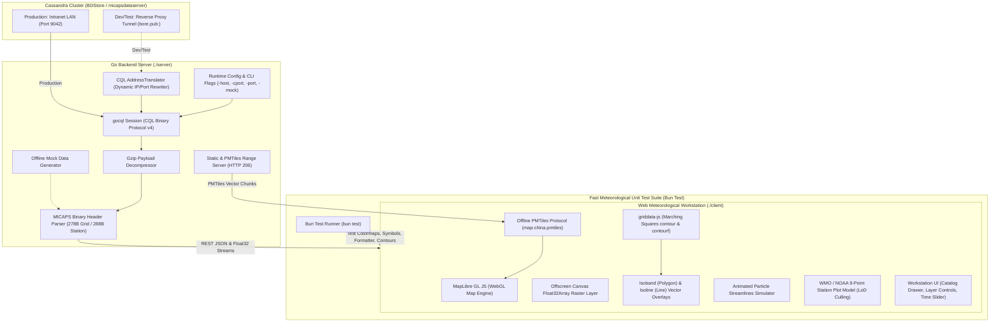

# MICAPS-Web

**MICAPS-Web** is a high-performance, modern web-based meteorological visualization and analysis workstation designed to replace and modernize desktop meteorologist tools (CMA MICAPS 4). It bridges distributed big data storage (Apache Cassandra / BDStore) with modern WebGL map visualization and in-browser scientific algorithms.

---

## Architecture Overview



---

## Key Features

- **Offline Vector Basemap**: Local PMTiles (`map-china.pmtiles`) providing China national borders, provincial boundaries, and graticule coordinates with 0 external network dependencies.
- **In-Browser Contouring (`griddata-js`)**: Client-side Marching Squares generation of filled isobands (`contourf`) and contour lines (`contour`) from NWP grids with sub-1.5s execution.
- **Standard WMO / NOAA Station Weather Plot**: Implements standard 9-position synoptic station model (CIMSS / NOAA WPC) including:
  - Center sky cover octas (0/8 to 8/8, obscured $X$).
  - Rotated wind barbs (5kt, 10kt, 50kt pennant).
  - Temperature $TT$ & Dewpoint $T_dT_d$.
  - Sea-level pressure $PPP$ (3-digit encoded) & 3h pressure tendency curve $ppa$.
  - Present weather $ww$ & visibility $VV$.
  - Adaptive Level-of-Detail (LoD) decluttering.
- **High-Density Raster & Wind Streamlines**: Zero-copy Float32 binary streaming rendered to offscreen canvas with CMA color palettes, plus animated wind streamline particle simulator.
- **Dynamic Bore Tunnel Translation**: Supports ephemeral reverse proxy tunnels (`bore.pub:<port>`) with dynamic port binding and cluster internal IP rewriting, with automatic offline mock fallback.
- **Fast Unit Test Suite**: Comprehensive testing for meteorological colormaps, synoptic isoline scaling, characteristic bold lines, WMO symbols, and config formatting via Bun Test.
- **Strict Modularity**: Every source file across the entire repository adheres strictly to **< 600 lines**.

---

## Directory Structure

```text
micaps-web/
├── micaps-web-plan1.md               # Master architecture and implementation specification
├── README.md                         # Project documentation
├── server/                           # Go HTTP server & Cassandra data engine
│   ├── cmd/
│   │   └── main.go                   # CLI entrypoint, flag parsing, route bootstrap (< 120 lines)
│   ├── config/
│   │   └── config.go                 # Dynamic configuration & CLI flag definitions (< 80 lines)
│   ├── db/
│   │   ├── cql_client.go             # Cassandra CQL session & TunnelTranslator (< 230 lines)
│   │   ├── catalog_queries.go        # Catalog, treeview, level & latest time queries (< 140 lines)
│   │   └── data_queries.go           # Raw blob query executor (< 50 lines)
│   ├── handler/
│   │   ├── catalog_handler.go        # REST catalog endpoints (< 110 lines)
│   │   ├── grid_handler.go           # NWP JSON and binary Float32 streaming handlers (< 100 lines)
│   │   ├── station_handler.go        # GeoJSON station observation handler (< 60 lines)
│   │   └── static_handler.go         # SPA fallback & HTTP 206 PMTiles range server (< 80 lines)
│   ├── mock/
│   │   └── mock_generator.go         # Synthetic NWP grid & station observation generator (< 190 lines)
│   ├── model/
│   │   └── types.go                  # Data structures and GeoJSON models (< 110 lines)
│   ├── parser/
│   │   ├── decompress.go             # Gzip blob decompressor (< 60 lines)
│   │   ├── grid_header.go            # 278-byte MICAPS Type 4/11 header parser (< 80 lines)
│   │   ├── grid_data.go              # Grid Float32 payload decoding (< 140 lines)
│   │   └── station_parser.go         # 288-byte station header & observation decoder (< 220 lines)
│   └── static/
│       └── map-china.pmtiles         # Offline China vector tiles (borders & provinces)
├── client/                           # Frontend Meteorological Workstation
│   ├── index.html                    # Workstation HTML shell (< 30 lines)
│   ├── package.json                  # Dependencies, build scripts & test runner
│   ├── vite.config.js                # Vite build configuration
│   ├── public/
│   │   └── config.json               # Runtime-editable meteorological configuration (presets & colormaps)
│   ├── src/
│   │   ├── main.js                   # Application bootstrap & lifecycle orchestrator (< 160 lines)
│   │   ├── style.css                 # Dark meteorological theme stylesheet (< 330 lines)
│   │   ├── api/                      # REST & binary stream fetchers
│   │   ├── layers/                   # MapLibre, Deck.gl, Canvas & SVG layer renderers
│   │   ├── map/                      # MapLibre GL setup, PMTiles protocol, graticule lines
│   │   ├── store/                    # Reactive workstation state manager
│   │   ├── ui/                       # Navbar, catalog drawer, layer control, time slider, tooltip
│   │   └── utils/                    # CMA palettes, weather symbols, griddata-js adapter
│   └── test/                         # Meteorological Unit Test Suite
│       ├── colormaps.test.js         # Dynamic colormaps & level scaling tests
│       ├── weather_symbols.test.js   # WMO symbols & 110° wind barbs tests
│       ├── contour_logic.test.js     # Characteristic bold contour tests
│       ├── config.test.js            # config.json validation & compact formatting tests
│       └── formatters.test.js        # Meteorological unit and date formatting tests
```

---

## Quick Start

### 1. Start Backend Server

The Go server can run either in **Development/Test mode** (using a dynamic `bore.pub` reverse-proxy tunnel) or in **Production mode** (direct intranet connection).

> [!NOTE]
> The `bore.pub` tunnel is used **strictly for development/testing**, and its remote port changes on every run. Pass the active port using `-cport`.

#### Run on Linux / macOS:
```bash
cd server

# Connect via active bore tunnel (e.g. bore.pub:45060)
./micaps-server -host 159.223.110.159 -cport 45060 -port 8088

# Connect to direct intranet Cassandra (Production)
./micaps-server -host 192.168.0.114 -cport 9042 -tunnel=false -port 8088

# Offline Mock Mode (No database required)
./micaps-server -mock=true -port 8088
```

#### Run on Windows 10/11:
A pre-compiled 64-bit Windows binary (`micaps-server.exe`) is included:
```cmd
cd server
micaps-server.exe -host 159.223.110.159 -cport 45060 -port 8088
```

To cross-compile the Windows binary from Linux:
```bash
cd server
CGO_ENABLED=0 GOOS=windows GOARCH=amd64 go build -o micaps-server.exe ./cmd/main.go
```

---

### 2. Frontend Build & Development

The frontend is built using Vite and bundled into `client/dist`. The Go backend serves these compiled static assets directly from the filesystem (configurable via the `-static` flag or `STATIC_DIR` environment variable, defaulting to `../client/dist`).

```bash
cd client

# Install dependencies (requires Bun 1.4)
bun install

# Build production bundle
bun run build

# Or launch local Vite development server
bun run dev
```

Open your browser at:
```text
http://localhost:8088
```

### Runtime Configuration (config.json)

Composite presets and named colormaps are loaded from `client/public/config.json` at startup rather than bundled into the JavaScript. Edit that JSON file, or modify layer styling directly in the workstation UI to auto-save immediately.

For a production build served from `client/dist`, edit or replace `client/dist/config.json`; Vite copies the source file there during `bun run build`. The file has this shape:

```json
{
  "colormaps": {
    "my-temperature": [
      { "val": -20, "color": [0, 80, 255, 255] },
      { "val": 20, "color": [255, 80, 0, 255] }
    ]
  },
  "presets": [
    {
      "id": "my-group",
      "name": "My Group",
      "hasLevel": true,
      "defaultLevel": 500,
      "colormap": "my-temperature",
      "colormapByLevel": { "850": "my-temperature" },
      "layers": [
        {
          "model": "ECMWF_HR",
          "element": "TMP",
          "type": "contour",
          "render": {
            "colormap": "my-temperature",
            "colormapByLevel": { "500": "my-temperature" }
          }
        }
      ]
    }
  ]
}
```

`render.colormap` overrides the group setting, and `colormapByLevel` provides a level-specific override. Colormaps use sorted numeric `val` stops and RGB/RGBA channel arrays from 0–255.

---

## Fast Unit Testing with Bun Test

Run the entire suite of meteorological algorithms, colormap calculations, WMO symbol rendering, and configuration formatting tests:

```bash
cd client
bun test
```

Or execute individual test suites:
```bash
# Verify meteorological colormaps and dynamic level scaling
bun test ./test/colormaps.test.js

# Verify WMO standard symbols and 110-degree wind barbs
bun test ./test/weather_symbols.test.js

# Verify characteristic bold contour line matching logic
bun test ./test/contour_logic.test.js

# Verify configuration format and preset schema
bun test ./test/config.test.js

# Verify date/time, cycle, and coordinate formatting
bun test ./test/formatters.test.js
```

---

## API Reference Summary

| Endpoint | Method | Description |
| :--- | :--- | :--- |
| `/api/catalog/models` | `GET` | Returns 4-tier model hierarchy (Global NWP, CMA Regional, Gridded Guidance, Observations). |
| `/api/catalog/elements` | `GET` | Returns available variables (`TMP`, `HGT`, `WIND`, etc.) for given model path. |
| `/api/catalog/levels` | `GET` | Returns isobaric pressure levels (`1000`, `850`, `500`, `200` hPa). |
| `/api/catalog/dates` | `GET` | Returns forecast base time directories. |
| `/api/catalog/files` | `GET` | Returns available forecast lead periods (`000`, `024`, `048`, `072`...). |
| `/api/data/grid` | `GET` | Returns decoded NWP grid GeoJSON with 2D scalar/vector arrays and coordinates. |
| `/api/data/grid/binary` | `GET` | Streams raw Little-Endian `Float32Array` bytes for zero-copy Canvas/WebGL raster rendering. |
| `/api/data/station` | `GET` | Returns WMO/CMA synoptic station observations as GeoJSON Point `FeatureCollection`. |
| `/map-china.pmtiles` | `GET` | HTTP 206 range-request endpoint serving offline China vector basemap tiles. |

---

## Standards & References

- **CMA MICAPS 4 Cassandra Architecture**: `../help/micaps4-cassandra.md`
- **MICAPS 4 File Format**: [nmcdev/nmc_met_io](https://github.com/nmcdev/nmc_met_io/blob/master/nmc_met_io/retrieve_cassandraDB.py)
- **High-Performance Local Web Maps**: [likev/local-map](https://github.com/likev/local-map)
- **In-Browser Contouring**: [likev/griddata-js](https://github.com/likev/griddata-js)
- **WMO / NOAA Station Weather Plot Layout**:
  - [CIMSS Satellite Meteorology Module 7](https://cimss.ssec.wisc.edu/satmet/modules/7_weather_forecast/wf-5.html)
  - [NOAA Weather Prediction Center (WPC) Station Plot](https://www.wpc.ncep.noaa.gov/html/stationplot.shtml)
