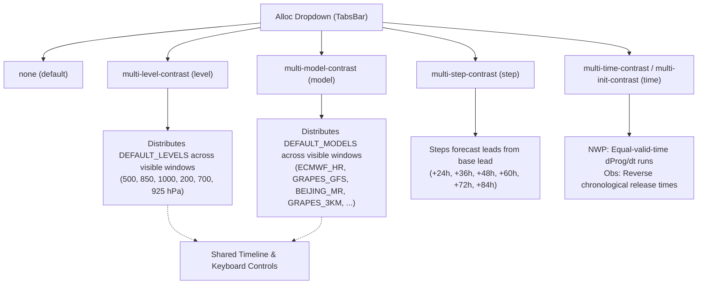
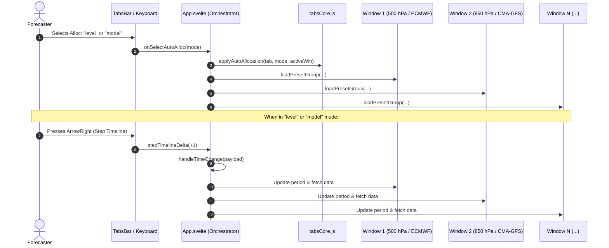

# Multi-Window Auto-Allocation & Synchronization in MICAPS-Web

**MICAPS-Web** features an automated multi-window parameter allocation and synchronization engine designed for operational meteorologists. When expanding from a single map view to split-view layouts (**2-Split `1×2`**, **4-Split `2×2`**, or **6-Split `2×3`**), Auto-Allocation distributes atmospheric parameters across visible map windows along canonical scientific axes with a single selection.

---

## 1. Motivation & Operational Workflow

In operational weather forecasting, meteorologists rarely analyze a single isolated 2D weather map. Diagnosis and forecasting require simultaneous evaluation across four fundamental meteorological dimensions:

1. **Vertical Atmospheric Structure**: Diagnosing coupled dynamics from the planetary boundary layer to the upper troposphere (e.g. comparing 925 hPa, 850 hPa, 700 hPa, 500 hPa, 200 hPa).
2. **Multi-Model Consensus & Uncertainty**: Evaluating forecast divergence between global and regional NWP models (e.g. ECMWF, CMA-GFS, Beijing-MR, Japan-MR, Shanghai-MR) for precipitation and geopotential height.
3. **Temporal Evolution (Forecast Leads)**: Tracking the progression of a weather system across successive forecast hours (+24h, +36h, +48h, +60h, +72h, +84h) from the same initial model run.
4. **Forecast Consistency / Trend ($d\text{Prog}/dt$)**: Comparing consecutive model runs verifying at the exact same target valid time to identify run-to-run trend shifts or back-off tendencies.

Without Auto-Allocation, opening a 4-split or 6-split layout creates duplicate copies of the active window, requiring repetitive manual configuration of each individual sub-window. The **Auto-Allocation** system automates this distribution instantaneously.

---

## 2. Layout Modes & Capacities

MICAPS-Web supports four grid layouts configured in [`TabsBar.svelte`](client/src/components/TabsBar.svelte) and styled in [`tabs.css`](client/src/tabs.css):

| Layout | Aspect / Dimensions | Capacity | Primary Operational Use Case |
|---|---|:---:|---|
| **`1×1`** | Single window | 1 | Full-screen synoptic inspection, profile diagrams, detailed analysis |
| **`1×2`** | 1 row × 2 columns | 2 | Dual-level comparison (e.g. 500 hPa vs 850 hPa) or radar vs satellite |
| **`2×2`** | 2 rows × 2 columns | 4 | Standard 4-level synoptic layout (1000, 850, 500, 200 hPa) |
| **`2×3`** | 2 rows × 3 columns | 6 | 16:9 ergonomic workstation standard: 6-model comparison or full vertical profile |

*Note: The `2×3` grid is specifically selected over `3×2` to fit modern 16:9 and ultrawide workstation monitors without vertically squishing map viewports.*

---

## 3. The 5 Auto-Allocation Modes

The Auto-Allocation control is a `<select id="sel-auto-alloc">` dropdown located in the tab bar alongside the layout buttons and camera sync toggle. It defaults to **`none`** on every tab.



### Summary Matrix

| Mode | Label in UI | Target Product Type | Controlled Window Parameter | Shared Controls |
|---|---|---|---|---|
| **`none`** *(default)* | `none` | Any | None (windows stay unified or manual) | Independent |
| **`level`** | `multi-level-contrast` | 3D Upper-Air Fields (`hasLevel: true`) | `win.level` | **Shared** Timeline & Levels |
| **`model`** | `multi-model-contrast` | Numerical Weather Prediction (NWP) | `win.model` + layer models | **Shared** Timeline & Levels |
| **`step`** | `multi-step-contrast` | NWP Forecast Cycles | `win.period` (lead hours) | Independent |
| **`time`** | `multi-time-contrast` (Obs) / `multi-init-contrast` (NWP) | Observation & NWP | `win.obsTime` (Obs) or `win.forecastCycle` + `win.period` (NWP) | Independent |

---

### Detailed Mode Specifications

#### 1. Mode `none` (Default)
- **State**: `tab.autoAllocation = "none"`.
- **Behavior**: Windows do not automatically disperse their parameters. Newly added or expanded windows inherit the active window's current configuration (`level`, `model`, `period`, `forecastCycle`).
- **Reversion**: Selecting `none` unifies all visible windows back to the active window's settings.

#### 2. Mode `level` (Atmospheric Vertical Profile)
- **State**: `tab.autoAllocation = "level"`.
- **Purpose**: Simultaneous analysis of standard mandatory pressure surfaces.
- **Reference Levels** ([`tabsCore.js`](client/src/lib/stores/tabsCore.js)):
  ```javascript
  export const DEFAULT_LEVELS = [500, 850, 1000, 200, 700, 925, 400, 300, 100];
  ```
- **Window Allocation**:
  - **Window 0 (500 hPa)**: Mid-tropospheric steering flow, shortwaves, vorticity advection.
  - **Window 1 (850 hPa)**: Lower-tropospheric jet, thermal advection, moisture flux.
  - **Window 2 (1000 hPa)**: Near-surface synoptic systems, sea-level pressure.
  - **Window 3 (200 hPa)**: Upper-tropospheric jet streak, divergence aloft.
  - **Window 4 (700 hPa)**: Frontal surfaces, vertical velocity, moisture depth.
  - **Window 5 (925 hPa)**: Planetary boundary layer, temperature inversions, low-level wind shear.
- **Common Parameters**: All windows retain identical model, forecast cycle, lead time, and valid time.

#### 3. Mode `model` (Multi-Model Consensus & Comparison)
- **State**: `tab.autoAllocation = "model"`.
- **Purpose**: Operational ensemble/deterministic model comparison for quantitative precipitation forecasting (QPF) or height fields.
- **Reference Models** ([`tabsCore.js`](client/src/lib/stores/tabsCore.js)):
  ```javascript
  export const DEFAULT_MODELS = [
    "ECMWF_HR",
    "GRAPES_GFS",
    "BEIJING_MR",
    "GRAPES_3KM",
    "JAPAN_MR",
    "SHANGHAI_MR",
    "NCEP_GFS",
    "GERMAN_HR",
  ];
  ```
- **Window Allocation**:
  - **Window 0**: `ECMWF_HR` (European Centre High-Resolution)
  - **Window 1**: `GRAPES_GFS` (CMA Global Forecast System)
  - **Window 2**: `BEIJING_MR` (Beijing Regional Model)
  - **Window 3**: `GRAPES_3KM` (CMA Convection-Permitting 3km Meso Model)
  - **Window 4**: `JAPAN_MR` (JMA Meso Model)
  - **Window 5**: `SHANGHAI_MR` (Shanghai Regional Model)
- **Common Parameters**: All windows retain identical vertical level (e.g. 500 hPa or surface `RAIN12`), forecast lead time (e.g. +24h), and forecast cycle.
- **Preset Adaptation**: For each window, active group layers (`contour`, `wind`, `raster`) are deep-cloned and their `model` properties rewritten to match the assigned model.

#### 4. Mode `step` (Forecast Lead Sequence)
- **State**: `tab.autoAllocation = "step"`.
- **Purpose**: Visualizing the continuous temporal evolution of a weather event from a single model run.
- **Window Allocation**:
  - Starting from the active window's base lead time $P_0$ (e.g. +24h) and step length $\Delta t$ (default 12h or 6h):
    $$P_i = P_0 + i \times \Delta t$$
  - In a 6-split layout starting at +24h with 12h steps:
    - Window 0: **+24h**
    - Window 1: **+36h**
    - Window 2: **+48h**
    - Window 3: **+60h**
    - Window 4: **+72h**
    - Window 5: **+84h**
- **Common Parameters**: All windows share the same model, vertical level, and initialization run cycle.

#### 5. Mode `time` (Observation History & NWP $d\text{Prog}/dt$ Consistency)
- **State**: `tab.autoAllocation = "time"`.
- Handles both observational data and model forecast runs:

##### A. Surface & Upper-Air Observations
- Assigns consecutive synoptic release hours stepping backward in time ($T, T - 12\text{h}, T - 24\text{h}, \dots$):
  - Window 0: `26092608` ($T_0$)
  - Window 1: `26092520` ($T_0 - 12\text{h}$)
  - Window 2: `26092508` ($T_0 - 24\text{h}$)
  - Window 3: `26092420` ($T_0 - 36\text{h}$)
  - Window 4: `26092408` ($T_0 - 48\text{h}$)
  - Window 5: `26092320` ($T_0 - 60\text{h}$)

##### B. NWP Forecasts ($d\text{Prog}/dt$ Valid-Time Consistency)
- Calculates run-to-run trend consistency where **every window verifies at the exact same target valid time**:
  $$\text{Target Valid Time } V = C_0 + P_0$$
- For each successive window $i$:
  $$C_i = C_0 - (i \times 12\text{h}), \quad P_i = P_0 + (i \times 12\text{h})$$
- Because $C_i + P_i = (C_0 - 12i) + (P_0 + 12i) = V$, all 6 windows display forecasts verifying at the same time:
  - Window 0 (Latest run): `26092608.024` (24h lead $\to$ valid at 26092708)
  - Window 1 (12h prior run): `26092520.036` (36h lead $\to$ valid at 26092708)
  - Window 2 (24h prior run): `26092508.048` (48h lead $\to$ valid at 26092708)
  - Window 3 (36h prior run): `26092420.060` (60h lead $\to$ valid at 26092708)
  - Window 4 (48h prior run): `26092408.072` (72h lead $\to$ valid at 26092708)
  - Window 5 (60h prior run): `26092320.084` (84h lead $\to$ valid at 26092708)
- Date and hour arithmetic is computed via [`stepCycleHours(cycleStr, deltaHours)`](client/src/lib/stores/tabsCore.js), handling leap years, month boundaries, and year turnovers in UTC.

---

## 4. Multi-Window Synchronization Architecture

When Auto-Allocation is set to **`level`** or **`model`**, all visible sub-windows represent the **same valid forecast or observation time**. Consequently, user navigation actions are shared across all visible windows in lockstep.



### Shared Controls Inventory

| Interaction | Mode = `level` | Mode = `model` | Mode = `step` | Mode = `time` / `none` |
|---|---|---|---|---|
| **Timeslider Chip Click** | **All visible windows** advance to selected time | **All visible windows** advance to selected time | **All visible windows** advance, maintaining step lead offsets | Active window only |
| **Keyboard <kbd>←</kbd> / <kbd>→</kbd>** | **All visible windows** step prev/next time step | **All visible windows** step prev/next time step | **All visible windows** step in lockstep, maintaining lead offsets | Active window only |
| **Spacebar (<kbd>Space</kbd>)** | **All visible windows** animate simultaneously | **All visible windows** animate simultaneously | **All visible windows** animate simultaneously, maintaining lead offsets | Active window only |
| **Keyboard <kbd>↑</kbd> / <kbd>↓</kbd>** | All windows shift vertical levels in tandem | **All visible windows** switch to new level together | **All visible windows** switch to new level together | Active window only |
| **Top Nav Level Dropdown** | Active window only | **All visible models** switch to selected level | **All visible windows** switch to selected level | Active window only |
| **Camera Pan / Zoom / Pitch** | Controlled by **Sync 🔗** button (`activeTab.syncMap`) | Controlled by **Sync 🔗** button (`activeTab.syncMap`) | Controlled by **Sync 🔗** button (`activeTab.syncMap`) | Controlled by **Sync 🔗** button (`activeTab.syncMap`) |

### Implementation Details in [`App.svelte`](client/src/App.svelte)

1. **Synchronized Timeline Handler (`handleTimeChange`)**:
   ```javascript
   const isShared = activeTab?.layout !== "1x1" &&
     (activeTab?.autoAllocation === "level" || activeTab?.autoAllocation === "model");

   const targets = isShared
     ? getVisibleWindows(activeTab)
     : (payload?.winId ? [getWindowById(payload.winId)].filter(Boolean) : [activeWin]);

   for (const win of targets) {
     // Updates win.period / win.obsTime, syncs timeline store, and triggers loadPresetGroup
   }
   ```

2. **Synchronized Level Stepping (`stepVerticalLevel`)**:
   - In `model` mode, pressing <kbd>↑</kbd> or <kbd>↓</kbd> changes the vertical level for **all model windows concurrently**, allowing forecasters to inspect 850 hPa wind across 6 models, then tap <kbd>↑</kbd> to inspect 700 hPa across all 6 models simultaneously.

3. **Dynamic Re-Allocation on Grid Expansion (`handleChangeLayout`)**:
   - When switching from `1×1` to `2×2` or `2×3`, if an allocation mode is active (`tab.autoAllocation !== "none"`), newly created window panels are automatically initialized with their respective parameter values without requiring re-selection.

---

## 5. Source Code Map

| File | Component / Role | Key Responsibilities |
|---|---|---|
| [`client/src/lib/stores/tabsCore.js`](client/src/lib/stores/tabsCore.js) | Plain Core Store | Defines `DEFAULT_LEVELS`, `DEFAULT_MODELS`, `stepCycleHours()`, `applyAutoAllocation()`, `revertAutoAllocation()` |
| [`client/src/lib/stores/tabs.svelte.js`](client/src/lib/stores/tabs.svelte.js) | Svelte 5 Reactive Wrapper | Wraps tabs state with `$state()`, re-exports core allocation helpers |
| [`client/src/components/TabsBar.svelte`](client/src/components/TabsBar.svelte) | UI Tab Bar | Renders `<select id="sel-auto-alloc">`, `.auto-alloc-container`, layout buttons, sync button |
| [`client/src/tabs.css`](client/src/tabs.css) | Stylesheet | Styles `.layout-select`, `.auto-alloc-container`, `.windows-grid.layout-2x3` |
| [`client/src/App.svelte`](client/src/App.svelte) | Root Orchestrator | Implements `applyAutoAllocationModeToTab()`, `handleTimeChange()`, `stepVerticalLevel()`, camera sync |
| [`client/test/stores/auto-allocation-modes.test.js`](client/test/stores/auto-allocation-modes.test.js) | Test Suite | Dedicated tests for all 5 modes, date/hour math, and allocation contracts |
| [`client/test/stores/plain-core.test.js`](client/test/stores/plain-core.test.js) | Core Test Suite | Regression tests for tab initialization, capacity checks, and level transitions |

---

## 6. Verification & Test Coverage

The Auto-Allocation subsystem is verified by automated test suites running on Bun:

```bash
bun test test/stores/auto-allocation-modes.test.js
bun test test/stores/plain-core.test.js
```

Test validations include:
- Default state initialization (`tab.autoAllocation === "none"`).
- UTC cycle arithmetic across month/day transitions (`stepCycleHours`).
- Mathematical verification of $d\text{Prog}/dt$ initialization and lead pairs ($C_i + P_i \equiv V$).
- Sequential model array cycling for arbitrary window counts.
- State preservation across layout expansion (`1×1` $\to$ `2×3`) and maximization toggles (<kbd>F4</kbd>).
