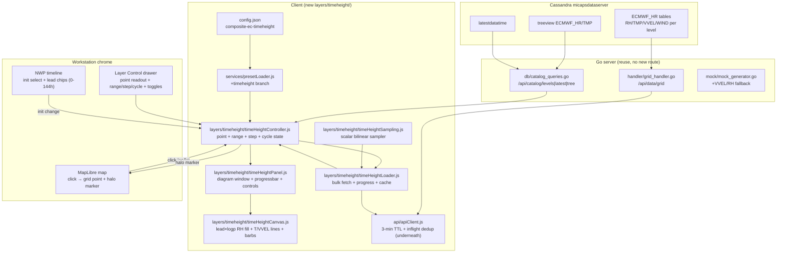

# EC Time–Height Profile (Forecast Lead × Pressure) — Implementation Plan 1

> [!NOTE] Live Cassandra Verification Results (`bore.pub:59042`, verified 2026-09-18)
> - **Catalog & Levels**: `GET /api/catalog/levels?path=ECMWF_HR/VVEL` returns all 10 target levels: `[1000, 925, 850, 700, 500, 400, 300, 250, 200, 100]`.
> - **Cycle format**: Latest cycle `26091808` (format `YYMMDDHH`), file template `<cycle>.<ppp>` (e.g. `26091808.024`).
> - **VVEL Units & Sign**: `description: "10e-2.Pa.s-1"` (centipascals/second, $10^{-2}\text{ Pa/s}$). Values range approximately $-500$ to $+300$ ($-5.0$ to $+3.0\text{ Pa/s}$). Sign convention is standard vertical omega: negative ($\omega < 0$) indicates upward vertical motion (ascent), positive indicates downward subsidence. Zero contour ($\omega = 0$) marks the ascent/descent transition.
> - **RH Range**: `description: "%"`, standard physical range $0\text{--}100\%$.
> - **Grid Geometry**: $60^\circ\text{--}150^\circ\text{E}$ (361 points @ $0.25^\circ$), $60^\circ\text{--}-10^\circ\text{N}$ (281 points @ $-0.25^\circ$, N$\to$S row-major). Sampler handles negative $d\text{lat}$.

## 1. Goal and Overview

Add a new preset group that renders a **time(forecast lead, horizontal)–height(hPa, vertical) cross-section** for **`ECMWF_HR`** at a user-selected grid point, with UI logic deliberately parallel to **TlogP** (`upper_air-tlogp-plan1.md`, `client/src/layers/tlogp/`).

### Key capabilities (requested)

1. **New preset group** (e.g. `composite-ec-timeheight`, category `NWP Time-Height Profile`).
2. **Click-on-map grid-point selection**: user clicks anywhere on the map; the system converts to lon/lat, snaps to the nearest `ECMWF_HR` grid node, drops a highlight marker, and (re)renders the profile for that point. Same mental model as TlogP map-click station switching (`stationHover.js:handleStationClick` → `tlogpController.setStation`).
3. **Profile contents**:
   - **RH contour fill** (reuse `RH` colormap, `getElementLevels("RH")` → `[50,60,70,80,90,100]`).
   - **Temperature contour lines** (red, e.g. `#f85149`).
   - **Vertical velocity contour lines** from **`ECMWF_HR/VVEL/<level>`** (distinct color, e.g. `#56d4dd` or `#c678dd`, bold at `0`, dashed for ascent).
   - **Wind barbs** from **`ECMWF_HR/WIND/<level>`** (`u`/`v` → `drawWindBarbCanvas` in `client/src/layers/station/stationSymbols.js`).
4. **Defaults**: lead `0–144 h`, interval step `12 h` (→ 13 columns: `0,12,…,144`). User can change **period range / interval step / init forecast base time (cycle)**. The time (horizontal) direction is reversible: default left→right (`0h` at left, `144h` at right), one-click toggle to right→left (`144h` at left, `0h` at right). Reversing is display-only and must not refetch.
5. **Bulk-load UX**: loading one profile needs `N_leads × N_levels × N_elements` grid files, so the panel must show a **data-load progress bar** (loaded/total, %, cancel).
6. **File cache**: cache loaded grid files so switching to another grid point (same cycle + leads + levels) is instant (no refetch, only resample).

### Non-goals for Plan 1

- No new Go endpoint. Reuse `GET /api/data/grid?path=<model>/<element>/<level>&file=<cycle>.<ppp>` (`server/handler/grid_handler.go:23`). A server-side `/api/data/profile` sampler is an explicit Plan-2 optimization (see §10).
- No map-plane contours for this preset (profile is a Canvas 2D diagram like TlogP, not MapLibre isobands). An optional background reference contour at the selected lead can be added later.

---

## 2. Data Model Research (reuse, verify before coding)

### 2.1 `ECMWF_HR` catalog paths

| Datum | `path` template | `file` template | Diamond | Client payload |
|---|---|---|---|---|
| RH | `ECMWF_HR/RH/<level>` | `<cycle>.<ppp>` e.g. `26082820.024` | 4 scalar | `GridResponse.values` + `x`,`y`,`header`,`stats` |
| TMP | `ECMWF_HR/TMP/<level>` | same | 4 scalar | same |
| VVEL | `ECMWF_HR/VVEL/<level>` | same | 4 scalar | same (`values` in Pa/s; **verify sign/units live**) |
| WIND | `ECMWF_HR/WIND/<level>` | same | 11 vector | `u`,`v`,`values`=speed; server already converts polar Speed/Dir → `u`/`v` (`Architecture.md §6.2`, `server/parser/grid_data.go`) |

- `file` construction is identical to `weatherLoader.js:33`: `file = ${cycle}.${String(period).padStart(3,"0")}`.
- `cycle` resolution is identical to NWP presets: `resolveForecastCycles(model, element, level)` → `latestdatatime` → `treeview` → dynamic fallback (`client/src/utils/timelineSync.js:82`), 5-min TTL. For this preset resolve once from e.g. `ECMWF_HR/TMP/500` and reuse for all elements/levels (same init).
- Levels: `ECMWF_HR` exposes almost 20 levels in `GET /api/catalog/levels`, but Plan 1 fixes the profile to 10 levels: `PROFILE_LEVELS = [1000,925,850,700,500,400,300,250,200,100]` (descending; matches `server/db/catalog_queries.go:172` fallback minus extras, and a subset of TlogP `STANDARD_ISOBARS` in `tlogpCanvas.js:19`). Do NOT follow catalog output and do NOT add `150` or other intermediate levels. If any of the 10 is missing for an element (e.g. VVEL 404), sample → `NaN` gap (see §5.3), do not abort the whole profile.
- Grid geometry: `GridResponse { header, stats, x[], y[], values[], u[], v[] }` (`server/model/types.go:44`). `x` = lon vector, `y` = lat vector (may be N→S; see §6.3 unsigned-Δlat). `values` row-major `n_lat × n_lon`. Mock domain is `70–140°E × 15–55°N @0.25°` (`server/mock/mock_generator.go:13`); live `ECMWF_HR` may be larger — sampler must use header/`x`/`y`, never hardcoded bounds.

### 2.2 Pre-code live verification checklist (5 min, `curl` or browser)

1. `GET /api/catalog/levels?path=ECMWF_HR/VVEL` → confirm 1000…100 coverage.
2. `GET /api/catalog/latest?path=ECMWF_HR/TMP/500&suffix=*.024` → note cycle format.
3. `GET /api/data/grid?path=ECMWF_HR/VVEL/500&file=<cycle>.024` → confirm JSON shape, value range/sign (e.g. `±2 Pa/s`? or `hPa/h`?), missing sentinel.
4. `GET /api/data/grid?path=ECMWF_HR/RH/850&file=<cycle>.000` → confirm `%` range.
5. If VVEL 404s on some levels, record the supported subset and encode it as `SUPPORTED_VVEL_LEVELS` fallback.

### 2.3 Fetch-volume math (why progress + cache are load-bearing)

Default `0–144h @12h` = **13 leads**. With fixed 10 levels × 4 fetches/level-lead (`RH,TMP,VVEL,WIND`):

```text
13 × 10 × 4 = 520 JSON grids (worst case, cold cache)
```

Each mock-size grid is `281×161 ≈ 45k` floats (~180 KB JSON numbers → ~0.5–1 MB JSON text). Live `ECMWF_HR` may be larger. Consequences encoded in this plan:

- Hard concurrency cap (6), batched `Promise.allSettled`, cancellable via `win.loadSeq` (same guard as `weatherLoader.js:116`).
- Progress bar is mandatory, not cosmetic.
- Dedicated window-scoped grid cache with TTL longer than `apiClient` 3-min default (see §7); second point selection must be **zero-network** when cycle/leads/levels unchanged.
- Plan 2 (server sampler) is the real fix for bandwidth; Plan 1 must at least not freeze the UI and must document the cost.

---

## 3. Architecture & Data Flow



TlogP analogy map:

| TlogP | Time–Height equivalent |
|---|---|
| `tlogpController.activeStationId` | `timeHeightController.activePoint { lon, lat, gridI, gridJ }` |
| `stationHover.handleStationClick` hit-test | map `click` → `map.unproject(e.point)` → clamp → snap to grid node |
| `tlogpController.highlightStationOnMap` halo | same halo pattern, new source/layer ids `th-active-point-*` |
| `tlogpPanel` + `tlogpCanvas` (Skew-T) | `timeHeightPanel` + `timeHeightCanvas` (lead × log-p) |
| `parcelCache` (SFC/925/850/700) | `matrixCache` per `(cycle, leadsKey, pointKey)` + raw `gridCache` per `(path,file)` |
| obs timeline `syncObservationTimeline` | NWP `resolveForecastCycles` + `setTimelineMode("nwp", …)` like `presetLoader.js:139` |
| `prefetchService collectObsItems` tlogp branch | **not reused** for bulk matrix; bulk loader *is* the prefetch. `schedulePrefetch` should skip `timeheight` layers (see §8) |

---

## 4. Preset Group & Config (`client/config.json`)

New group. `hasLevel:false` (vertical axis is inside the diagram), `isObservation:false` (NWP forecast). Single diagram layer of new `type:"timeheight"` keeps `presetLoader`/`layerControl` plumbing simple.

```json
{
  "id": "composite-ec-timeheight",
  "name": "EC Time-Height Profile (RH+T+VVEL+Wind)",
  "category": "NWP Time-Height Profile",
  "isObservation": false,
  "hasLevel": false,
  "defaultLevel": null,
  "colormap": "RH",
  "layers": [
    {
      "id": "ec-timeheight-diagram",
      "name": "EC Time-Height Profile (click map for point)",
      "type": "timeheight",
      "model": "ECMWF_HR",
      "element": "RH",
      "visible": true,
      "removable": true,
      "config": {
        "lon": 121.5,
        "lat": 31.4,
        "initCycle": null,
        "startHour": 0,
        "endHour": 144,
        "stepHours": 12,
        "timeDirection": "ltr",
        "levels": [1000, 925, 850, 700, 500, 400, 300, 250, 200, 100],
        "showRH": true,
        "showTemp": true,
        "showVVel": true,
        "showWind": true,
        "showGridPointMarker": true
      }
    }
  ]
}
```

Notes:

- `model:"ECMWF_HR"` is the bulk-fetch root; elements `RH/TMP/VVEL/WIND` are hardcoded in the loader (not separate layers), so legends stay manageable.
- `initCycle:null` → resolve latest at load, then pin (same as `weatherLoader.js:25`).
- `timeDirection:"ltr"` → time axis left→right (`startHour` at left). `"rtl"` reverses to right→left (`endHour` at left). Persisted via `autoSaveLayerConfig()`; changing it is render-only (no fetch, see §5.4/§5.6).
- Colormap reuse: `RH` fill uses global `RH` stops (fixed 0–100 physical, `colormaps.js:159`); TMP/VVEL lines use fixed stroke colors, not fills.

---

## 5. Frontend Modules (`client/src/layers/timeheight/`)

New directory, mirror `client/src/layers/tlogp/` structure. **Every file < 600 lines** (repo rule, `README.md:15`).

```text
client/src/layers/timeheight/
├── timeHeightSampling.js   # scalar bilinear sampler + header normalizer + snap-to-node
├── timeHeightLoader.js     # bulk grid fetch, concurrency, progress, window grid cache
├── timeHeightController.js # point/range/step/cycle state, map-click, marker, reload orchestration
├── timeHeightPanel.js      # floating diagram window: header, controls, progressbar, footer meta
├── timeHeightCanvas.js     # lead×logp renderer: RH fill, T/VVEL isolines, barbs, axes, crosshair
└── timeHeightLayer.js      # facade: loadTimeHeightLayer / removeTimeHeightLayer / setVisibility
```

### 5.1 `timeHeightSampling.js` (pure, fully unit-testable)

- `normalizeScalarHeader(gridData)` — clone of `windSampling.js:normalizeHeader` but for scalar `values`; handle N→S vs S→N via `startLat/endLat`, unsigned `d_lat` (`Architecture.md §6.3`).
- `createScalarSampler(gridData, norm?)` → `(lon,lat) => value|null`. Same bilinear weights as `createBilinearSampler` (`windSampling.js:32`), but over `values`; return `null` out-of-bounds or for sentinel (`>=9000`, `<= -9000`, `NaN`).
- `createWindSampler(gridData)` — thin re-export/wrapper of `windSampling.createBilinearSampler` for `u`/`v` (do not duplicate math).
- `snapToGridNode(gridData, lon, lat)` → `{ lon, lat, i, j }` nearest node (for marker + readout; avoids implying sub-grid precision).
- Missing-value policy: RH clamp `[0,100]`; TMP accept `[-90,60]` else `null`; VVEL accept `[-50,50] Pa/s` (adjust after §2.2) else `null`; wind needs both `u`,`v` finite else `null` barb.

### 5.2 Matrix model (shared vocabulary for loader/canvas/tests)

```js
// Built by timeHeightLoader.buildProfileMatrix(...)
matrix = {
  point: { lon, lat, i, j },     // snapped grid node
  cycle,                          // e.g. "26082820"
  leads: [0,12,...,144],          // columns
  levels: [1000,...,100],         // rows, descending (fixed 10, §2.1)
  rh:   Float32Array-ish 2D [nLevels][nLeads],
  tmp:  ...,
  vvel: ...,
  u:    ..., v: ...,
  missing: { rh: n, tmp: n, ... },
  stats: { rhMin/Max, tmpMin/Max, vvelMin/Max },
}
```

Row order descending pressure (1000 at bottom). Store as `Array<Float32Array>` or flat `Float32Array(nLevels*nLeads)` with `idx = li*nLeads + ti`. Use `NaN` for missing; contour code must skip `NaN` (see §5.4).

`matrix.leads` is always stored ascending (`[0,12,…,144]`). `timeDirection` (`"ltr"`|`"rtl"`) is a display-only transform applied in the canvas (`x(lead)` mapping); it is excluded from loader fetch keys and `matrixCache` keys so flipping direction never refetches or resamples.

### 5.3 `timeHeightLoader.js` — bulk fetch + progress + cache

Responsibilities:

1. **Enumerate fetch list**: cartesian product `leads × levels × [{element}]` where elements = `RH,TMP,VVEL,WIND`. Deduplicate by `path+file`.
2. **Window grid cache** (`win._thGridCache: Map<key,{data,ts}>`):
   - Key: `${path}|${file}` (same granularity as `apiClient.buildUrl("/api/data/grid",{path,file})`, so `isCached` checks align).
   - TTL: `10 min` (longer than `apiClient` 3-min default; profile exploration outlives a single timeline step). LRU-cap ~600 entries; evict oldest. `pruneExpiredCache`-style sweep on each load.
   - Underneath, still call `fetchGridData(path,file)` so global `dataCache` dedup/inflight (`apiClient.js:75`) applies; then mirror into `win._thGridCache` for the longer TTL. On grid-point change with identical cycle/leads/levels, **all hits come from `win._thGridCache` — zero network**.
   - `matrixCache: Map<matrixKey, matrix>` keyed `${cycle}|${leadsKey}|${levelsKey}|${i},${j}` so toggling RH/T/VVEL/barb visibility re-renders without resampling.
3. **Concurrency + progress**:
   - `CONCURRENCY = 6`. Process queue in batches; after each settle call `onProgress({ loaded, total, ok, failed, pct })`.
   - Use `Promise.allSettled` per batch; individual failure → `null` grid → `NaN` column cells (never fail the whole profile). Count `failed` for the footer note + single `showErrorToast` only if `failed === total`.
   - **Cancellation**: capture `win.loadSeq` at start (incremented by timeline/init/point changes, same pattern as `weatherLoader.js:116` and `bootstrap.js:338`); after each batch, abort if `win.loadSeq !== seq`. Panel Cancel button increments `win.loadSeq` and sets `controller.cancelRequested`.
4. **Sampling pass** (after all fetches settle or abort): for each `(level, lead)` pick the right cached grid and call scalar/wind samplers at the snapped point. This is microseconds vs network — do it synchronously, then return `matrix`.
5. API sketch:
   ```js
   export async function loadTimeHeightMatrix({ win, cycle, leads, levels, point, onProgress, signalSeq }) -> { matrix, stats: { total, ok, failed } }
   export function getThGridCache(win) / clearThGridCache(win)
   export function buildLeads(startHour, endHour, stepHours) // validate + clamp
   ```

### 5.4 `timeHeightCanvas.js` — lead × log-p renderer

Canvas 2D, HiDPI (`devicePixelRatio`), same discipline as `tlogpCanvas.js:103` (`resize()` + `render()`). **Not** MapLibre layers — coordinates are diagram space.

- **Axes**:
  - X (horizontal): forecast lead `startHour…endHour`, linear, reversible via `timeDirection`. `x(lead) = left + (lead-start)/(end-start)*w` for `"ltr"`; `x(lead) = left + (end-lead)/(end-start)*w` for `"rtl"`. Ticks at each lead (`+000h…+144h`, order follows direction), minor label rotation if crowded. All plotted content (RH cells, TMP/VVEL `griddata.contour` inputs mapped to pixel X, barb positions, timeline cursor line, crosshair readout) must go through this single `x(lead)` helper so flip is consistent. Single-lead edge case (`start==end`, normally rejected by validation): center the column.
  - Y (vertical): pressure, logarithmic: `y(p) = top + (ln(pTop)-ln(p))/(ln(pTop)-ln(pBot)) * h` with `pTop=100`, `pBot=1000` (invert of TlogP `pressureToY`; reuse formula shape from `tlogpMath.js`). Horizontal isobars at each profile level + labels on left (`1000…100`).
- **RH fill**: two options, pick one in implementation (document choice):
  - (a) **Per-cell image**: map each `(level,lead)` cell mean RH through `createColorResolver("RH")` (`colormaps.js:134`) into an offscreen canvas, then smooth-scale to plot rect. Cheap, robust with 13×10 cells, no `griddata` dependency. Recommended for Plan 1.
  - (b) `griddata.contourf(Z,{x:leads,y:logp,levels:RH_LEVELS})` then draw polygons in diagram space. Nicer but heavier; keep as Plan-1-stretch only.
  - Reuse `RH` colormap stops verbatim so legend matches map presets.
- **TMP lines**: `griddata.contour(Z_tmp,{x:leads,y:logY,levels})` with levels from `getElementLevels("TMP",tmpMin,tmpMax)` or fixed `[-40…40 step 4]`; stroke `#f85149`, width 1.6, bold at `0` (width 3). Labels along lines (reuse `formatContourLabel`).
- **VVEL lines**: `griddata.contour(Z_vvel,…)`; stroke `#56d4dd` (or `#c678dd` if TMP red collides on dark bg — decide in implementation, record in code comment); **bold + label `0`** (ascent/descent boundary); dashed `setLineDash([5,3])` for negative (ascent, Pa/s<0) vs solid for positive. Confirm sign convention after §2.2 and comment it at the call site.
- **Wind barbs**: at each `(lead, level)` node (decimate if crowded: all 13 leads × 10 levels is 130 barbs — acceptable at 0.6 scale; if overlap, draw every other level). `u,v → speed=hypot, dir=(atan2(u,v)?)` — careful: `drawWindBarbCanvas(ctx,x,y,speed,dir)` expects meteorological direction (deg, from-north). Convert `atan2(-u,-v)` → deg. Reuse exactly like `tlogpCanvas.js:513`.
- **Overlays**: plot-rect clip, border, crosshair + readout `(lead, p, RH, T, VVEL, wind)` on hover (same pattern as `tlogpCanvas.js:519`), empty-state text when `matrix==null` or all-`NaN`.
- `setData(matrix, options)` + `setOptions({showRH,showTemp,showVVel,showWind,timeDirection})` + `setTimeDirection(dir)` (re-render only, no data path) + `resize()` + `exportPNG()`. Export must reflect the current direction.

### 5.5 `timeHeightPanel.js` — floating window + progressbar + controls

Clone `tlogpPanel.js` chrome (header/badge/meta, draggable header, resizable, minimize, export PNG, close) with new id `timeheight-panel` (must not collide with singleton `#tlogp-panel`; see multi-window note in `upper_air-tlogp-review1.md:49` — scope per-window or document single-window limit for Plan 1).

Required UI elements:

- Header: `ECMWF_HR` badge + point readout `121.50°E, 31.40°N` + `Init: <cycle>` + valid-range label.
- Controls row (all editable, Apply on change):
  - `Start [0] – End [144]` number inputs + `Step [12]` select (`1/3/6/12/24` — reuse NWP steps from `timelineMath.getPeriodsForStep`, but default 12).
  - `Init cycle` select (populated from `resolveForecastCycles`; changing it reloads matrix).
  - Time-direction toggle: segmented `[→ 0→144 | 144→0 ←]` (or `⇄ Reverse` button) bound to `timeDirection`; flips instantly with no progress bar.
  - Toggles: `RH fill / T lines / VVEL lines / Barbs` checkboxes.
- **Progress bar** (the requested feature):
  ```html
  <div class="th-progress-wrap">
    <div class="th-progress-bar" style="width: 37%"></div>
    <span class="th-progress-label">Loading 192/520 grids… (37%)</span>
    <button class="th-btn-cancel">Cancel</button>
  </div>
  ```
  Determinate bar updated via loader `onProgress`; hidden when idle; `Cancel` aborts (see §5.3). Also mirror a compact status line in the layer drawer.
- Footer: `point / cycle / leads / levels / failed-cells` summary + VVEL units note.

### 5.6 `timeHeightController.js` — state + map click + reload orchestration

Mirror `tlogpController.js` shape (singleton export `timeHeightController`):

```js
state: { activePoint, cycle, startHour, endHour, stepHours, timeDirection, levels,
         matrix, loadingSeq, cancelRequested, activeMap, activeWin, isLayerActive }
isActive()
init(map, win, layerDef)   // read config, resolve cycle, attach map click, load matrix
setPoint(lon, lat, win, map) // clamp to domain, snap, update marker+drawer, resample-or-reload
setRange(start,end,step)   // validate (0≤start<end≤240, step∈{1,3,6,12,24}), reload
setTimeDirection(dir)      // "ltr"|"rtl": validate, persist, re-render only (no loader call)
setCycle(cycle)            // pin init, reload (clears win._thGridCache if cycle changed? No — keep, key includes file)
updateLeadsFromTimeline(period) // optional: highlight current-lead cursor line
show()/hide()/toggle()/destroy()
highlightPointOnMap(map, lon, lat)
```

- **Map click**: `map.on("click", handler)` registered in `init`, removed in `destroy` (same lifecycle as `stationCanvas.js:109`). Handler: `if (!isActive()) return; const ll = map.unproject(e.point); setPoint(ll.lng, ll.lat)`. Clamp to `ECMWF_HR` domain from the first cached grid header (or mock `70–140/15–55` before first load). `e.originalEvent` guard to ignore clicks on panel/drawer.
- **Point-change fast path**: if cycle/leads/levels unchanged and raw grids cached → resample synchronously from `win._thGridCache` (no progress bar, <50 ms). Else full bulk load with progress.
- **Marker**: GeoJSON source `th-active-point-source` + halo/center circle layers (copy `tlogpController.js:232` ids renamed). `setHighlightVisible` on eye toggle.
- **Direction fast path**: `setTimeDirection` only updates `state.timeDirection` + `layer.config.timeDirection`, calls `panel.setTimeDirection` / `canvas.setTimeDirection`, syncs drawer toggle UI, and persists via `autoSaveLayerConfig()` — it must not touch the loader, `win.loadSeq`, progress bar, or `matrixCache` (direction excluded from cache keys).
- Persist `config.{lon,lat,initCycle,startHour,endHour,stepHours,timeDirection}` + `autoSaveLayerConfig()` on change (same as TlogP `setStation`).

### 5.7 `timeHeightLayer.js` — facade (mirrors `tlogpLayer.js`)

```js
export async function loadTimeHeightLayer(map, layer={}, win=null)
export function removeTimeHeightLayer(map, win=null)
export function setTimeHeightVisibility(map, visible, win=null)
```

Builds normalized `layerDef` (defaults from §4), `addOrUpdateLayer`, `syncLayerControlForWindow` when active, then `timeHeightController.init(map, win, layerDef)`.

---

## 6. Layer Control, Timeline & Preset Loader Wiring

### 6.1 `presetLoader.js:loadPresetGroup` — add `timeheight` branch

Alongside the `tlogp` branch (`presetLoader.js:201`):

```js
} else if (layer.type === "timeheight") {
  // NWP init-cycle pinning (same as contour/wind path, presetLoader.js:139)
  // resolve once per group load, then delegate to timeHeight controller
  await loadTimeHeightLayer(map, layer, win);
}
```

- `clearAllWeatherLayersFromMap` must also call `removeTimeHeightLayer` (extend `presetLoader.js:20` cleanup list).
- `hasLevel:false` group: no `win.level` changes (already handled generically at `presetLoader.js:99`).
- NWP timeline setup (`presetLoader.js:139` `!isObservation` branch) already fires for this group since `isObservation:false` — ensure `pLayer` lookup includes `type==="timeheight"` or falls back to `{model:"ECMWF_HR",element:"TMP"}` so `resolveForecastCycles` + `setTimelineMode("nwp",…)` engage with `stepLength: win.stepLength || 12`.

### 6.2 Layer drawer (`layerRowView.js`, `layerRowBindings.js`, `layerDefaults.js`)

- `layerDefaults.js:buildBaseConfig`: add `if (layerDef.type === "timeheight")` returning the §4 config defaults merged with `layerDef.config`.
- `layerRowView.js`: `renderTimeHeightDrawerHTML(layer)` — point readout (lon/lat + snapped `i,j`), Start/End/Step inputs, Init-cycle select, time-direction toggle (`sel-th-direction` or ⇄ button), 4 visibility checkboxes, mini progress line (`th-drawer-progress`), following the TlogP drawer pattern (`layerRowView.js:44`).
- `layerRowBindings.js`: bind inputs → `timeHeightController.setPoint/setRange/setCycle/setTimeDirection` + checkbox → `panel.canvasRenderer.setOptions` + `autoSaveLayerConfig()`; mirror TlogP binding structure (`layerRowBindings.js:466`).
- `visibilityActions.js` / `actionsDispatcher.js`: add `timeheight` cases calling `setTimeHeightVisibility` / `removeTimeHeightLayer` (mirrors TlogP cases).

### 6.3 Timeline (`timeSliderView.js`, `timelineSync.js`, `bootstrap.js`)

- This preset uses **NWP mode** (`setTimelineMode("nwp", { period, initCycle, cycles, stepLength })`). Default `stepLength=12`, `period=win.period ?? 24` initial cursor only (profile itself spans `startHour…endHour`; the global timeline cursor becomes a **vertical cursor line** on the diagram, not a reload trigger — stepping the global NWP slider must NOT trigger a 520-file reload; it only moves the cursor + optionally updates the map reference layer).
- Init-cycle change (`select-init-time` → `fireTimeChange({isInitChange:true…})`, `bootstrap.js:398`): full matrix reload for the new cycle (grids keyed by file, old cycle stays cached under its own keys).
- Step-length change (`setStepLength`): for this preset, offer `12h` default with `6/24h` options; changing step in the panel (`stepHours`) is the profile-interval control; changing the global timeline step only affects cursor stepping. Document this split in panel help text to avoid confusion.
- `updateStepLengthOptions(isUpper,…)` TlogP branch is obs-mode; this preset stays in NWP branch (`1/3/6/12/24h`), no change needed.

---

## 7. Caching Strategy (the "smooth second point" guarantee)

Two tiers (both window-scoped so multi-window stays isolated):

1. **`win._thGridCache: Map<path|file, { grid, ts }>`** — raw grids. TTL 10 min, LRU 600. Populated from every `fetchGridData` success. Lookup before any network call. This is what makes point #2 free: same cycle+leads+levels → 100% hit → resample only.
2. **`controller.matrixCache: Map<matrixKey, matrix>`** — sampled matrices. Key includes snapped `i,j`. Toggling RH/T/VVEL/barbs or hovering hits this without even resampling.

Relationship to `apiClient.dataCache` (3-min TTL, inflight dedup, `apiClient.js:11`): the loader always goes through `fetchJson("/api/data/grid")` so global dedup still collapses simultaneous identical requests (e.g. two windows same cycle). The longer window cache sits above it; `isCached("/api/data/grid",{path,file})` remains a useful pre-check for progress estimation but is not the source of truth for the 10-min guarantee.

Eviction: on `setCycle` to a new init, keep old entries until TTL/LRU evicts (lets user flip back instantly). `clearThGridCache` on preset unload / `removeTimeHeightLayer`.

---

## 8. Prefetch / Background Policy

- Do **not** route `timeheight` layers through `prefetchService.collectNwpItems` (it would emit hundreds of items per direction). Guard: skip `layer.type==="timeheight"` in `collectNwpItems`, or return `[]` for the whole group (bulk loader already fetched the full span).
- Optional stretch: after matrix completes, `schedulePrefetch`-triggered neighbor-cycle warmup for the *same point* (prev/next init) at lowest priority. Off by default in Plan 1; gate behind `win._thWarmupNextCycle=false`.

---

## 9. Interaction Specifications

### 9.1 Select grid point (primary, mirrors TlogP §9.1)

```mermaid
sequenceDiagram
    autonumber
    actor Op as Operator
    participant Map as MapLibre map
    participant Ctrl as timeHeightController
    participant LD as timeHeightLoader + win._thGridCache
    participant API as /api/data/grid (×N, cached)
    participant Panel as timeHeightPanel/Canvas
    Op->>Map: Click map at (lon,lat)
    Map->>Ctrl: click → unproject → clamp → snapToGridNode
    Ctrl->>Map: Move halo marker to snapped node
    Ctrl->>Panel: Show point readout; if cold → show progressbar
    Ctrl->>LD: loadTimeHeightMatrix(point, cycle, leads, levels, onProgress)
    LD->>API: batched fetchGridData (conc=6), NaN on single fail
    API-->>LD: grids (mirrored to win._thGridCache)
    LD->>Ctrl: matrix (sampled)
    Ctrl->>Panel: render RH fill + T/VVEL lines + barbs; hide progress
```

Fast path: same cycle/leads/levels → `LD` resamples from `win._thGridCache`, no progress bar flash (or a 1-frame "cached" shimmer).

### 9.2 Change period / interval / init cycle

- Panel or drawer edits `start/end/step` → `buildLeads` validation (`0≤start<end≤240`, `step∈{1,3,6,12,24}`, cap columns ≤ 41 to bound fetches; warn if `total > 800`) → reload with progress (grids for overlapping leads hit cache).
- Init-cycle select → `setCycle` → reload (new `file` keys; old cycle retained in cache).
- Invalid input → toast + revert (same as TlogP station regex guard, `tlogpController.js:145`).

### 9.3 Reverse time direction (display-only)

- Panel toggle or drawer control flips `timeDirection` (`"ltr"` ⇄ `"rtl"`).
- Expected: tick labels, RH cells, TMP/VVEL lines, barbs, timeline cursor line, crosshair readout, and PNG export all mirror horizontally in the same frame; no progress bar, no fetch, no resample; marker/point/cycle/range state unchanged.
- Persisted to `layer.config.timeDirection` so reload restores the chosen orientation.

---

## 10. Backend & Mock (minimal)

- **No new handler/route.** Verify `ECMWF_HR/VVEL/*` serves via existing `GridHandler` + `candidateDataPaths` (no change expected).
- `server/mock/mock_generator.go:getFallbackGrid`: add `VVEL` (synthetic omega wave, signed) and `RH` (humidity blob advected with period) branches — currently only `HGT/RAIN/WIND` get special shapes (`grid_handler.go:99`). Without this, mock-mode VVEL/RH profiles are meaningless temperature clones. Small, test-covered change.
- Plan-2 note (do not implement now): `GET /api/data/profile?model=ECMWF_HR&elements=RH,TMP,VVEL,WIND&levels=…&cycle=…&leads=…&lon=…&lat=…` returning the sampled matrix server-side (one round trip, bilinear in Go). Plan 1 must structure `matrix` JSON identically so the loader can swap transports later.

---

## 11. Step-by-Step Implementation Roadmap

### Phase 0 — Verify & scaffold

- [ ] §2.2 live checks (levels, VVEL units/sign, cycle format); record results at top of the plan file.
- [ ] Add `composite-ec-timeheight` to `client/config.json` (§4).
- [ ] Scaffold `client/src/layers/timeheight/` with 6 files (§5) + `client/test/timeheight/` suite stub.

### Phase 1 — Sampling + loader + cache + progress (headless-testable, no canvas)

- [ ] `timeHeightSampling.js`: header normalize, scalar sampler, snap-to-node, sentinel policy.
- [ ] `timeHeightLoader.js`: `buildLeads`, queue/concurrency-6, `onProgress`, `loadSeq` cancel, `win._thGridCache` (10-min LRU-600), `matrixCache`, `NaN`-on-failure.
- [ ] Bun tests: sampler vs synthetic grid (exact bilinear values, edges → null), `buildLeads(0,144,12)` → 13 cols, progress callback counts, cache-hit second load performs zero `fetch`, cancel abandons without overwriting newer matrix.

### Phase 2 — Controller + map click + marker

- [ ] `timeHeightController.js` + `timeHeightLayer.js` facades; map click register/cleanup; clamp+snap; halo source `th-active-point-*`; fast-path resample.
- [ ] `presetLoader.js` branch + cleanup; `layerDefaults`/`visibilityActions`/`actionsDispatcher` cases.
- [ ] Bun tests: click lon/lat → snapped node; eye-toggle hides marker+panel; destroy removes listeners/sources.

### Phase 3 — Panel + canvas rendering

- [ ] `timeHeightPanel.js`: header/controls/init-select/direction-toggle/toggles/**progressbar+cancel**/footer/export-PNG; per-window scoping (no global `#tlogp-panel` reuse).
- [ ] `timeHeightCanvas.js`: log-p Y, reversible lead X via single `x(lead)` helper, RH cell-fill via `createColorResolver("RH")`, TMP + VVEL `griddata.contour` lines (VVEL dash-by-sign, bold 0), barbs via `drawWindBarbCanvas` with `atan2` conversion, crosshair readout, HiDPI resize.
- [ ] Drawer HTML + bindings (§6.2); NWP timeline cursor line (no reload on step).
- [ ] Bun tests: RH resolver mapping sanity, VVEL level selection (bold 0 present), barb dir conversion cases, `x(lead)` ltr/rtl mapping + direction toggle performs zero fetches, canvas handles all-`NaN` without throw.

### Phase 4 — Timeline/init wiring + mock + docs

- [ ] Init-cycle select population from `resolveForecastCycles("ECMWF_HR","TMP",500)`; `isInitChange` → full reload; global NWP step → cursor-only.
- [ ] Mock `VVEL`/`RH` branches + Go test.
- [ ] `prefetchService` guard for `timeheight`; `configEditor` preset validation passes (mirror `tlogp-integration` config-shape test).

### Phase 5 — Verification (V-table, all must pass before merge)

| ID | Check | How |
|---|---|---|
| V1 | Preset shape | `client/config.json` contains `composite-ec-timeheight` with §4 config; `loadPresetGroups` parses |
| V2 | Cold load default | Mock mode, preset load → 13 leads, fixed 10 levels, progress `0→100%`, RH fill + T/VVEL lines + barbs render |
| V3 | Map click | Click map → halo moves to snapped node, readout updates, second click with same cycle performs **zero** grid fetches (assert via fetch spy) |
| V4 | Period/interval | Set `0–72h @6h` → 13 cols, overlapping leads served from cache (loaded count < total) |
| V4b | Time direction | Toggle `ltr`→`rtl`→`ltr`: axis/ticks/lines/barbs/cursor mirror, zero fetches (fetch spy), config persists |
| V5 | Init change | Switch init select → reload, old cycle retained (flip back is instant) |
| V6 | Progress + cancel | Throttled mock fetch → bar advances monotonically; Cancel stops and keeps prior matrix |
| V7 | Partial failure | Force VVEL 404 on one level → `NaN` gap, profile still renders, footer shows `failed: n`, single toast max |
| V8 | Eye toggle / remove | Eye hides panel+marker; ✕ removes listeners, sources, panel node |
| V9 | Invalid input | `start≥end`, bad step, out-of-domain click → toast + revert, no fetch storm |
| V10 | Multi-window | Two windows different points/cycles do not share `win._thGridCache` or panel DOM |
| V11 | Mock VVEL/RH | Go test: mock VVEL signed range, RH 0–100 |

---

## 12. File Touch List (expected)

- NEW `client/src/layers/timeheight/{timeHeightSampling,timeHeightLoader,timeHeightController,timeHeightPanel,timeHeightCanvas,timeHeightLayer}.js`
- NEW `client/test/timeheight/{sampling,loader,controller,canvas}.test.js`
- EDIT `client/config.json` (add group), `client/src/services/presetLoader.js`, `client/src/ui/layers/{layerDefaults,layerRowView,layerRowBindings,visibilityActions,actionsDispatcher}.js`, `client/src/services/prefetchService.js` (skip guard)
- EDIT `server/mock/mock_generator.go` (+VVEL/RH) + test
- NO-OP `server/handler/*`, `server/db/*`, `server/parser/*` (verify only)

---

## 13. Risks & Decisions

1. **Bandwidth**: §2.3 worst case ~520 grids. Mitigations in Plan 1: conc-6, cache-10-min, column cap 41, `NaN`-tolerant partial render. Real fix is Plan-2 server sampler — keep `matrix` JSON forward-compatible.
2. **VVEL uncertainty**: units (Pa/s vs hPa/s) and sign (up negative?) must be confirmed live (§2.2) and pinned in a code comment + footer label (e.g. `VVEL (Pa/s, <0 ascent)`).
3. **Domain clamp**: clicks outside `ECMWF_HR` bbox snap to edge + toast; never extrapolate.
4. **TlogP singleton lesson** (`upper_air-tlogp-review1.md:49`): do not reuse `#tlogp-panel`; new `timeheight-panel` per window or documented single-window limit.
5. **Line-count rule**: 6 small modules, no file ≥ 600 lines; canvas render helpers split by layer (fill/lines/barbs/axes).
6. **Timeline confusion**: global NWP slider steps the *cursor*, panel step changes the *profile interval* — label both explicitly.
