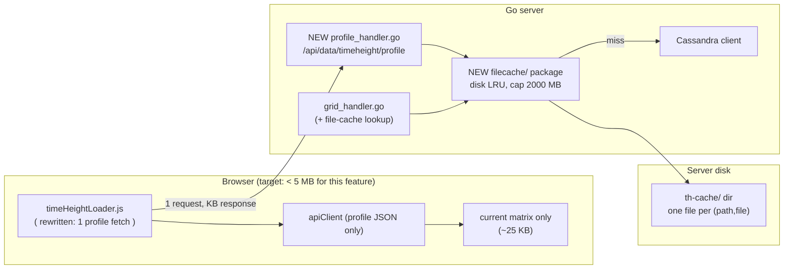

# EC Time–Height Profile — Plan 2: Move Bulk Grid Cache Off the Browser (Server File Cache ≤ 2000 MB)

## 1. Goal

Eliminate the current ~2000 MB browser-memory footprint of the ec-time-height-profile feature by moving bulk grid storage to a **server-side on-disk file cache capped at 2000 MB**, and shrinking the client to hold only the sampled profile matrix (KBs, not GBs).

Non-goal: changing map-plane contour layers, TlogP, or the Cassandra schema. No frontend build-pipeline change.

## 2. Where the ~2000 MB Comes From (current state, Plan 1 implementation)

A default profile = 13 leads × 10 levels × 4 elements (`RH,TMP,VVEL,WIND`) = **520 grids** (`client/src/layers/timeheight/timeHeightLoader.js`, `TH_GRID_CACHE_MAX_ENTRIES = 600`).

- Live `ECMWF_HR` grid = 361×281 = 101,441 points (plan1 §2.1 note). One scalar `values[]` ≈ 400 KB as Float32, but the client holds it as **parsed JSON** (`GridResponse` with JS-number arrays ≈ 0.8–1.5 MB per grid; `WIND` carries `values+u+v` ≈ 3×).
- Each grid is stored **twice** in the browser: `win._thGridCache` (10-min TTL, `timeHeightLoader.js:88-112`) **and** `apiClient.dataCache` (3-min TTL, `apiClient.js:75-125`, which additionally `structuredClone`s on every hit).
- 520 grids × ~1–2 MB × ~2 copies ≈ **1–2 GB**. A second cycle/range explored before TTL expiry doubles it again. `matrixCache` (controller) is negligible by comparison (13×10×6 Float32 ≈ 25 KB per matrix).

Key insight: putting a file cache **only** in front of `GET /api/data/grid` fixes Cassandra load but **does not fix browser memory** — the client would still download and retain 520 JSON grids. So Plan 2 has two coupled pieces:

1. **(A) New profile endpoint** — server samples the point, client downloads one KB-sized matrix instead of 520 grids.
2. **(B) Server file cache (≤2000 MB)** — backs both the new endpoint and the existing grid endpoints, so repeated points/cycles don't hit Cassandra.

## 3. Architecture After Plan 2



Wire format client↔server stays JSON. Nothing in the MapLibre/contour path changes except that grid responses may be served from disk.

## 4. Piece B — Server File Cache (`server/filecache/`, new package, each file < 600 lines)

### 4.1 What is cached

Cache the **compressed Cassandra blob bytes** (exactly what `db.GetBlob` returns — the gzip payload as stored), **not** decompressed data and not parsed structs:

- Byte-identical to the Cassandra result by construction: a cache hit replays the same bytes a Cassandra fetch would have returned, so cached vs uncached responses are trivially identical (stronger guarantee than caching a derived form, and easy to assert in tests with a byte comparison).
- Smaller on disk than decompressed payloads (live treeview sizes: scalar ~110–250 KB, `WIND` ~715 KB compressed vs ~406/812 KB decompressed Float32), so the 2000 MB cap holds ~2–3× more profiles.
- Decompress (`parser.DecompressGzip`) + parse (`parser.ParseGridData`) happen **on the fly per hit**. Both are CPU-only and microseconds-to-milliseconds per grid — negligible next to the Cassandra round trip they replace — and per-request buffers are freed after the response, keeping server RAM flat.
- Avoids gob/JSON version fragility of caching parsed `GridResponse`.

Key = `sha1("<table>|<dataPath>|<file>")` (table derived exactly as `db.GetBlob` derives it). One cache file per key: `<hex>.bin` + sidecar `<hex>.meta` (JSON: table, dataPath, file, byte size, stored-at).

### 4.2 Layout, cap, eviction

- Dir: configurable (flag `-th-cache-dir`, env `TH_CACHE_DIR`, default `./th-cache` next to the binary; must be creatable, else fail open with a loud log and continue cacheless).
- Cap: 2000 MB total of `*.bin` bytes (flag `-th-cache-mb`, env `TH_CACHE_MB`, default `2000`). Enforcement is **exact**: a global `int64` byte counter (atomic) + `sync.Mutex` around insert/evict; after every insert, evict oldest-`mtime` files until `total <= cap`. A single oversized insert never exceeds cap by more than one entry (evict-others-first, then store).
- LRU signal = file `mtime`, refreshed (`os.Chtimes`) on every hit. A background sweeper (every 60 s) re-enforces the cap and deletes entries older than TTL (flag `-th-cache-ttl`, default `6h`; forecast grids are immutable per `(path,file)`, so TTL exists only to bound staleness of catalog drift, not correctness).
- Startup: scan dir, rebuild index (size sum + mtimes), delete corrupt/orphan sidecars. No separate index file (no dual-source-of-truth bug class).
- Crash safety: write `<hex>.tmp` → `fsync` → `rename` → write `.meta`. Readers never see partial files (open with `O_RDONLY`; a missing `.meta` means ignore).
- Concurrency: `singleflight` per key (hand-rolled ~30 lines, no new dependency) so 6 concurrent client requests for the same grid = 1 Cassandra fetch. `CQLClient` already serializes queries internally; singleflight prevents stampedes across HTTP handlers.
- Mock mode: bypass disk cache entirely (synthetic data is already free).

### 4.3 Integration points

- `GridHandler.fetchGrid`: after resolving `dataPath/file`, check `filecache.Get` → on hit **decompress the cached blob on the fly** (`DecompressGzip` → `ParseGridData`) → return. On miss, existing Cassandra path, then `filecache.Put` the **raw compressed blob** (best-effort; log-and-continue on disk errors — cache must never fail a request).
- New `ProfileHandler` (piece A) uses the same `filecache` API; never touches `dataCache`-style in-memory maps (process memory stays flat).
- Observability: `GET /api/status` gains `thCache: {entries, bytes, capBytes}` (counters only, no key dump). Log evictions at `debug`, cap-exceeded drops at `warn` with byte counts.

## 5. Piece A — Profile Endpoint (`GET /api/data/timeheight/profile`)

Why required: without it the browser still holds 520 grids. With it the browser holds one matrix.

Request (all validated, all bounded):

```text
GET /api/data/timeheight/profile?model=ECMWF_HR&cycle=26091808&leads=0,12,...,144&levels=1000,...,100&lon=121.5&lat=31.4
```

- `model`: allowlist `^ECMWF_HR$` for Plan 2 (extend later).
- `cycle`: `^\d{8}$`; `leads`: ≤41 integers in `[0,240]` (same caps as `buildLeads`); `levels`: subset of the fixed 10 (`[1000,925,850,700,500,400,300,250,200,100]`, ≤10); `lon/lat`: floats, must fall inside the first resolved grid's domain (else 400, no extrapolation).
- Elements are fixed server-side (`RH,TMP,VVEL,WIND`) — not client-choosable, mirrors the loader's hardcoded list.

Server behavior per request (streaming — see §5.1):

1. Resolve the 13×10×4 = ≤520 `(path,file)` set (dedupe identical keys).
2. For each key: get the compressed blob (file cache hit → **decompress on the fly**; miss → Cassandra fetch → `Put` the blob → decompress), then **position + parse only the requested grid point** (§5.2) — never a full-grid parse. Concurrency cap 6 (same as client today) with `singleflight` dedup; per-key failure → `NaN` cells (never fail the whole matrix — same contract as today). **Flush one NDJSON progress event per settled grid** (not per batch) so the bar moves smoothly.
3. Collect the per-grid sampled values into the matrix rows. The bilinear weighting is identical to `timeHeightSampling.js` (shared numeric fixtures in Go tests, not JS imports).
4. Flush the final result line (matrix only), then close the stream.

### 5.2 Point-targeted parsing (no full grids on the profile path)

`ParseGridData` (`parser/grid_data.go`) decodes all 101,441 points plus `X`/`Y` arrays and full stats —
~400–800 KB allocated per grid, ~200–400 MB churn per cold profile — only to keep one bilinear value.
The profile handler must not use it. Add `parser.SampleGridPoint(decompressed, lon, lat)` that does
only the work for the requested point:

1. **Position**: parse the 278-byte header (`ParseGridHeader`, already exists), derive geometry with the
   exact `dLon`/`dLat` rules from `ParseGridData` (extent-derived steps, N→S sign), and compute
   `gx = (lon-startLon)/dLon`, `gy = (startLat-lat)/dLat` (or S→N variant). Out-of-domain → typed
   out-of-range error (handler maps to 400; never extrapolate). Snapped node
   `i=round(gx)`, `j=round(gy)` + snapped lon/lat (same math as JS `snapToGridNode`) is returned for
   the response `point` field — computed once from the first successful grid.
2. **Parse the stencil only**: with `x0=floor(gx)`, `x1`, `y0`, `y1` clamped to the grid, read at most
   **4 little-endian Float32s** from the payload — `values[j*nLon+i]` for Diamond 4; for Diamond 11,
   4 from Block 1 plus 4 from Block 2. Apply the identical sentinel policy as the client
   (`±9000`, `NaN`) and the RH clamp, with the same bilinear weights (including the valid-corner
   reweighting). Per-grid server allocation: header + a few floats — effectively zero.
3. **Wind polar/cartesian decision without a full scan**: the existing detector strides the whole grid
   (`grid_data.go:109`), which would defeat the purpose. Instead decide **once per grid** with the same
   strided read but returning only the `isSpeedDir` bool (no `U`/`V`/`Values` arrays, no stats loop),
   and reuse it for that grid's stencil conversion. Optionally persist the bool in the cache sidecar
   `.meta` at `Put` time so repeat requests skip even the strided read.

`ParseGridData` stays untouched for `/api/data/grid` (map layers still need full fields). The profile
path and the grid path therefore share blob fetching but diverge at decode time — full decode for maps,
stencil decode for profiles.

### 5.1 Streaming protocol (NDJSON) — drives the client progress bar

A single JSON response cannot report progress (headers-first, body-last), so the endpoint streams
`Content-Type: application/x-ndjson` with `Transfer-Encoding: chunked`: zero or more progress lines,
exactly one result line, in this order:

```text
{"type":"progress","loaded":1,"total":520,"ok":1,"failed":0,"cacheHits":1,"lastSource":"cache"}
{"type":"progress","loaded":2,"total":520,"ok":2,"failed":0,"cacheHits":1,"lastSource":"cassandra"}
...
{"type":"result","point":{...},"cycle":"26091808","leads":[...],"levels":[...],"rh":[[..],..],"tmp":[[..],..],"vvel":[[..],..],"u":[[..],..],"v":[[..],..],"missing":{...},"stats":{"failed":0,"total":520,"cacheHits":519}}
```

- `loaded/total/ok/failed` are cumulative; `cacheHits` counts grids served from the file cache;
  `lastSource` is `"cache"` or `"cassandra"` for the grid that just settled, so the UI label can read
  e.g. `Loading 212/520 grids… (41%) · 180 from cache`.
- `total` is sent on every line (client must not assume the first line arrives before render — use the
  known task count optimistically, correct on first event).
- `NaN` is not valid JSON: encode missing cells as `null` in the result line (client converts back to
  `NaN` in one place). Result line ≈ tens of KB; progress lines are ~100 bytes each.
- Client disconnect (Cancel / loadSeq change / tab close) cancels the request context: the handler must
  `select` on `r.Context().Done()` in its worker loop, stop Cassandra/file work promptly, and never
  `Put` partial results. Server work is idempotent — a cancelled request still leaves any completed
  `Put`s valid for the retry.
- **Timeout exemption**: `main.go` sets `WriteTimeout: 60s`, which bounds a complete response write —
  a cold 520-grid load can exceed it. Exempt this route from that deadline (handler runs under its own
  generous context, e.g. 10 min; normal all-cache-hit responses finish in ~100 ms). Document the
  exemption next to the route registration; do not raise the global timeout.
- Fallback compatibility: a client that cannot stream (or a proxy that buffers chunked bodies) still
  works — it reads the full body and parses the **last** line. The handler must therefore always end
  with the result line even when flushing is unavailable.

Security: reuse `validTableRegex` + strict numeric parsing; reject `..`, `/`, `%00` in every param (400). No filesystem path is ever derived from raw input except via the sha1 key.

## 6. Client Changes (net memory: GBs → KBs)

`client/src/layers/timeheight/timeHeightLoader.js` (rewrite, keep exports stable):

- **Delete** `win._thGridCache`, `TH_GRID_CACHE_MAX_ENTRIES/TTL`, `fetchGridWithCache`, and the 520-task fan-out. `getThGridCache/clearThGridCache` become deprecated shims (log-once warn, operate on a `Set` of warmed keys or no-op) so existing callers/tests keep compiling during migration, then removed in the cleanup commit.
- `loadTimeHeightMatrix({win, model, cycle, leads, levels, point, onProgress, signalSeq, isCancelled})` keeps its **signature and return shape** (`{cancelled, matrix, stats}`) but internally performs **one** streaming request to `/api/data/timeheight/profile` (plain `fetch`, **not** `fetchJson` — the response is a stream, and `apiClient.dataCache` must not store it). It reads the `ReadableStream` with a `TextDecoder`, splits NDJSON lines, fires the existing `onProgress({loaded, total, ok, failed, pct, cacheHits, lastSource})` callback **per progress line** (same shape the determinate bar already consumes, plus the two new fields for the `· N from cache` label), and builds the matrix from the final `result` line (`null→NaN` in one place).
- Cancel keeps working exactly as today: Cancel button / loadSeq change aborts via `AbortController` → `reader.cancel()` → server sees context-done and stops (§5.1). No fake percentages — every bar tick corresponds to a settled server-side grid, whether it came from disk or Cassandra.
- Keep `buildProfileMatrix` client-side **only as a test-oracle** for numeric parity (Go vs JS sampler), fed by synthetic grids — no longer on the hot path.
- `timeHeightController.js`: remove `_thGridCache` fast-path branches; "second point is instant" now comes from the server file cache (same cycle → all hits, response in ~100 ms) rather than browser RAM. Keep `matrixCache` (per-point matrices, KBs) with a small bound (e.g. 20 entries) so direction/visibility toggles stay render-only.
- `apiClient.js`: no change required — the profile stream bypasses `dataCache` entirely (nothing storable about a stream). The 3-min cache keeps serving the map-plane grid layers as today.

## 7. Memory / Disk Budget

| Store | Before | After |
|---|---|---|
| Browser `win._thGridCache` (520 full grids) | ~1000–1500 MB | **0 (deleted)** |
| Browser `apiClient.dataCache` share for these grids | ~500–1000 MB | ~100 KB (profile JSON) |
| Browser matrices | KBs | KBs (bounded to 20) |
| Server RAM (file cache) | n/a (TlogP single-blob only) | ~0 (compressed blobs live on disk; per request only headers + stencil floats are decoded on the fly, freed after — no 100k-point arrays anywhere on the profile path) |
| Server disk `th-cache/` | n/a | **≤2000 MB hard cap**, ~150–160 MB per full default profile at live geometry (520 compressed blobs: scalar ~110–250 KB, `WIND` ~715 KB from live treeview sizes), i.e. room for ~12 recent profiles/cycles under LRU |

Sizing check: worst case 41 leads × 10 levels × 4 = 1640 grids ≈ ~0.5 GB compressed — still under cap for a single request; LRU evicts older cycles first. Cap is enforced on **actual bytes on disk**, not entry counts (entry-count caps like today's 600 are what allowed the GB blowup).

## 8. Rollout Phases

- **Phase 0 — Measure**: add `GET /api/status.thCache` stub + client `getCacheStats()` logging of timeheight entries/bytes; record the ~2000 MB baseline in the review thread. No behavior change.
- **Phase 1 — Server file cache for grids (transparent)**: new `server/filecache/` package + `GridHandler` integration behind `-th-cache-dir` (default on, fail-open). Go tests: put/get/hit, cached blob byte-for-byte equal to the Cassandra payload, LRU eviction under a tiny MB cap, restart rebuild, corrupt-file tolerance, singleflight dedup, path-traversal rejection. Client untouched; verify identical grid responses and Cassandra query-count drop on repeat loads.
- **Phase 2 — Profile endpoint + client slim-down**: `server/handler/profile_handler.go` (+ route in `main.go` **with the WriteTimeout exemption**), new `parser.SampleGridPoint` point-targeted sampler (§5.2), NDJSON progress/result streaming with `Flusher` + context-cancel tests, Go numeric-parity tests vs JS fixtures (bilinear weights, N→S, RH clamp, sentinel→null, stencil-vs-full-parse equivalence, wind polar/cartesian decision parity), then the `timeHeightLoader.js` rewrite (stream reader, real per-grid progress, AbortController cancel) + controller fast-path removal + `matrixCache` bound. Bun tests updated: loader asserts **1 network request** with a mocked NDJSON stream, monotonic `loaded` with correct `cacheHits`/`lastSource`, cancel aborts the reader, `null→NaN` mapping covered.
- **Phase 3 — Harden the cap**: soak test (2 cycles × 2 ranges), assert `du th-cache ≤ 2000 MB`, kill-9 restart rebuild, sweeper timing, mock-mode bypass, disk-full behavior (serve from Cassandra, error logged, no 500). Document flags in `README.md` + `Architecture.md` §-pointer.
- **Phase 4 — Cleanup**: delete deprecated shims, remove `TH_GRID_CACHE_*` exports, drop the "520 JSON grids" paragraph from plan1 §2.3 (superseded), record final browser heap numbers.

## 9. Verification (must pass before merge)

| ID | Check | How |
|---|---|---|
| P1 | Browser holds no grids | Cold profile load → heap delta attributable to feature < 5 MB; `win._thGridCache` absent; `apiClient.dataCache` holds no grid/profile entries for this feature |
| P2 | One request per profile | Fetch spy: point/range/cycle load = exactly 1 `/api/data/timeheight/profile` call (vs 520 `/api/data/grid` before) |
| P2b | Progress bar tracks server sources | Mocked NDJSON stream (mixed `cache`/`cassandra` events) → bar advances monotonically to 100%, label shows `loaded/total` + `N from cache`; cancel mid-stream aborts the reader and keeps the prior matrix |
| P3 | Disk cap holds | Fill beyond 2000 MB (small-cap override) → oldest evicted, `du` ≤ cap, responses still correct |
| P4 | Numeric parity | Same `(cycle,point)` via old bulk path (test fixture) vs new endpoint → identical matrices within 1e-4; `SampleGridPoint` stencil output equals full-`ParseGridData` + client-weight sampling on fixtures; wind encoding decision matches the full-scan detector |
| P5 | Partial failure contract | Forced missing level → `null` cells → client `NaN` gap, `missing`/`failed` counts preserved, no whole-request 500 |
| P6 | Validation | Traversal/non-numeric/out-of-range params → 400; `lon/lat` outside domain → 400 (no extrapolation) |
| P7 | Restart safety | Kill-9 mid-write → restart rebuilds, corrupt partials ignored, service healthy |
| P8 | Existing suites green | `go test ./...`, `bun test` (updated timeheight tests), no regression to contour/wind/station paths |

## 10. Risks & Open Decisions

1. **First-load latency is unchanged** (Cassandra still serves 520 grids once); the win is memory + repeat-load speed. If first load must also be faster, that is a separate Cassandra-parallelism project, not this plan.
2. **Single-server disk scope**: with multiple server replicas each holds its own ≤2000 MB (cap is per host). Shared-NFS locking is explicitly out of scope; note it if deployed multi-replica.
3. **Disk-full / read-only disk**: fail open (skip `Put`, serve from Cassandra); never 500 on cache errors. Add a startup writability probe with a loud log.
4. **Profile-request size abuse**: hard caps (41 leads, 10 levels, fixed elements) bound worst-case Cassandra fan-out per request; add a small per-IP concurrency limit if the endpoint is abused.
5. **API surface**: `/api/data/timeheight/profile` is additive; `/api/data/grid` behavior is unchanged apart from being disk-accelerated. No migration for other clients.
