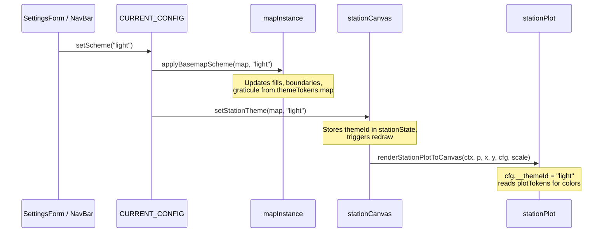

# Map + Plot Unified Theme System — Redesign Plan

> **Goal**: Three cohesive themes where the basemap is *low-profile / minimalist* (recedes visually), and the meteorological station plots (surface & upper-air) are *clean / high-contrast / obvious*. The map and plots together should feel polished, intentional, and professionally designed. Theme switching at runtime must propagate to both map and plot styling in one atomic operation.

---

## 1  Current State Analysis

### 1.1 Map Themes (3 schemes in `pmtilesLayers.js`)

| ID | Name | Character |
|----|------|-----------|
| `dark` | Midnight Slate | Dark blue-gray fills, slate boundaries |
| `light` | Daybreak Neutral | Light gray/white fills, dark boundaries |
| `micaps` | MICAPS Classic | Dark navy fills, sky-blue (`#38bdf8`) province borders |

### 1.2 Station Plot (hardcoded colors in `stationPlot.js`)

All three themes share **identical** station plot colors — there is no theme-awareness:

| Element | Current Color | Notes |
|---------|--------------|-------|
| Temperature (TT) | `#f85149` (bright red) | Top-left |
| Dewpoint (Td) | `#56d364` (emerald green) | Bottom-left |
| DTD (T-Td) | `#f0883e` (orange) | Middle-left |
| Pressure/Height (PPP) | `#79c0ff` (sky blue) | Top-right |
| Rain (R6) | `#38bdf8` (cyan) | Middle-right |
| Tendency (ppa) | `#a5d6ff` (light blue) | Bottom-right |
| Weather symbol (ww) | `#e3b341` (gold) | Center-left |
| Visibility (VV) | `#ffd33d` (yellow) | Far left |
| Wind barb | `#58a6ff` (blue) | Default color param |
| Sky cover circle BG | `rgba(13,17,23,0.85)` | Dark only |
| Sky cover border | `#e6edf3` (white-ish) | Dark only |
| Station dot (no cloud) | `#e3b341` fill / `#000` stroke | |
| Text outline (halo) | `rgba(0,0,0,0.85)` | Black halo for all text |

### 1.3 Problems

1. **No theme coupling** — plot colors are hardcoded; switching basemap scheme has zero effect on station plot rendering.
2. **Sky cover symbol only looks right on dark backgrounds** — the `rgba(13,17,23,0.85)` fill is invisible on the light theme.
3. **Text halo is always black** — on the light theme, the black halo behind bright-colored text creates muddy contrast rather than helping readability.
4. **Map boundaries are too prominent** — province and city boundaries compete with isoline contours and station plots for visual attention.
5. **Wind barb color is a default parameter, never dynamically themed.**
6. **No unified "theme token" system** — colors are scattered across `pmtilesLayers.js`, `stationPlot.js`, `stationSymbols.js`, `gridBarbs.js`, `streamlines.js`, and `contourStyle.js`.

---

## 2  Design Philosophy

```
┌──────────────────────────────────────────────────────────────┐
│  VISUAL HIERARCHY (most prominent → least prominent)        │
│                                                             │
│  1. Station Plot Text   ████████████████████  HIGHEST       │
│  2. Wind Barbs/Symbols  ██████████████████                  │
│  3. Contour Isolines    ████████████████                    │
│  4. National Boundary   ██████████                          │
│  5. Province Boundary   ████████                            │
│  6. City/County Bndry   ██████                              │
│  7. Graticule Lines     ████                                │
│  8. Land Fills          ██               LOWEST             │
│  9. Background (Ocean)  █                                   │
└──────────────────────────────────────────────────────────────┘
```

**Principles:**
- **Map whispers, data shouts.** The basemap must be low-contrast, near-monochrome, with minimal chroma so that colorful plot elements pop.
- **Text legibility via halo contrast inversion.** Dark themes get a dark halo; light themes get a light halo — always the opposite of the text fill color's luminance context.
- **Warm data / cool geography.** Station data uses warm-to-neutral tones (red, green, gold, white). Map boundaries use cool, desaturated tones (slate, gray, muted blue).
- **Consistent semantic colors across themes.** Temperature is always in the red family, dewpoint always green, pressure always blue — but the *exact shade* shifts to maintain contrast against each theme's background.

---

## 3  Redesigned Themes

### 3.1 Theme: **`dark`** — "Ink"

*Design intent:* Near-black, ultra-low-chroma map. Boundaries are barely visible hairlines. Data pops like glowing HUD elements.

#### 3.1.1 Basemap Palette (reduced from current)

```
background:           #08090d        ← deeper, less blue than current #0a0f19
ocean/world fill:     #0c0e14
china fill:           #0e1018
province fill:        #10121c
city/county fill:     #10121c

national boundary:    #475569  @ 0.65 opacity, 1.2px
province boundary:    #334155  @ 0.50 opacity, 0.8px
city boundary:        #1e293b  @ 0.35 opacity, 0.5px dashed
county boundary:      #1e293b  @ 0.25 opacity, 0.4px dashed
graticule:            rgba(100, 116, 139, 0.18)
```

> Key change: boundaries are **dimmer and thinner** than current. Province lines drop from 1.15px/0.88 opacity → 0.8px/0.50 opacity.

#### 3.1.2 Station Plot Palette — Dark

| Element | Fill Color | Halo | Font | Weight |
|---------|-----------|------|------|--------|
| TT (Temperature) | `#ff6b6b` | `rgba(0,0,0,0.92)` | 13px mono | 700 |
| Td (Dewpoint) | `#69db7c` | `rgba(0,0,0,0.92)` | 13px mono | 700 |
| DTD (T-Td) | `#ffa94d` | `rgba(0,0,0,0.92)` | 12px mono | 700 |
| PPP (Pressure/Hgt) | `#e0e0e0` | `rgba(0,0,0,0.92)` | 13px mono | 700 |
| Rain (R6) | `#74c0fc` | `rgba(0,0,0,0.92)` | 12px mono | 700 |
| Tendency (ppa) | `#a5d8ff` | `rgba(0,0,0,0.92)` | 11px mono | 600 |
| Weather (ww) | `#ffd43b` | `rgba(0,0,0,0.92)` | 15px mono | normal |
| Visibility (VV) | `#ffe066` | `rgba(0,0,0,0.92)` | 12px mono | 700 |
| Wind barb | `#dee2e6` | — | — | — |
| Sky cover BG | `rgba(8,9,13,0.90)` | — | — | — |
| Sky cover border | `#dee2e6` | — | — | — |
| Station dot | `#ffd43b` fill, `rgba(0,0,0,0.6)` stroke | — | — | — |

> **PPP is now near-white `#e0e0e0`** instead of blue — prevents clash with wind barbs and rain. Wind barbs are now light gray `#dee2e6` instead of blue to avoid competing with cyan rain values.

---

### 3.2 Theme: **`light`** — "Paper"

*Design intent:* Warm off-white, like a printed synoptic chart. Thin gray boundaries. Data printed in saturated ink.

#### 3.2.1 Basemap Palette

```
background:           #e8e4de        ← warm paper, not cold blue-white
ocean/world fill:     #f0ece6
china fill:           #f5f2ed
province fill:        #f0ece6
city/county fill:     #ebe7e1

national boundary:    #78716c  @ 0.70 opacity, 1.2px
province boundary:    #a8a29e  @ 0.45 opacity, 0.75px
city boundary:        #d6d3d1  @ 0.35 opacity, 0.5px dashed
county boundary:      #d6d3d1  @ 0.25 opacity, 0.4px dashed
graticule:            rgba(120, 113, 108, 0.15)
```

> Warm stone tones instead of cold blue-gray. The map looks like a faded atlas page.

#### 3.2.2 Station Plot Palette — Light

| Element | Fill Color | Halo | Font | Weight |
|---------|-----------|------|------|--------|
| TT (Temperature) | `#c92a2a` | `rgba(255,255,255,0.92)` | 13px mono | 700 |
| Td (Dewpoint) | `#2b8a3e` | `rgba(255,255,255,0.92)` | 13px mono | 700 |
| DTD (T-Td) | `#d9480f` | `rgba(255,255,255,0.92)` | 12px mono | 700 |
| PPP (Pressure/Hgt) | `#1c1c1e` | `rgba(255,255,255,0.92)` | 13px mono | 700 |
| Rain (R6) | `#1864ab` | `rgba(255,255,255,0.92)` | 12px mono | 700 |
| Tendency (ppa) | `#1971c2` | `rgba(255,255,255,0.92)` | 11px mono | 600 |
| Weather (ww) | `#e67700` | `rgba(255,255,255,0.92)` | 15px mono | normal |
| Visibility (VV) | `#e67700` | `rgba(255,255,255,0.92)` | 12px mono | 700 |
| Wind barb | `#1c1c1e` | — | — | — |
| Sky cover BG | `rgba(255,252,248,0.92)` | — | — | — |
| Sky cover border | `#1c1c1e` | — | — | — |
| Station dot | `#e67700` fill, `rgba(255,255,255,0.5)` stroke | — | — | — |

> **Halo is now WHITE** to mask the warm paper background. All colors are deep / saturated ink tones — dark red, forest green, near-black — for maximum contrast on light background. PPP is near-black because blue on light-cream is less readable than black.

---

### 3.3 Theme: **`micaps`** — "Slate Blue"

*Design intent:* Traditional MICAPS feel, dark navy with subtle blue boundary accents — but much more muted than current. Plot colors are bright pastels on the deep blue canvas.

#### 3.3.1 Basemap Palette (calmed down)

```
background:           #070b14
ocean/world fill:     #0a1020
china fill:           #0d1426
province fill:        #0f162a
city/county fill:     #0f162a

national boundary:    #94a3b8  @ 0.55 opacity, 1.2px    ← was white #f8fafc
province boundary:    #1e5088  @ 0.40 opacity, 0.8px    ← was bright cyan #38bdf8
city boundary:        #163a66  @ 0.30 opacity, 0.5px dashed
county boundary:      #163a66  @ 0.20 opacity, 0.4px dashed
graticule:            rgba(30, 80, 136, 0.15)
```

> **Province boundaries are now muted navy-blue instead of bright cyan**, reducing visual noise. National boundary uses pale slate instead of white, lowering contrast.

#### 3.3.2 Station Plot Palette — MICAPS

| Element | Fill Color | Halo | Font | Weight |
|---------|-----------|------|------|--------|
| TT (Temperature) | `#ff8787` | `rgba(7,11,20,0.92)` | 13px mono | 700 |
| Td (Dewpoint) | `#8ce99a` | `rgba(7,11,20,0.92)` | 13px mono | 700 |
| DTD (T-Td) | `#ffc078` | `rgba(7,11,20,0.92)` | 12px mono | 700 |
| PPP (Pressure/Hgt) | `#e0e0e0` | `rgba(7,11,20,0.92)` | 13px mono | 700 |
| Rain (R6) | `#a5d8ff` | `rgba(7,11,20,0.92)` | 12px mono | 700 |
| Tendency (ppa) | `#d0ebff` | `rgba(7,11,20,0.92)` | 11px mono | 600 |
| Weather (ww) | `#ffd43b` | `rgba(7,11,20,0.92)` | 15px mono | normal |
| Visibility (VV) | `#ffe066` | `rgba(7,11,20,0.92)` | 12px mono | 700 |
| Wind barb | `#dee2e6` | — | — | — |
| Sky cover BG | `rgba(7,11,20,0.90)` | — | — | — |
| Sky cover border | `#dee2e6` | — | — | — |
| Station dot | `#ffd43b` fill, `rgba(7,11,20,0.5)` stroke | — | — | — |

> Lighter pastel tints than the "Ink" dark theme — `#ff8787` vs `#ff6b6b` for temperature — giving a slightly warmer, gentler feel that suits the blue-tinted background.

---

### 3.4 Integer Formatting for Plot Values

All plotted values should use **integers** for visual cleanliness. Decimal points add clutter and consume precious pixel space in the station model. The precise value is always available in the hover tooltip.

| Element | Current Format | New Format | Example |
|---------|---------------|------------|---------|
| TT (Temperature) | `Math.round()` → int | ✅ Already int | `23` |
| Td (Dewpoint) | `Math.round()` → int | ✅ Already int | `18` |
| DTD (T-Td) | `Math.round()` → int | ✅ Already int | `5` |
| **PPP (SLP)** | `Math.round(num*10)/10` → **decimal** | **`Math.round(num)`** → int | `1013.2` → **`1013`** |
| PPP (Height) | 3-digit int | ✅ Already int | `588` |
| **VV (Visibility)** | `.toFixed(1)` → **decimal** | **`Math.round()`** → int | `1.5` → **`2`** |
| **R6 (Rain)** | `.toFixed(1)` when < 10mm → **decimal** | **`Math.round()`** → int | `3.2` → **`3`** |
| pDiff (Tendency) | int (tenths of hPa) | ✅ Already int | `+12` |

#### Code Changes in `stationExtract.js` — `extractPressureOrHeight()`

```js
// Before (SLP):
const rounded = Math.round(num * 10) / 10;   // 1013.2
return rounded.toString();

// After:
return Math.round(num).toString();            // 1013
```

#### Code Changes in `stationPlot.js`

```js
// Before (Visibility):
const vis = rawVis !== null
  ? (rawVis >= 1000 ? (rawVis / 1000).toFixed(rawVis % 1000 === 0 ? 0 : 1)
  : (rawVis < 10 ? rawVis.toFixed(1) : Math.round(rawVis).toString()))
  : "";

// After:
const vis = rawVis !== null
  ? (rawVis >= 1000 ? Math.round(rawVis / 1000).toString()
  : Math.round(rawVis).toString())
  : "";

// Before (Rain):
const rain6 = rawRain6 !== null && rawRain6 > 0
  ? (rawRain6 < 10 ? rawRain6.toFixed(1) : Math.round(rawRain6).toString())
  : "";

// After:
const rain6 = rawRain6 !== null && rawRain6 > 0
  ? Math.round(rawRain6).toString()
  : "";
```

---

## 4  Architecture: Unified Theme Token System

### 4.1 New File: `client/src/map/themeTokens.js`

A single source of truth that defines **all** visual tokens for every theme:

```js
// themeTokens.js - Unified theme token system for map + plot styling
export const THEME_TOKENS = {
  dark: {
    id: "dark",
    name: "Ink",
    // ── Map tokens ──
    map: {
      background: "#08090d",
      fills: { world: "#0c0e14", china: "#0e1018", provinces: "#10121c", ... },
      boundaries: { ... },  // (as in §3.1.1)
      graticule: "rgba(100, 116, 139, 0.18)",
    },
    // ── Station plot tokens ──
    plot: {
      halo: "rgba(0,0,0,0.92)",
      haloWidth: 2.5,
      font: "'SF Mono', ui-monospace, monospace",
      tt:    { color: "#ff6b6b", size: 13, weight: "700" },
      td:    { color: "#69db7c", size: 13, weight: "700" },
      dtd:   { color: "#ffa94d", size: 12, weight: "700" },
      ppp:   { color: "#e0e0e0", size: 13, weight: "700" },
      rain:  { color: "#74c0fc", size: 12, weight: "700" },
      tend:  { color: "#a5d8ff", size: 11, weight: "600" },
      ww:    { color: "#ffd43b", size: 15, weight: "normal" },
      vis:   { color: "#ffe066", size: 12, weight: "700" },
      wind:  { color: "#dee2e6" },
      sky:   { bg: "rgba(8,9,13,0.90)", border: "#dee2e6", fill: "#dee2e6" },
      dot:   { fill: "#ffd43b", stroke: "rgba(0,0,0,0.6)" },
    },
  },
  light: { ... },  // (as in §3.2)
  micaps: { ... },  // (as in §3.3)
};

export function getThemeTokens(name) { ... }
export function getPlotTokens(name) { ... }
export function getMapTokens(name) { ... }
```

### 4.2 Refactored: `pmtilesLayers.js`

- `BASEMAP_SCHEMES` → replaced by `THEME_TOKENS[id].map`
- `getPMTilesStyle()` → reads from `getMapTokens(schemeName)`
- `applyBasemapScheme()` → reads from `getMapTokens(schemeName)`
- The map-specific shape of the data stays the same; it's just sourced from `themeTokens.js`

### 4.3 Refactored: `stationPlot.js`

The `drawPlotText()` inner function currently hardcodes color and halo. After refactoring:

```js
import { getPlotTokens } from "../../map/themeTokens.js";

export function renderStationPlotToCanvas(ctx, p, cx, cy, cfg = {}, scale = 1.0) {
  const theme = getPlotTokens(cfg.__themeId || "dark");
  
  function drawPlotText(text, x, y, tokenKey, align = "left") {
    if (!text) return;
    const t = theme[tokenKey];
    ctx.font = `${t.weight} ${Math.round(t.size * scale)}px ${theme.font}`;
    ctx.textAlign = align;
    ctx.textBaseline = "middle";
    ctx.strokeStyle = theme.halo;
    ctx.lineWidth = theme.haloWidth * scale;
    ctx.lineJoin = "round";
    ctx.strokeText(text, x, y);
    ctx.fillStyle = t.color;
    ctx.fillText(text, x, y);
  }

  // TT
  if (showTemp && allowField("TT") && tt) {
    drawPlotText(tt, cx - 8*scale, cy - 12*scale, "tt", "right");
  }
  // ... etc
}
```

### 4.4 Refactored: `stationSymbols.js`

```js
// drawWindBarbCanvas - default color comes from theme, not hardcoded
export function drawWindBarbCanvas(ctx, cx, cy, speed, dir, scale = 1.0, color = null, themeId = "dark") {
  const windColor = color || getPlotTokens(themeId).wind.color;
  // ... use windColor instead of hardcoded "#58a6ff"
}

// drawSkyCoverCanvas - BG and border from theme
export function drawSkyCoverCanvas(ctx, cx, cy, octas = 0, scale = 1.0, themeId = "dark") {
  const sky = getPlotTokens(themeId).sky;
  // ... use sky.bg, sky.border, sky.fill
}
```

### 4.5 Theme Propagation at Runtime



#### Implementation in `mapInstance.js`:

```js
import { getPlotTokens } from "./themeTokens.js";

export function setBasemapScheme(map, schemeName) {
  // ... existing map style update ...
  
  // NEW: propagate to station plot
  const state = getState(map);
  state.config.__themeId = schemeName;
  updateVisibleMarkersForMap(map);  // triggers redraw with new colors
}
```

#### Implementation in `stationCanvas.js`:

The `drawStationCanvas()` function already passes `state.config` to `renderStationPlotToCanvas()`. Since we store `__themeId` in `state.config`, the plot renderer automatically picks it up on next frame.

---

## 5  File Change Inventory

| File | Action | Summary |
|------|--------|---------|
| **`client/src/map/themeTokens.js`** | **CREATE** | New unified theme token registry |
| `client/src/map/pmtilesLayers.js` | MODIFY | Source map tokens from `themeTokens.js` instead of inline `BASEMAP_SCHEMES`; keep `BASEMAP_SCHEMES` as a computed re-export for backward compat |
| `client/src/map/mapInstance.js` | MODIFY | `setBasemapScheme()` also sets `state.config.__themeId` and triggers station redraw; `resolveInitialBasemapScheme()` accepts `"micaps"` |
| `client/src/layers/station/stationExtract.js` | MODIFY | `extractPressureOrHeight()` SLP branch: `Math.round(num)` instead of `Math.round(num*10)/10` for integer display |
| `client/src/layers/station/stationPlot.js` | MODIFY | `drawPlotText()` reads colors/halo/font from theme tokens via `cfg.__themeId`; remove all hardcoded color literals; VV and R6 formatted as integers |
| `client/src/layers/station/stationSymbols.js` | MODIFY | `drawWindBarbCanvas()` and `drawSkyCoverCanvas()` accept `themeId` param, read from tokens |
| `client/src/layers/station/stationCanvas.js` | MODIFY | Pass `state.config.__themeId` down to symbol renderers |
| `client/src/layers/station/stationState.js` | MODIFY | Add `__themeId: "dark"` to default config |
| `client/src/layers/wind/gridBarbs.js` | MODIFY | Read barb colors from theme tokens (or keep existing speed-based coloring as override) |
| `client/src/layers/wind/streamlines.js` | MODIFY | Background clear color from theme tokens |
| `client/src/layers/contour/contourStyle.js` | MODIFY | Isoline label `text-halo-color` from theme tokens (dark vs light) |
| `client/src/map/graticule.js` | MINOR | Already reads from `getBasemapScheme()`, which now delegates to `themeTokens.js` |
| `client/src/components/config/SettingsForm.svelte` | MINOR | Update theme card names ("Ink", "Paper", "Slate Blue") |

---

## 6  Implementation Order

### Phase 1: Theme Token Infrastructure (no visual changes yet)
1. Create `themeTokens.js` with all three complete theme definitions
2. Wire `pmtilesLayers.js` to read from `themeTokens.js` (backward-compatible re-export)
3. Verify map loads identically — no visual regression

### Phase 2: Station Plot Theme-Awareness
4. Modify `stationState.js` — add `__themeId` to default config
5. Modify `stationPlot.js` — `drawPlotText()` reads from theme tokens
6. Modify `stationSymbols.js` — wind barb and sky cover read from tokens
7. Modify `stationCanvas.js` — pass theme info to symbol calls
8. Verify station plots render with correct theme colors

### Phase 3: Theme Propagation on Switch
9. Modify `mapInstance.js` — `setBasemapScheme()` sets `__themeId` + redraws stations
10. Modify `createMapInstance()` — initial theme propagated to station config
11. Verify runtime theme switch updates both map AND plot simultaneously

### Phase 4: Apply Redesigned Color Values
12. Update `themeTokens.js` with final redesigned map palettes (dimmer boundaries)
13. Update `themeTokens.js` with final redesigned plot palettes (per §3)
14. Update theme names in `SettingsForm.svelte`
15. Visual QA across all three themes

### Phase 5: Peripheral Layers
16. Wire `gridBarbs.js` and `streamlines.js` to theme tokens (optional — these may keep speed-based coloring)
17. Wire `contourStyle.js` label halos to theme tokens
18. Final cross-theme visual QA

---

## 7  Testing Checklist

- [ ] Load with dark theme → map is ultra-low-contrast, station TT red text has black halo, clearly readable
- [ ] Load with light theme → map is warm off-white, station TT dark-red text has white halo, clearly readable
- [ ] Load with micaps theme → map is dark navy with muted blue boundaries, station TT pink-red text
- [ ] Switch dark → light at runtime → map transitions, station plot redraws with light palette
- [ ] Switch light → micaps at runtime → same
- [ ] Verify wind barbs change color per theme
- [ ] Verify sky cover circle BG/border adapts per theme
- [ ] Verify contour isoline labels don't clash with new boundary colors
- [ ] Verify `localStorage` persistence works across page reload
- [ ] Multi-window: each window can have independent theme (if feature exists)
- [ ] No console errors on any theme switch
