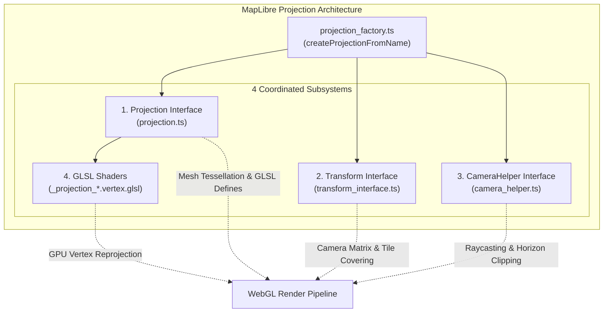

# MapLibre GL JS Map Projection Architecture & Custom Projection Analysis

This document provides a comprehensive technical investigation into MapLibre GL JS (v5.x) map projection capabilities, examining whether the engine supports a plugin or public API to register arbitrary new map projections, how projections are implemented internally across CPU and WebGL shaders, and architectural patterns for meteorological applications.

---

## 1. Executive Summary

- **Does MapLibre provide a public plugin API or registry to add new map projections?**  
  **No.** MapLibre GL JS does **not** expose a plugin API, registry method (such as `maplibregl.addProjection()` or `registerProjection()`), or runtime hook to introduce arbitrary user-defined map projections.
- **Can a developer register custom CRSs (e.g. Lambert Conformal Conic, Polar Stereographic, Albers Equal Area) like in OpenLayers?**  
  **No.** Unlike OpenLayers (which decouples projection math via `proj4js`), projections in MapLibre are closed and hardcoded into internal WebGL shader pipelines, camera matrices, and tile tessellation structures.
- **What projections are natively supported in MapLibre GL JS v5?**
  1. `mercator` (Spherical Web Mercator / EPSG:3857, default)
  2. `globe` (3D spherical globe with zoom-interpolated transition to Mercator)
  3. `vertical-perspective` (orthographic/perspective planetary view)
- Any unrecognized projection string passed to `map.setProjection({ type: '...' })` emits a console warning and falls back to `mercator`.

---

## 2. Source Code Investigation (`node_modules/maplibre-gl/src/`)

An analysis of the MapLibre GL JS source code confirms that projections are hardcoded within internal factory functions and cannot be extended via public APIs.

### 2.1. Public Entry Point Lacks Projection Registration APIs

In [`client/node_modules/maplibre-gl/src/index.ts`](file:///root/downloads/micaps-web/client/node_modules/maplibre-gl/src/index.ts#L378-L382), MapLibre exports extensible hooks for custom protocols and custom data sources:

```typescript
export {
    addProtocol,            // Supported: Custom network protocols (e.g. pmtiles://)
    removeProtocol,
    addSourceType,          // Supported: Custom source types
    importScriptInWorkers,  // Supported: Web Worker script injection
    // NOTE: There is NO addProjection or registerProjection exported.
};
```

While data sources (`addSourceType`) and network protocols (`addProtocol`) have modular plugin lifecycles, **no projection registration function exists**.

---

### 2.2. Closed Factory Switch-Case (`projection_factory.ts`)

In [`client/node_modules/maplibre-gl/src/geo/projection/projection_factory.ts`](file:///root/downloads/micaps-web/client/node_modules/maplibre-gl/src/geo/projection/projection_factory.ts#L17-L75), projections are instantiated through a static `switch-case` block:

```typescript
export function createProjectionFromName(
    name: ProjectionSpecification['type'],
    transformConstrain?: TransformConstrainFunction
): {
    projection: Projection;
    transform: ITransform;
    cameraHelper: ICameraHelper;
} {
    const transformOptions = {constrainOverride: transformConstrain};
    
    // Zoom-interpolated projection definition (e.g., globe transitioning to mercator)
    if (Array.isArray(name)) {
        const globeProjection = new GlobeProjection({type: name});
        return {
            projection: globeProjection,
            transform: new GlobeTransform(transformOptions),
            cameraHelper: new GlobeCameraHelper(globeProjection),
        };
    }

    switch (name) {
        case 'mercator': {
            return {
                projection: new MercatorProjection(),
                transform: new MercatorTransform(transformOptions),
                cameraHelper: new MercatorCameraHelper(),
            };
        }
        case 'globe': {
            const globeProjection = new GlobeProjection({type: [
                'interpolate',
                ['linear'],
                ['zoom'],
                11,
                'vertical-perspective',
                12,
                'mercator'
            ]});
            return {
                projection: globeProjection,
                transform: new GlobeTransform(transformOptions),
                cameraHelper: new GlobeCameraHelper(globeProjection),
            };
        }
        case 'vertical-perspective': {
            return {
                projection: new VerticalPerspectiveProjection(),
                transform: new VerticalPerspectiveTransform(transformOptions),
                cameraHelper: new VerticalPerspectiveCameraHelper(),
            };
        }
        default: {
            warnOnce(`Unknown projection name: ${name}. Falling back to mercator projection.`);
            return {
                projection: new MercatorProjection(),
                transform: new MercatorTransform(transformOptions),
                cameraHelper: new MercatorCameraHelper(),
            };
        }
    }
}
```

The factory uses a closed branch. Any name other than `'mercator'`, `'globe'`, or `'vertical-perspective'` triggers `warnOnce` and defaults directly to `MercatorProjection`.

---

### 2.3. Style Engine and Style Specification Enforcement

1. **`Style._setProjectionInternal`** in [`client/node_modules/maplibre-gl/src/style/style.ts`](file:///root/downloads/micaps-web/client/node_modules/maplibre-gl/src/style/style.ts#L1745-L1752):
   ```typescript
   _setProjectionInternal(name: ProjectionSpecification['type']) {
       const projectionObjects = createProjectionFromName(name, this.map.transformConstrain);
       this.projection = projectionObjects.projection;
       this.map.migrateProjection(projectionObjects.transform, projectionObjects.cameraHelper);
       for (const key in this.tileManagers) {
           this.tileManagers[key].reload();
       }
   }
   ```
   When `map.setProjection()` is called, it directly passes the projection name to `createProjectionFromName()`, migrates the camera helper and transform on the map instance, and triggers an immediate reload across all active `tileManagers`.
2. **Style Specification Schema** in [`@maplibre/maplibre-gl-style-spec`](file:///root/downloads/micaps-web/client/node_modules/@maplibre/maplibre-gl-style-spec/src/reference/v8.json#L5982-L5996):
   The official style specification validator restricts the `projection.type` property to constants or zoom expressions.

---

## 3. Why MapLibre Does Not Support Simple Projection Plugins

In 2D web mapping engines like OpenLayers or Leaflet (with Proj4Leaflet), projections are mathematical transformations running in CPU JavaScript:

$$\text{Proj4: } (x, y)_{\text{projected}} \longleftrightarrow (\lambda, \phi)_{\text{geographic}}$$

In MapLibre GL JS, vector and raster layers are rendered through **hardware-accelerated WebGL pipelines**. Adding a projection is not merely changing a 2D formula; it requires coordinating **four deeply coupled subsystems**:



### 3.1. The Four Required Subsystems

#### 1. `Projection` Interface ([`src/geo/projection/projection.ts`](file:///root/downloads/micaps-web/client/node_modules/maplibre-gl/src/geo/projection/projection.ts))
- **Dynamic Tile Tessellation & Subdivision**: Flat Web Mercator vector tiles cannot simply be placed onto curved surfaces without distorting straight line segments. The projection must define subdivision rules (`subdivisionGranularity`) and build dynamic vertex meshes (`getMeshFromTileID()`) to allow the GPU to bend tiles smoothly without edge tearing.
- **Shader Pipeline Prelude & Macros**: The projection injects preprocessor `#define` directives (e.g. `#define GLOBE`) and GLSL prelude code into **every vertex and fragment shader** compiled across all layer types (fill, line, circle, symbol, raster, hillshade).
- **GPU Error Mitigation**: Periodic GPU inaccuracy measurements (`ProjectionErrorMeasurement`) to correct single-precision 32-bit floating point limitations in mobile/embedded GPUs.

#### 2. `Transform` Interface ([`src/geo/transform_interface.ts`](file:///root/downloads/micaps-web/client/node_modules/maplibre-gl/src/geo/transform_interface.ts))
- Implements bidirectional coordinate mapping: `project()`, `unproject()`, `pointCoordinate()`, `coordinatePoint()`, `locationCoordinate()`.
- Computes tile covering hierarchies ([`covering_tiles.ts`](file:///root/downloads/micaps-web/client/node_modules/maplibre-gl/src/geo/projection/covering_tiles.ts)) to determine which quadtree vector tiles are visible inside the current camera frustum.

#### 3. `CameraHelper` Interface ([`src/geo/projection/camera_helper.ts`](file:///root/downloads/micaps-web/client/node_modules/maplibre-gl/src/geo/projection/camera_helper.ts))
- Handles 3D camera raycasting from screen pixels to the planet surface.
- Calculates the horizon clipping plane equation (`u_projection_clipping_plane`) to cull geometry located on the occluded far side of the sphere.

#### 4. WebGL Vertex Shaders ([`_projection_globe.vertex.glsl`](file:///root/downloads/micaps-web/client/node_modules/maplibre-gl/src/shaders/glsl/_projection_globe.vertex.glsl))
- All vertex transformations happen on the GPU in real-time per vertex. Tile coordinates `(0..8192)` are reprojected into 3D world space and screenspace directly inside the GPU pipeline.

Because of this tightly bound multi-tier design, custom projections cannot be introduced via a lightweight JavaScript plugin without modifying the WebGL shader source, tile tessellators, and camera mathematics simultaneously.

---

## 4. Architectural Comparison: MapLibre GL JS vs. OpenLayers

| Capability | MapLibre GL JS (v5.x) | OpenLayers (v10.x) |
| :--- | :--- | :--- |
| **Primary Focus** | High-performance WebGL vector tile rendering, 3D terrain, smooth 60 FPS tilt/rotation, 3D globe | Comprehensive 2D GIS workstation, multi-projection support, spatial analysis |
| **Arbitrary Custom Projections** | ❌ **No public API** (closed switch-case) | ✅ **Full Proj4js Integration** (`ol/proj/proj4`) — any EPSG/Proj4 definition supported |
| **Data Source CRS Auto-Reprojection** | ❌ None (vector data must be EPSG:4326; tiles must be EPSG:3857) | ✅ Native raster and vector on-the-fly reprojection between different CRSs |
| **3D Spherical Globe** | ✅ Built-in native WebGL 3D Globe with horizon culling and atmospheric blend | ❌ Flat 2D only (requires CesiumJS via OL-Cesium bridge for 3D) |
| **Rendering Pipeline** | 100% GPU WebGL vertex/fragment shaders | Canvas 2D / WebGL hybrid |
| **Community Tracking Issue** | [Issue #168: Support rendering in multiple CRS](https://github.com/maplibre/maplibre-gl-js/issues/168) | Standard feature since early versions |

---

## 5. Architectural Workarounds for Meteorological Systems

When building meteorological workstations (which frequently encounter polar stereographic, Lambert conformal, or custom regional projections), three primary workarounds are available in MapLibre:

### Workaround 1: Direct Canvas Overlays (The MICAPS-Web Pattern)
- **Concept**: Let MapLibre manage the basemap in Web Mercator or Globe projection. Meteorological symbols (such as WMO 9-point station plots and 110° metric wind barbs) are rendered into a transparent HTML5 `<canvas>` positioned above the map.
- **Coordinate Conversion**: Use `map.project([lng, lat])` to transform geographic coordinates $(\lambda, \phi)$ directly into screen-space pixel coordinates $(x, y)$.
- **Advantages**: Complete independence from MapLibre's shader limitations; custom projections or meteorological conventions (e.g. calm wind circles, pennant flags) can be drawn directly with Canvas2D.

### Workaround 2: Custom WebGL Layer (`CustomLayerInterface`)
- **Concept**: Implement a custom WebGL layer via [`CustomLayerInterface`](file:///root/downloads/micaps-web/client/node_modules/maplibre-gl/src/style/style_layer/custom_style_layer.ts#L8-L40).
- **Implementation**: Write custom GLSL shaders that receive the MapLibre view matrix and render arbitrary geometry reprojected with custom formulas.
- **Limitations**: Only reprojects the data within that custom layer; the underlying vector basemap remains in Web Mercator or Globe.

### Workaround 3: Server-Side Raster Reprojection
- **Concept**: When displaying gridded scalar fields (e.g. ECMWF, GFS, CMA GRAPES), reproject the meteorological grid on the server or in a Web Worker into Web Mercator space before delivering it to MapLibre.
- **In MICAPS-Web**: Implemented via CPU resampling (`latToMercatorY`), creating an offscreen Canvas image quad that aligns with Web Mercator tile extents without WebGL distortion.

---

## 6. Conclusion & Recommendations

1. **Do not attempt to register custom projections dynamically** in MapLibre GL JS using non-existent APIs. Any unrecognized name will silently fall back to `mercator`.
2. **For 3D Globe visualization**, use the native `'globe'` or `'vertical-perspective'` projections introduced in MapLibre v5.
3. **For arbitrary meteorological projections (e.g. Lambert Conformal Conic for regional China domains or Polar Stereographic for Arctic analyses)**:
   - If full basemap reprojection is an absolute requirement, **OpenLayers** with `proj4js` is the industry-standard choice.
   - If modern WebGL vector tiles, 3D terrain, smooth rotation, and 3D globe visualization are paramount, use **MapLibre GL JS** and handle non-Mercator meteorological layers via **screen-space Canvas overlays** or **pre-computed CPU/shader transforms**.
