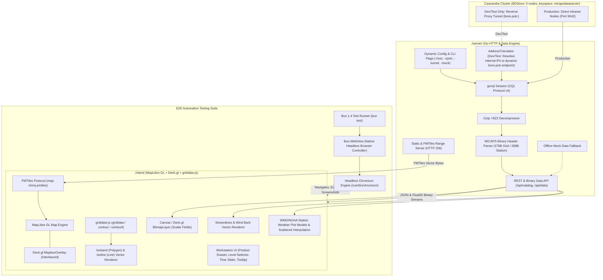

# MICAPS-Web System Architecture & Implementation Plan (v1)

## 1. Executive Summary
**MICAPS-Web** is a high-performance, web-based meteorological visualization and analysis workstation designed to modernize the CMA (China Meteorological Administration) MICAPS 4 desktop experience. It bridges distributed Apache Cassandra big data storage with modern WebGL/WebGPU web frontends, providing meteorologists with real-time access to NWP model grids, surface station observations, radar mosaics, and geostationary satellite imagery.

### Core Architectural Principles
1. **Decoupled Architecture**: Go HTTP server in `./server/` (Cassandra CQL v4, NAT address translation, Gzip decompression, 278/288-byte MICAPS header parsing, PMTiles range server) and modular frontend in `./client/` (MapLibre GL JS + PMTiles offline map, Deck.gl GPU rendering, `griddata-js` in-browser interpolation & contour/contourf).
2. **Environment & Tunnel Handling**: The `bore.pub` reverse-proxy tunnel is **strictly for development/testing**, with an ephemeral port that changes on every tunnel restart. Production operates directly over intranet LAN IPs on standard port `9042`.
3. **Standard WMO / NOAA Station Weather Plot**: Implements standard station model rendering (CIMSS / WPC NCEP specifications: sky cover circle, wind barbs, $T$, $T_d$, SLP 3-digit encoding, 3h pressure tendency glyphs, present weather symbols).
4. **Headless Browser E2E Automation (Bun 1.4 `Bun.WebView` + Chromium)**: Uses Bun 1.4's native `Bun.WebView` to navigate, click, scroll, run JavaScript, and take screenshots—enabling zero-selenium headless browser testing for MapLibre GL rendering, PMTiles loading, `griddata-js` contouring, station weather plot layout, and visual regressions.
5. **Strict Modularity (< 600 Lines Rule)**: Every file across both `./server/` and `./client/` (and this plan) strictly adheres to **< 600 lines**.
6. **Zero External Map Dependency**: Uses local PMTiles (`map-china.pmtiles`) for borders, provinces, and cities for 100% intranet/offline security.
7. **Cross-Platform Delivery**: Standalone Go binary (`micaps-server.exe` on Windows 10/11, or ELF binary on Linux).

---

## 2. System Architecture Diagram



---

## 3. Database Architecture & Reverse Proxy Protocol
Reference: `../help/micaps4-cassandra.md`

### 3.1. Connection Parameters & Dynamic Tunnel Handling
- **Cassandra Release**: `2.2.5` | **CQL Protocol**: Binary v4 (`CQL 3.3.1`) | **Cluster**: `BDStore` | **Keyspace**: `micapsdataserver`
- **Environment Separation**:
  - **Development / Testing (`bore.pub`)**:
    - The `bore.pub` tunnel is an ephemeral reverse TCP proxy used **only for development and testing**.
    - **Dynamic Port Allocation**: The forwarded port changes on every tunnel run (e.g. `20752`, `28341`, etc.). The server must never hardcode this port.
    - CLI arguments (`-cport <port>`) and environment variables (`CASSANDRA_PORT`) provide dynamic runtime port binding.
    - When running in tunnel mode (`-tunnel=true`), `TunnelTranslator` rewrites all discovered cluster peer IPs (`192.168.0.114–117`) to `bore.pub:<dynamic-port>`.
  - **Production Environment (Intranet)**:
    - Direct LAN connection to cluster seed nodes on default port `9042` without reverse proxy translation (`-tunnel=false`).
  - **Offline / Fallback Mode (`-mock`)**:
    - If the dynamic tunnel is down, the server seamlessly serves synthetic meteorological fields so frontend development is never blocked.

```go
type TunnelTranslator struct {
    TargetIP net.IP
    Port     int // Dynamically populated from CLI flag -cport / env CASSANDRA_PORT
}
func (t *TunnelTranslator) Translate(addr net.IP, port int) (net.IP, int) {
    return t.TargetIP, t.Port
}
```

### 3.2. Table Schema & Query Conventions
All 66 dataset tables use `COMPACT STORAGE`:
```sql
CREATE TABLE micapsdataserver.<TABLE_NAME> (
    "dataPath" text, column1 text, value blob, PRIMARY KEY ("dataPath", column1)
) WITH COMPACT STORAGE;
```
- **Path Decomposition**: Given `ECMWF_HR/TMP/850`, `table` = `ECMWF_HR`, partition key `"dataPath"` = `TMP/850`, clustering key `column1` = `26081708.000`.
- **Index Tables**:
  - `latestdatatime`: Partition Key `"dataPath"`, Clustering Key `column1` (`*.024`), Value `value` (latest run string `2026082708.024`).
  - `treeview`: Partition Key `"dataPath"`, Clustering Key `column1` (file name), Value `value` (size in bytes).
  - `level`: Partition Key `"dataPath"`, Clustering Key `column1` (isobaric levels in hPa: `1000, 850, 700, 500, 200...`).

---

## 4. MICAPS 4 Binary File Format Specifications
Reference: `nmcdev/nmc_met_io/retrieve_cassandraDB.py`

### 4.1. Payload Decompression Pipeline
1. Decompress raw `value` blob via Gzip (`gzip.decompress(response)` in Python, or `compress/gzip` in Go).
2. Inspect first 6 bytes: 4-byte ASCII discriminator (e.g. `m4b`), 2-byte little-endian `int16` data type.

### 4.2. 278-Byte NWP Grid Header (Type 4 Scalar & Type 11 Vector U/V)
Binary layout in Little-Endian:
| Offset | Field Name | Type | Size | Description |
| :--- | :--- | :--- | :--- | :--- |
| `0` | `discriminator` | `[4]byte` | 4 B | Format identifier string |
| `4` | `dataType` | `int16` | 2 B | **4** = 2D Scalar Grid; **11** = 2D Vector Grid (U, V) |
| `6` | `modelName` / `element` | `[20]byte`, `[50]byte` | 70 B | Model (`ECMWF_HR`) & variable (`TMP`, `HGT`, `WIND`) |
| `76` | `description` / `level` | `[30]byte`, `float32` | 34 B | Description & pressure level (hPa) |
| `110` | `year, month, day, hour, tz, period` | `6 x int32` | 24 B | Forecast reference time (UTC) & lead hour offset |
| `134` | `slon, elon, dlon, nlon` | `3 x float32, 1 x int32` | 16 B | West/East bounds, step $\Delta\text{lon}$, column count |
| `150` | `slat, elat, dlat, nlat` | `3 x float32, 1 x int32` | 16 B | South/North bounds, step $\Delta\text{lat}$, row count |
| `166` | `isolineStart, isolineEnd, space` | `3 x float32` | 12 B | Default isoline base, ceiling, interval |
| `178` | `perturbNum, ensembleTotal` | `2 x int16` | 4 B | Member index & total ensemble members |
| `182` | `minute, second, extent` | `2 x int16, [92]byte` | 96 B | Exact time & reserved metadata |

- **Type 4 (Scalar)**: Offset `278` onwards contains $N_{\text{lat}} \times N_{\text{lon}}$ `float32` values (row-major).
- **Type 11 (Vector Wind)**: Offset `278` onwards contains $2 \times N_{\text{lat}} \times N_{\text{lon}}$ `float32` values ($U$ matrix then $V$ matrix).

### 4.3. 288-Byte Station Observation Header & Element Mapping
- **Header**: Discriminator (4 B), Type (2 B), Description (100 B), Level (4 B), LevelDescription (50 B), Date/Time (28 B), `id_type` (2 B), Extent (98 B).
- **Records**: Followed by station count $N_{\text{station}}$ (`int32`), element definitions, and station observations (Station ID, lon, lat, numb, element values).
- **MICAPS Element ID Mapping to Station Plot Fields**:
  - `2001`: Temperature $TT$ (°C) | `2005` / Dew Point: $T_dT_d$ (°C)
  - `Pres_sea_level` / `SLP`: Sea-level pressure $PPP$ (hPa)
  - `Pressure_tendency_3h`: 3-hour pressure change $pp$ (hPa) & tendency curve $a$
  - `1401`: Total Cloud Cover $N$ ($0/8$ to $8/8$) | `1601`: Present Weather Code $ww$
  - `Wind_direction` & `Wind_speed`: Wind vector ($dd$, $ff$) | `1203/1207`: Visibility $VV$

---

## 5. Web Frontend Plotting Architecture
References: `likev/griddata-js`, `likev/local-map`, CIMSS SatMet, NOAA WPC

### 5.1. Offline Vector Basemap (`local-map`)
- **Engine**: MapLibre GL JS v5 with `pmtiles` protocol.
- **Source**: `pmtiles://http://localhost:8080/map-china.pmtiles` with 4 layers (`china`, `provinces_boundary`, `provinces`, `citys`).
- **Graticule**: Dynamic lat/lon lines and degree labels via `graticule.js`.

### 5.2. In-Browser Interpolation & Contouring (`griddata-js`)
1. **Scattered-to-Grid Interpolation (`griddata`)**:
   - Irregular AWS station points are interpolated to regular grid via `griddata(points, values, [X, Y], { method: 'linear' | 'cubic' })`.
2. **Marching Squares Isobands & Isolines (`contourf` & `contour`)**:
   - `contourf(Z, { x: lonCoords, y: latCoords, levels, extend: 'both' })` $\to$ GeoJSON `MultiPolygon` isobands rendered with palette fills.
   - `contour(Z, { x: lonCoords, y: latCoords, levels })` $\to$ GeoJSON `MultiLineString` isolines with inline elevation labels.

### 5.3. High-Density Raster & Wind Vectors
- **Raster Fields (Deck.gl BitmapLayer / Canvas)**: Zero-copy `Float32Array` streaming from `/api/data/grid/binary` rendered onto offscreen canvas at 60 FPS.
- **Wind Vectors**: Decimated wind barbs (speed/direction) and animated WebGL streamlines.

### 5.4. WMO / NOAA Standard Station Weather Plot Model
References: [CIMSS SatMet Module 7](https://cimss.ssec.wisc.edu/satmet/modules/7_weather_forecast/wf-5.html) & [NOAA WPC Station Plot](https://www.wpc.ncep.noaa.gov/html/stationplot.shtml)

Standard synoptic surface observations are rendered using the standard 9-position meteorological station model layout:

```
          [TT: Temp °C]        (Wind Barb: ff/dd)      [PPP: Sea-Level Pressure]
                 \                     |                     /
     [VV: Vis] - [ww: Weather Symbol] - (N: Sky Cover Circle) - [ppa: 3h Press Trend]
                 /                                           \
          [TdTd: Dewpoint °C]                                 [RR: 6h Precip]
```

#### Detailed Element Specifications:
1. **Center Circle (Sky Cover $N$)**:
   - `0/8`: Open circle (Clear / SKC) | `2/8`: 1/4 filled pie slice (Scattered / FEW)
   - `4/8`: Half-filled vertical circle (Partly Cloudy / SCT) | `6/8`: 3/4 filled circle (Mostly Cloudy / BKN)
   - `8/8`: Fully solid circle (Overcast / OVC) | Obscured: Cross inside circle (`X`) | Missing: Blank or `?`
2. **Wind Barb ($ff$ / $dd$)**:
   - Shaft originates at the center circle pointing into the direction *from* which the wind blows.
   - Calm: Double concentric circle without shaft.
   - Half-barb: 5 kts (~2.5 m/s) | Full-barb: 10 kts (~5 m/s) | Flag/Pennant: 50 kts (~25 m/s).
3. **Temperature ($TT$) & Dewpoint ($T_dT_d$)**:
   - $TT$ at top-left in whole °C. $T_dT_d$ at bottom-left in whole °C.
4. **Sea-Level Pressure ($PPP$)**:
   - Plotted at top-right in tenths of hPa/mb with leading 9 or 10 omitted (e.g. `1013.8 mb` $\to$ `138`, `998.2 mb` $\to$ `982`).
5. **Pressure Tendency ($ppa$)**:
   - `pp`: 3-hour pressure change in tenths of hPa (e.g. `+18` for $+1.8\text{ hPa}$).
   - `a`: Tendency curve symbol (rising steadily `/`, rising then falling `/\`, falling steadily `\`, falling then rising `\/`, steady `-`).
6. **Present Weather Symbol ($ww$)**:
   - Plotted middle-left (between $TT$ and $T_dT_d$): Rain dots (`.`, `..`, `...`), Drizzle commas (`,`), Snow stars (`*`), Fog (`≡`), Haze (`∞`), Thunderstorm (`☈`).
7. **Visibility ($VV$)**:
   - Plotted far-left in km or fractional statute miles.
8. **Rendering & Collision Decluttering**:
   - Implemented in `stationLayer.js` using Deck.gl `IconLayer` or dynamic offscreen Canvas / SVG sprites.
   - **Level of Detail (LoD)**: At low zoom (Z0–Z4), displays simplified colored dots; at medium-high zoom (Z5+), renders full 9-position station model plots with viewport collision decluttering.

---

## 6. Headless Browser Automation Testing with Bun 1.4 `Bun.WebView`

### 6.1. Architecture & Chromium Integration
Bun 1.4 includes a built-in headless browser automation engine via `Bun.WebView`:
- **Native Web Automation**: Controls a headless browser instance without bulky external frameworks (Puppeteer, Playwright, or Selenium).
- **Browser Requirement**: Uses Chromium installed on the host system (`apt-get install -y chromium`, auto-detected or configured via `BUN_CHROME_PATH=/usr/bin/chromium`).

> [!TIP]
> **Bun.WebView Core Capabilities**:
> `Bun.WebView` natively supports the full suite of headless browser automation actions:
> 1. **Navigate**: `await webview.navigate(url)` (loads application pages, intranet endpoints, or data URLs).
> 2. **Click**: `await webview.click(selector)` / `await webview.click({ x, y })` (triggers buttons, catalog drawers, and layer toggles).
> 3. **Scroll**: `await webview.scroll(dx, dy)` / `await webview.scrollTo(x, y)` (tests map panning, timeline scrubbing, and list scrolling).
> 4. **Run JavaScript**: `await webview.evaluate("script")` (probes WebGL context, verifies MapLibre layers, and reads DOM state).
> 5. **Take Screenshots**: `await webview.screenshot()` (returns a PNG `Blob` for visual regression testing and pixel validation).

### 6.2. E2E Test Suite Structure (`client/test/e2e/`)
All test files are written using Bun's native test runner (`bun test`) and strict `< 600 lines` modular design:

```
client/test/e2e/
├── helpers/
│   └── testEnv.js              # WebView lifecycle fixture, launch config & cleanup (< 150 lines)
├── map_render.test.js          # PMTiles offline vector tiles & graticule render test (< 200 lines)
├── contour_layer.test.js       # griddata-js in-browser contour & contourf render test (< 250 lines)
├── station_plot.test.js        # WMO/NOAA 9-point station plot & decluttering test (< 280 lines)
├── raster_wind.test.js         # Float32Array binary stream & wind streamline test (< 220 lines)
├── ui_controls.test.js         # Catalog drawer, time slider playback, layer control test (< 260 lines)
└── visual_regression.test.js   # Screenshot capture & pixel-level diff comparison (< 200 lines)
```

### 6.3. Reference `Bun.WebView` Test Implementation
```javascript
import { test, expect, describe, beforeAll, afterAll } from "bun:test";

describe("MICAPS-Web E2E Verification", () => {
  let webview;

  beforeAll(async () => {
    // Launch headless Chromium via Bun 1.4 Bun.WebView
    webview = new Bun.WebView({
      headless: true,
      width: 1920,
      height: 1080
    });
    await webview.navigate("http://localhost:8080");
  });

  afterAll(async () => {
    if (webview) await webview.close();
  });

  test("MapLibre GL and PMTiles base map loaded successfully", async () => {
    const isMapLoaded = await webview.evaluate("Boolean(window.__MAP__ && window.__MAP__.isStyleLoaded())");
    expect(isMapLoaded).toBe(true);
  });

  test("griddata-js generates valid contourf isobands on map", async () => {
    const featureCount = await webview.evaluate(`(() => {
      const src = window.__MAP__.getSource("isoband-source");
      return src ? src._data.features.length : 0;
    })()`);
    expect(featureCount).toBeGreaterThan(0);
  });

  test("WMO/NOAA station plot renders 9-point layout elements", async () => {
    const stationCount = await webview.evaluate(`(() => {
      return window.__STATION_LAYER__ ? window.__STATION_LAYER__.getVisibleCount() : 0;
    })()`);
    expect(stationCount).toBeGreaterThan(0);
  });

  test("Visual regression screenshot matches baseline", async () => {
    const screenshotBlob = await webview.screenshot();
    expect(screenshotBlob.size).toBeGreaterThan(5000);
    await Bun.write("./test/screenshots/current-weather-map.png", screenshotBlob);
  });
});
```

---

## 7. Modular Codebase Design & File Breakdown (< 600 Lines)

Every file in `./server/`, `./client/`, and `./client/test/` is strictly under 600 lines:

```
micaps-web/
├── server/                         # Go High-Performance Server
│   ├── cmd/main.go                 # Entrypoint, CLI flags (-cport, -tunnel, -mock) (< 200 lines)
│   ├── config/config.go            # Dynamic config parser (CLI / ENV / Defaults) (< 130 lines)
│   ├── db/client.go                # gocql Session lifecycle & reconnects (< 220 lines)
│   ├── db/translator.go            # Dynamic reverse-proxy AddressTranslator (< 90 lines)
│   ├── db/catalog_queries.go       # treeview, latestdatatime, level queries (< 280 lines)
│   ├── db/data_queries.go          # Cassandra blob queries (< 300 lines)
│   ├── parser/decompress.go        # Gzip / BZ2 streaming decompressors (< 120 lines)
│   ├── parser/grid_header.go       # 278-byte binary grid header decoder (< 250 lines)
│   ├── parser/grid_data.go         # Type 4 / Type 11 float32 decoders (< 280 lines)
│   ├── parser/station_parser.go    # 288-byte station observations decoder (< 360 lines)
│   ├── handler/catalog_handler.go  # /api/catalog/* REST endpoints (< 240 lines)
│   ├── handler/grid_handler.go     # /api/data/grid/* JSON and binary endpoints (< 320 lines)
│   ├── handler/station_handler.go  # /api/data/station/* GeoJSON endpoints (< 220 lines)
│   ├── handler/static_handler.go   # Static files & PMTiles HTTP 206 Range (< 180 lines)
│   ├── model/types.go              # Shared Go DTOs and structs (< 240 lines)
│   └── mock/mock_generator.go      # Offline synthetic meteorological fields (< 300 lines)
│
├── client/                         # Modern Web Frontend (Vite + MapLibre + Deck.gl)
│   ├── index.html                  # HTML shell & map container (< 60 lines)
│   ├── package.json                # Dependencies (< 50 lines)
│   ├── vite.config.js              # Vite config & dev proxy (< 60 lines)
│   ├── public/map-china.pmtiles    # Local offline China vector tiles
│   ├── src/
│   │   ├── main.js                 # App bootstrap & lifecycle (< 160 lines)
│   │   ├── style.css               # Modern meteorology dark theme (< 350 lines)
│   │   ├── api/apiClient.js        # REST & binary ArrayBuffer fetch wrapper (< 180 lines)
│   │   ├── api/catalogApi.js       # Catalog and index query helpers (< 150 lines)
│   │   ├── map/mapInstance.js      # MapLibre GL instance & PMTiles protocol (< 240 lines)
│   │   ├── map/pmtilesLayers.js    # China borders, provinces, cities styling (< 200 lines)
│   │   ├── map/graticule.js        # Coordinate graticules & degree labels (< 160 lines)
│   │   ├── layers/deckOverlay.js   # Deck.gl MapboxOverlay manager (< 180 lines)
│   │   ├── layers/rasterLayer.js   # Canvas & Deck.gl BitmapLayer renderer (< 320 lines)
│   │   ├── layers/contourLayer.js  # griddata-js contour & contourf manager (< 380 lines)
│   │   ├── layers/windLayer.js     # Wind barbs & animated streamlines (< 400 lines)
│   │   ├── layers/stationLayer.js  # WMO/NOAA station plot layout & decluttering (< 450 lines)
│   │   ├── utils/weatherSymbols.js # WMO sky cover, weather & trend SVG glyph generator (< 280 lines)
│   │   ├── utils/colormaps.js      # CMA palettes (TMP, PRE, dBZ, RH, WIND) (< 320 lines)
│   │   ├── utils/interpolate.js    # griddata-js scattered-to-grid adapter (< 180 lines)
│   │   ├── utils/formatters.js     # Coordinate & meteorological unit helpers (< 150 lines)
│   │   ├── store/appState.js       # Central reactive state manager (< 260 lines)
│   │   ├── ui/navBar.js            # Top header & Cassandra status indicator (< 140 lines)
│   │   ├── ui/catalogDrawer.js     # 5-tier product selector panel (< 360 lines)
│   │   ├── ui/layerControl.js      # Layer toggles, opacity & palette settings (< 300 lines)
│   │   ├── ui/timeSlider.js        # Forecast lead time player & timeline (< 260 lines)
│   │   └── ui/tooltip.js           # Hover/click value inspector (< 180 lines)
│   └── test/e2e/                   # Bun 1.4 Bun.WebView E2E Automation Tests
│       ├── helpers/testEnv.js          # WebView fixture & Chromium launcher (< 150 lines)
│       ├── map_render.test.js          # Offline PMTiles & graticule render test (< 200 lines)
│       ├── contour_layer.test.js       # griddata-js contouring test (< 250 lines)
│       ├── station_plot.test.js        # WMO/NOAA station plot model test (< 280 lines)
│       ├── raster_wind.test.js         # Binary raster & wind vector test (< 220 lines)
│       ├── ui_controls.test.js         # Interactive workstation UI test (< 260 lines)
│       └── visual_regression.test.js   # Pixel-diff screenshot comparison test (< 200 lines)
```

---

## 8. HTTP REST & Binary API Specification

### 8.1. Catalog Endpoints
- `GET /api/catalog/models`: Returns categorized list of 66 supported tables.
- `GET /api/catalog/tree?path=ECMWF_HR/TMP`: Queries `treeview` for available forecast runs/files.
- `GET /api/catalog/levels?path=ECMWF_HR/TMP`: Queries `level` for vertical pressure levels (`[1000, 850, 700, 500, 200]`).
- `GET /api/catalog/latest?path=ECMWF_HR/TMP/850`: Queries `latestdatatime` for most recent cycle.

### 8.2. Data Endpoints
- `GET /api/data/grid?path=ECMWF_HR/TMP/850&file=26081708.024`: Returns JSON grid object (metadata, bbox, step, shape, values array).
- `GET /api/data/grid/binary?path=ECMWF_HR/TMP/850&file=26081708.024`: Returns `application/octet-stream` (32-byte header: bounds, dimensions, zMin, zMax, followed by raw `Float32Array`).
- `GET /api/data/station?path=SURFACE/PLOT_10MIN&file=20260827080000.000`: Returns GeoJSON Point `FeatureCollection` with decoded station plot properties (`stationId`, `temp`, `dewpoint`, `slp`, `pressureTendency`, `pressureChange3h`, `cloudCover`, `weatherCode`, `windSpeed`, `windDir`, `visibility`, `rain6h`).

---

## 9. Implementation Roadmap & Milestones

### Phase 1: Server Core & Cassandra Integration (Days 1–3)
- Initialize Go module (`go mod init micaps-server`).
- Implement dynamic `TunnelTranslator` (`translator.go`) accepting CLI flag `-cport <dynamic-port>` and `-tunnel` toggle.
- Implement Gzip decompressor, 278B grid header parser (`grid_header.go`), and mock generator (`mock_generator.go`).

### Phase 2: REST & Binary API (Days 4–6)
- Implement catalog query handlers (`models`, `tree`, `levels`, `latest`).
- Implement JSON and binary Float32 streaming endpoints (`grid_handler.go`).
- Implement station parser (`station_parser.go`) extracting full WMO/NOAA observation fields, and PMTiles HTTP-Range handler (`static_handler.go`).
- Test cross-compilation: `CGO_ENABLED=0 GOOS=windows GOARCH=amd64 go build -o micaps-server.exe`.

### Phase 3: Client Foundation & Offline Basemap (Days 7–9)
- Initialize Vite project in `./client/` with `maplibre-gl`, `pmtiles`, `@deck.gl/*`, `griddata`.
- Register PMTiles protocol, load `map-china.pmtiles`, and verify China provincial boundaries.
- Implement lat/lon graticules with degree text labels (`graticule.js`).

### Phase 4: Frontend Meteorological Renderers (Days 10–13)
- **Isoband & Isoline Layer**: Integrate `griddata.contourf` and `griddata.contour` on MapLibre.
- **Raster Layer**: Implement offscreen Canvas + Deck.gl `BitmapLayer` for zero-copy binary streaming.
- **Color Tables**: Implement standard CMA palettes for temperature, precipitation, radar dBZ, humidity.
- **WMO / NOAA Station Plot Layer (`stationLayer.js` & `weatherSymbols.js`)**:
  - Implement full 9-point station model layout (CIMSS / WPC specifications).
  - Generate SVG/Canvas sprites for sky cover octas, weather symbols, and pressure tendencies.
  - Implement zoom-dependent decluttering and on-demand `griddata.griddata()` interpolation.
- **Wind Layer**: Implement wind barbs and WebGL animated streamlines.

### Phase 5: Workstation UI & Interactivity (Days 14–16)
- Build navigation bar with system status and Cassandra connection monitor.
- Build `CatalogDrawer` (Category $\to$ Model $\to$ Element $\to$ Level $\to$ Cycle).
- Build `TimeSlider` for forecast lead time scrubbing and animation playback.
- Build `LayerControl` and `Tooltip` hover value inspector.

### Phase 6: Headless Automation Testing with Bun 1.4 `Bun.WebView` (Days 17–18)
- Install and configure Chromium (`apt-get install -y chromium`, set `BUN_CHROME_PATH`).
- Implement E2E test suite in `./client/test/e2e/` with `Bun.WebView`.
- Execute automated headless regression tests for base map, `griddata-js` contouring, station plot models, and visual screenshots (`bun test`).
- Verify all source files adhere to the strict **`< 600 lines`** rule.

---

## 10. Verification & Quality Acceptance Criteria
| Component | Target Requirement | Verification Test |
| :--- | :--- | :--- |
| **File Length Constraint** | Every source file < 600 lines | Automated line-count scan (`wc -l`) across `./server/`, `./client/`, and tests |
| **Bun.WebView E2E Automation** | Headless automated test suite passes | Run `bun test ./client/test/e2e/` against live / mock server |
| **Chromium Integration** | `Bun.WebView` spawns headless browser | Verified `Bun.WebView` navigation and screenshots using `/usr/bin/chromium` |
| **Dynamic Tunnel Port** | Accepts dynamic `bore.pub` port via `-cport` / `CASSANDRA_PORT` | Launch with custom port `-cport <port>` and verify `TunnelTranslator` redirects |
| **Intranet Direct Mode** | Connects to port 9042 without tunnel | Launch with `-tunnel=false` directly against cluster node |
| **Station Plot Accuracy** | Matches WMO/NOAA CIMSS & WPC specifications | Station models display correct $TT$, $T_dT_d$, SLP 3-digit encoding, wind barbs, sky octas, and weather symbols |
| **Station Decluttering** | No overlapping text at low zooms | Verify zoom-dependent LoD transitions from simple dots to full station models |
| **Offline Basemap** | 100% offline map operation | MapLibre renders China provincial boundaries with network disabled |
| **Contour Generation** | `contour` & `contourf` in browser | Isobands and isolines generated from 2D grid in < 100ms |
| **Zero-Copy Raster Stream** | Instant million-cell grid display | Binary Float32 buffer painted to Canvas / BitmapLayer at 60 FPS |
| **Wind Field Rendering** | Type 11 vector rendering | Wind barbs display correct speed/direction and streamlines animate |
| **Cross-Platform Delivery** | Windows 10 standalone binary | `micaps-server.exe` launches and serves web client without external runtime |
