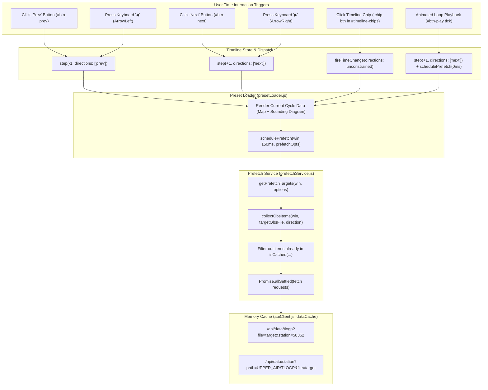
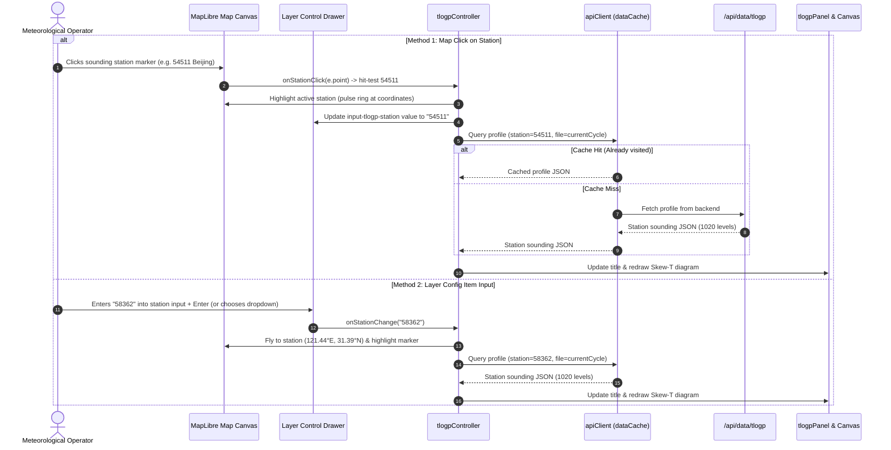

# Upper-Air T-lnP (Skew-T log-P) Sounding Diagram — Implementation Plan 1

## 1. Goal and Overview

This plan defines the end-to-end architecture and implementation steps to add **Upper-Air T-lnP (Skew-T log-P) sounding diagrams** to MICAPS-Web.

### Key Capabilities
1. **Cassandra Data Integration**: Directly query and stream high-resolution vertical sounding profiles from Cassandra table `micapsdataserver."UPPER_AIR"` under partition `TLOGP` (verified against live cluster `bore.pub:59042`).
2. **Dedicated Preset Group (`TlogP Observation`)**:
   - Because `"Upper-Air Observations"` already contains multiple dense isobaric layers (500 hPa station plots, derived HGT, TMP, DTD, VOR, DIV contours), T-lnP sounding is placed in its own dedicated top-level category: **`TlogP Observation`**.
   - Defines preset group `composite-tlogp` (`id: "composite-tlogp"`, `category: "TlogP Observation"`), which loads the national sounding station network on the map and opens the interactive T-lnP sounding diagram, defaulting to station **`58362` (Shanghai / Baoshan)**.
3. **Dual Station Switching Interaction**:
   - **Interaction A (Map Click)**: The operator clicks on any sounding station marker on the map (e.g. 54511 Beijing, 59287 Guangzhou, 57516 Chongqing). The system hit-tests the station, highlights it with an active ring, and immediately updates the T-lnP diagram to that station.
   - **Interaction B (Layer Config Item Input)**: The operator expands the `⚙` config drawer of the T-lnP layer in the Layer Control panel, types a 5-digit station ID (e.g. `58362`) and presses Enter / clicks Apply (or selects from a quick dropdown of primary sounding stations). The system validates the station, updates the diagram, and centers/highlights the station on the map.
4. **Multi-Level Convective Parcel Ascent (Surface, 925, 850, 700 hPa & Custom)**:
   - In operational meteorology, convection is frequently elevated (e.g., nighttime low-level jet advection, frontal overrunning, nocturnal thunderstorms). Convective parcel ascent must **not** be restricted to surface-based parcels.
   - The engine supports lifting parcels from **Surface**, **925 hPa**, **850 hPa**, **700 hPa**, or an arbitrary custom level selected interactively on the diagram.
   - Dynamic recomputation of elevated LCL, LFC, EL, CAPE, and CIN for the selected parcel starting level.
5. **Timeline UI Integration (Similar to `UPPER_AIR/PLOT`)**:
   - Observation timeline synchronization with `UPPER_AIR/TLOGP` file history.
   - Step-length selector configured for upper-air sounding cycles: **12h** (default 00Z / 12Z synoptic soundings), **24h** (daily cycle comparison), and **6h** (intensive sounding runs).
   - Chronological timeline chips with active state, keyboard stepping (`◀/▶`), and animated loop playback (`▶/⏸`).
   - Time-step evolution: advancing time steps synchronizes both the map station observations and the vertical sounding profile diagram for the active station.
6. **Prefetch Engine Fully Consistent with `UPPER_AIR/PLOT` (`prefetchService.js`)**:
   - Matches the exact prefetch lifecycle of the existing `upper_air/plot` observation pipeline.
   - Automatically schedules debounced background prefetching whenever the user triggers a time change:
     - Clicking the **`prev`** (`#btn-prev`) or **`next`** (`#btn-next`) buttons.
     - Pressing keyboard **`◀`** (`ArrowLeft`) or **`▶`** (`ArrowRight`).
     - Clicking any **Timeline Chip** (`.chip-btn` in `#timeline-chips`).
     - Ticking forward in animated **Loop Playback** (`#btn-play`).
   - For directional steps (`prev`, `next`, `◀`, `▶`), pre-loads the adjacent cycle along the movement vector; for timeline chip selections, pre-loads both preceding and succeeding cycles around the selected time step.
   - Concurrently pre-caches both the national sounding station network and the active station's profile (`58362`) into `dataCache`, delivering instant, zero-latency rendering.
7. **Professional Thermodynamic Sounding Engine**: Canvas 2D skewed thermodynamic diagram plotting temperature profile ($T$), dew point profile ($T_d$), vertical wind barbs, background reference curves (isobars, isotherms, dry adiabats, saturated pseudoadiabats, saturation mixing ratio isopleths), parcel ascent trajectory, CAPE/CIN buoyant areas, and convective instability indices (CAPE, CIN, LCL, LFC, EL, K-Index, Total Totals, Showalter Index, Precipitable Water).

---

## 2. Cassandra Research Findings (`bore.pub:59042`)

Using a direct CQL binary protocol client to inspect the live Cassandra host at `bore.pub:59042`, the exact storage architecture and data formats were verified:

### 2.1 Cassandra Storage Schema
- **Keyspace**: `micapsdataserver`
- **Data Table**: `micapsdataserver."UPPER_AIR"`
- **Partition Key (`dataPath`)**: `'TLOGP'`
- **Clustering Key (`column1`)**: Observation timestamp string, e.g. `'20260320200000.000'`, `'20260917140000.000'`
- **Value Column (`value`)**: GZIP-compressed binary blob containing standard MICAPS Diamond 5 ASCII text.
- **Directory & Catalog Index**:
  - `SELECT column1, value FROM micapsdataserver.treeview WHERE "dataPath" = 'UPPER_AIR/TLOGP'`
  - Each entry represents an available observation cycle and its compressed file byte size (e.g. `20260320200000.000`, size `488,063` bytes).
- **Latest Observation Timestamp**:
  - `SELECT column1, value FROM micapsdataserver.latestdatatime WHERE "dataPath" = 'UPPER_AIR/TLOGP'`
  - Returns the latest available sounding run (e.g. `20260917140000.000`).

### 2.2 Data Cadence and Observation Runs
- **Primary Synoptic Sounding Hours**:
  - **00 UTC (08:00 BJT)** and **12 UTC (20:00 BJT)**: The full operational radiosonde network releases. Files contain **500–550 stations** across China and GTS international stations. Uncompressed file size: **~1.8 MB – 2.1 MB** (~40,000 to 45,000 lines of text).
- **Intermediate / Intensive Sounding Hours**:
  - **06 UTC (14:00 BJT)** and **18 UTC (02:00 BJT)**: Supplementary sounding runs containing 15–40 specific stations.

### 2.3 Verified Verification of Station `58362` (Shanghai / Baoshan)
- Station `58362` is confirmed present in all 08:00 and 20:00 BJT observation runs:
  - **Header line**: `58362 121.44 31.39 5.5 1020`
  - **Station ID**: `58362`
  - **Longitude**: `121.44° E`
  - **Latitude**: `31.39° N`
  - **Station Elevation**: `5.5 m`
  - **Vertical Levels**: `1020` levels (high vertical resolution sounding profile from surface up to 10 hPa).

### 2.4 MICAPS Diamond 5 File Format Structure
```text
diamond 5 202603202000_TLOGP
<year> <month> <day> <hour> <station_count>
<station_id> <lon> <lat> <elevation> <num_levels>
   <pressure>   <height>   <temperature>   <dewpoint>   <wind_dir>   <wind_speed>
   ... (repeated for num_levels)
<next_station_id> <lon> <lat> <elevation> <num_levels>
   ...
```

#### Record Column Definition
| Column | Parameter | Unit | Example Value | Description |
|---|---|---|---|---|
| Col 1 | Pressure ($p$) | hPa | `1022.5`, `1000.0`, `850.0` | Vertical isobaric level |
| Col 2 | Height ($H$) | dagpm | `0.7` (7m), `153.6` (1536m) | Geopotential height in decameters |
| Col 3 | Temperature ($T$) | °C | `10.2`, `0.92`, `-45.3` | In-situ air temperature |
| Col 4 | Dew Point ($T_d$) | °C | `1.53`, `-4.84`, `-55.1` | Dew point temperature ($T_d \le T$) |
| Col 5 | Wind Direction ($dd$) | degrees | `122`, `4`, `292` | Wind direction ($0^\circ - 360^\circ$) |
| Col 6 | Wind Speed ($ff$) | m/s | `3.0`, `5.2`, `10.8` | Wind speed in meters per second |

*Missing Value Indicator*: Values $\ge 9999.0$ indicate missing or unmeasured data points.

---

## 3. Architecture & Data Flow

```mermaid
flowchart TD
    subgraph CassandraCluster["Cassandra (bore.pub:59042)"]
        C1["micapsdataserver.UPPER_AIR\n(dataPath='TLOGP')"]
        C2["micapsdataserver.treeview\n(dataPath='UPPER_AIR/TLOGP')"]
        C3["micapsdataserver.latestdatatime\n(dataPath='UPPER_AIR/TLOGP')"]
    end

    subgraph Backend["Go Server (micaps-web/server)"]
        D5["parser/diamond5_parser.go\n(Decompress + Parse Diamond 5)"]
        TH["handler/tlogp_handler.go\n(/api/data/tlogp)"]
        MC["mock/mock_generator.go\n(Offline Fallback Generator)"]
    end

    subgraph FrontendState["Frontend Store & Presets (client/src)"]
        PConfig["config.json\n(Category: 'TlogP Observation'\nid: 'composite-tlogp')"]
        PLoader["services/presetLoader.js\n(loadPresetGroup)"]
        TStore["layers/tlogp/tlogpController.js\n(Active Station & Parcel Level State)"]
        TLine["utils/timelineSync.js & timeSlider.js\n(Obs Timeline Mode: 12h/24h/6h)"]
        PFetch["services/prefetchService.js\n(Time-Directional Prefetch Engine)"]
        Cache["api/apiClient.js\n(In-Memory TTL Data Cache)"]
    end

    subgraph FrontendUI["Frontend Interactive Views"]
        Map["MapLibre GL Map\n(Sounding Station Markers)"]
        LC["Layer Control Panel\n(Station ID & Parcel Level Controls)"]
        TSlider["Time Slider Footer\n(Step: 12h/24h/6h, Chips, Loop Play)"]
        TPanel["layers/tlogp/tlogpPanel.js\n(Dockable Sounding Window\nParcel Level Toolbar: SFC/925/850/700)"]
        TCanvas["layers/tlogp/tlogpCanvas.js\n(Skew-T Diagram + Elevated Parcel CAPE/CIN)"]
    end

    C1 -->|Gzip Blob| D5
    C2 --> TH
    C3 --> TH
    C2 --> TLine
    C3 --> TLine
    D5 --> TH
    MC -.->|Mock Mode| TH

    TH -->|GeoJSON Stations| Cache
    TH -->|Station Sounding JSON| Cache
    Cache --> Map
    Cache --> TStore

    PConfig --> PLoader
    PLoader --> TStore
    PLoader --> TLine
    PLoader --> PFetch

    PFetch -->|Prefetch Prev/Next Cycle Soundings| Cache

    TLine --> TSlider
    TSlider -->|Chip Click / Loop Play Tick| PLoader

    Map -->|Click Station Marker| TStore
    LC -->|Input Station ID / Apply| TStore
    LC -->|Select Parcel Level (SFC/925/850/700)| TStore
    TPanel -->|Toolbar Parcel Level Button| TStore

    TStore -->|Profile Data & Station ID| TPanel
    TStore -->|Highlight Selected Station| Map
    TStore -->|Sync Station Input & Level| LC
    TPanel --> TCanvas
```

---

## 4. Backend Implementation Plan (Go)

### 4.1 Diamond 5 Parser (`server/parser/diamond5_parser.go`)
Create a high-speed, zero-allocation ASCII text scanner for Diamond 5:
- **Header Parsing**: Extracts observation timestamp (`year, month, day, hour`) and station count.
- **Station Indexing**: Scans station blocks `<station_id> <lon> <lat> <elevation> <num_levels>`.
- **Level Decoding**:
  - Converts decameters to geopotential meters: $H_{\text{gpm}} = H_{\text{dagpm}} \times 10$.
  - Filters sentinel missing values ($9999$).
  - Sanitizes thermodynamic constraints ($T_d \le T$).
- **Dual Output Modes**:
  1. `ExtractStationsGeoJSON(data []byte) (*model.GeoJSONFeatureCollection, error)`:
     Generates lightweight GeoJSON Point features for all ~500 stations with station attributes (`station_id`, `lon`, `lat`, `elevation`, `surface_temp`, `surface_dewpoint`, `surface_wind_speed`, `surface_wind_dir`, `num_levels`). Used by the map to plot the sounding stations.
  2. `ExtractStationProfile(data []byte, stationID string) (*StationSounding, error)`:
     Performs targeted extraction of the vertical profile for a single requested station (e.g. `58362`) directly from the decompressed buffer without allocating structures for all 500 stations.

```go
type SoundingLevel struct {
    Pressure    float64 `json:"pressure"`  // hPa
    Height      float64 `json:"height"`    // meters (gpm)
    Temp        float64 `json:"temp"`      // °C
    DewPoint    float64 `json:"dewPoint"`  // °C
    WindDir     float64 `json:"windDir"`   // degrees
    WindSpeed   float64 `json:"windSpeed"` // m/s
}

type StationSounding struct {
    StationID   string          `json:"stationId"`
    StationName string          `json:"stationName"`
    Lon         float64         `json:"lon"`
    Lat         float64         `json:"lat"`
    Elevation   float64         `json:"elevation"`
    ObsTime     string          `json:"obsTime"`
    NumLevels   int             `json:"numLevels"`
    Levels      []SoundingLevel `json:"levels"`
}
```

### 4.2 T-lnP HTTP Handler (`server/handler/tlogp_handler.go`)
Provide endpoint `/api/data/tlogp`:
- **Query Parameters**:
  - `file`: cycle timestamp string (e.g. `20260320200000.000` or `latest`).
  - `station`: station ID string (e.g. `58362`).
- **Behavior**:
  - If `station` is omitted: calls `ExtractStationsGeoJSON` and returns GeoJSON FeatureCollection of all stations for map rendering.
  - If `station` is specified (e.g. `station=58362`): calls `ExtractStationProfile` and returns JSON payload of the vertical sounding profile.
  - If file is missing or `file=latest`, automatically resolves latest cycle from `micapsdataserver.latestdatatime`.
- **Cycle Blob Cache**:
  - Maintain an in-memory single-cycle decompressed cache with TTL (5 minutes) so that switching between stations within the same observation cycle does not repeatedly decompress the ~2MB blob from Cassandra.
- **Route Registration**:
  - In `server/cmd/main.go`:
    ```go
    tlogpH := &handler.TLogPHandler{Client: cqlClient, MockMode: cfg.MockMode}
    mux.HandleFunc("/api/data/tlogp", tlogpH.Handler)
    ```

### 4.3 Mock Generator Extension (`server/mock/mock_generator.go`)
- Extend `mock_generator.go` with `GenerateMockTLogPProfile(stationID string, file string) *StationSounding`.
- Provides realistic standard sounding profiles for station `58362` and regional stations (standard atmosphere with typical boundary layer inversion, tropopause at ~200 hPa, and realistic wind shear) when `-mock` is active.

---

## 5. Frontend Thermodynamic Sounding Engine

Create a modular thermodynamic subsystem under `client/src/layers/tlogp/`:

```
client/src/layers/tlogp/
├── tlogpMath.js          # Skew-T transforms & multi-level parcel calculations
├── tlogpCanvas.js        # High-DPI Canvas 2D skewed diagram & curve rendering
├── tlogpPanel.js         # Dockable sounding subwindow UI & parcel level toolbar
├── tlogpController.js    # Sounding state, station switching & parcel level state
└── tlogpLayer.js         # Layer Control integration & map marker highlight
```

### 5.1 Skew-T Mathematical Calculations (`tlogpMath.js`)
1. **Vertical Pressure Coordinate**:
   Logarithmic pressure coordinate from $p_{\text{bottom}} = 1050\text{ hPa}$ to $p_{\text{top}} = 100\text{ hPa}$:
   $$y(p) = H \cdot \frac{\ln(p_{\text{bottom}}) - \ln(p)}{\ln(p_{\text{bottom}}) - \ln(p_{\text{top}})}$$
2. **Skewed Horizontal Temperature Coordinate**:
   Linear temperature coordinate skewed by $45^\circ$ (or configurable skew factor $S \approx 0.8$):
   $$x(T, p) = x_0(T) + S \cdot (y_{\text{bottom}} - y(p))$$
3. **Reference Atmospheric Curves**:
   - **Isobars**: Horizontal grid lines at standard levels: 1000, 925, 850, 700, 500, 400, 300, 250, 200, 150, 100 hPa.
   - **Isotherms**: Skewed lines at $10^\circ\text{C}$ intervals from $-80^\circ\text{C}$ to $+40^\circ\text{C}$ ($0^\circ\text{C}$ isotherm highlighted in blue/cyan).
   - **Dry Adiabats ($\theta$)**:
     $$T = \theta \left(\frac{p}{1000}\right)^{R_d / c_p}, \quad \frac{R_d}{c_p} \approx 0.286$$
   - **Moist Pseudoadiabats ($\theta_w$)**: Numerical integration of saturated adiabatic lapse rate $\Gamma_m$:
     $$\frac{dT}{dp} = \frac{R_d T + L_v w_s}{p \left(c_{pd} + \frac{L_v^2 w_s \epsilon}{R_d T^2}\right)}$$
   - **Saturation Mixing Ratio Lines ($w_s$)**:
     $$w_s = 622 \cdot \frac{e_s(T)}{p - e_s(T)} \quad (\text{g/kg})$$

### 5.2 Multi-Level Convective Parcel Ascent (Surface, 925, 850, 700 hPa & Custom)
In addition to surface-based parcels (SBCAPE), meteorologists require elevated parcel analysis for nighttime convection, warm-air advection aloft, and frontal inversions.

#### 1. Initial Parcel State $(p_{\text{init}}, T_{\text{init}}, T_{d,\text{init}})$
- The ascent starting pressure $p_{\text{init}}$ can be:
  - `surface` (lowest valid observation level, e.g. 1022.5 hPa)
  - `925` (925 hPa isobaric layer)
  - `850` (850 hPa isobaric layer)
  - `700` (700 hPa isobaric layer)
  - `custom` (arbitrary pressure level $p_{\text{custom}}$ clicked by the operator on the diagram)
- Look up or interpolate $T(p_{\text{init}})$ and $T_d(p_{\text{init}})$ from the station's vertical sounding profile.
- Conserved dry potential temperature:
  $$\theta_{\text{init}} = T_{\text{init}} \left(\frac{1000}{p_{\text{init}}}\right)^{R_d / c_p}$$
- Initial vapor pressure and mixing ratio:
  $$e_{\text{init}} = e_s(T_{d,\text{init}}) = 6.112 \exp\left(\frac{17.67 T_{d,\text{init}}}{T_{d,\text{init}} + 243.5}\right)$$
  $$w_{\text{init}} = 622 \cdot \frac{e_{\text{init}}}{p_{\text{init}} - e_{\text{init}}} \quad (\text{g/kg})$$

#### 2. Elevated Lifting Condensation Level ($p_{\text{LCL}}$)
- Ascend dry-adiabatically upward from $p_{\text{init}}$ along $\theta = \theta_{\text{init}}$ and $w = w_{\text{init}}$:
  $$T_{\text{LCL}} = \frac{1}{\frac{1}{T_{d,\text{init}} - 56} + \frac{\ln(T_{\text{init}} / T_{d,\text{init}})}{800}} + 56 \quad (\text{K})$$
  $$p_{\text{LCL}} = p_{\text{init}} \left(\frac{T_{\text{LCL}}}{T_{\text{init}}}\right)^{c_p / R_d}$$
- Ensure physical constraint $p_{\text{LCL}} \le p_{\text{init}}$. If $T_{d,\text{init}} \ge T_{\text{init}}$, $p_{\text{LCL}} = p_{\text{init}}$.

#### 3. Moist Pseudoadiabatic Ascent above LCL
- For all levels $p < p_{\text{LCL}}$, the parcel ascends along the moist pseudoadiabat passing through $(T_{\text{LCL}}, p_{\text{LCL}})$.
- Compute $T_{\text{parcel}}(p)$ up to $100\text{ hPa}$.

#### 4. Elevated LFC, EL, CAPE, and CIN
- **Elevated LFC ($p_{\text{LFC}}$)**: First isobaric level above $p_{\text{LCL}}$ where parcel virtual temperature exceeds environmental virtual temperature: $T_{v,\text{parcel}} > T_{v,\text{env}}$.
- **Elevated EL ($p_{\text{EL}}$)**: Isobaric level above $p_{\text{LFC}}$ where parcel virtual temperature drops below environmental: $T_{v,\text{parcel}} \le T_{v,\text{env}}$.
- **Elevated CAPE**:
  $$\text{CAPE}(p_{\text{init}}) = \int_{p_{\text{EL}}}^{p_{\text{LFC}}} R_d \left(T_{v,\text{parcel}} - T_{v,\text{env}}\right) d\ln p \quad (\text{J/kg})$$
- **Elevated CIN**:
  $$\text{CIN}(p_{\text{init}}) = \int_{p_{\text{LFC}}}^{p_{\text{init}}} R_d \max\left(0, T_{v,\text{env}} - T_{v,\text{parcel}}\right) d\ln p \quad (\text{J/kg})$$

#### 5. Meteorological Instability Indices
- **K-Index**: $(T_{850} - T_{500}) + T_{d850} - (T_{700} - T_{d700})$
- **Total Totals ($TT$)**: $(T_{850} + T_{d850}) - 2 T_{500}$
- **Showalter Index ($SI$)**: $T_{500} - T_{\text{parcel, 850}\to 500}$
- **Precipitable Water ($PW$)**: $\frac{1}{g} \sum w \, \Delta p$ (mm)

### 5.3 Canvas 2D Diagram Renderer (`tlogpCanvas.js`)
- Offscreen/onscreen canvas with full `devicePixelRatio` scaling.
- **Layers**:
  1. *Background Grid*: Isobars, skewed isotherms, dry adiabats, moist adiabats, mixing ratio lines.
  2. *Elevated Buoyancy Shading*: Shaded positive area (CAPE) in translucent red-orange (`rgba(248, 81, 73, 0.25)`) and negative area (CIN) in translucent cyan-blue (`rgba(88, 166, 255, 0.25)`), anchored at the active parcel level $p_{\text{init}}$.
  3. *Temperature Curve*: Solid red (`#f85149`, 2.5px) with data point markers.
  4. *Dewpoint Curve*: Solid cyan/blue (`#39c5bb`, 2.5px).
  5. *Parcel Ascent Trajectory*: Dashed gold (`#e3b341`, 2.0px) starting exactly at $(T(p_{\text{init}}), p_{\text{init}})$.
  6. *Parcel Origin Marker*: A highlighted interactive ring/handle on the temperature curve at $p_{\text{init}}$ showing the starting pressure and temperature.
  7. *Wind Barbs Column*: Rendered along the right margin at corresponding pressure levels using CMA/WMO standard barbs (`stationSymbols.js:drawWindBarbCanvas`).
  8. *Interactive Crosshair*: Real-time cursor readout of $(p, H, T, T_d, \theta, \theta_e, \text{wind})$ on hover.

### 5.4 Sounding Subwindow Panel (`tlogpPanel.js`)
- Dockable and floating meteorological panel positioned over or alongside the map.
- **Header**:
  - Station ID badge: `58362`
  - Station Name: `Shanghai / Baoshan (上海/宝山)`
  - Metadata: `Lat: 31.39°N, Lon: 121.44°E, Alt: 5.5m`
  - Observation Time: `2026-03-20 20:00 BJT (12:00 UTC)`
  - Window controls: Minimize/Expand, Float/Dock, Export PNG, Close.
- **Parcel Level Selector Toolbar**:
  - Interactive segmented buttons: `[Surface]` | `[925 hPa]` | `[850 hPa]` | `[700 hPa]` | `[Custom ▼]`
  - Real-time indicator: e.g. `"Parcel: 850 hPa (T=0.9°C, Td=-4.8°C) → CAPE: 420 J/kg, CIN: 18 J/kg"`.
- **Footer / Sidebar**:
  - Summary cards for calculated indices: `CAPE`, `CIN`, `LCL`, `LFC`, `EL`, `K`, `TT`, `PW`.

---

## 6. Preset Group & Layer Control Integration

### 6.1 Dedicated Preset Group in `client/config.json`
To avoid cluttering `"Upper-Air Observations"` (which already manages 500 hPa station plots and derived HGT/TMP/DTD/VOR/DIV contours), T-lnP sounding is placed in its own dedicated category: **`"TlogP Observation"`**.

```json
{
  "id": "composite-tlogp",
  "name": "T-lnP Sounding Analysis (TlogP)",
  "category": "TlogP Observation",
  "isObservation": true,
  "hasLevel": false,
  "defaultLevel": null,
  "layers": [
    {
      "id": "upperair-tlogp-stations",
      "name": "Sounding Station Network",
      "type": "station",
      "model": "UPPER_AIR",
      "element": "TLOGP",
      "path": "UPPER_AIR/TLOGP",
      "removable": false,
      "render": {
        "showTemp": true,
        "showDewpoint": true,
        "showWind": true,
        "showPressure": true
      }
    },
    {
      "id": "upperair-tlogp-diagram",
      "name": "T-lnP Sounding Diagram (58362 Shanghai)",
      "type": "tlogp",
      "model": "UPPER_AIR",
      "element": "TLOGP",
      "stationId": "58362",
      "defaultStation": "58362",
      "parcelLevel": "surface",
      "visible": true,
      "removable": true,
      "config": {
        "stationId": "58362",
        "parcelLevel": "surface",
        "showTemp": true,
        "showDewpoint": true,
        "showWind": true,
        "showParcel": true,
        "showDryAdiabats": true,
        "showMoistAdiabats": true,
        "showMixingRatio": true,
        "showIndices": true
      }
    }
  ]
}
```

### 6.2 Layer Defaults (`client/src/ui/layers/layerDefaults.js`)
Extend `buildBaseConfig` to support `type === "tlogp"`:
```javascript
if (layerDef.type === "tlogp") {
  return {
    stationId: layerDef.config?.stationId || layerDef.stationId || "58362",
    parcelLevel: layerDef.config?.parcelLevel || "surface",
    showTemp: layerDef.config?.showTemp !== false,
    showDewpoint: layerDef.config?.showDewpoint !== false,
    showWind: layerDef.config?.showWind !== false,
    showParcel: layerDef.config?.showParcel !== false,
    showDryAdiabats: layerDef.config?.showDryAdiabats !== false,
    showMoistAdiabats: layerDef.config?.showMoistAdiabats !== false,
    showMixingRatio: layerDef.config?.showMixingRatio !== false,
    showIndices: layerDef.config?.showIndices !== false,
    ...(layerDef.config || {}),
  };
}
```

### 6.3 Layer Row HTML Template (`client/src/ui/layers/layerRowView.js`)
When `layer.type === "tlogp"`, render the station selector and multi-level parcel controls:

```html
<div class="layer-config ${layer.isExpanded ? '' : 'hidden'}" data-layer-id="${layer.id}">
  <!-- 1. Station ID Selection Row -->
  <div class="config-row" style="flex-direction: column; align-items: flex-start; gap: 6px; width: 100%;">
    <label style="color: var(--text-secondary, #8b949e); font-size: 11px; font-weight: 600;">
      📍 Station Selection:
    </label>
    <div style="display: flex; gap: 6px; width: 100%; align-items: center;">
      <input type="text" class="input-tlogp-station" 
             value="${layer.config?.stationId || '58362'}" 
             placeholder="Station ID (e.g. 58362)" 
             title="Enter 5-digit station ID and press Enter"
             style="width: 80px; height: 24px; background: #161b22; border: 1px solid #30363d; color: #58a6ff; font-weight: 600; border-radius: 4px; text-align: center; font-size: 12px;" />
      <button class="btn-tlogp-apply" style="height: 24px; padding: 0 10px; font-size: 11px; background: #238636; color: #fff; border: 1px solid #2ea043; border-radius: 4px; cursor: pointer;">
        Apply
      </button>
      <select class="sel-tlogp-quick-station" style="flex: 1; height: 24px; background: #161b22; border: 1px solid #30363d; color: #c9d1d9; border-radius: 4px; font-size: 11px; padding: 0 4px;">
        <option value="">— Major Stations —</option>
        <option value="58362" ${layer.config?.stationId === '58362' ? 'selected' : ''}>58362 上海 (Shanghai)</option>
        <option value="54511" ${layer.config?.stationId === '54511' ? 'selected' : ''}>54511 北京 (Beijing)</option>
        <option value="59287" ${layer.config?.stationId === '59287' ? 'selected' : ''}>59287 广州 (Guangzhou)</option>
        <option value="57516" ${layer.config?.stationId === '57516' ? 'selected' : ''}>57516 重庆 (Chongqing)</option>
        <option value="57494" ${layer.config?.stationId === '57494' ? 'selected' : ''}>57494 武汉 (Wuhan)</option>
        <option value="51463" ${layer.config?.stationId === '51463' ? 'selected' : ''}>51463 乌鲁木齐 (Urumqi)</option>
        <option value="56778" ${layer.config?.stationId === '56778' ? 'selected' : ''}>56778 昆明 (Kunming)</option>
        <option value="50953" ${layer.config?.stationId === '50953' ? 'selected' : ''}>50953 哈尔滨 (Harbin)</option>
      </select>
    </div>
    <div class="tlogp-station-meta-badge" style="font-size: 11px; color: #8b949e; margin-top: 2px;">
      Active: <span style="color: #e3b341; font-weight: 600;">${layer.config?.stationName || '58362 上海/宝山'}</span>
    </div>
  </div>

  <!-- 2. Parcel Ascent Starting Layer Row (Surface, 925, 850, 700 hPa) -->
  <div class="config-row" style="flex-direction: column; align-items: flex-start; gap: 4px; width: 100%; margin-top: 6px; padding-top: 6px; border-top: 1px solid #30363d;">
    <label style="color: var(--text-secondary, #8b949e); font-size: 11px; font-weight: 600;">
      🔺 Parcel Ascent Starting Level:
    </label>
    <div style="display: flex; gap: 6px; width: 100%; align-items: center;">
      <select class="sel-tlogp-parcel-level" style="flex: 1; height: 24px; background: #161b22; border: 1px solid #30363d; color: #e3b341; font-weight: 600; border-radius: 4px; font-size: 11px; padding: 0 6px;">
        <option value="surface" ${(layer.config?.parcelLevel || 'surface') === 'surface' ? 'selected' : ''}>Surface (Surface-Based Parcel)</option>
        <option value="925" ${layer.config?.parcelLevel === '925' ? 'selected' : ''}>925 hPa (Low-Level Inversion / Boundary)</option>
        <option value="850" ${layer.config?.parcelLevel === '850' ? 'selected' : ''}>850 hPa (Low-Level Jet / Elevated Convection)</option>
        <option value="700" ${layer.config?.parcelLevel === '700' ? 'selected' : ''}>700 hPa (Mid-Level Inflow / Overrunning)</option>
        <option value="custom" ${layer.config?.parcelLevel === 'custom' ? 'selected' : ''}>Custom Level (Click Diagram to Set)</option>
      </select>
    </div>
  </div>

  <!-- 3. Curve Display Toggles -->
  <div class="config-grid-2col" style="margin-top: 6px; padding-top: 6px; border-top: 1px solid #30363d;">
    <label class="config-checkbox-item">
      <input type="checkbox" class="chk-tlogp-temp" ${layer.config?.showTemp !== false ? 'checked' : ''} />
      <span style="color: #f85149;">Temperature (T)</span>
    </label>
    <label class="config-checkbox-item">
      <input type="checkbox" class="chk-tlogp-dewpoint" ${layer.config?.showDewpoint !== false ? 'checked' : ''} />
      <span style="color: #39c5bb;">Dew Point (Td)</span>
    </label>
    <label class="config-checkbox-item">
      <input type="checkbox" class="chk-tlogp-wind" ${layer.config?.showWind !== false ? 'checked' : ''} />
      <span>Wind Barbs</span>
    </label>
    <label class="config-checkbox-item">
      <input type="checkbox" class="chk-tlogp-parcel" ${layer.config?.showParcel !== false ? 'checked' : ''} />
      <span style="color: #e3b341;">Parcel & CAPE</span>
    </label>
  </div>
</div>
```

### 6.4 Event Bindings (`client/src/ui/layers/layerRowBindings.js`)
- Bind station input, Enter keyup, dropdown change, and curve checkboxes.
- Bind `sel-tlogp-parcel-level` change:
  - Updates `layer.config.parcelLevel = e.target.value`.
  - Notifies `tlogpController.setParcelLevel(win, e.target.value)`.
  - Re-renders parcel curve, LCL, LFC, EL, and CAPE/CIN areas starting from the selected isobaric level.
  - Auto-saves layer configuration via `autoSaveLayerConfig()`.

---

## 7. Timeline UI Integration (`UPPER_AIR/TLOGP`)

The timeline interface for T-lnP observation operates seamlessly through the existing observation timeline infrastructure ([`timelineSync.js`](file:///root/downloads/micaps-web/client/src/utils/timelineSync.js), [`timeSliderView.js`](file:///root/downloads/micaps-web/client/src/ui/timeline/timeSliderView.js), [`timelineMath.js`](file:///root/downloads/micaps-web/client/src/ui/timeline/timelineMath.js), [`playbackController.js`](file:///root/downloads/micaps-web/client/src/ui/timeline/playbackController.js)), mirroring the behavior of `UPPER_AIR/PLOT`:

```
┌───────────────────────────────────────────────────────────────────────────────────────────────────────────────────────────────────────────────────────┐
│ ◀ Prev  ▶ Next   [ ▶ Play ]  [ 12h ▼ ]   [ 03/20 20:00 ]  [ 03/21 08:00 ]  [ 03/21 20:00 (Active) ]  [ 03/22 08:00 ] ...   [ 1x ▼ ]  [ 🔁 Loop ]     │
│ Observation: 2026-03-21 20:00:00 BJT (12:00 UTC)                                                                     Dataset: UPPER_AIR/TLOGP         │
└───────────────────────────────────────────────────────────────────────────────────────────────────────────────────────────────────────────────────────┘
```

### 7.1 Observation Timeline Initialization & Path Routing
- When `composite-tlogp` loads, [`syncObservationTimeline`](file:///root/downloads/micaps-web/client/src/utils/timelineSync.js#L162) is invoked with path `UPPER_AIR/TLOGP`.
- Recognizes `path.includes("UPPER_AIR")` or preset group category `"TlogP Observation"`, automatically engaging `isUpper = true` mode:
  ```javascript
  const isUpper = path.includes("UPPER_AIR") || path.includes("TLOGP") || winTitle.toLowerCase().includes("tlogp");
  const stepLength = (win && win.stepLength) ? win.stepLength : (isUpper ? 12 : 3);
  ```
- Queries `micapsdataserver.treeview WHERE "dataPath" = 'UPPER_AIR/TLOGP'` (up to 100 recent files) and locks to the latest available synoptic sounding run (e.g. `20260917140000.000` / `20260321200000.000`).

### 7.2 Step-Length Selector (`#select-step-length`)
In upper-air sounding observation, radiosondes are released primarily at synoptic times (00 UTC / 08:00 BJT and 12 UTC / 20:00 BJT). The step-length dropdown [`updateStepLengthOptions(isUpper, currentStep)`](file:///root/downloads/micaps-web/client/src/ui/timeline/timeSliderView.js#L30-L69) provides upper-air tailored intervals:
- **`12h` (Default & Recommended)**: Standard operational synoptic radiosonde cadence (00Z & 12Z). Filters observation files strictly to `08:00` and `20:00` BJT runs, filtering out off-synoptic intermediate runs.
- **`24h`**: Daily comparison step. Selects the same synoptic hour across consecutive calendar days (e.g. comparing consecutive 20:00 BJT evening soundings to analyze day-to-day air mass modifications).
- **`6h`**: Mesoscale / intensive sounding cadence. Includes all releases (02:00, 08:00, 14:00, 20:00 BJT) during severe weather or typhoon field observation campaigns.

### 7.3 Timeline Chips (`#timeline-chips`)
- File filtering via [`filterObsFilesByStep(rawFiles, stepLength, isUpper)`](file:///root/downloads/micaps-web/client/src/ui/timeline/timelineMath.js#L71-L125) formats valid runs into chronological chips.
- Chip windowing via [`selectObsChipsWindow(files, targetFile)`](file:///root/downloads/micaps-web/client/src/ui/timeline/timelineMath.js#L34-L47) maintains a readable sliding window of 10 chips centered on the active file.
- Labels formatted cleanly as `MM/DD HH:mm` (e.g. `03/20 20:00`, `03/21 08:00`, `03/21 20:00`).
- Clicking any chip emits `fireTimeChange({ isObs: true, file, _seq })`, updating the active cycle and triggering bidirectional prefetch (both preceding and succeeding adjacent cycles) around the selected timestamp.

### 7.4 Coordinated Time-Step Dispatch (`loadPresetGroup` with `isTimeStep = true`)
When the time step changes (via chip click, keyboard arrow, or loop playback tick):
1. The active window's `win.obsTime` updates to the new timestamp.
2. `loadPresetGroup(map, group, period, level, win, true, expectedSeq)` executes in `isTimeStep = true` mode:
   - **Station Map Layer**: Queries `/api/data/tlogp?file=<newFile>` (or `/api/data/station?path=UPPER_AIR/TLOGP&file=<newFile>`) and updates all map station markers with surface/sounding observations for the new time step.
   - **T-lnP Diagram Layer**: Re-queries `/api/data/tlogp?file=<newFile>&station=<activeStationId>` (e.g. `58362`) and redraws the Skew-T diagram, parcel trajectory, and stability indices for that observation timestamp.
   - The selected station highlight on the map remains locked onto the active station.
3. Upon load completion, `presetLoader.js` triggers `schedulePrefetch(win, 150, prefetchOpts)` with the appropriate directional constraints, identical to `upper_air/plot`.

### 7.5 Loop Playback Controller (`playbackController.js`)
- **Controls**:
  - Play/Pause toggle (`btn-play-pause`) / `Space` bar.
  - Forward / Backward step buttons (`btn-step-fwd`, `btn-step-back`).
  - Speed selector: `1x` (1500 ms per step), `2x` (800 ms per step), `0.5x` (3000 ms per step).
  - Loop toggle: Wraps around from the newest observation back to the oldest in the chip window.
- **Meteorological Evolution Utility**:
  - Loop playback allows operational forecasters to watch thermodynamic sounding evolution over time:
    - Diurnal boundary layer heating and nocturnal inversion formation.
    - Low-level moisture advection (dew point curve shifting right below 850 hPa).
    - Frontal passage: temperature inversion sinking, wind barbs veering clockwise with height.
    - Convective destabilization: CAPE increasing and CIN shrinking leading up to severe convective initiation.
- **Race Condition Guard**: Each request tracks `win.loadSeq` to guarantee that out-of-order asynchronous responses during fast playback or rapid scrubbing are discarded without flickering.

---

## 8. Prefetch Engine Integration: Full Consistency with Existing `UPPER_AIR/PLOT` (`prefetchService.js`)

To guarantee immediate response without loading spinners or frame stutter when stepping through observation cycles, scrubbing timeline chips, or playing back time sequences, the T-lnP sounding pipeline strictly adheres to the established prefetch architecture used by `upper_air/plot` ([`prefetchService.js`](file:///root/downloads/micaps-web/client/src/services/prefetchService.js)).

### 8.1 The Existing `upper_air/plot` Prefetch Architecture

In the existing codebase, `upper_air/plot` (`composite-upperair-500` and individual upper-air station plots) coordinates with the timeline UI and prefetch engine across five distinct user interaction vectors:



### 8.2 Trigger-by-Trigger Prefetch Behavior & Consistency

The T-lnP observation preset (`composite-tlogp`) mirrors the exact trigger routing and directional constraint handling of `upper_air/plot`:

| Interaction Trigger | Source / Code Path | Direction Parameter | Target Cycle(s) Evaluated | Prefetched Data Payload |
|---|---|---|---|---|
| **Click `Prev` Button** | `#btn-prev` in `timeSliderView.js` → `step(-1, { directions: ["prev"] })` | `["prev"]` (normalized to `left`) | Next earlier synoptic cycle ($t - \Delta t$, e.g. $t - 12\text{h}$) | Active station sounding profile + national sounding station network |
| **Click `Next` Button** | `#btn-next` in `timeSliderView.js` → `step(1, { directions: ["next"] })` | `["next"]` (normalized to `right`) | Next forward synoptic cycle ($t + \Delta t$, e.g. $t + 12\text{h}$) | Active station sounding profile + national sounding station network |
| **Press Keyboard `◀`** | `keyboardShortcuts.js` (`ArrowLeft`) → `onPeriodStep(-1)` → `timeSliderStep(-1, { directions: ["prev"] })` | `["prev"]` (normalized to `left`) | Next earlier synoptic cycle ($t - 12\text{h}$) | Active station sounding profile + national sounding station network |
| **Press Keyboard `▶`** | `keyboardShortcuts.js` (`ArrowRight`) → `onPeriodStep(1)` → `timeSliderStep(1, { directions: ["next"] })` | `["next"]` (normalized to `right`) | Next forward synoptic cycle ($t + 12\text{h}$) | Active station sounding profile + national sounding station network |
| **Click Timeline Chip** | `.chip-btn` in `#timeline-chips` → `fireTimeChange({ isObs: true, file, _seq })` | `null` (unconstrained) | **Both** adjacent boundaries: earlier ($t - \Delta t$) AND later ($t + \Delta t$) | Both preceding and succeeding sounding profiles + station networks |
| **Animated Loop Playback** | `playbackController.js` periodic tick → `step(1, { source: "btn-play", directions: ["next"] })` | `["next"]` (normalized to `right`) | Upcoming synoptic cycle ($t + 12\text{h}$) with immediate 0ms debounce | Upcoming sounding profile + station network |

#### Detailed Mechanism:
1. **Directional Stepping (`prev` button, `next` button, keyboard `◀` / `▶`)**:
   - When moving backward, only the *preceding* observation file ($t - 12\text{h}$) is fetched. This prevents unnecessary forward network requests when the user is specifically browsing historical states.
   - When moving forward, only the *succeeding* observation file ($t + 12\text{h}$) is fetched, staying one step ahead of the forward trajectory.
2. **Timeline Chip Clicks (`.chip-btn`)**:
   - Clicking a chip represents a non-sequential jump to an arbitrary synoptic run.
   - Because user intent after a jump could be either stepping forward or stepping backward, `prefetchDirections` is unconstrained (`null`).
   - `getPrefetchTargets(win)` evaluates `shouldFetchLeft = true` and `shouldFetchRight = true`.
   - The engine pre-loads **both** the preceding run ($t - 12\text{h}$) and succeeding run ($t + 12\text{h}$) in parallel. Subsequent clicks on `◀` or `▶` from that chip are guaranteed to hit the cache instantly.
3. **Debounce Management (`schedulePrefetch`)**:
   - `schedulePrefetch(win, 150, prefetchOpts)` uses a 150ms debounce timer per window (`prefetchTimers.get(winKey)`).
   - If the user rapidly taps arrow keys or clicks chips multiple times in quick succession, intermediate prefetch timers are automatically cancelled via `cancelScheduledPrefetch(win)`. Prefetch only fires once the user rests on a cycle for $>150\text{ ms}$, saving server bandwidth and preventing Cassandra connection saturation.

### 8.3 Observation Item Collection in `collectObsItems`

In `client/src/services/prefetchService.js`, `collectObsItems` is extended to recognize `tlogp` layers within `win.activeGroup.layers` or standalone observation windows:

```javascript
// client/src/services/prefetchService.js: collectObsItems()
function collectObsItems(win, targetObsFile, direction, overrideLevel = null) {
  const items = [];
  const activeGroup = win.activeGroup;

  if (activeGroup && Array.isArray(activeGroup.layers) && activeGroup.layers.length > 0) {
    for (const layer of activeGroup.layers) {
      if (layer.type === "station") {
        const model = layer.model || win.model || "SURFACE";
        const element = layer.element || win.element || "PLOT";
        let lvl = overrideLevel !== null ? overrideLevel : (win.level || layer.level);

        const obsPath =
          model === "UPPER_AIR" && lvl
            ? `UPPER_AIR/${element}/${lvl}`
            : (layer.path || (model === "UPPER_AIR" ? `UPPER_AIR/${element}/${lvl || 500}` : `${model}/${element}`));

        items.push({ type: "station", path: obsPath, file: targetObsFile, direction, level: lvl });
      } else if (layer.type === "tlogp" || (layer.model === "UPPER_AIR" && layer.element === "TLOGP")) {
        // T-lnP Sounding Layer: Prefetch active station sounding profile and station network
        const activeStationId = win.tlogpStation || layer.config?.stationId || "58362";

        // 1. Station Sounding Profile JSON (1020 vertical levels)
        items.push({
          type: "tlogp",
          path: "UPPER_AIR/TLOGP",
          file: targetObsFile,
          station: activeStationId,
          direction,
        });

        // 2. Sounding Station Network GeoJSON (MapLibre / Deck.gl markers)
        items.push({
          type: "station",
          path: "UPPER_AIR/TLOGP",
          file: targetObsFile,
          direction,
        });
      }
    }
  }

  return items;
}
```

### 8.4 Background Execution, Cache Invalidation & Zero-Latency Hit

In `prefetchSurroundingData(win, options)`:
1. **Deduplication**: Filters `items` by unique key (`${item.type}:${item.path}:${item.file}:${item.station || ""}`).
2. **Cache Verification (`isCached`)**:
   - Station sounding profile: `isCached("/api/data/tlogp", { file: item.file, station: item.station })`
   - Station network: `isCached("/api/data/station", { path: item.path, file: item.file })`
   - Items already in memory cache are skipped immediately without network interaction.
3. **Asynchronous Fetching**:
   ```javascript
   const results = await Promise.allSettled(
     itemsToFetch.map(async (item) => {
       try {
         if (item.type === "tlogp") {
           return await fetchJson("/api/data/tlogp", { file: item.file, station: item.station });
         } else if (item.type === "station") {
           return await fetchStationObservations(item.path, item.file);
         }
       } catch (err) {
         // Best-effort prefetch: silent catch, never disrupts active view or shows toasts
         return null;
       }
     })
   );
   ```
4. **Instant Zero-Latency Transition**:
   - Fetched payloads are saved directly in `dataCache` (`client/src/api/apiClient.js`).
   - When the user subsequently clicks `prev`, `next`, a timeline chip, or presses `◀` / `▶`, the subsequent call to `fetchJson("/api/data/tlogp", ...)` hits `dataCache` in $<1\text{ ms}$.
   - The Skew-T diagram and map station layer re-render synchronously without any network round-trip.

### 8.5 Multi-Level Parcel Calculations Cache

- In addition to network data prefetching, thermodynamic parcel calculations are cached in memory:
  - Once sounding profile data for a station is parsed, [`tlogpMath.js`](file:///root/downloads/micaps-web/client/src/layers/tlogp/tlogpMath.js) calculates parcel ascent paths for all standard levels (`surface`, `925`, `850`, `700 hPa`) and stores them in a Map on `tlogpController`.
  - Clicking `[SFC]`, `[925]`, `[850]`, or `[700]` buttons in the subwindow toolbar switches the diagram trajectory and updates thermodynamic indices instantaneously ($<1\text{ ms}$) without recalculation.

---

## 9. Interaction Specifications

### 9.1 Dual Station Switching Interaction



### 9.2 Multi-Level Parcel Ascent Interaction
1. **From Panel Toolbar**:
   - Operator clicks `[SFC]`, `[925]`, `[850]`, or `[700]` in the T-lnP subwindow header.
   - `tlogpController.setParcelLevel(level)` updates state.
   - The parcel starting point moves along the temperature curve to the selected isobaric height.
   - Parcel ascent curve and CAPE/CIN polygons instantly re-render from that level upward.
   - Instability indices card updates from surface-based values (SBCAPE) to elevated values (e.g. 850 hPa CAPE).
2. **From Layer Config Item**:
   - Operator selects `850 hPa` from `sel-tlogp-parcel-level`.
   - Synchronizes immediately with the T-lnP subwindow and updates diagram.
3. **From Interactive Diagram Click**:
   - Operator clicks directly on the diagram at any isobaric height (or drags the parcel starting anchor).
   - $p_{\text{init}}$ snaps to the clicked level, recalculating parcel ascent and displaying custom elevated CAPE.

---

## 10. Step-by-Step Implementation Roadmap

### Phase 1: Backend Diamond 5 Parser & API
- [x] Create `server/parser/diamond5_parser.go`:
  - ASCII text scanner for Diamond 5.
  - Multi-level extraction with missing-value normalization.
  - GeoJSON generator for station map network.
  - Profile extractor for single station.
- [x] Create `server/parser/diamond5_parser_test.go`:
  - Unit test with fixture containing station `58362` and Antarctic/GTS stations.
  - Verify 1020 levels parsed accurately, missing values handled, $T_d \le T$ validated.
- [x] Create `server/handler/tlogp_handler.go`:
  - Implement `/api/data/tlogp` with station profile and station list branches.
  - Integrate cycle blob cache.
- [x] Register route in `server/cmd/main.go`.
- [x] Extend `server/mock/mock_generator.go` with mock sounding generator for offline development.

### Phase 2: Frontend Thermodynamic Engine & Multi-Level Parcel
- [x] Create `client/src/layers/tlogp/tlogpMath.js`:
  - Skew-T coordinate transformation formulas.
  - Saturated pseudoadiabats numerical integration.
  - Multi-level parcel ascent function: `computeParcelAscent(sounding, initialPressure)`.
  - Calculations for elevated LCL, LFC, EL, CAPE, CIN, K, TT, SI, PW.
  - Unit tests in `client/test/tlogp/tlogp-math.test.js`.
- [x] Create `client/src/layers/tlogp/tlogpCanvas.js`:
  - High-DPI canvas renderer for thermodynamic grid and sounding curves.
  - Dynamic parcel trajectory starting from $p_{\text{init}}$ (`surface`, `925`, `850`, `700`, or custom).
  - Wind barb column using `drawWindBarbCanvas`.
  - Elevated CAPE/CIN buoyant area polygons and shading.
  - Interactive crosshair hover listener and parcel origin handle.
- [x] Create `client/src/layers/tlogp/tlogpPanel.js`:
  - Dockable / floating UI subwindow with header, parcel level selector toolbar (`[SFC] [925] [850] [700]`), indices table, and canvas container.

### Phase 3: Layer Control, Dual Station Toggle & Time Prefetch
- [x] Create `client/src/layers/tlogp/tlogpController.js`:
  - State management for active station (default `58362`), active parcel level (default `surface`), observation cycle sync, and data caching.
- [x] Update `client/src/layers/station/stationCanvas.js` & `stationHover.js`:
  - Add click event listener to MapLibre map for station hit-testing.
  - Call `tlogpController.setStation` when a sounding station is clicked.
- [x] Update `client/src/ui/layers/layerRowView.js`:
  - Add `renderTLogPDrawerHTML` with station ID input, Apply button, quick-select dropdown, and parcel ascent level dropdown.
- [x] Update `client/src/ui/layers/layerRowBindings.js`:
  - Bind station input, Enter keyup, dropdown change, parcel level dropdown change, and curve checkboxes.
- [x] Update `client/src/ui/layers/layerDefaults.js`:
  - Add default configuration factory for `type === "tlogp"` with `parcelLevel: "surface"`.
- [x] Update `client/src/services/prefetchService.js`:
  - Extend `collectObsItems` to collect `tlogp` sounding profile and station network items for adjacent time cycles (`prev` and `next`).
  - Ensure prefetch triggers consistently with existing `upper_air/plot` across all user interactions: clicking `prev`, clicking `next`, clicking any timeline chip, and pressing keyboard `◀` / `▶`.
  - Extend `prefetchSurroundingData` to check `isCached` and pre-fetch `/api/data/tlogp` and `/api/data/station` endpoints in the background.

### Phase 4: Dedicated Preset Group & Timeline Integration
- [x] Update `client/config.json`:
  - Register `composite-tlogp` preset group under new category **`"TlogP Observation"`**.
- [x] Update `client/src/services/presetLoader.js`:
  - Add `else if (layer.type === "tlogp")` branch in `loadPresetGroup`.
  - Automatically fetch station `58362` and display the T-lnP panel upon loading.
  - Integrate observation timeline for `UPPER_AIR/TLOGP` (`stepLength: 12`, chips, playback loop).
  - Schedule prefetch via `schedulePrefetch(win, 150)`.
- [x] Update `client/src/services/presetLoader.js:clearAllWeatherLayersFromMap`:
  - Ensure T-lnP panel is cleaned up / hidden when switching presets.

### Phase 5: Verification & Automated Tests
- [x] Bun test suite `client/test/tlogp/tlogp-integration.test.js`:
  - Verify preset loading registers `upperair-tlogp-stations` and `upperair-tlogp-diagram` under `"TlogP Observation"`.
  - Verify default station is `58362`.
  - Verify parcel ascent starting from 925 hPa, 850 hPa, and 700 hPa recomputes elevated CAPE/CIN and changes diagram parcel origin.
  - Verify map click updates station ID to `54511` and re-renders.
  - Verify layer config item input updates station ID and triggers data fetch.
  - Verify timeline chip click and step selection (12h/24h/6h) advances observation cycle and updates sounding profile.
  - Verify `prefetchService` successfully queues and caches adjacent cycle sounding profiles for active station.
  - Verify eye toggle hides/shows panel.
- [x] End-to-end verification against live Cassandra cluster `bore.pub:59042`.

---

## 11. Verification & Acceptance Criteria

| ID | Test Scenario | Expected Outcome | Verification Method |
|---|---|---|---|
| **V1** | Query Cassandra `bore.pub:59042` for `UPPER_AIR/TLOGP` | Returns Diamond 5 text with $>500$ stations, station 58362 present with 1020 levels | Integration test / CQL check |
| **V2** | Load `composite-tlogp` preset group in category `TlogP Observation` | Appears under separate "TlogP Observation" group; map displays sounding stations; T-lnP panel opens with station 58362 loaded by default | Preset loader test + UI inspection |
| **V3** | Click sounding station marker on map (e.g. 54511 Beijing) | Map highlights station 54511; T-lnP diagram reloads and renders Beijing sounding; layer config input updates to `54511` | Simulated click test + map event spy |
| **V4** | Input station ID `59287` into layer config drawer + Enter | Diagram re-renders for Guangzhou (59287); map centers/highlights Guangzhou; badge updates to `59287 广州` | DOM input test + controller dispatch spy |
| **V5** | Toggle parcel ascent level to `850 hPa` (or `925 hPa` / `700 hPa`) | Parcel ascent starts from 850 hPa $(T_{850}, p_{850})$; elevated LCL, LFC, EL, and CAPE/CIN recomputed; diagram parcel trajectory and shading start at 850 hPa | Unit tests + canvas snapshot check |
| **V6** | Timeline step length selector (12h / 24h / 6h) | Options restricted to upper-air intervals (12h, 24h, 6h); switching to 12h displays only 08:00 and 20:00 BJT synoptic runs | Timeline step test |
| **V7** | Timeline chip click & loop play | Clicking a chip or running playback loop advances cycle, updates map stations, and updates T-lnP diagram for active station without memory leak | Timeline playback test |
| **V8** | Time-directional prefetch verification (`prefetchService.js`) | Matches `upper_air/plot`: clicking `prev` / `◀` prefetches earlier cycle; clicking `next` / `▶` prefetches forward cycle; clicking timeline chip prefetches both surrounding cycles; active station and station network hit `dataCache` with 0ms network latency | Prefetch stats assertion + mock network spy across all triggers |
| **V9** | Enter invalid station ID (e.g. `ABCDE` or non-existent) | Inline error toast shown; previous station remains active without crashing | Input validation test |
| **V10** | Toggle layer visibility eye (👁) in Layer Control | T-lnP sounding panel hides when disabled and restores when enabled | Visibility action test |
| **V11** | Thermodynamic index calculation verification | Surface and elevated CAPE, CIN, LCL, K-index, TT, SI values calculated and displayed in indices table | Math unit tests against synthetic test profiles |
